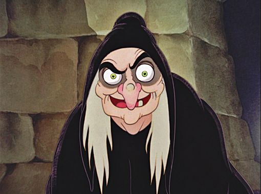
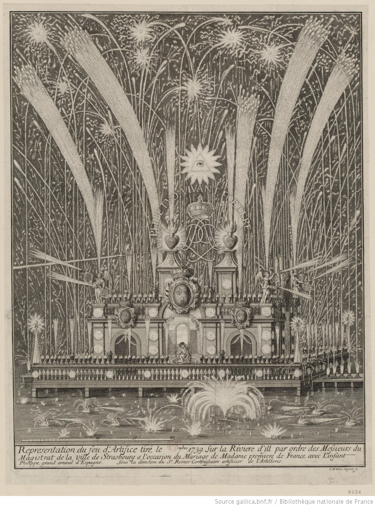

---
tags:
    - Basic Fantasy RPG
    - Bitume
    - Call of Cthulhu
    - Cthulhu Dark
    - D&D
    - D20 System
    - D6 System
    - Empires & Dynasties
    - Github
    - Grogniardia
    - Jung
    - Kult
    - Légendes
    - Mahler
    - Maléfices
    - Mega
    - Mkdocs
    - Mythic
    - OSRIC
    - Paranoia
    - Risus
    - Simulacres
    - SRD
    - Vampire
---

# Materials for Mythic GME in French

I published in the [jdr repo](https://github.com/orey/jdr) a kind of one-page master's screen for Mythic GME in French.

This game really marked the RPG world by violating many tabletop RPG principles:

* The game master is mandatory: In Mythic GME, he/she isn't anymore (even if sometimes a referee can be useful to decide on odds).
* The story must be determined before playing: In Mythic, you can play a story with just a starting idea.
* Randomness can be inserted intelligently at some key points in the story.
* The game engine is whatever you want, and globally, this is one element among others.
* With this story system, you can play solo.

Mythic GME fostered the imagination of many players and game masters for almost 20 years, especially in the world of solo RPG. What is funny is that some old D&D tables determining, for instance, the way the NPCs react to the PCs can be used easily in a Mythic GME adventure. In some ways, many elements of well-known RPGs can be used in complement with the Fate Chart.

I'm currently analyzing the Mythic GME extensions, Mythic Variation I and II, which propose new rules more adapted to the universes you play in, and more adapted to the kind of questions you're asking.

_September 22 2020_

---

# D&D and Gustav Mahler

For sure, there is no link between D&D and Mahler, except that they are various manifestations of the human culture, which is quite vague indeed.

The fact is the digging into D&D history is, for me, haoppening at the same time as the digging into my old CDs of the Mahler symphonies. BTW, I miss the 6th for an unknown reason.

I stopped listening to Mahler several years ago when I faced many personal troubles. In a certain way, the sadness of the 9th was talking to me, doing echo to my own pain. Those symphonies are associated to a certain period of my life that I don't recall with pleasure.

Even if my role-playing phase is much older than Mahler symphonies, synchronicity seems to be there, as Jung would have say. Another Gustav...

I created a [repo](https://github.com/orey/srd-3.5) to host the D&D 3.5 original texts, that I found in the [Wayback Machine](https://archive.org). The idea would be to publish the rough material in a browse-able way in order to progressively being able to integrate elements into programs.

I have been struggling yesterday with the conversion of HTML to Markdown, problem for which I found a not-so-bad solution that I put in my [stuff repo](https://github.com/orey/stuff). The idea is to parse the HTML (generated from RTF by LibreOffice) and to replace tables with images. In a site that support dynamic images (like the ones we can generate with [mkdocs](https://www.mkdocs.org/)), the material will be mobile friendly.

_September 20 2020_

---

# D&D and the American appetite for wilderness

There is something peculiar about D&D, which could explain why I am not so fond of stories of people fighting with monsters in darks labyrinths.

While reading the blog of James Maliszewski, [Grognardia](https://grognardia.blogspot.com), the huge attraction for "wilderness", which seems at the root of D&D,  is a bit foreign to me.

Maybe, the reason is cultural. In France, we have a long lasting past and everyone at school studies the Middle-Age, and the Greeks and Romans before that. In a certain way, a "dungeon" is just the biggest tower in a castle, where the lord used to live.

Chivalry, in the French unconscious, is quite different than the picture that is depicted in D&D: knights have a law code and serve the widow and the orphan. They are often in love with a lady in a romantic way. They may face magic but not in the D&D sense. In a way, the Arthurian legend remains our reference.

For a European eye, D&D looks like a western in tunnels with monsters as enemies, instead of Indians. I know, this is a bit provocative, but D&D is not at all a vision of chivalry, as we have traditionally in France. On the contrary: killing monsters, conquer territories and gain treasures to gain levels look, to me, as a caricature of the American dream.

| D&D element | Element of American culture | French traditional chivalry element | Element of French culture |
| ----- | ----- | ----- | ----- |
| Travel in the wilderness to conquer territories | This really seems as the ideal of the Far West, which is typical American culture | In French, chivalry, knight quests are for God or for a loved one. | Conquering  territories is no more considered as a positive thing (colonization is seen as a bad thing) |
| Fight enemies and kill monsters | The violence is part of American culture, as the fighting | The notion of "monster" is present in the European legends but in small doses, probably due to Catholicism | Violence is more psychological and verbal than real in French society (maybe because it is forbidden to have weapons) |
| Gain treasure | Typical American culture about earthly wealth, which is also typical from protestant countries | The knights were fighting for an ideal and not for money, especially money coming from the murder and robbery of other living beings | Catholic tradition that sees money as something dirty |
| Gain experience and progress in the levels | This can be seen as a real appetite for social ascension, and social competition | This appetite also exists but not really in the chivalry tradition | Social progression was also a feature of the Baby Boomers, being in the US or in Europe |

In other words, D&D is a very _American_ game: A universe where violence and murder enables to progress in the society and become more powerful...

Maybe that deserves more details than this quick simplistic psycho-analysis, but that may also explain why, for many French people, D&D is not very exciting.

In France, we have this expression "Gros Bill" ("Big Bill") who is supposed to represent the super-hero knight, able to massacre everyone. If I saw many Gros-Bills, I never saw them craving for wilderness. Because we are old countries, most of us don't dream about conquest of the wild countries.

For sure, D&D can be played like CoC, with more atmosphere and monsters that are so powerful that your should run instead of fighting.

But, discovering progressively the roots of D&D, I think I progress in my understanding of why D&D is not my cup of tea.

_September 15 2020_

---

# Software help for RPGs?

For sure, dice are crucial to RPGs. But knowing that many role players play with tables, I am quite surprised of the "paper orientation" of the RPG world. It's obvious that the objective is not to create a graphical RPG, but it could be interesting, for instance, to have random tables managed digitally.

Maybe my reflection is driven by some random game helps or by games like Mythic. But in some cases, being able to generate characters dynamically could be really interesting.

Indeed, I am quite interested by the mix between random elements and driven elements. 

If we consider the old school gaming scenarios, the structure is quite often simple:

* A scenario introduction, with the plot (when there is a plot :),
* A location description,
* NPC (quite often monsters) and treasures description.

In the case of the use of a GM emulator, easy software tools could be very interesting, something like a web page enabling to manage more complex randomness _in a certain context_.

Interesting topic.

_September 10 2020_

---

# Autum's coming

I like Autumn. Living in the south of France, a very hot region in Summer, Autumn is the end of Summer and so the capacity of walking in the mountains again. The period is also the period of rough storms with heavy rain, which is changing after all those months of sunny and hot days.

I just received the Dungeon's Master Guide of D&D 3e. I must admit I am a bit disappointed because the book is not old school, and appears to me as overproduced, nearer from a collection object than to a usable game. But well, I am used to D&D and I must go on.

_September 8 2020_

---

# The big director's roll

Well, I begin to play with dice at work, trying to predict what will happen.

I faced today a really interesting case. Let me create the scene (maybe it is a wargame rather than a RPG): You have two teams, one is good and the other is bad. In a contract, each team wrote half of a document to present to a prospect. The overall material is bad, undoubtedly. The prospect screams saying: "what kind of s**t is it?"

At first, the hierarchy laughs, saying : "oh yes, no problem, everything's OK, just this stupid prospect that doesn't understand how smart we are. Well, after a while, probably after tectonic management movements (because the prospect reaction has a tendency to climb up the ladder), everyone would like to find a guilty person.

For sure, the good team would be a good choice. Because, if the bad team survived, that means they have a specific protection charm that is not in line with their skills: maybe the charm is **Not My Fault**. So the attention gets to the good team that did a good job. The director of the bad team has a meeting tomorrow with the director of the good team. Indeed, as the team leader of the good team predicted it with his **It Smells like Crap** psionic power. Working from that prediction, the good team prepared the place for battle with many traps that are reinforced by the **Hidden Truth** potion.

I calculated the odds of the bad director: 25% of being able to convince to good director, after all bonuses and penalties applied. I rolled a 98! Uh! Critical failure...

We'll see tomorrow if my Oracle begins to work!

_September 7 2020_

---

# Getting public?

For now, this blog is quite hidden, which is nice. That enables me to dig into the recent (or less recent) RPG story. I kinda like to read the various game systems and compare them.

I went recently through old stuff of mine: **Simulacres**, for instance which is a French game as I dislike them. The game system could have been innovative, but instead it is complicated and even a bit pretentious. I really dislike this feature in French personality: bragging as if French people had invented the hot water (French expression). Nevertheless, I love France and the French. But I would like to see more really creative stuff, playable stuff, modest, optimized, efficient, creative, straight to the point stuff, than those crappy "I am the best and I teach you" products.

In the past, many game designers have indulged the pleasure of farting higher than their asses (other French expression, rather sympathetic this one), and I dislike it. I would say that Croc is probably one of a kind, that did not, or at least I don't remember. Maybe also the one who created the French RPG where you play lycanthropes. I'll find the name back.

Well, the fact is, there are many RPGs that I find unplayable, but they don't feel as if they were lecturing me on something. That's the power of Americans. There is so much competition, that people try their best to do the best product. I see also a certain kind of "focus" in some American games. We're here for something particular: role-playing in a certain universe, and not benefiting from that tribune to insinuate political of social-crap stuff. A game is a game and no moral lesson from your grand-pa.

_September 7 2020_

---

# The winning couple for a RPG starting now with no preparation?

I analyzed extensively the [Risus](http://www.risusiverse.com) RPG (which is short so that didn't take much time) and created a [flowchart](https://github.com/orey/jdr/tree/master/Risus-fr) to sum-up this micro-game (in French). Yes, my intention is to translate stuff when I can and when the license enables it. France is a great country for RPGs, even if I often find the French RPG a bit patronizing... As the French maybe.

Anyway, in order to play without any preparation, nor at the game mechanics level, or  at the scenario level, maybe the winning couple is **[Risus](http://www.risusiverse.com) + [Mythic](https://www.drivethrurpg.com/product/20798/Mythic-Game-Master-Emulator)**.

Risus is a funny game with very simple game mechanics, that are similar to some other mini-RPGs such as Cthulhu Dark ([French version](https://orey.github.io/cthulhu-dark-fr)) or the children game FirstFable ([French version](https://orey.github.io/premierefable)) or even the very micro-game Roll for Shoes ([French version](https://github.com/orey/jdr/tree/master/RollForShoes-fr)).

I think the emergence of mini-RPGs is the proof of some RPG players getting old. When you are young, you are keen to work hard in very large rule books. When you are older, you can run on the accumulated capacities of GM-ing that you have accumulated for so many years.

The problem of older players is, for sure, the availability of other players. When everyone has its life, it's not so easy to meet. So, quite often, the sessions are scarcer, and with less players (unless you enroll your own children). For that, simple game engines can be a good way to address the rule part preparation. Remains the adventure itself for which you can use many tools: generators or even GM emulators if you really don't have the time to prepare a story.

Concerning GM emulation, I think it would be great to use it inside a pre-existing universe. I have to investigate on that.

_September 7 2020_

---

# A very creative period

It's been a long time since I did not have a look to the RPG world, almost 25 years! For sure, I discovered that a multitude of RPGs and RPG engines were created in 25 years, and some of them seem to me as particularly notable.

One of them is [Mythic GM Emulator](https://www.drivethrurpg.com/product/20798/Mythic-Game-Master-Emulator). This engine defined a new way to envisage to RPG by playing adventures with a level of randomness and possibly with no GM. I will write more about that game soon. I must admit that, a long time ago, I know many players that would have been greatly satisfied with that kind of engine.

This creative period is very interesting because, for the RPG player and GM, there are plenty of offers, and most of them quite affordable. Many are Creative Commons or open source, or free. There is also the dominant position of [DriveThruRPG](https://www.drivethrurpg.com/) as a global dealer of RPGs.

I can see many great evolutions in the RPG universe in those last years :

* The development of Internet enabled many independant authors to create very interesting material, very often for a limited price.
* The development of print on demand enabled also to differentiate the selling of PDFs from the selling of printed manuals, which is great, considering the disappearance of many gaming shops (at least in France).
* The SRD 3.5 opened the door to re-interpretations of old school ways of playing RPGs, which can be a good thing. Games should offer many variations and attract several kinds of players.

On this topic, I started reading the blog of James Maliszewski, [Grogniardia](https://grognardia.blogspot.com). It is very intesting and enables me to catch on with the RPG world. There are some good moments, in this blog, about the old school RPG gaming, mostly based on the the 2 first editions of D&D (OD&D and Holmes mainly). Even if I was never a player of D&D, the old school is talking to me. The age, maybe. The passion for CoC also where I find the same kind of objectives: play with not so many rules, have fun, and improvise. Maybe we are not so far from each other after all.

The fact is, the period from 2000 to 2010 seems very creative, whereas I am not so sure that the following decade was (the one that is terminating now). I have to investigate.

In some dimensions, I understand old school fanatics to be sad that things changed. But on the other hand, we still have many choices in the offer, so much actually that searching for the product that corresponds to you can be quite long. But I think we should not complain. It is just a new era of RPG with several generations playing the same kind of games and so expecting different things from it.

For sure, everyone is not playing a single "universal" game, but, without being a specialist, when I see all the supplements produced by Paizo on PathFinder, I wonder if most players are not still concentrated on heroic-fantasy games around the D&D rules (being 3rd edition or another).

_September 7 2020_

# Dodge and parrying

This blog is also a pretext to speak about RPG, so that's what I'm going to do. There seem to be a way to open comments in this blog but I am not sure many people will be interested by the topic. If you are, contact me by mail.

A long time ago, I played RPGs, mainly CoC, Warhammer, Paranoïa, Vampire, Kult, but also French games like [Mega II](https://fr.wikipedia.org/wiki/Mega_(jeu_de_r%C3%B4le) "Mega"), [Bitume](https://fr.wikipedia.org/wiki/Bitume_(jeu_de_r%C3%B4le) "Bitume"), [Empire et Dynasties](https://fr.wikipedia.org/wiki/Empires_et_Dynasties "Empires") ou [Légendes](https://fr.wikipedia.org/wiki/L%C3%A9gendes_(jeu_de_r%C3%B4le) "Légendes"). I was never a player of D&D.

Recently, I have entered the RPG world again and try to catch up, especially with all the SRD and [Open Gaming](https://en.wikipedia.org/wiki/Open_gaming) adventure. That initiative created PathFinder as a competitor to D&D. I'm reading some other rule books inheritated from the SRD 3.5, especially [Basic Fantasy RPG](https://www.basicfantasy.org/), and [OSRIC](https://osric.fr/).

Indeed, as I like the D20 system in general, I would like to inspire the Enterprise RPG gaming system from it.

The fact is I find it very surprising that there seem to be no dodge or parrying system. In a round (let's says 10 seconds), I would have expected every PC to have at least 1 attack and 1 defense. For sure, the order in the combat sequence is depending upon initiative, which means that if you don't have the initiative, you can try to parry (with your shield or your weapon - BTW, weapon parrying power depends on the weapon because a stick is not a sword) or to dodge.

Dodging should be the result of DEX and so have some bonus/malus coming from DEX and some bonus/malus coming from AC (it is more complex to dodge with a plate armor than without).

Concerning parrying, it could be done at the same level that the attack, or to be some kind of contest versus the attack of the attacker. However, you should choose to parry with your shield or your weapon.

For sure, I think the AC concept theoretically takes into account this fact, but I think it breaks the balance in combat. Let us suppose you are a Monk at level 12: You should be unreachable my most creatures, even if you don't attack and you just dodge.

The fact of having 2 attacks per round would give you the same number of defenses. I even think you should be able to turn the attack in a defense if you need it, for instance when attacked by multiple enemies.

I have to continue my investigations to see how dodge and parrying are treated in other rule books. I am not really in favor of dodging being a skill: it should be more part of the core combat system.

I have to reply on a logical combat system that's why those investigations are interesting.

_August 30 2020_

---

# Spells, classes and armor class

_Courtesys of [sirdrak](https://www.deviantart.com/sirdrak/art/Gauntlet-sorcerer-sketch-585462023)_

**Spells**

Some enterprise PCs have Charism but not only. They are able to seduce people even if their real skills are low.

On the contrary, many people can be charmed by those spells, above all if they are not skilled enough to realize the subterfuge.

Skills should influence on saving throws with bonuses. Low skills should provide a malus for saving throws.

Anyway, the seduction should be considered as a magic power.

Magic could be based on Charisma.

**Classes of characters**

Indeed, as all PCs are human (are they really? ;), there are no races. But classes of characters also exist.

The Classes should match basic profile characteristics. Engineer could be a profile. Salesman or saleswoman another. HR, Marketing, Finance, etc. could be classes.

Classically, PC classes should require some level in a certain characteristic.

The belonging of a certain "influence cycle" should be possible. In France, ENA, X or ENSAM are acting like secret societies that create networks of people assigning themselves positions without them to be always connected to their real skills. That belonging could add some bonus or malus in different situations.

**Armor class**

Generally the boss of a company will have a very low armor class. If the business is owned by him, the AC is 1.

But for companies where the boss is just a nominated guy, which means he can be replaced, the his AC should be 2 or 3.

For the rest of people, their AC should be the boss AC minus the number of hierarchical levels between the boss and the PC position.

For instance, let us suppose your PC is the n-5 of a big boss who has an AC=2. Your AC is 7.

Note: PC should have AC modifiers depending on the situations.

_August 27 2020_

---

# Create funny rolls

If characteristics are balanced between one extreme and the other, for several situations, it would be quite funny to let the GM decide what "side" of the characteristics to roll for. One alternative is to make 2 rolls. I have to think about it.

_August 27 2020_

---

# More characteristics and skills

Let's go straight to the point: many characteristics and skills in Enterprise-RPG must represent the bad reality of companies.

Let's try a first list:

Characteristic or skill? | Type | Comment
--- | --- | ---
Lying | Skill | Could be attached to some alignment notion
Politics | Characteristic | Lying could be a skill deriving
Physical | Characteristic | Not so useful
Technical skills | Skills | Per domain
Sell | Skill | Can be used in other contexts
Invent stupid project | Skill | This should probably be generalized to other stupid stuff
Misunderstand | Skill | A good skill for manager is misunderstanding
Paranoia | Skill | Ability to imagine that someone is plotting agains you
Plot  | Skill | A useful skill in enterprise
Detect Plot | Skill | Same
Bad faith | Skill | Same

A lot of skills should find their places in "combat rules".

**First Ideas About Combat Rules**

Combat rules could have several flavours:

* Confrontation: face to face
* Group combat: influence in a meeting, groupe versus group, etc.
* Plot

_August 26 2020_

---

# Characteristics

_Courtesy of istockphoto.com_

**First inspiration: Jung**

Each character will have a set of characteristics and skills. I like the skills being specialization of characteristics.

I wanted to start with the Jungiang traits. Roughly, Jung defines 3 kinds of attributes. If we adopt the perspective of [Myers-Briggs](https://en.wikipedia.org/wiki/Myers–Briggs_Type_Indicator) (without adding the 4th trait), we can have:

* Introversion/Extraversion, which is the place from where people are taking their energy;
* Intuitive/Sensing, which is the perception of time, intuitive living in the future and being able to anticipate, and sensing living in the present;
* Thinkful/Feeling, which is the approach of conflict, or based on intellectual facts or based on feeling for people.

In all cases, as the "context" (understand "the enterprise the PC are into") requires certain details on the "mind characteristics", we have to find a way to have balanced characteristics.

**First rules**

Let's take an example to enable to reflection. Sandra is a woman and she has an argument with Vincent, a man. Vincent is "Feel" oriented whereas Sandra is more "Think". Let us suppose that we have just one scale: Feel + Think should be a fixed number and Sandra would have much more chances to succeed in an analysis based on Think than an analysis based on Feel (and the reverse for Vincent).

However:

* Those characteristics should both exist in both profiles and be linked together in some way;
* There is no reason for which those characteristics may be limited.

So we can imagine the following rules:

* For your PC, at PC creation, you have one roll for Think/Feel: **roll 3D6** to get X;
* Choose if X goes to Feel or to Think;
* Put 18-X in the other characteristic.

The result would be for Sandra 3+6+4=13:

Characteristic | Feel | Think 
--- | --- | ---
**Value** |  5 | 13 |

And for Vincent, 1+4+5=10:

Characteristic | Feel | Think
--- | --- | ---
**Value** | 10 | 8

This can enable the standard D20 roll against some threshold to succeed to not in a certain challenge.

_August 25_

---

# What kind of dice?

_Courtesy of istockphoto.com_

The first point will be to decide what kind of dice use. I admit having a preference for standard RPG dices, and not D6, even if most of the quick tabletop RPG seem to be using D6.

For now, I will adopt a game system inspired by D&D but the blog is here to enable the reflection on the topic.

_August 25_

---

# What is the enterprise RPG you are talking about?

_Courtesy of istockphoto.com_

The enterprise is an hostile environment in which various set of skills are employed : technical ones, but also political ones. For decades, the enterprise landscape has changed, not really for the best, especially in big structures:

* Political skills are, more than ever, on the frontline;
* Technical skills seem to stay in the background;
* Nowadays, who is concerned about change management, or exact reporting?

This blogs starts a reflection around a **simulation system that would be adapted to simulate what's going on in modern enterprises** in which nothing can be called a failure anymore and everything is always a success, where intentions are too often sufficient.

This in-progress game aims to turn catastrophic situations in funny situations. If the exercise is successfull, you will be able :

* To create the PC (Player Characters) that correspond to your collegues;
* To predict the output of meetings and to create various kinds of "encounters";
* To determine who is the best PC or NPC (Non Player Character) to win a challenge or a contest;
* In one word, to play the roles of your colleagues.

In a certain way, this system _could be_ a RPG but would more be a way to have fun in the office with the RPG concepts adapted to the enterprise.

More to come.

_August 25 2020_

