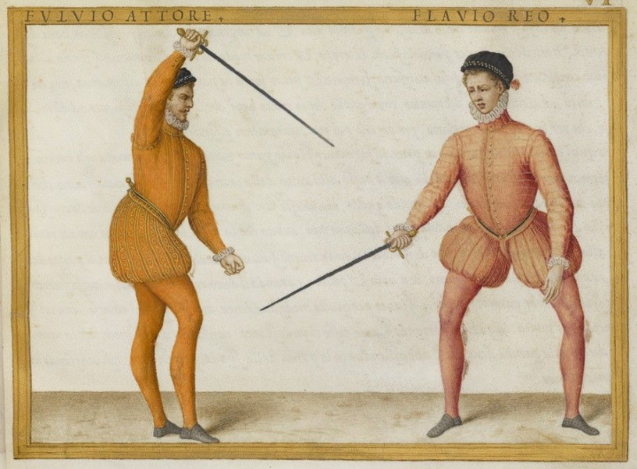
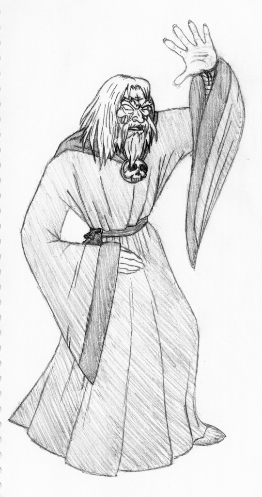

---

# Dodge and parrying

This blog is also a pretext to speak about RPG, so that's what I'm going to do. There seem to be a way to open comments in this blog but I am not sure many people will be interested by the topic. If you are, contact me by mail.

A long time ago, I played RPGs, mainly CoC, Warhammer, Paranoïa, Vampire, Kult, but also French games like [Mega II](https://fr.wikipedia.org/wiki/Mega_(jeu_de_r%C3%B4le) "Mega"), [Bitume](https://fr.wikipedia.org/wiki/Bitume_(jeu_de_r%C3%B4le) "Bitume"), [Empire et Dynasties](https://fr.wikipedia.org/wiki/Empires_et_Dynasties "Empires") ou [Légendes](https://fr.wikipedia.org/wiki/L%C3%A9gendes_(jeu_de_r%C3%B4le) "Légendes"). I was never a player of D&D.

Recently, I have entered the RPG world again and try to catch up, especially with all the SRD and [Open Gaming](https://en.wikipedia.org/wiki/Open_gaming) adventure. That initiative created PathFinder as a competitor to D&D. I'm reading some other rule books inheritated from the SRD 3.5, especially [Basic Fantasy RPG](https://www.basicfantasy.org/), and [OSRIC](https://osric.fr/).

Indeed, as I like the D20 system in general, I would like to inspire the Enterprise RPG gaming system from it.

The fact is I find it very surprising that there seem to be no dodge or parrying system. In a round (let's says 10 seconds), I would have expected every PC to have at least 1 attack and 1 defense. For sure, the order in the combat sequence is depending upon initiative, which means that if you don't have the initiative, you can try to parry (with your shield or your weapon - BTW, weapon parrying power depends on the weapon because a stick is not a sword) or to dodge.

Dodging should be the result of DEX and so have some bonus/malus coming from DEX and some bonus/malus coming from AC (it is more complex to dodge with a plate armor than without).

Concerning parrying, it could be done at the same level that the attack, or to be some kind of contest versus the attack of the attacker. However, you should choose to parry with your shield or your weapon.

For sure, I think the AC concept theoretically takes into account this fact, but I think it breaks the balance in combat. Let us suppose you are a Monk at level 12: You should be unreachable my most creatures, even if you don't attack and you just dodge.

The fact of having 2 attacks per round would give you the same number of defenses. I even think you should be able to turn the attack in a defense if you need it, for instance when attacked by multiple enemies.

I have to continue my investigations to see how dodge and parrying are treated in other rule books. I am not really in favor of dodging being a skill: it should be more part of the core combat system.

I have to reply on a logical combat system that's why those investigations are interesting.

_August 30_

---

# Spells, classes and armor class

_Courtesys of [sirdrak](https://www.deviantart.com/sirdrak/art/Gauntlet-sorcerer-sketch-585462023)_

**Spells**

Some enterprise PCs have Charism but not only. They are able to seduce people even if their real skills are low.

On the contrary, many people can be charmed by those spells, above all if they are not skilled enough to realize the subterfuge.

Skills should influence on saving throws with bonuses. Low skills should provide a malus for saving throws.

Anyway, the seduction should be considered as a magic power.

Magic could be based on Charisma.

**Classes of characters**

Indeed, as all PCs are human (are they really? ;), there are no races. But classes of characters also exist.

The Classes should match basic profile characteristics. Engineer could be a profile. Salesman or saleswoman another. HR, Marketing, Finance, etc. could be classes.

Classically, PC classes should require some level in a certain characteristic.

The belonging of a certain "influence cycle" should be possible. In France, ENA, X or ENSAM are acting like secret societies that create networks of people assigning themselves positions without them to be always connected to their real skills. That belonging could add some bonus or malus in different situations.

**Armor class**

Generally the boss of a company will have a very low armor class. If the business is owned by him, the AC is 1.

But for companies where the boss is just a nominated guy, which means he can be replaced, the his AC should be 2 or 3.

For the rest of people, their AC should be the boss AC minus the number of hierarchical levels between the boss and the PC position.

For instance, let us suppose your PC is the n-5 of a big boss who has an AC=2. Your AC is 7.

Note: PC should have AC modifiers depending on the situations.

_August 27_

---

# Create funny rolls

If characteristics are balanced between one extreme and the other, for several situations, it would be quite funny to let the GM decide what "side" of the characteristics to roll for. One alternative is to make 2 rolls. I have to think about it.

_August 27_

---

# More characteristics and skills

Let's go straight to the point: many characteristics and skills in Enterprise-RPG must represent the bad reality of companies.

Let's try a first list:

Characteristic or skill? | Type | Comment
--- | --- | ---
Lying | Skill | Could be attached to some alignment notion
Politics | Characteristic | Lying could be a skill deriving
Physical | Characteristic | Not so useful
Technical skills | Skills | Per domain
Sell | Skill | Can be used in other contexts
Invent stupid project | Skill | This should probably be generalized to other stupid stuff
Misunderstand | Skill | A good skill for manager is misunderstanding
Paranoia | Skill | Ability to imagine that someone is plotting agains you
Plot  | Skill | A useful skill in enterprise
Detect Plot | Skill | Same
Bad faith | Skill | Same

A lot of skills should find their places in "combat rules".

**First Ideas About Combat Rules**

Combat rules could have several flavours:

* Confrontation: face to face
* Group combat: influence in a meeting, groupe versus group, etc.
* Plot

_August 26_

---

# Characteristics

_Courtesy of istockphoto.com_

**First inspiration: Jung**

Each character will have a set of characteristics and skills. I like the skills being specialization of characteristics.

I wanted to start with the Jungiang traits. Roughly, Jung defines 3 kinds of attributes. If we adopt the perspective of [Myers-Briggs](https://en.wikipedia.org/wiki/Myers–Briggs_Type_Indicator) (without adding the 4th trait), we can have:

* Introversion/Extraversion, which is the place from where people are taking their energy;
* Intuitive/Sensing, which is the perception of time, intuitive living in the future and being able to anticipate, and sensing living in the present;
* Thinkful/Feeling, which is the approach of conflict, or based on intellectual facts or based on feeling for people.

In all cases, as the "context" (understand "the enterprise the PC are into") requires certain details on the "mind characteristics", we have to find a way to have balanced characteristics.

**First rules**

Let's take an example to enable to reflection. Sandra is a woman and she has an argument with Vincent, a man. Vincent is "Feel" oriented whereas Sandra is more "Think". Let us suppose that we have just one scale: Feel + Think should be a fixed number and Sandra would have much more chances to succeed in an analysis based on Think than an analysis based on Feel (and the reverse for Vincent).

However:

* Those characteristics should both exist in both profiles and be linked together in some way;
* There is no reason for which those characteristics may be limited.

So we can imagine the following rules:

* For your PC, at PC creation, you have one roll for Think/Feel: **roll 3D6** to get X;
* Choose if X goes to Feel or to Think;
* Put 18-X in the other characteristic.

The result would be for Sandra 3+6+4=13:

Characteristic | Feel | Think 
--- | --- | ---
**Value** |  5 | 13 |

And for Vincent, 1+4+5=10:

Characteristic | Feel | Think
--- | --- | ---
**Value** | 10 | 8

This can enable the standard D20 roll against some threshold to succeed to not in a certain challenge.

_August 25_

---

# What kind of dice?

_Courtesy of istockphoto.com_

The first point will be to decide what kind of dice use. I admit having a preference for standard RPG dices, and not D6, even if most of the quick tabletop RPG seem to be using D6.

For now, I will adopt a game system inspired by D&D but the blog is here to enable the reflection on the topic.

_August 25_

---

# What is the enterprise RPG you are talking about?

_Courtesy of istockphoto.com_

The enterprise is an hostile environment in which various set of skills are employed : technical ones, but also political ones. For decades, the enterprise landscape has changed, not really for the best, especially in big structures:

* Political skills are, more than ever, on the frontline;
* Technical skills seem to stay in the background;
* Nowadays, who is concerned about change management, or exact reporting?

This blogs starts a reflection around a **simulation system that would be adapted to simulate what's going on in modern enterprises** in which nothing can be called a failure anymore and everything is always a success, where intentions are too often sufficient.

This in-progress game aims to turn catastrophic situations in funny situations. If the exercise is successfull, you will be able :

* To create the PC (Player Characters) that correspond to your collegues;
* To predict the output of meetings and to create various kinds of "encounters";
* To determine who is the best PC or NPC (Non Player Character) to win a challenge or a contest;
* In one word, to play the roles of your colleagues.

In a certain way, this system _could be_ a RPG but would more be a way to have fun in the office with the RPG concepts adapted to the enterprise.

More to come.

_August 25_

