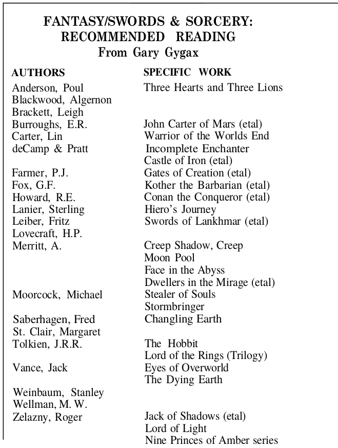
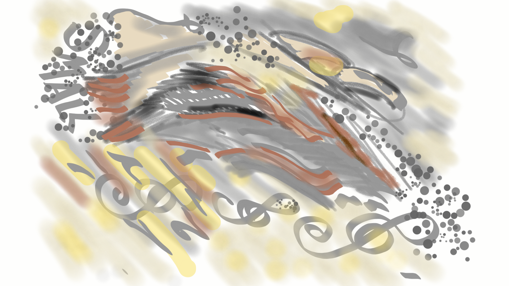

---

# Gandalf, un magicien niveau 5 dans un mauvais scénar de D&D

En recherchant des trucs dans les vieux Dragon, j'ai trouvé cet [article provoquant de 1977](https://github.com/orey/DandD/blob/master/Articles/1977-Gandalf5thMagicUser.pdf) comme quoi Gandalf était un vulgaire magicien niveau 5.

Cela m'a bien fait rire car je n'ai jamais été un grand fan du Seigneur des Anneaux. A l'époque, les fans hystériques de Tolkien tentaient de me convaincre de l'immensité de ce livre, et des autres (encore plus pourris). Je les provoquais en leur disant que Tolkien avait tout pompé sur l'interprétation de Wagner des légendes germaniques, ce qui est malheureusement vrai. Dès qu'un truc est cool dans le SdA, c'est pas de Tolkien :

* L'Anneau maudit des Nibelung est le cœur de la Légende du même nom (Tolkien a pompé l'intrigue principale soit l'anneau maudit) ;
* Le heaume magique rend invisible est forgé avec le même or (Tolkien a pris le pouvoir et l'a attribué à l'anneau, quelle inventivité démoniaque !) ;
* L'anneau suscite des convoitises allant jusqu'au meurtre (motif que Tolkien a repris brut de fonderie) ;
* L'anneau trouvé dans la caverne est gardé par un dragon tué par Siegfried (chez Tolkien, c'est Bilbo qui gagne l'anneau aux devinettes en flouant Golum, ne me dites pas que ça ne craint pas) ;
* L'épée brisée qui fut reforgée, c'est celle de Siegfried (et pas celle d'Isildur, petit pompeur) ;
* Etc.

En fait, dans la Tétralogie (L'Or du Rhin, la Walkyrie, Siegfried, le Crépuscule des Dieux), tout est mieux que chez Tolkien :

* La malédiction a une raison profonde, le manque d'amour et le rejet du nain Alberich par les Filles du Rhin ;
* La convoitise touche les dieux, en particulier Wotan (Odin), qui se retrouve coincé dans des histoires de fesses et de promesses hâtives ;
* Il y a une dimension métaphysique dans ce cycle, avec la mise en place d'un enchaînement de causes et d'effets qui mène au crépuscule des dieux.

Chez Tolkien, tout est long et chiant. Même les méchants sont chiants. Et je trouve que c'est bien rendu par les films qui sont vraiment chiants. L'histoire est niaise. Pourquoi aller détruire l'anneau chez Sauron ? Raconter la guerre généralisée avec deux hobbits se baladant dans les Terres du Milieu, ouais, c'est un scénario un peu faiblard. Aucune dimension philosophique. Aucune dimension heroic-fantasy...

Normal, le sieur Tolkien était un érudit. Et les érudits sont la plupart du temps des pompeurs car ils sont trop peu inventifs pour écrire quelque chose d'original (je parlerai un de ces quatre de Ecco). Alors, on peut planquer le tout sous des tonnes de mots, sous un langage elfique foireux et sous des tonnes de PNJ, mais il n'en demeure pas moins que ça reste nul.

Une des dimensions les plus nulles de la série est l'absence de sentiments. Les personnages sont vraiment nases et creux. Ils ne véhiculent rien, aucun amour, aucun idéal, à part buter Sauron. Leur confrérie en carton pâte ne fait rien ressentir. Le SdA est un bouquin froid comme une table de dissection, celle de l'érudit.

Regardez les opéras de Wagner (avec les sous-titres) et vous verrez ce que c'est qu'une légende heroic-fantasy avec des sentiments !

Enfin, tout ça pour dire que cet article m'a remis en mémoire le combat pathétique de Gandalf et de Saroumane dans le film. C'est nul. Et effectivement, c'est nul comme un combat de magiciens de niveau 5 dans un mauvais scénar de D&D !

Au moins, on enlèvera pas à Gary Gygax le fait de s'être toujours clairement détaché d'une filiation trop directe d'avec Tolkien, qu'il relègue au stade d'inspiration. J'ai trouvé des trucs là-dessus que je sortirai un de ces quatre.

_(28 novembre 2021)_

---

# Collection D&D

Sans être un fan de D&D, j'ai fait un repo avec pas de trucs très intéressants sur le D&D des premiers jours.

L'idée originale était de mettre dans un endroit des interviews de Gygax et certains points de vue sur D&D.

C'est encore à l'état de "draft" mais voilà ce que ça donne : https://github.com/orey/DandD

_(28 novembre 2021)_

---

# Archéologue du JDR

En fait, j'ai toujours voulu être archéologue. Cela m'a servi de nombreuses fois, car exhumer le passé permet de comprendre le présent. A commencer par les jeux de rôles.

Dans mes investigations, je vous propose de relire des vieux trucs qui me rappellent des choses.

On commence par ça:

Gary nous recommande des choses à lire en 1976 dans The Dragon. A l'époque, D&D est constitué des 3 petits livres bruns.

_(28 novembre 2021)_

---

# Ouais

Bon, voilà quelques mois que je me suis remis dans le sujet jeu de rôle (après 25 bonnes années) et je commence à avoir accumulé pas mal de choses. Il est peut-être temps de les partager.

