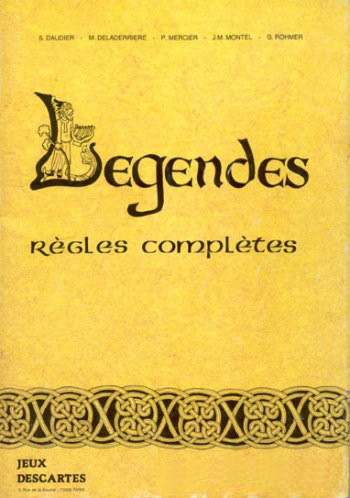
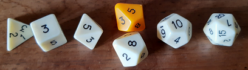

---
tags:
    - 9th Level
    - Advanced Fighting Fantasy
    - Ars Magica
    - Basic Fantasy RPG
    - Basic Roleplaying System
    - Call of Cthulhu
    - Colostle
    - D&D
    - D6 System
    - DCC
    - Fighting Fantasy
    - Froika
    - Ghostbusters
    - GME
    - Grande Liste
    - GURPS
    - Harry Potter
    - James Bond
    - L'Ultime Epreuve
    - Légendes
    - Légendes de la Vallée des Rois
    - Links
    - Maléfices
    - Mega
    - Mythic
    - Pendragon
    - Rêve de Dragon
    - Questworlds
    - Risus
    - Runequest
    - S. John Ross
    - Shadowrun
    - Simulacres
    - SRD
    - Star Wars
    - Troika
    - Vladimir Propp
    - Warhammer
    - Worlds Witout Numbers
---

# Les règles de Ghostbusters publiées en français

Voilà, c'est fait :

* Sur ce site : [Ghostbusters, les règles en français](../downloads/ghostbusters.md)
* Sur [itch.io](https://itch.io) : [Ghostbusters, les règles en français](https://rouboudou.itch.io/ghostbusters)

1er novembre 2022

---

# Exploration des moteurs de jeux génériques

Dans la suite des articles précédents, je regarde les divers moteurs de jeux génériques et leurs SRD. Tout cela manque d'un dictionnaire permettant de classifier les systèmes de jeux. Il est possible que cela existe.

Tiens, prenons L'Ultime Epreuve (1983), premier JDR français, si je ne m'abuse. On peut voir le système comme un mélange entre D&D et Chtulhu.

| D&D              | Cthulhu      | L'Ultime Epreuve | Sur |
|------------------|--------------|------------------|-----|
| Force            | Force        | Force            | 3D6 |
| Dextérité        | Dextérité    | Dextérité        | 3D6 |
| Constitution     | Constitution | Constitution     | 3D6 |
| Intelligence     | Intelligence | Intelligence     | 3D6 |
| Sagesse (Wisdom) | Pouvoir      | Pouvoir          | 3D6 |
| Charisme         | Apparence    | Charisme         | 3D6 |
|                  | Éducation    |                  | 3D6 |

Table 2 : Les caractéristiques de L'Ultime Épreuve

En substance, Les compétences sont nommées Talents et sont d'un nombre restreint : Attaque, Défense, Tir, Capacités physiques, Manipulation, Discrétion, Détection, Influence, Connaissance et Magie. Elles sont obtenues en additionnant deux ou trois caractéristiques. Les tests sont des tests de pourcentages sous les Talents.

L'Ultime Epreuve est un jeu simple et assez agréable, au final assez compatible avec le Basic Roleplaying System de Chaosium.

## James Bond RPG

James Bond est aussi un jeu à caractéristiques avec des jets de compétences.

| D&D              | Cthulhu      | James Bond   | 
|------------------|--------------|--------------|
| Force            | Force        | Force        |
| Dextérité        | Dextérité    | Dextérité    |
| Constitution     | Constitution |              |
| Intelligence     | Intelligence | Intelligence |
| Sagesse (Wisdom) | Pouvoir      | Volonté      |
| Charisme         | Apparence    |              |
|                  | Éducation    |              |
|                  |              | Perception   |

La création des personnages se fait avec des points de création permettant d'acheter ce que vous voulez. Les compétences sont aussi le fruit d'un calcul avec des caractéristiques. Pour autant, le score obtenu n'est pas exactement un pourcentage. Pour tester une compétence, il faut regarder quel "barème" utiliser en fonction d'un facteur de difficulté.

## Autres jeux en cours

Je regarde ou ai regardé récemment :

* Questworlds [SRD](https://www.chaosium.com/questworlds-system-reference-document/) : je ne suis pas emballé, j'ai l'impression d'un Risus en beaucoup plus compliqué.
* Cypher System [preview](https://www.montecookgames.com/store/product/cypher-system-rulebook-2/) : je n'ai fait que tourner les pages.
* Tango RPG system : ça ressemble un peu à [Dungeon Squad](../downloads/dungeonsquad.md).
* Drama System : un drôle de truc de Robin Laws (l'inventeur de Gumshoe si je ne m'abuse).
* Corpus Mechanica : un système français très D6.
* J-Système [ici](https://www.geek-powa.fr/jeu-de-roles-jdr/systeme-j-un-moteur-de-jdr-generique/), un système de jeu avec des cartes. Je n'ai pas creusé.
* Tri-Stat DX [ici](https://www.drivethrurpg.com/product/368/TriStat-dX-Core-System-RolePlaying-Game/), un système intéressant dont je n'ai pas fini la lecture.
* Metal [SRD](https://johndoe-rpg.com/2013/01/16/le-srd-du-systeme-metal-est-disponible-gratuitement/), pas lu mais je me souviens avoir joué à Bloodlust 1e.
* [Basic Fantasy Roleplay](https://www.basicfantasy.org/index.html), je connais bien, c'est pas lui que j'ai découvert la notion d'OGL et de SRD voilà quelques années.
* [Microlite20](https://ruleslightrpgs.com/forum/?w3=dmlld3RvcGljLnBocD9mPTI3JnQ9MjY1), un classique, je crois même en avoir fait une traduction quelque part.
* Dungeon Crawl Classics, j'ai entamé la lecture et c'est assez marrant.

Mais je manque de temps pour classifier un peu tout cela...

31 octobre 2022

---

# Quelques mots sur Rêve de Dragon

Je viens de mettre la main sur l'édition du [Scriptorium](https://scriptarium.org/store/category/20-jeu-de-r%C3%B4le/) de Rêve de Dragon... Et moi qui trouvait que Légendes était un jeu compliqué !

15 octobre 2022

---

# Petit statut en passant

J'ai lu ou relu pas mal de choses ces temps-ci.

## Basic Roleplaying System 4e

Basic Roleplaying System 4e

J'avoue que j'aime bien. C'est simple et intuitif et, d'une certaine façon, c'est le système que je connais le mieux. J'ai regardé les pouvoirs psy. Malheureusement, je ne trouve pas ça top. J'aime bien les jets de pourcentage, comparé à des nombres de d6 (qui ont toujours des courbes de probabilités en cloche).

## Légendes de la Valée des Rois

Légendes de la Vallée des Rois

Malgré ma [critique de la gamme Légendes](202209.md#legendes-le-multi-bide-du-jdr-francais), j'ai lu consciencieusement les deux livres de ce jeu que je ne connaissais pas trop.

### Un jeu injouable

Le livre de civilisation est pas mal fait, quoique totalement descriptif. On pourra regretter le manque total de pistes d'intrigues, ou d'idées de scénarios. On est vraiment dans le supplément historique, et c'est vraiment dommage.

Le scénario est à l'avenant : court, simpliste, et insuffisant pour bâtir des personnages qui ont des aventures sur plusieurs sessions.

Là, la barre est très haute et s'adresse à des MJs chevronnés (je ne parle que de l'univers) et des joueurs passionnés. On peut reprendre la table d'accessibilité définie [ici](202209.md#accessibilite).

| Jeu                            | Access. Monde    | Access. Magie    | Motivation fondamentale | Complexité jeu | Accessibilité |
|--------------------------------|------------------|------------------|-------------------------|----------------|---------------|
| Légendes de la Vallée des Rois | Difficile (u)(1) | Difficile (v)(1) | Difficile (w)(1)        | Difficile (1)  | **1.00**/4    |

Table 1 : Accessibilité des Légendes de la Vallée des Rois

On voit bien la marque de fabrique de Légendes...

Le livre de règles est un ouvrage bizarre. Au début, on pourrait penser que les règles sont simples, mais progressivement, les règles se complexifient jusqu'à devenir franchement complexes, même pour la création des personnages. La magie montre un réel travail, mais nécessitant un énorme effort de mise en pratique. Et puis, avec les deux types de magie correspondant _grosso modo_ aux deux classes sociales, comment constituer un ensemble homogène.

Ce qui est intrigant avec ce genre de jeux, c'est que l'on se demande s'il a été play-testé. Où est l'aventure ou le mystère quand on joue un savetier de la XVIIIème dynastie ? Je me demande s'il est possible de jouer autre chose que des personnages pré-tirés dans cet univers.

### Les éléments d'une seconde édition

Evidemment, si l'on faisait une seconde édition, on pourrait tirer quelque chose du matériau original :

* Il faudrait simplifier drastiquement le système de jeu, et pas forcément le contenu de fond, comme celui de la magie ;
* Il faudrait avoir des règles pour que les personnages soient dans un groupe social homogène (là, on peut être mendiant ou pharaon au tirage, ce qui ne permet pas de faire des groupes homogènes, c'en est même ridicule), ces règles devraient aussi donner des pistes pour des ensembles d'aventures de _groupes_ et non proposer de jouer tous les métiers dans un univers historique ;
* Il faudrait penser un peu différemment la magie, car elle est très complexe ;
* Il faudrait ajouter des idées de scénarios un peu partout dans la timeline historique.

Le sujet religieux est aussi abordé d'un point de vue historique. Cette partie est intéressante, mais elle aurait pu être rendue plus "fantastique" en matérialisant les divers Dieux le long du Nil dans les événements historiques. Je veux dire, si l'on ne tisse pas les dieux dans l'histoire, les créatures à têtes d'animaux tombent un peu comme un cheveu sur la soupe. Il aurait fallu faire deux colonnes : les événements historiques d'un côté et l'interprétation magique de l'autre.

Cela me fait penser à l'approche prise par Ars Magica : nous sommes bien dans le Moyen-Age historique, mais avec des mages qui ont des pouvoirs et une vision différente de la réalité.

### Les options prises par GURPS

<myimage>GURPS Egypt</myimage>

Si on compare, GURPS rame un peu quand même dans cet univers antique égyptien, mais fait le choix de simplifier le nombre de profils de PJs, la magie, etc., et d'ouvrir sur d'autres perspectives et d'autres suppléments de la gamme GURPS qui auraient besoin de backgrounds historiques pour des aventures se déroulant en Egypte. Historiquement, c'est plus sommaire, mais c'est plus jouable et plus ouvert. Certes, on tombe vite dans les momies, dans un cas comme dans l'autre...

C'est le côté difficulté de l'accessibilité du monde et de la magie. Pour les occidentaux que nous sommes, l'Egypte ancienne est quand même lointaine et les archétypes connus de cette période ne sont pas nombreux : pyramides, pharaons, momies...

## Y a-t-il des créateurs dans la salle ?

Ca me donne un genre de goût amer dans la bouche, car Légendes de la Vallée des Rois est un jeu français, et au final, il n'a pas été joué et, aujourd'hui non plus, il n'est plus joué. Donc l'objectif n'est pas atteint. Après, faut-il sauver tous les jeux ?

Dans mes jeunes années, on avait le choix entre deux types de jeux :

* Des traductions de jeux américains, dont D&D et CoC,
* Des jeux français, dont L'Ultime Epreuve, Légendes, Méga, Empire Galactique, Maléfices, Rêve de Dragon, Empire et Dynasties, Bitume, etc.

Aujourd'hui, ça me semble plus compliqué. On a beaucoup de traductions (que je trouve souvent pas top), pas mal de trucs issus de SRD américains, à commencer par les SRD de D&D 3.5e, et quelques rééditions squelettiques ou confidentielles de jeux français de l'époque, je pense à Maléfices ou à Méga 5.

| Date | Jeu                     | Editeur                                                                                              | Editions                                  |
|------|-------------------------|------------------------------------------------------------------------------------------------------|-------------------------------------------|
| 1983 | L'ultime Epreuve        | Aucun                                                                                                | Plus d'édition                            |
| 1983 | Légendes                | Aucun                                                                                                | Plus d'édition                            |
| 1984 | **Méga**                | [editions-leha.com](https://editions-leha.com/catalogue-details/mega-le-5e-paradigme-livre-de-base/) | 5ème édition publiée mais non supportée   |
| 1984 | Maléfices               | [arkhane-asylum.fr](https://arkhane-asylum.fr/malefices/)                                            | Seconde édition annoncée mais introuvable |
| 1984 | Empire galactique       | Aucun                                                                                                | Plus d'édition                            |
| 1985 | **Rêve de Dragon**      | [scriptarium.org](https://scriptarium.org/store/category/20-jeu-de-r%C3%B4le/)                       | 3ème édition manifestement bien supportée |
| 1986 | Bitume                  | [raise-dead.com](https://raise-dead.com/category/bitume/)                                            | 6ème édition annoncée mais introuvable    |
| 1986 | La Compagnie des Glaces | Aucun                                                                                                | Plus d'édition                            |
| 1986 | Avant Charlemagne       | Aucun                                                                                                | Plus d'édition                            |
| 1988 | Empires et Dynasties    | Aucun                                                                                                | Plus d'édition                            |
| 1988 | Zone                    | Aucun                                                                                                | Plus d'édition                            |
| 1988 | Simulacres              | Aucun                                                                                                | Plus d'éditions                           |
| 1989 | Hurlements              | Aucun                                                                                                | Plus d'éditions                           |
| 1989 | Athanor                 | Aucun                                                                                                | Plus d'éditions                           |
| 1990 | **INS/MV**              | [raise-dead.com](https://raise-dead.com/shop/)                                                       | 5ème édition                              |
| 1991 | Heavy Metal             | Aucun                                                                                                | Plus d'éditions                           |
| 1991 | Bloodlust               | Aucun                                                                                                | Plus d'éditions après Bloodlust Metal     |
| 1992 | **Nephilim**            | [mnemos.com](https://mnemos.com/jeux/)                                                               | 5ème édition                              |

Ce qui veut dire que, pour le vieux joueur que je suis (1989 est ma limite à l'époque), il ne reste que Méga et Rêve de Dragon et encore, pas dans leurs éditions originales.

Les jeux américains ont conservé des empruntes durables parce qu'ils vivent, voire même se répètent à chaque édition : D&D, on en est à la 5 ; CoC à la 7 ; et *tutti quanti*. Les présentations changent, les règles évoluent, les scénarios anciens sont revus et d'autres sont créés. Il y a une logique de gamme.

Mais nous les français, on a du mal à suivre nos jeux. Les jeux sont soutenus par leur auteur et puis après, pouf, ils disparaissent. Ils sont difficiles à trouver, à l'heure du PDF et l'impression à la demande !!!! Alors que je peux trouver Tunnels & Trolls première édition en PDF !!!

Vous les créateurs de JDR français à la retraite, qu'est-ce que vous foutez ? Vous attendez quoi pour faire des PDF, même scannés ?

Par exemple, je veux acheter une première édition de Rêve de Dragon. Hé bien, je peux me brosser.

9 octobre 2022

# Tables

* <a href="#accessibilite">Table 2 : Table d'accessibilité des JDR</a>
* <a href="#moteurs">Table 1 : Grille d'analyse des moteurs de JDR</a>

---
# Légendes : le multi-bide du JDR français

Ce qui suit est une analyse personnelle de quelqu'un qui a vécu les événements en tant que MJ et joueur. Je ne dis pas que mon expérience est représentative mais parfois, il faut mettre les pieds dans le plat dans une France qui n'ose plus regarder ni ses échecs, ni ses succès en face.

## Légendes, le jeu injouable

C'est l'histoire d'une déception.

Quand j'étais jeune, <mygame>Légendes</mygame> me semblait une alternative à la folie <mygame>D&D</mygame> et à l'approche de bourrins qui en découlait trop souvent. Quoi que le jeu ait eu une réputation de jeu hyper-complexe, en tant que MJ, je me souviens d'avoir cassé ma tirelire pour acheter les règles complètes. Nous avions à faire à un jeu supposément *générique* et déjà, à l'époque, le concept me séduisait.

J'avoue avoir été refroidi et être resté perplexe devant la réelle complexité du jeu. D'un autre côté, j'avais été prévenu.

Légendes, les règles complètes

Le jeu me paraissait *injouable*.

Plus tard, je me suis quand même procuré <mygame>Légendes des 1001 nuits</mygame>, parce que j'aimais bien l'univers. Le travail sur le background était vraiment sérieux mais je ne voyais pas comment je pouvais faire jouer ce jeu, en tous cas, pas avec le moteur de jeu original.

Cela revient depuis plusieurs fois dans ce blog, mais à l'époque, peu de gens avaient vraiment le temps ou les compétences  d'adapter des suppléments d'un jeu pour un autre. La belle pochette de pochette de <mygame>Légendes des 1001 nuits</mygame> est donc restée sur l'étagère. Je l'ai toujours.
 

Légendes des mille et une nuits, un joli background pas facile d'accès

Plus tard, dans une convention de jeux à Morestel, je me décide à jouer à <mygame>Légendes Celtiques</mygame> avec, manifestement, un MJ compétent ayant digéré les folles mécaniques. Je m'en souviens encore...

Sans parler de la longueur du processus de création des personnages, une fois à la table, le bilan fut désastreux : après 6 heures de jeu, nous n'en sommes toujours qu'au début du scénario. Nous avons principalement joué un combat d'une minute de jeu (60 secondes) en 4h30 ! Hé oui, le combat seconde par seconde... C'était trop pour moi.

En fait, à l'époque, que ce soit <mygame>Légendes Celtiques</mygame> ou <mygame>Légendes des 1001 nuits</mygame>, il faut voir qu'il était compliqué d'intéresser des joueurs à ces univers. Jouer des Gaulois dans un monde avec de la magie *à la marge*, ce n'est pas très facile.

Car, quoiqu'on puisse en penser, les points de repères du joueur des années 80 dans le monde celtique ne sont pas très nombreux.

## La difficulté du genre historico-magique

Ce genre "historico-magique" est très intéressant intellectuellement, mais très compliqué à faire jouer et à jouer dans les deux dimensions suivantes :

* Les joueurs n'ont pas forcément la *connaissance historique* du monde ;
* Ces derniers n'ont pas non plus la *connaissance de l'interprétation de la magie* qui est faite par le jeu.

<myu>Note</myu> : Voir la <a href="#moteurs">grille d'analyse des moteurs de JDR</a> et l'importance de la magie.

Le travail du MJ est d'autant plus complexe. Si j'étais cynique, je dirais que ce genre a un côté "prof d'histoire" ou "prof de français".

Quand on lit certains de ces jeux, on a l'impression de lire les bouquins de la série "La vie quotidienne".

C'est vrai pour le monde des <mygame>Légendes Celtiques</mygame>, mais aussi pour le monde des 1001 nuits qui, quoique beaucoup plus magique, est au final peu connu. On connaît Ali Baba, Aladdin, les génies et les tapis volants, mais souvent, cela ne va pas plus loin. Comment pouvoir se projeter (à l'époque) dans un monde très religieux gouverné par la présence d'Allah et par une vision musulmane du monde ?

Attention, je ne mets pas en cause les auteurs (notamment [Jean-Marc Montel](https://www.legrog.org/biographies/jean-marc-montel)) qui ont vraiment accompli un morceau de bravoure...

Mais quid de leur travail ? Où est-il ? Nulle part ! Descartes se fait racheter et puis, pouf, le contenu disparaît dans les limbes ! Il n'est même pas publié en PDF comme les vieilles versions de <mygame>AD&D</mygame>. Incroyable comme nous, français, pouvons gâcher notre talent !

Mais heureusement que les américains ne font pas la même chose ! Sinon , nous ne jouerions plus à <mygame>AD&D</mygame> ni à <mygame>CoC</mygame> !

Pour en revenir à l'approche de <mygame>Légendes</mygame>, les autres jeux de rôles traitent le sujet différemment. La fantasy s'appuie sur un imaginaire médiéval-fantastique très malléable et très ouvert, et les jeux d'horreur contemporaine se situent dans des univers proches du nôtre. De plus, ces deux types de jeux mettent au centre du jeu la découverte : des souterrains ("dungeons") pour le premier, et de l'horreur cachée pour le second.

## Les trois dimensions de l'accessibilité du jeu

On pourrait proposer une grille d'analyse des jeux basée sur la capacité des joueurs à accéder facilement à l'univers :

* Dans sa **dimension pragmatique** : est-ce que le joueur peut rapidement "intuiter" des postures compatibles avec l'univers ?
* Dans sa **dimension magique** : est-ce que le joueur peut rapidement intuiter ce qui est faisable par la magie ?

Avec ces deux dimensions, nous pourrions définir une grille de lecture de l'**accessibilité du monde** au joueur, un genre de ticket d'entrée pour les joueurs.

Je vais rajouter une troisième dimension qui me tient à coeur : le pourquoi. Pourquoi jouer dans ce monde ? Pourquoi est-ce intéressant ? Quel type de personnages est intéressant à vivre dans ce monde ? Quelle est la grande motivation des joueurs, de tous les joueurs ?

Le jeu historique est vraiment le jeu pour qui cette question est la plus naturelle : certes, la période révolutionnaire est intéressante historiquement parlant, mais est-il intéressant de jouer des acteurs de cette période historique quand on n'est ni un prof d'histoire, ni un prof de français ?

Je vais nommer cette troisième dimension : la **motivation fondamentale**, sous-entendu, "pour jouer".

La quatrième dimension sera la **complexité du système de jeu** qui est quand même un paramètre important dans l'équation.

Nous pouvons définir une échelle à trois valeurs :

* Facile : 3 points,
* Moyenne : 2 points,
* Difficile : 1 point,
* Très difficile : 0 points.

Ensuite, faisons les calculs et regardons les résultats !

| Jeu                     | Access. Monde    | Access. Magie    | Motivation fondamentale | Complexité jeu     | Accessibilité |
|-------------------------|------------------|------------------|-------------------------|--------------------|---------------|
| Cthulhu                 | Facile (f)(3)    | Facile (g)(3)    | Facile (h)(3)           | Facile (3)         | 4.00          |
| Star Wars               | Facile (d)(3)    | Facile (d)(3)    | Facile (e)(3)           | Facile (3)         | 4.00          |
| D&D                     | Facile (a)(3)    | Facile (b)(3)    | Facile (c)(3)           | Difficile (1)      | 3.30          |
| Esoterrorists           | Facile (f)(3)    | Moyenne (l)(2)   | Facile (m)(3)           | Moyenne (2)        | 2.50          |
| Pendragon               | Moyenne (i)(2)   | Facile (g)(2)    | Facile (r)(3)           | Facile (3)         | 2.50          |
| Runequest               | Moyenne (n)(2)   | Facile (b)(2)    | Facile (c)(3)           | Moyenne (2)        | 2.25          |
| Alternity Dark Matter   | Facile (f)(3)    | Moyenne (l)(2)   | Moyenne (o)(2)          | Moyenne (2)        | 2.25          |
| Méga                    | Moyenne (p)(2)   | Moyenne (l)(2)   | Facile (q)(3)           | Moyenne (2)        | 2.25          |
| Ars Magica              | Moyenne (i)(2)   | Moyenne (j)(2)   | Facile (k)(3)           | Difficile (1)      | 2.00          |
| Hurlements              | Moyenne (i)(2)   | Difficile (s)(1) | Difficile (t)(1)        | Facile (3)         | 1.75          |
| Légendes des 1001 nuits | Difficile (u)(1) | Difficile (v)(1) | Difficile (w)(1)        | Très difficile (0) | **0.75**      |
| Légendes Celtiques      | Difficile (u)(1) | Difficile (v)(1) | Difficile (w)(1)        | Très difficile (0) | **0.75**      |

Table 2 : Accessibilité des jeux de rôles

Explications :

| Lettre | Explication                                                                                                              |
|--------|--------------------------------------------------------------------------------------------------------------------------|
| a      | Imaginaire médiéval-fantastique très imprécis                                                                           |
| b      | Tout est possible                                                                                                       |
| c      | Aventures, pouvoir, richesse                                                                                            |
| d      | Monde de Star wars, avec la Force comme magie                                                                           |
| e      | Lutter contre l'empire                                                                                                  |
| f      | Monde contemporain                                                                                                      |
| g      | La magie est essentiellement réservée aux PNJs donc on peut dire que le jeu "évite" un peu le problème                  |
| h      | Lutter contre les horreurs                                                                                              |
| i      | Le Moyen-Age                                                                                                            |
| j      | Le jeu est conçu autour de la magie                                                                                     |
| k      | Etre un mage                                                                                                            |
| l      | La magie et les pouvoirs psy                                                                                            |
| m      | Lutter contre les esoterroristes                                                                                        |
| n      | Glorantha n'est pas complètement intuitif comme monde                                                                   |
| o      | Pas de grands ennemis                                                                                                   |
| p      | Monde space-opera un peu spécial                                                                                        |
| q      | Etre un Méga                                                                                                            |
| r      | Chevalerie                                                                                                              |
| s      | Magie peu claire centrée autour des lycanthropes au Moyen-Age                                                           |
| t      | Jouer des gens dans une caravane, mais quelle est la motivation (l'initiation ? mais n'est-ce pas un peu prétentieux ?) |
| u      | Monde compliqué à appréhender pour les joueurs                                                                          |
| v      | Univers magique non intuitif                                                                                            |
| w      | Ne pas jouer des héros mais des personnages ordinaires                                                                  |

Même pour un jeu comme <mygame>Pendragon</mygame>, on voit que l'accessibilité du jeu est plus faible que les jeux *mainstream*, même pour des français ayant étudié longuement et plusieurs fois le Moyen-Age, et ayant une connaissance moyenne de la Légende Arthurienne.

Pendragon, première édition, 1985

Notons que <mygame>Légendes</mygame> arrive dans le peloton de queue. D'un autre côté,  c'est moi qui note.

## La double peine ?

Sans vouloir faire de mauvais esprit, jouer à <mygame>Légendes</mygame>, c'est un peu la double peine :

* Les règles sont hyper-compliquées ;
* L'univers a une accessibilité faible, voire très faible, pour les joueurs.

Mais pourquoi cumuler les deux difficultés ? Cette question m'a souvent turlupiné.

Mettons que je sois créateur de JDR : je fais un effort sur l'univers, supposons la Gaule. Déjà le jeu ne s'adressera qu'à une frange très particulière de joueurs, des joueurs intéressés par vivre des aventures dans un autre temps, légèrement teinté de magie, une magie qui plus est vue comme optionnelle...

Bref, comme je suis très malin, je vais, en plus, choisir un système de jeu hyper-complexe et "simulationniste" ? Soit c'est de la prétention incroyable, soit de la stupidité... Ou alors un peu des deux.

Sans doute le problème est-il lié au sujet du "play-testing". Quand un jeu sort aux US, il aura été testé et éprouvé par beaucoup de joueurs. D'où les multiples éditions du jeu, pour prendre en compte les retours du terrain. D'où un business récurrent de la vente des éditions successives (héhé pas fous les gars). D'où la nécessité de suivre la gamme... en ne faisant pas travailler que ses potes... Oui parce que dans notre monde français, il faut le reconnaître, nous sommes quand même dans le **copinage** beaucoup plus que dans la **compétence**.

En France, nous sommes trop forts *tout de suite*. Nous publions des jeux *parfaits* qui n'ont pas besoin d'une seconde édition ; ou alors 20 ans après quand les jeunes d'autrefois sont devenus des cadres nostalgiques et lisent les beaux bouquins très chers de JDR dans leur lit le soir en ayant peur de les abîmer.

<mygame>Méga</mygame>, avec ses 5 éditions, fait figure d'exception et c'est tant mieux. Au moins, ses créateurs acceptent le retour du terrain et les changements ou précisions de règles.

*[Peut-être que <mygame>NeoMega</mygame> va mettre un coup de pied dans la fourmilière du monde pépère des Mégas un peu "fonctionnaires" sur les bords !]*

Conséquence pour <mygame>Légendes</mygame> : il faut être (très) motivé en tant que MJ et avoir des joueurs très motivés pour aller dans cette direction, sachant qu'en plus, à l'époque, les ouvrages de la gamme sont tous sauf donnés.

## Premières Légendes, le désastre

Poursuivons.

La série <mygame>Premières Légendes</mygame> commet, selon moi, deux erreurs fondamentales :

* Elle reprend la marque <mygame>Légendes</mygame>, qui avait quand même une connotation négative de jeu injouable ;
* Elle ajoute le terme *Premières* qui produit une réelle catastrophe marketing.

Premières Légendes de la Table Ronde

Là où <mygame>D&D</mygame> propose deux séries, le <mygame>D&D</mygame> "normal" et un jeu "advanced", <mygame>AD&D</mygame> pour les joueurs confirmés, <mygame>Premières Légendes</mygame> donne l'impression d'un jeu pour les enfants (alors qu'il est encore hyper-complexe), **c'est le marketing AD&D à l'envers !**

En plus, la couverture est hideuse !

L'effet est donc incroyablement percutant : *Premières Légendes, c'est comme le jeu hypercomplexe, mais pour les blaireaux* (sous-entendu les non rôlistes).

Il aurait fallu, je pense :

* Trouver un autre nom,
* Trouver un autre système de jeux, pour rendre plus accessible ces univers...

Bon, je sais, ce que je propose ressemble un peu à l'approche de <mygame>GURPS</mygame>.

Ce qui est incompréhensible, c'est que Descartes re-signe pour trois produits des plus confus.

1. <mygame>La Table Ronde</mygame> sort en 1986, soit un an après la parution de <mygame>Pendragon</mygame> aux Etats-Unis, la même année que la traduction en français dudit jeu chez *Gallimard* (un travail de cochon). Le jeu qui n'a rien à voir avec la Table Ronde, aurait dû s'appeler _Légendes du Moyen-Age_. Il se passe au XIIIème siècle et est quand même très historique...

2. <mygame>Légendes Celtiques</mygame> en 1987, rajoute à la confusion, en particulier des suppléments : est-ce qu'un  upplément <mygame>Légendes Celtiques</mygame> est utilisable avec <mygame>(Premières) Légendes Celtiques</mygame> sachant que le système de jeu est "presque" compatible mais pas complètement ? Mais pourquoi se lancer dans un tel imbroglio ? Parfois, il faut savoir abandonner une marque...

3. <mygame>Légendes de la Vallée des Rois</mygame> en 1988 apporte un peu d'air frais à la série grâce au travail de [Christian Caroli](https://www.legrog.org/biographies/christian-caroli). Mais là encore, même si le produit est travaillé, l'accessibilité du jeu est super super faible, tellement que cela signera l'arrêt de mort de la gamme.

Encart positif :

* Si vous voulez jouer en 2022 des chevaliers, jouez à <mygame>Pendragon</mygame>.
* Si vous voulez jouer des gaulois, malheureusement, ça va être chaud : regardez sur la scène des JDR indie des fois que quelqu'un ait eu l'idée d'adapter <mygame>Légendes</mygame> à un moteur de jeu *jouable* ; ou alors Jouez à GURPS Celtic Myths.

GURPS Celtic Myths

* Si vous voulez jouer dans le monde des Pharaons, je vous conseille GURPS Egypt. Ou alors quelqu'un devra faire l'effort d'adapter le contenu de M. Caroli à un système de jeu moins débile.

GURPS Egypt

Sur ce dernier jeu, ne nous méprenons pas, je pense que la qualité du contenu français est *meilleure*, mais la jouabilité est bien moindre. Donc, il faut faire un choix :

* Soit ceux qui possèdent les droits de <mygame>Légendes de la Vallée des Rois</mygame> font un reboot avec le même contenu *édité* autrement, par quelqu'un d'autre, et pour un autre système de jeu, jouable, celui-là (et pourquoi pas pour plusieurs... oulala, c'est chaud !), sachant que les joueurs d'aujourd'hui sont encore moins sensibles à l'univers ;
* Soit le travail peut rester dans les limbes, et on joue à autre chose ou alors on joue à GURPS en anglais.

Moi, j'ai un travail full time, donc sur ce coup-ci, ce n'est pas moi qui vous aiderait.

Blague à part.

La gamme <mygame>Légendes</mygame> va souffrir du syndrome français : pas de suivi, pas de "service après-vente" (SAV).

En fait, c'est tout le contraire chez les américains - alors que souvent, le jeu est l'oeuvre d'une seule personne (au moins au début) :

* Des jeux play-testés,
* Une accessibilité travaillée, et retravaillée à chaque édition (aussi parce que les joueurs changent, et donc les demandes du "marché" changent),
* Un suivi avec des suppléments, ce qui veut dire que les gens croient au jeu et que le jeu a une vraie "part de marché" (oulala le gros mot en France, berk !).

## Bref

Je suis peut-être négatif mais nous avons là l'exemple type de la prétention française :

* Des jeux très complexes,
* Dans des univers difficiles d'accès pour les joueurs,
* Aucun suivi (les français n'aiment pas le support après-vente),
* Un marketing très nase,
* Et surtout... une bonne grosse dose de prétention de faire mieux que les ricains, parce que, attention, nous on est **cultivés** et on sait jouer dans des mondes historiques de profs d'histoire (avec un peu de magie, mais pas trop quand même sinon, c'est trop de la superstition, ça fait pas assez rationnel et cultivé),
* Une compréhension faible des règles de base du business (faire plaisir à ses **clients** et non à ses copains).

Parfois, je trouve que nous, les français, sommes vraiment des gros lourds prétentieux, des idéologues. Pas étonnant que nous soyons détestés à l'étranger.

Et que nous jouions à des jeux américains...

25 septembre 2022

---

# A la recherche du meilleur système (simple) de JDR (2)

J'ai un peu modifié [mon programme de stats de combats](https://github.com/orey/jdr/blob/master/D6-System-Combat/proba-versus2.js) pour qu'il prenne en compte les modificateurs de type `2d6+2` ou `1d10-1`. Mon but était de vérifier que le système `d6` est bien moins avantageux pour celui qui qui a un modificateur plus faible qu'un système linéaire `d12`. Vous me direz, c'est évident. En fait oui.

Prenons le cas d'un combat avec <mygame>AFF</mygame> et donc un combat avec `COMP+2d6+Talent` contre un monstre ayant `COMP+2d6`. Il s'agit donc de comparer les courbes de deux entités ayant `2d6+A` et `2d6+B` et de les comparer avec le cas où l'on utiliserait un `d12`.

| Joueur 1 | Joueur 2 | Proba Jet 1 > Jet 2 | Proba Jet 1 &le; Jet 2 |
|----------|----------|---------------------|------------------------|
| `2d6`    | `2d6+4`  | `10%`               | `90%`                  |
| `1d12`   | `1d12+4` | `19%`               | `81%`                  |

Soit près de deux fois plus de chances de réussir dans le cas du `d12`.

Dans le cas d'une victoire ou égalité :

| Joueur 1 | Joueur 2 | Proba Jet 1 &ge; Jet 2 | Proba Jet 1 < Jet 2 |
|----------|----------|------------------------|---------------------|
| `2d6`    | `2d6+4`  | `16%`                  | `84%`               |
| `1d12`   | `1d12+4` | `25%`                  | `75%`               |

C'est complètement différent.

Je ne vais pas me paraphraser quand à l'[analyse des jeux D6](../pages/D6-Combat.md) mais on comprend pourquoi les systèmes `d20` ou `d100` se sont imposés : parce qu'ils sont plus *fair play* et n'offre pas les phénomènes de déformation des coubes à `nd6`.

Notons que même pour les jets sous la `COMP+Talent` ou la `COMP+Magie`, et même si le score total est de `11` ou plus, `12` étant toujours un échec, il reste une chance sur douze (`8%`) d'échouer. Alors que le pourcentage de chances de faire un double `6` sur `2d6` est de `1/36` soit à peine `3%`.

Froika! risque donc d'être un système `d12` qui sera donc compatible avec Troika! et AFF mais en plus linéaire. Il reste juste à limiter la `COMP` à la création du perso. Je trouve `6+1d6` trop permissif, `3+1d3` trop punitif, il reste `6+1d4` ou `6+1d3`. A voir.

19 septembre 2022

---

# A la recherche du meilleur système (simple) de JDR (1)

## Gestion des tests simples

Les tests simples sont utilisés pour les tests de compétences. Il faut tester le PJ pour savoir s'il réussit ou pas.

Selon les jeux, la compétence testée (parfois appelée caractéristique, talent, ou autre) est soit une constante (par exemple `45%` ou `12`), soit quelque chose de variable (par exemple `4d6` ou `1d8`).

Le test peut prendre deux une des deux grandes formes suivantes :

* Si la compétence est une **constante**, le jet de dés permet de se mesurer à elle : il faut faire soit inférieur ou égal à la compétence (courant), soit supérieur ou égal (plus rare).
* Si la compétence est une **variable**, le MJ doit déterminer un facteur de difficulté : le jet devra donc battre ce facteur, souvent supérieur ou égal à ce dernier.

Généralement, les systèmes de JDR gèrent ce cas sans problème notable. Il faut juste s'assurer que les statistiques ne soient pas tordues (voir [l'article sur les systèmes D6](../pages/D6-systems.md)).

Il faut noter une différence importante sur les tests à base de compétence : le test de la compétence constante n'oblige pas le MJ à déterminer un facteur de difficulté dans la plupart des cas. Des bonus et malus peuvent être appliqués dans des cas exceptionnels mais le joueur connaît sa chance de réussite de base dans tous les cas.

Par exemple, sur un système en pourcentage, si je possède `60%` dans une compétence, je comprend immédiatement mes chances de réussite, le `d100` étant, de plus, une distribution statistique linéaire (ce qui n'est pas le cas de `3d6` par exemple).

Les systèmes à **seuil de difficulté** ont le désavantage de faire appel au MJ pour toutes les situations, ce qui, à la longue, peut entraîner un sentiment d'arbitraire chez les joueurs.

J'avoue que personnellement, je préfère les jets contre des scores de compétences fixes. Comme j'évite les bonus/malus, sauf cas exceptionnel ou scène cruciale, le jeu va plus vite.

## Les deux grands problèmes à résoudre

En fait, à mon avis, les deux grands problèmes de conception d'un système de JDR sont les suivants :

* **Équilibrer les combats** (mêlée et à distance entre les joueurs et les adversaires),
* **Équilibrer la magie** (ou les pouvoirs psy), à la fois entre les joueurs (pour un certain équilibre du groupe) et avec les adversaires.

Certains jeux comme <mygame>Call Of Cthulhu</mygame> simplifient un peu le problème en déclarant que la magie est finalement réservée aux adversaires (fous). Certes, un PJ peut connaître un sort, mais pas au sens <mygame>D&D</mygame>.

D'autres jeux comme <mygame>D&D</mygame> deviennent intéressants dès lors que tous les PJs sont d'un niveau suffisant, et donc que les PJs ayant des sorts peuvent les utiliser. Dans les premiers niveaux, l'intérêt est quand même très limité. Et, à plus haut niveau, l'équilibre redevient compliqué (et n'est pas le même suivant les éditions).

D'autres jeux comme <mygame>Ars Magica</mygame> préviennent dès le début que le magicien sera le plus fort et de loin (et donc les PJs ne sont pas équilibrés).

Dans les nouveaux moteurs de jeux simplifiés (<mygame>FU</mygame>, <mygame>Black Hack</mygame> et consorts), je reste sur ma faim car cette équation est finalement souvent mal résolue. En fait, je cherche depuis longtemps un moteur de jeux simplifié gérant correctement la magie et les combats avec des mécanismes simples et extensibles.

## La façon de Dungeoneer de résoudre le problème

Dans ma recherche, après avoir traduit et compressé les règles de <mygame>Fighting Fantasy</mygame> (disponible [ici](../downloads/fighting-fantasy.md) ou sur [itch.io](https://rouboudou.itch.io/fighting-fantasy), j'ai récupéré une copie d'[Advanced Fighting Fantasy - Dungeoneer](https://en.wikipedia.org/wiki/Dungeoneer), une extension du jeu de Steve Jackson et de Ian Livingstone.

Advanced Fighting Fantasy - Dungeoneer

L'extension concerne deux dimensions :

* Des talents (compétences avancées ou *advanced skills*),
* Un système de magie.

Les talents fonctionnent comme des bonus, par exemple un talent de combat à l'épée de 2 donnera un bonus de 2 lors du combat contre l'adversaire. Ainsi, le joueur tirera `COMP+2D6+2` contre un adversaire.

Le joueur a `COMP` points à répartir dans ses talents.

La système de magie est assez malin et en deux temps :

* A la création du PJ, le joueur doit choisir de combien de points il ampute sa `COMP` pour créer son score de magie (pris sur les points de compétences avancées). Supposons que j'ai tiré `1d6+6` pour ma `COMP` et que j'obtienne `10`. Je décide d'affecter `4` points à la magie. J'aurais donc `COMP=6` et `Magie (4)`. Pour réussir un sort, je devrai donc faire un jet sous ma `COMP+Magie`, ce qui est ma `COMP` initiale.
* Suivant la difficulté du sort, je perdrai un certain nombre de `PdV`.
* Cela signifie aussi que pour toutes mes autres compétences non magiques, ma `COMP` restera à `6` et donc j'aurai moins de chances de réussite _structurellement_.
* Le nombre de points restant pour les autres talents est de `COMP-Magie= 10-4=6` ce qui équilibre la magie avec les autres compétences.

Évidemment, dans ce système, on peut se poser la question si faire un jet de `2d6` sous la `COMP+Compétence avancée` n'est pas un peu facile. Il est précisé dans le jeu qu'un `12` est toujours un échec, mais effectivement, on retrouve l'aspect un peu "facile" de Fighting Fantasy original.

## La façon Troika!

Troika! prend une approche encore plus simple sur deux dimensions :

* La `COMP` est tirée avec `1d3+3` seulement, ce qui rend les jets sous la `COMP+Compétence avancée` (beaucoup) plus difficiles (trop sans doute) ;
* La connaissance d'un sort est un talent comme un autre (même si l'utilisation des sorts fait perdre des points de vie).

Il y a certains avantages à ce système :

* Il est encore plus simple que celui de <mygame>Dungeoneer</mygame> ;
* Il permet à tous les archétypes de personnage d'avoir des talents dont des sorts, sans distinction ;
* Il est basé sur un système de points de compétences à répartir qui ne dépend pas de la `COMP` et donc, qui ne possède cet effet "double-peine" qui est qu'une `COMP` faible implique une restriction sur les talents à la création du personnage (comme dans <mygame>Dungeoneer</mygame>).

Les règles proposent de créer des archétypes à partir de `10` points de talents, même si, dans le livre de base, certains archétypes sont créés à partir de `13` voire `14` points de talents.

## Une grille d'analyse hyper-simple des moteurs de JDR

Cela fait donc une grille d'analyse à trois dimensions très simple :

| Dimension                          | Enjeu                                                                         | Difficulté de conception |
|------------------------------------|-------------------------------------------------------------------------------|--------------------------|
| Tests simples                      | Ne pas faire intervenir le MJ pour des facteurs de difficulté à chaque action | Moyen                    |
| Équilibre des combats              | Entre un PJ et un adversaire (combat en mêlée et à distance)                  | Facile                   |
| Équilibre de la magie/pouvoirs psy | Dans la dimension, équilibre des PJs ensemble, et contre les adversaires      | Difficile                |

Table 1 : Grille d'analyse des moteurs de JDR

## Application à quelques jeux

Prenons les notes possibles suivantes :

* `A` : très bien pris en charge ;
* `B` : moyennement pris en charge ;
* `C` : mal pris en charge ;
* `I` : inapplicable, le jeu a évité le problème. 

| Jeu            | Tests simples | Equilibre combats                     | Equilibre magie / psy                | Complexité |
|----------------|---------------|---------------------------------------|--------------------------------------|------------|
| CoC            | `A`           | `A`                                   | `I`                                  | 2          |
| D&D            | `A`           | `A`                                   | `A`, `B` ou `C` suivant les éditions | 3          |
| GURPS          | `A`           | `A`                                   | `A`                                  | 3          |
| FF             | `A`           | `A`                                   | `I`                                  | 1          |
| AFF Dungeoneer | `A`           | `A`                                   | `A`                                  | 1          |
| Troika!        | `A`           | Sans doute `B`                        | `A`                                  | 1          |
| Ars Magica     | `A`           | `A`                                   | `I`                                  | 3          |
| Risus          | `B`           | `B` voir [ici](../pages/D6-Combat.md) | `B`                                  | 1          |
| Mini6          | `B`           | `B` voir [ici](../pages/D6-Combat.md) | `B`                                  | 1          |

Bon, <mygame>Dungeoneer</mygame> et <mygame>Troika!</mygame> mènent la compétition, le second étant quand même très inspiré (voire souvent copié) sur le premier.

18 septembre 2022

---

# NeoMega, ça roule

Ahaha, je travaille sur <mygame>NeoMega</mygame>, motorisé par <mygame>Froika!</mygame> (en fait plutôt <mygame>AFF</mygame>) et j'ai déjà pas mal de matériel.

18 septembre 2022

---

# NeoMega pour Froika!

Bon, la réflexion avance. Dès que j'ai fini la traduction de <mygame>Troika!</mygame> (nom actuel <mygame>Froika!</mygame>), je me lance dans l'adaptation à <mygame>Méga</mygame>.

Même si j'aime beaucoup l'univers et le travail remarquable fait dans le cadre de l'[Encyclopédie Galactique](https://www.messagers-galactiques.com/), je trouve que de nombreux points n'ont pas été exploités.

Tout d'abord, la timeline décrite dans <mygame>Méga 3</mygame> et étoffée dans <mygame>Méga 4</mygame> reste évasive et des détails manquent quant à l'*Eclipse des Soleils* et les fameuses *Choses du Vide*.

Ensuite, le fait de pouvoir **transiter** est déjà quelque chose de potentiellement déstabilisant pour une nation galactique (possibilité de vois des armées débarquer par des tétraèdres), mais le fait de pouvoir **se transférer dans quelqu'un d'autre** pose un problème de *sécurité galactique*. Il est donc obligatoire que certains états aient, à un moment, considéré la Guilde comme une menace à éliminer. Ou alors, il était obligatoire que certains renégats aient une envie folle de prendre le contrôle de royaumes ou de l'AG.

Je me souviens des livres de Philip Dick : quand un monde est empli de gens ayant des pouvoirs psy, toute la "texture" du monde est différente. Je pense que les potentialités de <mygame>Méga</mygame> n'ont pas été exploitées complètement. On en est resté à un monde un peu bisounours où les Mégas se baladent comme ils veulent avec des pouvoirs capables de changer le cours de l'histoire (le sujet est en filigrane dans Méga 2).

C'est pourquoi, je vais travailler en ce sens, un genre de réinterprétation de l'univers. Possible que ça ne donne pas grand chose, mais on sait jamais.

04 septembre 2022

---

# Langue de pute

J'ai donc fait une synthèse des scénarios des vieux Casus (première série) pour retrouver principalement tout ce qui concernant <mygame>Cthulhu</mygame> et <mygame>Méga</mygame>.

J'ai aussi concaténé tout ce que je trouvais sur <mygame>Laelith</mygame>, première édition, y compris les scénarios <mygame>D&D</mygame> de Denis Beck (avant la parution du <mygame>Laelith 2e</mygame> dans le format éphémère du _Casus_ deuxième formule, sachant qu'on est maintenant à <mygame>Laelith 3e</mygame>, des très beaux livres de collection pour les quadra/quinca nostalgiques mais ayant des sous).

J'ai (re)découvert pas mal de choses :

* L'indécision totale du journal et son incapacité à suivre un sujet très longtemps.
* L'incompréhensible soutien à <mygame>Simulacres</mygame>, ce jeu complètement merdique, malgré les efforts démentiels de son auteur pour l'imposer de force et en mettre de partout, alors qu'à l'époque, les systèmes <mygame>D&D</mygame> et <mygame>AdC</mygame> étaient les plus pratiqués. Au lieu de faire des pages et des pages pour <mygame>Simulacres</mygame>, pourquoi ne pas traduire les scénarios pour les différents systèmes de jeux ? Avec le recul, on voit que l'Heroic Fantasy à la <mygame>D&D</mygame> ou l'horreur lovecraftienne à la Call <mygame>Of Cthulhu</mygame> passent par tous les systèmes...
* L'incompréhensible spécialisation des scénarios à un système de jeu. Par exemple, tout scénario <mygame>D&D</mygame> aurait pu avoir sa traduction pour <mygame>Runequest</mygame> ou <mygame>Warhammer</mygame>. Je crois avoir vu cela dans un seul numéro de Casus. Et comment font les joueurs ? Ils font la traduction seuls ? Ils sont supposés connaître tous les jeux et posséder tous les suppléments ? Hé non, ils sont supposés les jouer avec <mygame>Simulacres</mygame> !
* L'hyperfocalisation sur <mygame>Shadowrun</mygame> qui n'est tout de même pas le jeu du siècle.
* Des scénarios sur des jeux de troisième zone, hyper-spécialisés, impossibles à trouver en boutique à l'époque et tellement spécifiques qu'ils en étaient impossibles à adapter.
* Un soutien absolu à <mygame>Rêve de Dragon</mygame> que, franchement, personne ne jouait autour de moi. Bon, OK, Denis Gerfaud est sympa, mais quand même.
* Je m'étais toujours demandé pourquoi <mygame>Pendragon</mygame> n'avait pas percé en France, mais c'était parce que tout le monde voulait faire la promo des <mygame>Légendes de la Table Ronde</mygame> qui, vu de moi, fut un bide complet (la traduction nase de Gallimard en 1986 n'a pas aidé). Dans les _Casus_ première version, à un certain moment, on en arrive un moment au comble : l'auteure du jeu LDLTR (Anne Vétillard) écrivant des scénarios pour <mygame>Pendragon</mygame> ! On croît rêver !
* Pourquoi avoir gardé des pages sur les wargames ? Il y avait des lecteurs ?
* Et la pub... Mon dieu, tant de pubs...

Au final, quand on se tape tous les Casus première mouture, on comprend comment, petit à petit, le public a fui. Sur certains numéros, il n'y a rien à garder, même du côté des scénarios.

Enfin, il reste certains scénarios pas mal, mais ils sont souvent des mêmes auteurs (notamment Denis Beck et Tristan Lhomme, j'aime bien aussi Jean Balczesak)...

_Tempus fugit_.

28 août 2022

---

# Un été tranquille

Bon, pas mal de choses :

* Je poursuis la traduction de <mygame>Troika!</mygame> avec une approche un peu personnelle des illustrations. Mais c'est lent.
* J'ai pas mal travaillé sur la comparaison entre les systèmes de jeu de <mygame>Fighting Fantasy</mygame>, celui de <mygame>Advanced Fighting Fantasy 1e</mygame>, et celui de <mygame>Troika!</mygame>. Ce n'est pas encore prêt mais c'est assez intéressant.
* En parallèle, je travaille sur l'adaptation du système <mygame>AFF</mygame> à <mygame>Méga</mygame>, pour avoir quelque chose plus élaboré que [ça](https://rouboudou.itch.io/mega) mais quand même hyper-simple.
* J'ai découvert <mygame>Ars Magica</mygame> pendant les vacances notamment avec la deuxième édition de 1989 de *Lion Rampant* (avant les versions *White Wolf*). J'avoue que ce jeu est assez fascinant, un peu dans le genre du jeu de rôle que j'aurais toujours voulu jouer au Moyen-âge.  J'y reviendrai.
* J'ai trouvé une bonne occase de <mygame>D&D</mygame> 4e DMG sur eBay. Je suis content.
* Je me suis fait une compil des scénarios pour <mygame>Méga</mygame> des vieux Casus. Je pense à la faire imprimer par Lulu. J'ai fait pareil pour les scénars <mygame>Cthulhu</mygame>.
* J'ai travaillé sur une page de Links en anglais qui vient d'un refresh de [cette page](https://github.com/orey/ttrpg).

Au fait, <mygame>D&D</mygame> 6e est en route ! Ça se passe ici : <https://www.dndbeyond.com/one-dnd>. Excitant, non ?

27 août 2022

# Fighting Fantasy (1984) en deux pages

<mygame>Fighting Fantasy</mygame> est le système de jeu des _Livres dont vous êtes le héros_. En 1984, Steve Jackson et Ian Livingstone transforment le système de jeu des livres solo en JDR très simple.

Même si le jeu ne contient pas de système de magie, il est intéressant à plus d'un titre car il possède une ossature très saine qui fera qu'il ne ne cessera d'être repris, par exemple par Troika!

| Caractéristique  | Commentaire                                                                                                          |
|------------------|----------------------------------------------------------------------------------------------------------------------|
| Skill (1d6+6)    | Permet la comparaison avec un seuil (2d6 &le; Skill)                                                                  |
|                  | Permet le combat en opposition (comparaison de Skill + 2d6 + modificateurs chez les deux combattants)                |
|                  | Permet l'application de bonus et de malus (avec des probabilités linéaires) en fonction des armes, ou des conditions |
|                  | Permet l'utilisation de "compétences avancées" (genre de bonus permanents au Skill) (*)                              |
| Stamina (2d6+12) | La notion de points de vie rend moins vague l'état des blessures du personnages                                      |
|                  | Cette notion permet une magie basée sur la consommation de Stamina (*)                                               |
| Luck (1d6+6)     | Cette notion permet de sauver les héros en cas de problème, tout en ne donnant pas un chèque en blanc                |

(*) Extensions que l'on trouve à la fois dans <mygame>Advanced Fighting Fantasy</mygame> de 1989 et dans <mygame>Troika!</mygame>.

En gros, le jeu est très sain dans sa structure et d'une simplicité telle qu'on peut jouer avec des enfants très rapidement.

A consommer sans modération : la version française sur le site :

<table>
<tr>
<td><button type="submit" style="font-size:16px;border-radius: 4px;font-weight: bold;background:#fa5c5c;color:white;padding:10px" onclick="window.location.href='../../files/fighting-fantasy/FightingFantasy-VersionFrancaise-OreyJdr13.pdf';">Télécharger</button></td>
<td style="font-size:16px">FightingFantasy-VersionFrancaise-OreyJdr13.pdf</td>
</tr>
</table>

Et aussi sur Itch.io : [https://rouboudou.itch.io/fighting-fantasy](https://rouboudou.itch.io/fighting-fantasy)

30 juillet 2022

---

# Ahahahah ! (rire sardonique)

La Poste a livré une journée en avance mes commandes [Lulu](https://lulu.com). Encore une fois, je suis surpris de la qualité de ces impressions.

## World Without Number

Le premier bouquin reçu est l'impression de la version gratuite de [Worlds Without Number](https://www.drivethrurpg.com/product/348809/worlds-without-number-free-edition) de Kevin Crawford. La couverture est cartonnée souple et l'intérieur est en couleurs.

Moins de 15€ en impression chez Lulu, c'est incroyable.

## D&D 4e Player's Handbook

Le second bouquin était une tentative : le [Players's Handbook de D&D 4ème édition](https://www.dmsguild.com/product/161671/Players-Handbook-4e?src=hottest_filtered&filters=0_0_0_0_0_45349_0_0). A partir du PDF, je me suis recomposé une couverture cartonnée dure avec les modèles de Lulu.

Pour ceux qui ne le savent pas, Lulu crée un PDF pour la couverture avec juste la bonne épaisseur sur la tranche selon le nombre de pages et les options prises pour le papier. Le résultat est impeccable.

Le livre fait un peu plus de 18€, tout en couleurs...

En fait, j'aurais bien voulu acheter un reprint sur [DriveThru](https://www.drivethrurpg.com/) ou [DmsGuild](https://www.dmsguild.com/), mais les livres de règles de la quatrième édition ne sont plus édités. J'ai cherché un peu une occase mais bizarrement, je n'ai rien trouvé d'intéressant.

Je vais pouvoir, avec 14 ans de retard, juger de cette édition qui fit couler beaucoup d'encre dans le monde du JDR. C'est mon côté archéologue.

## Autres éditions de D&D

En fait, je n'ai jamais joué qu'à <mygame>AD&D 1e</mygame>, avec une espèce de fascination effrayée pour le Dungeon Master's Guide, de Gary Gygax, énorme et écrit tout petit. Mon MJ de l'époque me disait que tout y était prévu. Il y avait un côté "club d'initiés" chez les MJs de cette époque. D'abord, il fallait sacrément bien parler l'anglais, je m'en rends compte aujourd'hui, car Gary écrit plutôt pas mal. Ensuite, il fallait passer des semaines à lire et digérer tout ce matériel.

Avec le recul, je me dis que pas mal de MJs devaient adapter un peu les règles à leur sauce, car ne serait-ce que l'anglais de certains d'entre eux était quand même approximatif.

Pour les gens qui seraient intéressés, j'ai réuni dans un repo git quelques articles dudit Gary écrits dans des vieux Dragon. C'est ici : [github.com/orey/DandD](https://github.com/orey/DandD)

Comme je n'ai jamais beaucoup joué à <mygame>D&D</mygame>, je n'avais quasiment rien en stock, à part la boîte de base de <mygame>D&D</mygame> en français de 1982 de Moldvay, que j'ai donnée à mon frère je crois.

Donc, il y a deux ans, je n'avais rien. En me remettant un peu dans le coup, j'ai découvert la vague OSR et la fameuse version <mygame>D&D</mygame> 3e et 3.5e. En cherchant un peu, j'ai trouvé les 3 bouquins d'occase. Le jeu est quand même bien touffu.

Puis j'ai repris les investigations sur <mygame>D&D</mygame> : d'abord sur <mygame>D&D 0e</mygame>, puis sur <mygame>AD&D 1e</mygame> où j'ai profité d'une promotion sur *DmsGuild* pour acheter les 3 bouquins en reprint. En plus de l'édition 3.5, j'ai lu l'édition gratuite de <mygame>D&D 5e</mygame> Basic Rules que j'ai fait imprimer chez Lulu (première tentative, pas top au niveau rendu).

Voilà. Pour l'instant, la première édition d'<mygame>AD&D</mygame> reste ma favorite, même si le Manuel du Maître est quand même un peu en mode bazar. J'avoue que j'aime bien la logique didactique de Gary Gygax, ainsi que certains parti-pris qu'il avait sur le JDR.

Pour la 4e, c'est vraiment une tentative. Il va me falloir un certain temps pour lire le livre et me faire une idée. Surtout que j'ai déjà <mygame>Worlds Without Number</mygame> à lire avant...

24 juillet 2022

---

# Worlds Without Number (WWN)

J'avoue que je ne suis pas facilement impressionné par les JDR actuels.

J'ai, par exemple, dans le contexte Ennies 2022, passé un peu de temps sur la synthèse [Level 1 de 9thlevel](https://www.9thlevel.com/product-page/2021-level-1-anthology-digital) 2021 et même 2020 et là, pour moi, on est dans un autre monde... loin de [DCC](https://goodman-games.com/dungeon-crawl-classics-rpg/) et du JDR tel que je le connais.

Par exemple, <mygame>Colostle</mygame>, qui semble faire son petit effet dans la sphère des Ennies 2022, est un jeu sympa, plutôt pour ados, et son utilisation des cartes (jeu de 54 cartes) à la place des dés est une idée sympathique, qui n'est pas sans rappeler celle de [Fortune Wheels](http://www.fortuneswheel.co.uk/) qui est aussi un jeu anglais. Côté probabilités, cela innove un peu : dans un jeu complet, on a une chance sur 13 de tirer une carte, mais si le jeu écarte les cartes déjà tirées, cela modifie les probabilités...

Bref, venons-en à WWN. J'avais lu quelques trucs sur ce jeu, en fait plutôt sur _Stars Without Numbers_. Je télécharge et je tourne les pages. Déjà, le volume du livre me semble inhabituel (352 pages). C'est de l'OSR mais avec pas mal de choses intéressantes.

Puis en page 94, le monde commence à être décrit, puis viennent 200 pages environ de tables pour créer sa campagne, son aventure, etc. Ouahou, quel gigantesque travail. Résultat, je me fais une commande de version gratuite sur Lulu et cette dernière doit arriver demain. Je pense que je vais l'emporter en vacances car c'est une somme impressionnante qui mérite un peu d'attention.

Voir : [Worlds Without Numbers Free Edition](https://www.drivethrurpg.com/product/348809/worlds-without-number-free-edition)

Au fait, les [votes](https://vote.ennie-awards.com/vote/2022/) pour les Ennies 2022 se terminent ce soir ! A quand des Ennies français ?

24 juillet 2022

---

# Fighting Fantasy 1984 en français

## Fighting Fantasy (FF), le moteur des _Livres dont vous Êtes le Héros_

<mygame>Fighting Fantasy</mygame> est une série de livres de jeux de rôles pour un seul joueur créée par [Steve Jackson](https://en.wikipedia.org/wiki/Steve_Jackson_(British_game_designer)) (le Steve Jackson anglais et non [celui de GURPS](https://en.wikipedia.org/wiki/Steve_Jackson_(American_game_designer)) qui est américain) et [Ian Livingstone](https://en.wikipedia.org/wiki/Ian_Livingstone).

Le premier volume de la série fut publié en livre de poche par Pufin en 1982. Cette série propose un système de jeu de rôles très simple qui fut ensuite complété de diverses façons, notamment dans le livre <mygame>Dungeoneer, Advanced Fighting Fantasy</mygame>, publié en 1989. Récemment, le système a été repris et customisé dans le jeu de rôles [Troika!](https://melsonian-arts-council.itch.io/troika-numinous-edition).

## Une modeste synthèse des règles en deux pages

Le document de deux pages que je viens de terminer reprend les règles originales de 1984. J'avais déjà un [draft en stock](https://github.com/orey/jdr-ff/blob/master/v1.0/FightingFantasy-VersionFrancaise-OreyJdr03.pdf) mais je n'étais pas totalement satisfait de la présentation (manque de temps pour finaliser les choses).

Comme je voudrais poster cette synthèse de deux pages du <mygame>FF</mygame> de 1984 sur [itch.io](https://rouboudou.itch.io), j'ai demandé sur [le site de FF](https://www.fightingfantasy.com/licensing) les conditions de le licence. Je vais voir ce qu'ils répondent.

La version de 1984 est super légère :

* Elle ne possède pas le système de compétences avancées que l'on trouve dans <mygame>Dungeoneer</mygame>,
* Elle ne comprend pas de système de magie.

## Le contexte Troika!

Je suis en train de traduire <mygame>Troika!</mygame> depuis le SRD en mettant en illustration une toile de maître quand je le peux. Cela donne une certaine "couleur" au jeu.

Comme le système de jeu de <mygame>Troika!</mygame> est celui de <mygame>Advanced Fighting Fantasy</mygame>, légèrement adapté (sur la COMP notamment), j'ai voulu remettre en forme ma version de synthèse des règles de FF 1984 pour comprendre un peu la généalogie du truc. A noter que <mygame>FF</mygame> et <mygame>Troika!</mygame> sont deux produits anglais, et qu'il est impossible à tout rôliste anglais de ma génération de ne pas connaître <mygame>FF</mygame>.

En fait, ce qui me botte dans ce système, c'est son accessibilité, et notamment la capacité de jouer avec des ados en quelques minutes. Comme avec [Ghostbusters](../pages/D6-systems.md), le système se maîtrise en un rien de temps.

## Reboot de Advanced Fighting Fantasy

A ce propos, <mygame>Advanced Fighting Fantasy</mygame> a été [rebooté](https://www.drivethrurpg.com/browse/pub/667/Arion-Games/subcategory/1684_25223/Advanced-Fighting-Fantasy) par Arion Games. Ils en sont même à la deuxième édition. Par contre, le graphisme intérieur ne m'a pas totalement séduit. Il y a tant d'artistes de talent dans le monde de la fantasy que c'est dommage de faire une mise en page comme je la fais si on a quelques moyens.

24 juillet 2022

---

# News

Voilà les sujets qui m'ont occupé ces derniers temps :

* Je poursuis la traduction de <mygame>Troika!</mygame> C'est un gros travail surtout dans un contexte de manque structurel de temps. Elle sera sans doute gratuite.
* Vu sur [itch.io](https://itch.io), le supplément [Fangenoire](https://osr-vf.itch.io/fangenoire) pour Périlleuses Contrées, par [OSR-VF](https://osr-vf.itch.io/). Un gros travail de super qualité !
* J'ai acheté et lu le jeu [Colostle](https://www.colostle.com/) mais je n'ai pas eu le temps de tester. L'univers est amusant mais cela ressemble quand même à un jeu pour enfants.
* J'ai voté pour les [Ennies 2022](https://ennie-awards.com/) et ce fut un gros travail. Quelques trucs intéressants dans la scène TTRPG alternative mais il faudrait que j'ai plus de temps. Rien que de voter sérieusement m'a pris plusieurs heures en plusieurs jours. Vous avez jusqu'au 24 juillet 2022 pour voter : https://vote.ennie-awards.com/vote/2022/
* J'ai eu  <mygame>The Witcher TTRPG</mygame>  comme cadeau d'anniversaire mais je n'ai pas encore démarré la lecture.
* Il faut que j'intègre le facteur de chaos au eGME (voir plus bas).

23 juillet 2022

---

# A propos de la première version du "eGME" en ligne

La version du <a href="https://orey.github.io/blog/gme-version1-0.html">GME (beta)</a> fait appel à quelques concepts de <mygame>Mythic</mygame> que je trouve bien. Je vais le nommer "eGME" pour le distinguer du <mygame>GME Mythic</mygame> notamment (et puis c'est moins long à écrire).

## Concept 1 : les scènes et leur structure

Le jeu solo est un ensemble de scènes. Ces scènes font apparaître des PNJ et des pistes (des intrigues).

<myimage>Figure 1 : vue de la structure des scènes du eGME</yimage>

## Concept 2 : la scène a trois états

La scène possède 3 états différents :

* Au début, on décrit comme elle commence, elle est "normale" ;
* Elle peut être "altérée", soit modifiée suite à un événement ;
* Elle peut être "interrompue", ce qui signifie qu'autre chose se passe (piloté par un événement aléatoire

## Concept 3 : le facteur de chaos

Dans Mythic et ses extensions, il existe plusieurs façons, en début de scène, de savoir si cette dernière subit une modification. Dans le Mythic GME, c'est le facteur de chaos qui pilote ce paramètre.

<myimage>Figure 2 : vue de la [table du destin](https://github.com/orey/jdr/tree/master/Mythic-fr) de Mythic</yimage>

Le principe du facteur de chaos est que, en fin de scène, suivant ce que le PJ a maîtrisé ou pas, le facteur de chaos diminue ou augmente. Plus le facteur de chaos est grand, plus le risque d'avoir un événement aléatoire est important.

Le facteur de chaos est testé en début de scène. Il décide si une scène doit être modifiée ou pas.

Ce concept est très intéressant car il rend le GME à la fois plus incertain et piloté par un genre de contexte extérieur de maîtrise du PJ.

Pour l'instant, le facteur de chaos n'est pas implémenté dans le GME et la raison est expliquée ci-dessous.

## Concept 4 : le facteur de chaos comme perturbateur des réponses de l'oracle

<myimage> Figure 3 : l'oracle dans le eGME </yimage>

L'oracle de Mythic est basé sur une estimation de la probabilité d'occurrence d'un certain événement. En fonction de cette probabilité, le jet de 1d100 aura plus ou moins de chances de faire dire "oui" à l'oracle.

L'idée de Mythic GME est que le facteur de chaos devrait intervenir comme élément perturbateur dans les réponses de l'oracle. Cela donne la table du destin en figure 2.

 Le parti pris par Tana Pigeon, créatrice de Mythic, est d'augmenter les chances pour l'oracle de répondre oui à la question quand le facteur de chaos est élevé.

Cette option est au final, assez inadaptée, car, durant toute la scène, l'oracle aura une façon de répondre homogène mais distordue. De plus, il est alors facile de lui poser des questions auxquelles le joueur voudrait qu'il réponde oui. J'ai implémenté cette version de l'oracle [ici](https://github.com/orey/gme/blob/main/oracles/oracle2.js), mais elle n'est pas utilisée dans le eGME.

Tana Pigeon, consciente du problème, a proposé dans _Mythic Variations 2_ une autre façon d'intégrer l'impact du chaos dans l'oracle. J'avoue que cette solution est plus maligne car elle plus aléatoire. Elle est aussi implémentée [là](https://github.com/orey/gme/blob/main/oracles/oracle1.js). Mais elle n'est pas utilisée dans le eGME.

En fait, je ne suis pas satisfait de ce game design. Après une analyse qu'on pourra trouver [ici](../pages/gme.md), je me suis mis à tester en mode papier une autre version de cette intégration.

## Concept 4 : l'événement aléatoire

Mythic et Mythic Variation 1 offre différentes façons de générer un événement aléatoire.

<myimage>Figure 4 : l'événement aléatoire dans le eGME</myimage>

Cette fonction est implémentée dans le eGME et elle est bien. On pourrait certes challenger les tables sur lesquelles elle repose, mais au final, cette fonction est très utilisable.

Un des problèmes de game design est : quand invoquer cette fonction dans le jeu, surtout si l'on veut l'invoquer dans le cadre d'une question posée à l'oracle ?

## Quels sont les besoins ?

Une des façons d'intégrer un événement aléatoire dans le résultat de l'oracle est par exemple de déclencher cet événement sur un jet de dés double avec 1d100. Cela fait une chance sur 10 d'avoir un événement aléatoire.

On pourrait aussi faire un test de chaos à un certain moment, en fonction d'un résultat donné par l'oracle.

L'oracle répond de manière classique les choses suivantes :

* Oui et...
* Oui
* Oui mais...
* Non mais...
* Non
* Non et...

On pourrait convenir que dès que l'oracle répond "et..." alors un événement aléatoire se produit, soit positivement, soit négativement. Il est aussi possible de faire en sorte qu'un événement aléatoire ne se produise qu'en cas de "non et...", car dans ce cas, potentiellement, il faut, dans tous les cas, que le joueur trouve une autre solution.

Voilà l'état de mes réflexions sur le sujet. Pour le moment donc, le facteur de chaos n'est pas implémenté, mais j'y songe.

23 juillet 2022

---

# La première version de mon GME en ligne

C'est ici : <a href="https://orey.github.io/blog/gme-version1-0.html">GME (beta)</a>

Il fait pas mal de choses et est 100% utilisable offline. Il faudrait sans doute que j'harmonise les couleurs avec le site. Je commenterai une autre fois, je manque de temps.

Pour mémoire, GME = Game Master Emulator.

26 juin 2022

---

# Harry Potter le JDR, le top du top

Bon, je ne suis pas souvent impressionné par les productions françaises mais là, force est de constater que nous avons un jeu d'une qualité remarquable.

Comme je débarque après plus de deux décennies sans JDR, j'avoue que je connais pas [Keul](https://www.geek-it.org/author/keul/), l'auteur du jeu, mais [son travail](https://www.geek-it.org/harry-potter-jdr/) est vraiment remarquable :

[Harry Potter, le JDR](https://www.geek-it.org/harry-potter-jdr/)

Bon, certes, j'aime bien, le<mygame> Basic RolePlaying</mygame> (BRP) system de *Chaosium*, mais j'avoue que, lorsque j'ai trouvé ce bijou sur Internet voilà deux ans, cela m'a donné envie de rejouer... avec ma fille et ma femme.

A tel point que j'ai demandé à Lulu de me l'imprimer.

Je comprends qu'il y a un problème de droits, mais Keul devrait sans doute se rapprocher de J. K. Rowling ou de son agent, car son JDR est le plus complet et le mieux fait que l'on puisse voir sur le sujet (même si d'autres ont tenté, en français).

Bravo à [Keul](https://www.geek-it.org/author/keul/) encore pour ce travail impressionnant !

06 juin 20222

---

# Analyse de la table du destin de Mythic GME

Je travaille en ce moment à une petite [collection de programmes](https://github.com/orey/gme) permettant de jouer en solo avec une construction d'histoire dynamique. Mon inspiration est <mygame>Mythic GME</mygame>.

C'est pour moi une occasion de travailler sur le [game design de ces GME](../pages/gme.md), dans la continuité des sujets [Grande Liste des intrigues de JDR](../downloads/grande-liste.md) et [Morphologie du conte](../pages/propp.md) de Vladimir Propp.

C'est un vieux sujet que je mature depuis quelques temps.

La structuration de l'histoire via <mygame>Mythic GME</mygame> est un bon canevas sur lequel broder. Pour le moment, j'ai codé la table du destin dans les deux versions proposées par <mygame>Mythic</mygame> : la version <mygame>Mythic GME</mygame> et la version <mygame>Mythic GME Variation II</mygame>.

04 juin 2022

# A propos de Maléfices

_La table des paliers de Maléfices 1e_

Faenyx a publié une étude assez extensive de la dernière édition de Maléfices. C'est ici :

* [Première partie](https://chezfaenyx.blogspot.com/2022/01/malefices-4eme-edition-1ere-partie.html),
* [Deuxième partie](https://chezfaenyx.blogspot.com/2022/01/malefices-4eme-edition-2eme-partie.html),
* [Troisième partie](https://chezfaenyx.blogspot.com/2022/01/malefices-4eme-edition-3eme-partie.html).

A la lecture de cette critique, je ne suis pas très chaud pour acheter.

C'est mon côté grognard, je suppose, mais l'année dernière, Lulu m'a permis de réimprimer tous les anciens suppléments. J'ai même fait réimprimer un tarot qui est comme l'original mais en nettement mieux, avec des vraies cartes et tout et tout...

C'est la magie de notre époque. Rien n'est impossible sur Internet.

_28 mai 2022_

---

# Lulu : de la joie pour les grognards, deuxième partie : Ghostbusters

Voilà, je les ai reçus ! L'origine du système D6 !

La première édition de Ghostbusters RPG est sortie en 1986. Elle est écrite par :

* [Sandy Petersen](https://en.wikipedia.org/wiki/Sandy_Petersen) : on ne le présente plus, le créateur, entre autres, de l'Appel de Cthulhu ;
* [Lynn Willis](https://en.wikipedia.org/wiki/Lynn_Willis) : impliqué sur Runequest, co-auteur de la campagne Les masques de Nyarlathotep ;
* [Greg Stafford](https://en.wikipedia.org/wiki/Greg_Stafford) : l'inventeur de Glorantha et le père de Runequest.

A l'époque, tous ces gens sont chez Chaosium et West End Games (WEG) fait appel à eux pour créer le jeu Ghostbusters. L'idée est de créer un jeu très simple permettant à tous de jouer rapidement sans beaucoup de préparation et avec des D6 seulement.

Le matériel de la boîte de base est riche :

Ghostbusters a des côtés Call of Cthulhu, mais en mode "fun". Par exemple, la caractéristique "Cool" est proche de la santé mentale, mais en plus large. On trouve aussi les fameux livres maudits, même si, dans le cas de Ghostbusters, ces derniers parlent de fantômes.

Le gros morceau de la boîte est le "Operations Manual" dont voici le sommaire :

J'ai retravaillé les PDFs originaux trouvés sur [les sites de fans US](https://rendedpress.blogspot.com/2015/11/ghostbusters-rpg-legit-downloads-gbfans.html) pour avoir tout en un volume (scenarii inclus). Le manuel des opérations est très axé sur les aventures, ce qui est assez peu usuel pour une boîte de base.

Pour la version _Ghostbusters International (1989)_, j'ai séparé le matériel en trois livres que l'on voit sur la photo :

* Les règles du jeu,
* Les scénarios,
* Le "Tobin's spirit Guide".

Environ 30€ chez Lulu... Je ne suis vraiment pas payé pour leur faire de la pub, mais, c'est vraiment la joie chez les grognards !

Voir aussi la page sur la [comparaison des systèmes de jeu D6](../pages/D6-systems.md).

_28 mai 2022_

---

# Lulu : de la joie pour les grognards : Star Wars 1e

Je ne sais pas si je suis un Grognard mais Lulu me met en joie. Pourquoi ?

Je ne suis pas contre acheter des vieux JDR. J'ai raté plus de 20 ans de l'histoire du hobby, j'ai donné quelques unes de mes reliques de JDR à mon frère voilà des années (dont une boîte de D&D rouge 1e en français presque neuve !), c'est normal que je veuille combler mes lacunes avec des vieux trucs. Le problème, c'est que, ces vieilleries ne sont pas simples à trouver et, quand on les trouve, elles sont souvent chères.

Ces derniers temps, j'ai acquis pour quelques euros les 3 volumes de D&D 3.5 en état correct à bon. A l'étranger.

J'ai aussi trouvé Méga 3 en édition Descartes, édition complètement scandaleuse (reprise avec les fautes du numéro spécial de Casus avec une intro focalisée sur les errata), mais acquise pour le scénario.

J'ai aussi laissé dans mon passé, une première édition française de Star Wars D6 WEG et le sourcebook qui allait avec. J'ai dû retravailler un peu les PDF qui se trouvent très facilement, WEG ayant cessé d'exister et je me suis fait une petite commande Lulu, le premier en cartonné super couleurs (un vrai fac-similé de l'édition originale US) et le second en cartonné N&B, respectivement 28€ et 10€. Je lisais l'autre fois dans le mail de Black Book que le papier devient cher, mais de mon côté je dois dire que je n'ai pas vu la différence. Un fac-similé 1e cartonné couleur pour moins de 30€, en France, c'est du jamais vu.

J'ai pas mal utilisé Lulu pour des livres, notamment des 18ème et 19ème siècles, et franchement, c'est imbattable, que ce soit au niveau qualité ou au niveau prix. En plus, vous avez une édition unique et c'est fait en France, d'où un délai moyen de deux semaines pour avoir les ouvrages.

Raahah (râle du grognard), je suis content ! Star Wars D6 est une étape de plus dans mon exploration grognardesque des systèmes de jeu D6, après Risus et Ghostbusters.

D'ailleurs, demain, je reçois Ghostbusters 1e et 2e (international edition) avec tous les suppléments WEG en provenance directe de l'imprimeur français qui bosse pour Lulu ! Trop bon !

_26 mai 2022_

---

# Probabilités de x d6 contre y D6 (suite)

J'ai détaillé un peu l'explication des probabilités de succès de x d6 contre y d6 en combat dans [une page dédiée](https://github.com/orey/jdr/tree/master/D6-System-Combat) sur mon [github](https://github.com/orey/jdr).

Il faudrait comparer avec des systèmes de jeu ayant des scores de combat fixes et des moyens linéaires de les tester.

_24 mai 2022_

---

# La Grande Liste Des Intrigues de jeu de rôles

[La Grande Liste des intrigues de jeu de rôles](https://rouboudou.itch.io/la-grande-liste-des-intrigues-de-jdr) est une création de S. John Ross, l'inventeur de [Risus](https://rouboudou.itch.io/risus). Ce supplément gratuit vient d'un article que John a écrit en plusieurs versions et qui décrit les intrigues génériques de tous les scénarios qu'il avait pu lire.

En un sens, John Ross reprend le flambeau du livre de Vladimir Propp, [la Morphologie du Conte](https://github.com/orey/jdr/tree/master/VladimirPropp). Ce livre est un jalon important dans l'analyse des contes de fées dans la mesure où il prend le sujet par la structure des contes, et montre que, bien qu'en apparence très nombreux et divers, tous les contes analysés obéissent à une même "équation".

Des années plus tard, ayant découvert la Grande Liste, j'ai eu l'impression que John Ross redécouvrait ce même concept. Sans aller jusqu'à l'équation, ce dernier propose une liste d'intrigues, des variations et des possibles retournements, qui font que la plupart des intrigues de scénarios semblent entrer dans ces quelques pages.

Il fournit aussi un conseil trivial, mais à ne pas oublier : dans les JDRs, l'intrigue est souvent simple ; ce sont les personnages qui la rendent attirante. L'intrigue n'est rien sans les rôles, ceux des PJs mais aussi ceux des PNJs qui donnent une couleur particulière.

Je ne pense pas qu'il existait une version traduite avant celle que j'ai mis en ligne. A télécharger à tout prix !

_23 mai 2022_

---

# Handel, Méga et le jeu de rôles

[Ecouter](https://www.youtube.com/watch?v=tACelwl_S1o&t=9s)

Ce disque m'a beaucoup marqué. Il m'a fait aimer Handel. Quel rapport avec le JDR ? Aucun sans doute.

Je lis les blogs de ceux qui n'ont jamais perdu le contact avec le jeu, et je me sens un peu étranger. Je ne suis pas encore re-rentré complètement dedans.

Tiens, sur le blog de Imaginos, un [lien](https://blogs.bl0rg.net/imaginos/2022/04/23/cinquieme-paradigme-mais-pas-cinquieme-vitesse/) vers un [topo sur Méga 5](https://scriiipt.com/2022/04/mega-5e-paradigme-un-point-detape-apres-3-ans/). Je vais attendre un peu. Je suis dans Méga 3 et le 4, ayant trouvé une bonne occase papier de Méga 3 que je n'avais jamais lu.

Dans tous les cas, on ne jouera sans doute jamais avec le moteur de jeu original, mais soit avec [Risus](https://rouboudou.itch.io/risus) et mon [extension simpliste pour Risus Méga](https://rouboudou.itch.io/mega), soit avec un autre moteur simpliste mais adapté aux pouvoirs psy.

Comme je ne suis pas complètement satisfait du système Risus, je regarde [Ghostbusters](https://rendedpress.blogspot.com/2015/11/ghostbusters-rpg-legit-downloads-gbfans.html) et [Troika](https://melsonian-arts-council.itch.io/troika-numinous-edition/devlog/104412/srd) qui me plaisent bien au niveau de mécanique de jeu simpliste.

Ghostbusters est un jeu marrant qui a inspiré Star Wars 1e avec sa mécanique de groupe de d6s (d6 pool). Troika est dans la continuité des jeux dont on est le héros. Je sais qu'il a été [traduit en français](https://www.gameontabletop.com/cf660/troika-numinous-edition.html) mais il ne semble pas (encore ?) disponible à l'achat. Dans tous les cas, je suis en train de le traduire et de l'adapter de mon côté.

Hé oui, je recherche encore un système de jeu simpliste mais sympa pour jouer dans tous les univers. C'est mon côté blaireau.

_22 mai 2022_

---

# Machins de 2020 sur les ricains

Marrant, sur ce sujet, ma femme me disait que les américains avaient un type de névrose collective très spéciale : celle de n'avoir pas de passé, ou plutôt de refouler leur passé /en tant qu'européens/. Des choses, simples pour nous, les font rêver, particulièrement le Moyen-Age.

Pareil, sur un podcast de [dicegeeks.com](https://dicegeeks.com/), j'ai entendu une discussions sur les dinosaures en tant que monstres dans les JDRs. Étrange discussion de gens qui se rendent compte que visiter des labyrinthes (les fameux "dungeons") pour buter des monstres, c'est facile comme jeu mais c'est pas hyper sain, dans l'absolu. Une phrase excellente de Matt Davis : "jouer comme ça à D&D, c'est vraiment faire du wargame ;  ce n'est pas du JDR".

Cela m'a fait penser à tout un tas de choses qui font tripper les américains, notamment des trucs moyenâgeux très médiocres qui ne nous impressionnent pas, nous les Frenchies.

En fait, D&D, c'est un peu le passé médiéval fantasmé des ricains croisé avec des super-héros dans les grottes de Tolkien...

Pas trop mon truc tout ça.

_21 mai 2022_

---

# Enfin, les probabilités de x d6 contre y d6 !

Ahah, je suis content de moi !

Cela fait un moment que je me pose des questions sur le système D6. J'avais commencé sur le système D6 ici : https://github.com/orey/jdr/tree/master/D6-System

Je me souviens que j'avais beaucoup aimé le système de Star Wars avant de découvrir que des différences de nombres de dés étaient très difficiles à compenser.

Récemment, je me suis remis à fond dans [Risus](https://github.com/orey/jdr-risus) et là encore, le système Risus, surtout en mode combat, Cliché contre Chiché, avec chaque cliché ayant un certain nombre de d6, m'a fait me poser de grandes questions.

Je suis revenu à la source en analysant [Ghostbusters](https://rendedpress.blogspot.com/2015/11/ghostbusters-rpg-legit-downloads-gbfans.html) (en téléchargement gratuit sur le lien). Le système est le même, sans doute plus flexible que le système Risus (j'y reviendrai).

Je me suis dit que, vraisemblablement, des gens avaient dû travailler les probabilités de succès d'un combat de 3d6 contre 4d6, par exemple. Je n'ai pas trouvé, si bien que j'ai fait [un petit tableur et un petit programme](https://github.com/orey/jdr/tree/master/nD6) pour pouvoir le calculer. Les résultats sont là :

On voit bien sur ces deux tableaux l'ampleur des dégâts. Dès que les deux combattants ont un d6 d'écart, les probabilités de succès chutent.

Dans Risus, ce phénomène peut être compensé par la Gonflette, mais cette dernière est très coûteuse car, si elle permet de booster sur un round (il faut l'envisager dans un combat où l'on se sert de plusieurs Clichés), le coût ensuite de -1d6 est quand même très violent.

Dans Ghostbusters, c'est plus malin, je trouve : on prend un bon point qui devient un d6 supplémentaire, histoire d'être plus équilibré. Et comme les PJs ont normalement plein de bons points, on peut en consommer quelques uns durant un combat.

De mémoire, dans Star Wars, il y a aussi un moyen de "booster" pour compenser provisoirement le décalage sur une action. Il faudrait que je regarde.

_21 mai 2022_

---

# Des trucs sur Itch

Bon, voilà, j'ai publié quelques trucs gratuits sur Itch : https://rouboudou.itch.io

En ce moment, je suis dans [Risus](https://rouboudou.itch.io/risus). Je sais c'est un vieux truc mais c'est assez pratique pour jouer sur le pouce. J'ai un peu travaillé un écran en 3 volets qui commence à être sympa :

* Page 1 : toutes les règles de Risus en mode synthèse utilisable ;
* Page 2 : la table des probas, utile car nous sommes dans un monde de multiples D6 donc des probas avec une courbe en cloche ;
* Page 3 : des outils pour comprendre les Clichés et créer des personnages amusants.

J'avoue que je débarque encore dans un monde qui a beaucoup changé depuis mon long break. Je regarde des trucs, lis des trucs sans être toujours convaincu.

Enfin, c'est cool toute cette agitation positive autour du JDR. Je me souviens d'une époque où les joueurs étaient vus comme des satanistes et où les médias disaient que les jeunes se suicidaient à cause de D&D.

_15 mai 2022_

---

