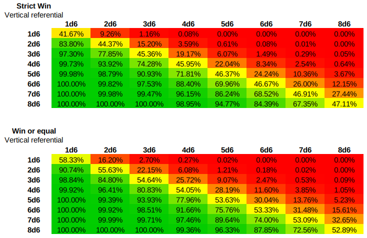
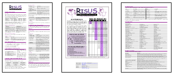

# May 2022

---

## Lulu : de la joie pour les grognards !

Je ne sais pas si je suis un Grognard mais Lulu me met en joie. Pourquoi ?

Je ne suis pas contre acheter des vieux JDR. J'ai raté plus de 20 ans de l'histoire du hobby, j'ai donné quelques unes de mes reliques de JDR à mon frère voilà des années (dont une boîte de D&D rouge 1e en français presque neuve !), c'est normal que je veuille combler mes lacunes avec des vieux trucs. Le problème, c'est que, ces vieilleries ne sont pas simples à trouver et, quand on les trouve, elles sont souvent chères.

Ces derniers temps, j'ai acquis pour quelques euros les 3 volumes de D&D 3.5 en état correct à bon. A l'étranger.

J'ai aussi trouvé Méga 3 en édition Descartes, édition complètement scandaleuse (reprise avec les fautes du numéro spécial de Casus avec une intro focalisée sur les errata), mais acquise pour le scénario.

J'ai aussi laissé dans mon passé, une première édition française de Star Wars D6 WEG et le sourcebook qui allait avec. J'ai dû retravailler un peu les PDF qui se trouvent très facilement, WEG ayant cessé d'exister et je me suis fait une petite commande Lulu, le premier en cartonné super couleurs (un vrai fac-similé de l'édition originale US) et le second en cartonné N&B, respectivement 28€ et 10€. Je lisais l'autre fois dans le mail de Black Book que le papier devient cher, mais de mon côté je dois dire que je n'ai pas vu la différence. Un fac-similé 1e cartonné couleur pour moins de 30€, en France, c'est du jamais vu.

J'ai pas mal utilisé Lulu pour des livres, notamment des 18ème et 19ème siècles, et franchement, c'est imbattable, que ce soit au niveau qualité ou au niveau prix. En plus, vous avez une édition unique et c'est fait en France, d'où un délai moyen de deux semaines pour avoir les ouvrages.

Raahah (râle du grognard), je suis content ! Star Wars D6 est une étape de plus dans mon exploration grognardesque des systèmes de jeu D6, après Risus et Ghostbusters.

D'ailleurs, demain, je reçois Ghostbusters 1e et 2e (international edition) avec tous les suppléments WEG en provenance directe de l'imprimeur français qui bosse pour Lulu ! Trop bon !

/(26 mai 2022)/

---

## Probabilités de x d6 contre y D6 (suite)

J'ai détaillé un peu l'explication des probabilités de succès de x d6 contre y d6 en combat dans [une page dédiée](https://github.com/orey/jdr/tree/master/D6-System-Combat) sur mon [github](https://github.com/orey/jdr).

Il faudrait comparer avec des systèmes de jeu ayant des scores de combat fixes et des moyens linéaires de les tester.

/(24 mai 2022)/

---

## La Grande Liste Des Intrigues de jeu de rôles

[La Grande Liste des intrigues de jeu de rôles](https://rouboudou.itch.io/la-grande-liste-des-intrigues-de-jdr) est une création de S. John Ross, l'inventeur de [Risus](https://rouboudou.itch.io/risus). Ce supplément gratuit vient d'un article que John a écrit en plusieurs versions et qui décrit les intrigues génériques de tous les scénarios qu'il avait pu lire.

En un sens, John Ross reprend le flambeau du livre de Vladimir Propp, [la Morphologie du Conte](https://github.com/orey/jdr/tree/master/VladimirPropp). Ce livre est un jalon important dans l'analyse des contes de fées dans la mesure où il prend le sujet par la structure des contes, et montre que, bien qu'en apparence très nombreux et divers, tous les contes analysés obéissent à une même "équation".

Des années plus tard, ayant découvert la Grande Liste, j'ai eu l'impression que John Ross redécouvrait ce même concept. Sans aller jusqu'à l'équation, ce dernier propose une liste d'intrigues, des variations et des possibles retournements, qui font que la plupart des intrigues de scénarios semblent entrer dans ces quelques pages.

Il fournit aussi un conseil trivial, mais à ne pas oublier : dans les JDRs, l'intrigue est souvent simple ; ce sont les personnages qui la rendent attirante. L'intrigue n'est rien sans les rôles, ceux des PJs mais aussi ceux des PNJs qui donnent une couleur particulière.

Je ne pense pas qu'il existait une version traduite avant celle que j'ai mis en ligne. A télécharger à tout prix !

/(23 mai 2022)/

---

## Handel, Méga et le jeu de rôles

[Ecouter](https://www.youtube.com/watch?v=tACelwl_S1o&t=9s)

Ce disque m'a beaucoup marqué. Il m'a fait aimer Handel. Quel rapport avec le JDR ? Aucun sans doute.

Je lis les blogs de ceux qui n'ont jamais perdu le contact avec le jeu, et je me sens un peu étranger. Je ne suis pas encore re-rentré complètement dedans.

Tiens, sur le blog de Imaginos, un [lien](https://blogs.bl0rg.net/imaginos/2022/04/23/cinquieme-paradigme-mais-pas-cinquieme-vitesse/) vers un [topo sur Méga 5](https://scriiipt.com/2022/04/mega-5e-paradigme-un-point-detape-apres-3-ans/). Je vais attendre un peu. Je suis dans Méga 3 et le 4, ayant trouvé une bonne occase papier de Méga 3 que je n'avais jamais lu.

Dans tous les cas, on ne jouera sans doute jamais avec le moteur de jeu original, mais soit avec [Risus](https://rouboudou.itch.io/risus) et mon [extension simpliste pour Risus Méga](https://rouboudou.itch.io/mega), soit avec un autre moteur simpliste mais adapté aux pouvoirs psy.

Comme je ne suis pas complètement satisfait du système Risus, je regarde [Ghostbusters](https://rendedpress.blogspot.com/2015/11/ghostbusters-rpg-legit-downloads-gbfans.html) et [Troika](https://melsonian-arts-council.itch.io/troika-numinous-edition/devlog/104412/srd) qui me plaisent bien au niveau de mécanique de jeu simpliste.

Ghostbusters est un jeu marrant qui a inspiré Star Wars 1e avec sa mécanique de groupe de d6s (d6 pool). Troika est dans la continuité des jeux dont on est le héros. Je sais qu'il a été [traduit en français](https://www.gameontabletop.com/cf660/troika-numinous-edition.html) mais il ne semble pas (encore ?) disponible à l'achat. Dans tous les cas, je suis en train de le traduire et de l'adapter de mon côté.

Hé oui, je recherche encore un système de jeu simpliste mais sympa pour jouer dans tous les univers. C'est mon côté blaireau.

/(22 mai 2022)/

---

## Machins de 2020 sur les ricains

Marrant, sur ce sujet, ma femme me disait que les américains avaient un type de névrose collective très spéciale : celle de n'avoir pas de passé, ou plutôt de refouler leur passé /en tant qu'européens/. Des choses, simples pour nous, les font rêver, particulièrement le Moyen-Age.

Pareil, sur un podcast de [dicegeeks.com](https://dicegeeks.com/), j'ai entendu une discussions sur les dinosaures en tant que monstres dans les JDRs. Étrange discussion de gens qui se rendent compte que visiter des labyrinthes (les fameux "dungeons") pour buter des monstres, c'est facile comme jeu mais c'est pas hyper sain, dans l'absolu. Une phrase excellente de Matt Davis : "jouer comme ça à D&D, c'est vraiment faire du wargame ;  ce n'est pas du JDR".

Cela m'a fait penser à tout un tas de choses qui font tripper les américains, notamment des trucs moyenâgeux très médiocres qui ne nous impressionnent pas, nous les Frenchies.

En fait, D&D, c'est un peu le passé médiéval fantasmé des ricains croisé avec des super-héros dans les grottes de Tolkien...

Pas trop mon truc tout ça.

/(21 mai 2022)/

---

## Enfin, les probabilités de x d6 contre y d6 !

Ahah, je suis content de moi !

Cela fait un moment que je me pose des questions sur le système D6. J'avais commencé sur le système D6 ici : https://github.com/orey/jdr/tree/master/D6-System

Je me souviens que j'avais beaucoup aimé le système de Star Wars avant de découvrir que des différences de nombres de dés étaient très difficiles à compenser.

Récemment, je me suis remis à fond dans [Risus](https://github.com/orey/jdr-risus) et là encore, le système Risus, surtout en mode combat, Cliché contre Chiché, avec chaque cliché ayant un certain nombre de d6, m'a fait me poser de grandes questions.

Je suis revenu à la source en analysant [Ghostbusters](https://rendedpress.blogspot.com/2015/11/ghostbusters-rpg-legit-downloads-gbfans.html) (en téléchargement gratuit sur le lien). Le système est le même, sans doute plus flexible que le système Risus (j'y reviendrai).

Je me suis dit que, vraisemblablement, des gens avaient dû travailler les probabilités de succès d'un combat de 3d6 contre 4d6, par exemple. Je n'ai pas trouvé, si bien que j'ai fait [un petit tableur et un petit programme](https://github.com/orey/jdr/tree/master/nD6) pour pouvoir le calculer. Les résultats sont là :

On voit bien sur ces deux tableaux l'ampleur des dégâts. Dès que les deux combattants ont un d6 d'écart, les probabilités de succès chutent.

Dans Risus, ce phénomène peut être compensé par la Gonflette, mais cette dernière est très coûteuse car, si elle permet de booster sur un round (il faut l'envisager dans un combat où l'on se sert de plusieurs Clichés), le coût ensuite de -1d6 est quand même très violent.

Dans Ghostbusters, c'est plus malin, je trouve : on prend un bon point qui devient un d6 supplémentaire, histoire d'être plus équilibré. Et comme les PJs ont normalement plein de bons points, on peut en consommer quelques uns durant un combat.

De mémoire, dans Star Wars, il y a aussi un moyen de "booster" pour compenser provisoirement le décalage sur une action. Il faudrait que je regarde.

/(21 mai 2022)/

---

## Des trucs sur Itch

Bon, voilà, j'ai publié quelques trucs gratuits sur Itch : https://rouboudou.itch.io

En ce moment, je suis dans Risus. Je sais c'est un vieux truc mais c'est assez pratique pour jouer sur le pouce. J'ai un peu travaillé un écran en 3 volets qui commence à être sympa :

* Page 1 : toutes les règles de Risus en mode synthèse utilisable ;
* Page 2 : la table des probas, utile car nous sommes dans un monde de multiples D6 donc des probas avec une courbe en cloche ;
* Page 3 : des outils pour comprendre les Clichés et créer des personnages amusants.

J'avoue que je débarque encore dans un monde qui a beaucoup changé depuis mon long break. Je regarde des trucs, lis des trucs sans être toujours convaincu.

Enfin, c'est cool toute cette agitation positive autour du JDR. Je me souviens d'une époque où les joueurs étaient vus comme des satanistes et où les médias disaient que les jeunes se suicidaient à cause de D&D.

/(15 mai 2022)/

---

