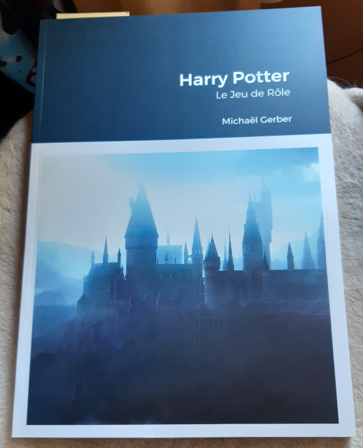

---
tags:
    - Harry Potter
    - Mythic
    - GME
---

# News

Voilà les sujets qui m'ont occupé ces derniers temps :

* Je poursuis la traduction de Troika! C'est un gros travail surtout dans un contexte de manque structurel de temps. Elle sera sans doute gratuite.
* Vu sur [itch.io](https://itch.io), le supplément [Fangenoire](https://osr-vf.itch.io/fangenoire) pour Périlleuses Contrées, par [OSR-VF](https://osr-vf.itch.io/). Un gros travail de super qualité !
* J'ai acheté et lu le jeu [Colostle](https://www.colostle.com/) mais je n'ai pas eu le temps de tester. L'univers est amusant mais cela ressemble quand même à un jeu pour enfants.
* J'ai voté pour les [Ennies 2022](https://ennie-awards.com/) et ce fut un gros travail. Quelques trucs intéressants dans la scène TTRPG alternative mais il faudrait que j'ai plus de temps. Rien que de voter sérieusement m'a pris plusieurs heures en plusieurs jours. CVous avez jusqu'au 24 juillet 2022 pour voter : https://vote.ennie-awards.com/vote/2022/
* J'ai eu _The Witcher TTRPG_ comme cadeau d'anniversaire mais je n'ai pas encore démarré la lecture.
* Il faut que j'intègre le facteur de chaos au eGME (voir plus bas).

_23 juillet 2022_

---

# A propos de la première version du "eGME" en ligne

La version du <a href="https://orey.github.io/blog/gme-version1-0.html">GME (beta)</a> fait appel à quelques concepts de Mythic que je trouve bien. Je vais le nommer "eGME" pour le distinguer du GME Mythic notamment (et puis c'est moins long à écrire).

## Concept 1 : les scènes et leur structure

Le jeu solo est un ensemble de scènes. Ces scènes font apparaître des PNJ et des pistes (des intrigues).

_Figure 1 : vue de la structure des scènes du eGME_

## Concept 2 : la scène a trois états

La scène possède 3 états différents :

* Au début, on décrit comme elle commence, elle est "normale" ;
* Elle peut être "altérée", soit modifiée suite à un événement ;
* Elle peut être "interrompue", ce qui signifie qu'autre chose se passe (piloté par un événement aléatoire

## Concept 3 : le facteur de chaos

Dans Mythic et ses extensions, il existe plusieurs façons, en début de scène, de savoir si cette dernière subit une modification. Dans le Mythic GME, c'est le facteur de chaos qui pilote ce paramètre.

_Figure 2 : vue de la [table du destin](https://github.com/orey/jdr/tree/master/Mythic-fr) de Mythic_

Le principe du facteur de chaos est que, en fin de scène, suivant ce que le PJ a mîtrisé ou pas, le facteur de chaos diminue ou augmente. Plus le facteur de chaos est grand, plus le risque d'avoir un événement aléatoire est important.

Le facteur de chaos est testé en début de scène. Il décide si une scène doit être modifiée ou pas.

Ce concept est très intéressant car il rend le GME à la fois plus incertain et piloté par un genre de contexte extérieur de mâitrise du PJ.

Pour l'instant, le facteur de chaos n'est pas implémenté dans le GME et la raison est expliquée ci-dessous.

## Concept 4 : le facteur de chaos comme perturbateur des réponses de l'oracle

_Figure 3 : l'oracle dans le eGME_

L'oracle de Mythic est basé sur une estimation de la probabilité d'occurrence d'un certain événement. En fonction de cette probabilité, le jet de 1d100 aura plus ou moins de chances de faire dire "oui" à l'oracle.

L'idée de Mythic GME est que le facteur de chaos devrait intervenir comme élément perturbateur dans les réponses de l'oracle. Cela donne la table du destin en figure 2.

 Le parti pris par Tana Pigeon, créatrice de Mythic, est d'augmenter les chances pour l'oracle de répondre oui à la question quand le facteur de chaos est élevé.

Cette option est au final, assez inadaptée, car, durant toute la scène, l'oracle aura une façon de répondre homogène mais distordue. De plus, il est alors facile de lui poser des questions auxquelles le joueur voudrait qu'il réponde oui. J'ai implémenté cette version de l'oracle [ici](https://github.com/orey/gme/blob/main/oracles/oracle2.js), mais elle n'est pas utilisée dans le eGME.

Tana Pigeon, consciente du problème, a proposé dans _Mythic Variations 2_ une autre façon d'intégrer l'impact du chaos dans l'oracle. J'avoue que cette solution est plus maligne car elle plus aléatoire. Elle est aussi implémentée [là](https://github.com/orey/gme/blob/main/oracles/oracle1.js). Mais elle n'est pas utilisée dans le eGME.

En fait, je ne suis pas satisfait de ce game design. Après une analyse qu'on pourra trouver [ici](../pages/gme.md), je me suis mis à tester en mode papier une autre version de cette intégration.

## Concept 4 : l'événement aléatoire

Mythic et Mythic Variation 1 offre différentes façons de générer un événement aléatoire.

_Figure 4 : l'événement aléatoire dans le eGME_

Cette fonction est implémentée dans le eGME et elle est bien. On pourrait certes challenger les tables sur lesquelles elle repose, mais au final, cette fonction est très utilisable.

Un des problèmes de game design est : quand invoquer cette fonction dans le jeu, surtout si l'on veut l'invoquer dans le cadre d'une question posée à l'oracle ?

## Quels sont les besoins ?

Une des façons d'intégrer un événement aléatoire dans le résultat de l'oracle est par exemple de déclencher cet événement sur un jet de dés double avec 1d100. Cela fait une chance sur 10 d'avoir un événement aléatoire.

On pourrait aussi faire un test de chaos à un certain moment, en fonction d'un résultat donné par l'oracle.

L'oracle répond de manière classique les choses suivantes :

* Oui et...
* Oui
* Oui mais...
* Non mais...
* Non
* Non et...

On pourrait convenir que dès que l'oracle répond "et..." alors un événement aléatoire se produit, soit positivement, soit négativement. Il est aussi possible de faire en sorte qu'un événement aléatoire ne se produise qu'en cas de "non et...", car dans ce cas, potentiellement, il faut, dans tous les cas, que le joueur trouve une autre solution.

Voilà l'état de mes réflexions sur le sujet. Pour le moment donc, le facteur de chaos n'est pas implémenté, mais j'y songe.

_23 juillet 2022_

---

# La première version de mon GME en ligne

C'est ici : <a href="https://orey.github.io/blog/gme-version1-0.html">GME (beta)</a>

Il fait pas mal de choses et est 100% utilisable offline. Il faudrait sans doute que j'harmonise les couleurs avec le site. Je commenterai une autre fois, je manque de temps.

Pour mémoire, GME = Game Master Emulator.

_26 juin 2022_

---

# Harry Potter le JDR, le top du top

Bon, je ne suis pas souvent impressionné par les productions françaises mais là, force est de constater que nous avons un jeu d'une qualité remarquable.

Comme je débarque après plus de deux décennies sans JDR, j'avoue que je connais pas [Keul](https://www.geek-it.org/author/keul/), l'auteur du jeu, mais [son travail](https://www.geek-it.org/harry-potter-jdr/) est vraiment remarquable :

[Harry Potter, le JDR](https://www.geek-it.org/harry-potter-jdr/)

Bon, certes, j'aime bien, le Basic RolePlaying (BRP) system de Chaosium, mais j'avoue que, lorsque j'ai trouvé ce bijou sur Internet voilà deux ans, cela m'a donné envie de rejouer... avec ma fille et ma femme.

A tel point que j'ai demandé à Lulu de me l'imprimer.

Je comprends qu'il y a un problème de droits, mais Keul devrait sans doute se rapprocher de J. K. Rowling ou de son agent, car son JDR est le plus complet et le mieux fait que l'on puisse voir sur le sujet (même si d'autres ont tenté, en français).

Bravo à [Keul](https://www.geek-it.org/author/keul/) encore pour ce travail impressionnant !

_06 juin 20222_

---

# Analyse de la table du destin de Mythic GME

Je travaille en ce moment à une petite [collection de programmes](https://github.com/orey/gme) permettant de jouer en solo avec une construction d'histoire dynamique. Mon inspiration est Mythic GME.

C'est pour moi une occasion de travailler sur le [game design de ces GME](../pages/gme.md), dans la continuité des sujets [Grande Liste des intrigues de JDR](../downloads/grande-liste.md) et [Morphologie du conte](../pages/propp.md) de Vladimir Propp.

C'est un vieux sujet que je mature depuis quelques temps.

La structuration de l'histoire via Mythic GME est un bon canevas sur lequel broder. Pour le moment, j'ai codé la table du destin dans les deux versions proposées par Mythic : la version Mythic GME et la version Mythic GME Variation II.

_04 juin 2022_
