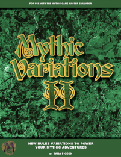

---
tags:
    - Mythic
    - GME
---

# Analyse de la table du destin de Mythic GME

Je travaille en ce moment à une petite [collection de programmes](https://github.com/orey/gme) permettant de jouer en solo avec une construction d'histoire dynamique. Mon inspiration est Mythic GME.

C'est pour moi une occasion de travailler sur le [game design de ces GME](../pages/gme.md), dans la continuité des sujets [Grande Liste des intrigues de JDR](../downloads/grande-liste.md) et [Morphologie du conte](../pages/propp.md) de Vladimir Propp.

C'est un vieux sujet que je mature depuis quelques temps.

La structuration de l'histoire via Mythic GME est un bon canevas sur lequel broder. Pour le moment, j'ai codé la table du destin dans les deux versions proposées par Mythic : la version Mythic GME et la version Mythic GME Variation II.

_04 juin 2022_
