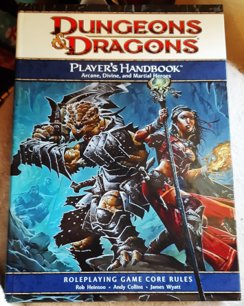
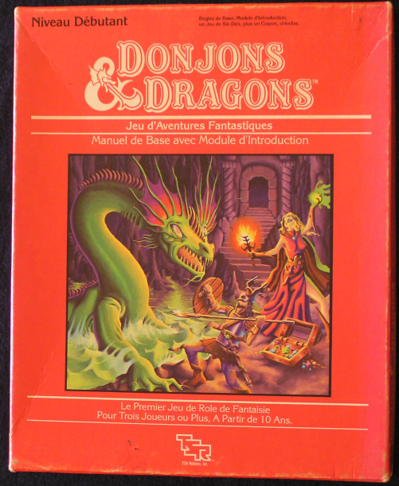
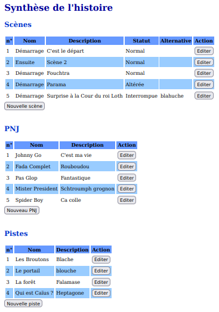

---
tags:
    - 9th Level
    - Colostle
    - D&D
    - DCC
    - Fighting Fantasy
    - Ghostbusters
    - GME
    - Harry Potter
    - Mythic
    - Troika
    - Worlds Witout Numbers
---

# Fighting Fantasy (1984) en deux pages

<mygame>Fighting Fantasy</mygame> est le système de jeu des _Livres dont vous êtes le héros_. En 1984, Steve Jackson et Ian Livingstone transforment le système de jeu des livres solo en JDR très simple.

Même si le jeu ne contient pas de système de magie, il est intéressant à plus d'un titre car il possède une ossature très saine qui fera qu'il ne ne cessera d'être repris, par exemple par Troika!

| Caractéristique  | Commentaire                                                                                                          |
|------------------|----------------------------------------------------------------------------------------------------------------------|
| Skill (1d6+6)    | Permet la comparaison avec un seuil (2d6 &le; Skill)                                                                  |
|                  | Permet le combat en opposition (comparaison de Skill + 2d6 + modificateurs chez les deux combattants)                |
|                  | Permet l'application de bonus et de malus (avec des probabilités linéaires) en fonction des armes, ou des conditions |
|                  | Permet l'utilisation de "compétences avancées" (genre de bonus permanents au Skill) (*)                              |
| Stamina (2d6+12) | La notion de points de vie rend moins vague l'état des blessures du personnages                                      |
|                  | Cette notion permet une magie basée sur la consommation de Stamina (*)                                               |
| Luck (1d6+6)     | Cette notion permet de sauver les héros en cas de problème, tout en ne donnant pas un chèque en blanc                |

(*) Extensions que l'on trouve à la fois dans <mygame>Advanced Fighting Fantasy</mygame> de 1989 et dans <mygame>Troika!</mygame>.

En gros, le jeu est très sain dans sa structure et d'une simplicité telle qu'on peut jouer avec des enfants très rapidement.

A consommer sans modération : la version française sur le site :

<table>
<tr>
<td><button type="submit" style="font-size:16px;border-radius: 4px;font-weight: bold;background:#fa5c5c;color:white;padding:10px" onclick="window.location.href='../../files/fighting-fantasy/FightingFantasy-VersionFrancaise-OreyJdr13.pdf';">Télécharger</button></td>
<td style="font-size:16px">FightingFantasy-VersionFrancaise-OreyJdr13.pdf</td>
</tr>
</table>

Et aussi sur Itch.io : [https://rouboudou.itch.io/fighting-fantasy](https://rouboudou.itch.io/fighting-fantasy)

30 juillet 2022

---

# Ahahahah ! (rire sardonique)

La Poste a livré une journée en avance mes commandes [Lulu](https://lulu.com). Encore une fois, je suis surpris de la qualité de ces impressions.

## World Without Number

Le premier bouquin reçu est l'impression de la version gratuite de [Worlds Without Number](https://www.drivethrurpg.com/product/348809/worlds-without-number-free-edition) de Kevin Crawford. La couverture est cartonnée souple et l'intérieur est en couleurs.

Moins de 15€ en impression chez Lulu, c'est incroyable.

## D&D 4e Player's Handbook

Le second bouquin était une tentative : le [Players's Handbook de D&D 4ème édition](https://www.dmsguild.com/product/161671/Players-Handbook-4e?src=hottest_filtered&filters=0_0_0_0_0_45349_0_0). A partir du PDF, je me suis recomposé une couverture cartonnée dure avec les modèles de Lulu.

Pour ceux qui ne le savent pas, Lulu crée un PDF pour la couverture avec juste la bonne épaisseur sur la tranche selon le nombre de pages et les options prises pour le papier. Le résultat est impeccable.

Le livre fait un peu plus de 18€, tout en couleurs...

En fait, j'aurais bien voulu acheter un reprint sur [DriveThru](https://www.drivethrurpg.com/) ou [DmsGuild](https://www.dmsguild.com/), mais les livres de règles de la quatrième édition ne sont plus édités. J'ai cherché un peu une occase mais bizarrement, je n'ai rien trouvé d'intéressant.

Je vais pouvoir, avec 14 ans de retard, juger de cette édition qui fit couler beaucoup d'encre dans le monde du JDR. C'est mon côté archéologue.

## Autres éditions de D&D

En fait, je n'ai jamais joué qu'à <mygame>AD&D 1e</mygame>, avec une espèce de fascination effrayée pour le Dungeon Master's Guide, de Gary Gygax, énorme et écrit tout petit. Mon MJ de l'époque me disait que tout y était prévu. Il y avait un côté "club d'initiés" chez les MJs de cette époque. D'abord, il fallait sacrément bien parler l'anglais, je m'en rends compte aujourd'hui, car Gary écrit plutôt pas mal. Ensuite, il fallait passer des semaines à lire et digérer tout ce matériel.

Avec le recul, je me dis que pas mal de MJs devaient adapter un peu les règles à leur sauce, car ne serait-ce que l'anglais de certains d'entre eux était quand même approximatif.

Pour les gens qui seraient intéressés, j'ai réuni dans un repo git quelques articles dudit Gary écrits dans des vieux Dragon. C'est ici : [github.com/orey/DandD](https://github.com/orey/DandD)

Comme je n'ai jamais beaucoup joué à <mygame>D&D</mygame>, je n'avais quasiment rien en stock, à part la boîte de base de <mygame>D&D</mygame> en français de 1982 de Moldvay, que j'ai donnée à mon frère je crois.

Donc, il y a deux ans, je n'avais rien. En me remettant un peu dans le coup, j'ai découvert la vague OSR et la fameuse version <mygame>D&D</mygame> 3e et 3.5e. En cherchant un peu, j'ai trouvé les 3 bouquins d'occase. Le jeu est quand même bien touffu.

Puis j'ai repris les investigations sur <mygame>D&D</mygame> : d'abord sur <mygame>D&D 0e</mygame>, puis sur <mygame>AD&D 1e</mygame> où j'ai profité d'une promotion sur *DmsGuild* pour acheter les 3 bouquins en reprint. En plus de l'édition 3.5, j'ai lu l'édition gratuite de <mygame>D&D 5e</mygame> Basic Rules que j'ai fait imprimer chez Lulu (première tentative, pas top au niveau rendu).

Voilà. Pour l'instant, la première édition d'<mygame>AD&D</mygame> reste ma favorite, même si le Manuel du Maître est quand même un peu en mode bazar. J'avoue que j'aime bien la logique didactique de Gary Gygax, ainsi que certains parti-pris qu'il avait sur le JDR.

Pour la 4e, c'est vraiment une tentative. Il va me falloir un certain temps pour lire le livre et me faire une idée. Surtout que j'ai déjà <mygame>Worlds Without Number</mygame> à lire avant...

24 juillet 2022

---

# Worlds Without Number (WWN)

J'avoue que je ne suis pas facilement impressionné par les JDR actuels.

J'ai, par exemple, dans le contexte Ennies 2022, passé un peu de temps sur la synthèse [Level 1 de 9thlevel](https://www.9thlevel.com/product-page/2021-level-1-anthology-digital) 2021 et même 2020 et là, pour moi, on est dans un autre monde... loin de [DCC](https://goodman-games.com/dungeon-crawl-classics-rpg/) et du JDR tel que je le connais.

Par exemple, <mygame>Colostle</mygame>, qui semble faire son petit effet dans la sphère des Ennies 2022, est un jeu sympa, plutôt pour ados, et son utilisation des cartes (jeu de 54 cartes) à la place des dés est une idée sympathique, qui n'est pas sans rappeler celle de [Fortune Wheels](http://www.fortuneswheel.co.uk/) qui est aussi un jeu anglais. Côté probabilités, cela innove un peu : dans un jeu complet, on a une chance sur 13 de tirer une carte, mais si le jeu écarte les cartes déjà tirées, cela modifie les probabilités...

Bref, venons-en à WWN. J'avais lu quelques trucs sur ce jeu, en fait plutôt sur _Stars Without Numbers_. Je télécharge et je tourne les pages. Déjà, le volume du livre me semble inhabituel (352 pages). C'est de l'OSR mais avec pas mal de choses intéressantes.

Puis en page 94, le monde commence à être décrit, puis viennent 200 pages environ de tables pour créer sa campagne, son aventure, etc. Ouahou, quel gigantesque travail. Résultat, je me fais une commande de version gratuite sur Lulu et cette dernière doit arriver demain. Je pense que je vais l'emporter en vacances car c'est une somme impressionnante qui mérite un peu d'attention.

Voir : [Worlds Without Numbers Free Edition](https://www.drivethrurpg.com/product/348809/worlds-without-number-free-edition)

Au fait, les [votes](https://vote.ennie-awards.com/vote/2022/) pour les Ennies 2022 se terminent ce soir ! A quand des Ennies français ?

24 juillet 2022

---

# Fighting Fantasy 1984 en français

## Fighting Fantasy (FF), le moteur des _Livres dont vous Êtes le Héros_

<mygame>Fighting Fantasy</mygame> est une série de livres de jeux de rôles pour un seul joueur créée par [Steve Jackson](https://en.wikipedia.org/wiki/Steve_Jackson_(British_game_designer)) (le Steve Jackson anglais et non [celui de GURPS](https://en.wikipedia.org/wiki/Steve_Jackson_(American_game_designer)) qui est américain) et [Ian Livingstone](https://en.wikipedia.org/wiki/Ian_Livingstone).

Le premier volume de la série fut publié en livre de poche par Pufin en 1982. Cette série propose un système de jeu de rôles très simple qui fut ensuite complété de diverses façons, notamment dans le livre <mygame>Dungeoneer, Advanced Fighting Fantasy</mygame>, publié en 1989. Récemment, le système a été repris et customisé dans le jeu de rôles [Troika!](https://melsonian-arts-council.itch.io/troika-numinous-edition).

## Une modeste synthèse des règles en deux pages

Le document de deux pages que je viens de terminer reprend les règles originales de 1984. J'avais déjà un [draft en stock](https://github.com/orey/jdr-ff/blob/master/v1.0/FightingFantasy-VersionFrancaise-OreyJdr03.pdf) mais je n'étais pas totalement satisfait de la présentation (manque de temps pour finaliser les choses).

Comme je voudrais poster cette synthèse de deux pages du <mygame>FF</mygame> de 1984 sur [itch.io](https://rouboudou.itch.io), j'ai demandé sur [le site de FF](https://www.fightingfantasy.com/licensing) les conditions de le licence. Je vais voir ce qu'ils répondent.

La version de 1984 est super légère :

* Elle ne possède pas le système de compétences avancées que l'on trouve dans <mygame>Dungeoneer</mygame>,
* Elle ne comprend pas de système de magie.

## Le contexte Troika!

Je suis en train de traduire <mygame>Troika!</mygame> depuis le SRD en mettant en illustration une toile de maître quand je le peux. Cela donne une certaine "couleur" au jeu.

Comme le système de jeu de <mygame>Troika!</mygame> est celui de <mygame>Advanced Fighting Fantasy</mygame>, légèrement adapté (sur la COMP notamment), j'ai voulu remettre en forme ma version de synthèse des règles de FF 1984 pour comprendre un peu la généalogie du truc. A noter que <mygame>FF</mygame> et <mygame>Troika!</mygame> sont deux produits anglais, et qu'il est impossible à tout rôliste anglais de ma génération de ne pas connaître <mygame>FF</mygame>.

En fait, ce qui me botte dans ce système, c'est son accessibilité, et notamment la capacité de jouer avec des ados en quelques minutes. Comme avec [Ghostbusters](../pages/D6-systems.md), le système se maîtrise en un rien de temps.

## Reboot de Advanced Fighting Fantasy

A ce propos, <mygame>Advanced Fighting Fantasy</mygame> a été [rebooté](https://www.drivethrurpg.com/browse/pub/667/Arion-Games/subcategory/1684_25223/Advanced-Fighting-Fantasy) par Arion Games. Ils en sont même à la deuxième édition. Par contre, le graphisme intérieur ne m'a pas totalement séduit. Il y a tant d'artistes de talent dans le monde de la fantasy que c'est dommage de faire une mise en page comme je la fais si on a quelques moyens.

24 juillet 2022

---

# News

Voilà les sujets qui m'ont occupé ces derniers temps :

* Je poursuis la traduction de <mygame>Troika!</mygame> C'est un gros travail surtout dans un contexte de manque structurel de temps. Elle sera sans doute gratuite.
* Vu sur [itch.io](https://itch.io), le supplément [Fangenoire](https://osr-vf.itch.io/fangenoire) pour Périlleuses Contrées, par [OSR-VF](https://osr-vf.itch.io/). Un gros travail de super qualité !
* J'ai acheté et lu le jeu [Colostle](https://www.colostle.com/) mais je n'ai pas eu le temps de tester. L'univers est amusant mais cela ressemble quand même à un jeu pour enfants.
* J'ai voté pour les [Ennies 2022](https://ennie-awards.com/) et ce fut un gros travail. Quelques trucs intéressants dans la scène TTRPG alternative mais il faudrait que j'ai plus de temps. Rien que de voter sérieusement m'a pris plusieurs heures en plusieurs jours. Vous avez jusqu'au 24 juillet 2022 pour voter : https://vote.ennie-awards.com/vote/2022/
* J'ai eu  <mygame>The Witcher TTRPG</mygame>  comme cadeau d'anniversaire mais je n'ai pas encore démarré la lecture.
* Il faut que j'intègre le facteur de chaos au eGME (voir plus bas).

23 juillet 2022

---

# A propos de la première version du "eGME" en ligne

La version du <a href="https://orey.github.io/blog/gme-version1-0.html">GME (beta)</a> fait appel à quelques concepts de <mygame>Mythic</mygame> que je trouve bien. Je vais le nommer "eGME" pour le distinguer du <mygame>GME Mythic</mygame> notamment (et puis c'est moins long à écrire).

## Concept 1 : les scènes et leur structure

Le jeu solo est un ensemble de scènes. Ces scènes font apparaître des PNJ et des pistes (des intrigues).

<myimage>Figure 1 : vue de la structure des scènes du eGME</yimage>

## Concept 2 : la scène a trois états

La scène possède 3 états différents :

* Au début, on décrit comme elle commence, elle est "normale" ;
* Elle peut être "altérée", soit modifiée suite à un événement ;
* Elle peut être "interrompue", ce qui signifie qu'autre chose se passe (piloté par un événement aléatoire

## Concept 3 : le facteur de chaos

Dans Mythic et ses extensions, il existe plusieurs façons, en début de scène, de savoir si cette dernière subit une modification. Dans le Mythic GME, c'est le facteur de chaos qui pilote ce paramètre.

<myimage>Figure 2 : vue de la [table du destin](https://github.com/orey/jdr/tree/master/Mythic-fr) de Mythic</yimage>

Le principe du facteur de chaos est que, en fin de scène, suivant ce que le PJ a maîtrisé ou pas, le facteur de chaos diminue ou augmente. Plus le facteur de chaos est grand, plus le risque d'avoir un événement aléatoire est important.

Le facteur de chaos est testé en début de scène. Il décide si une scène doit être modifiée ou pas.

Ce concept est très intéressant car il rend le GME à la fois plus incertain et piloté par un genre de contexte extérieur de maîtrise du PJ.

Pour l'instant, le facteur de chaos n'est pas implémenté dans le GME et la raison est expliquée ci-dessous.

## Concept 4 : le facteur de chaos comme perturbateur des réponses de l'oracle

<myimage> Figure 3 : l'oracle dans le eGME </yimage>

L'oracle de Mythic est basé sur une estimation de la probabilité d'occurrence d'un certain événement. En fonction de cette probabilité, le jet de 1d100 aura plus ou moins de chances de faire dire "oui" à l'oracle.

L'idée de Mythic GME est que le facteur de chaos devrait intervenir comme élément perturbateur dans les réponses de l'oracle. Cela donne la table du destin en figure 2.

 Le parti pris par Tana Pigeon, créatrice de Mythic, est d'augmenter les chances pour l'oracle de répondre oui à la question quand le facteur de chaos est élevé.

Cette option est au final, assez inadaptée, car, durant toute la scène, l'oracle aura une façon de répondre homogène mais distordue. De plus, il est alors facile de lui poser des questions auxquelles le joueur voudrait qu'il réponde oui. J'ai implémenté cette version de l'oracle [ici](https://github.com/orey/gme/blob/main/oracles/oracle2.js), mais elle n'est pas utilisée dans le eGME.

Tana Pigeon, consciente du problème, a proposé dans _Mythic Variations 2_ une autre façon d'intégrer l'impact du chaos dans l'oracle. J'avoue que cette solution est plus maligne car elle plus aléatoire. Elle est aussi implémentée [là](https://github.com/orey/gme/blob/main/oracles/oracle1.js). Mais elle n'est pas utilisée dans le eGME.

En fait, je ne suis pas satisfait de ce game design. Après une analyse qu'on pourra trouver [ici](../pages/gme.md), je me suis mis à tester en mode papier une autre version de cette intégration.

## Concept 4 : l'événement aléatoire

Mythic et Mythic Variation 1 offre différentes façons de générer un événement aléatoire.

<myimage>Figure 4 : l'événement aléatoire dans le eGME</myimage>

Cette fonction est implémentée dans le eGME et elle est bien. On pourrait certes challenger les tables sur lesquelles elle repose, mais au final, cette fonction est très utilisable.

Un des problèmes de game design est : quand invoquer cette fonction dans le jeu, surtout si l'on veut l'invoquer dans le cadre d'une question posée à l'oracle ?

## Quels sont les besoins ?

Une des façons d'intégrer un événement aléatoire dans le résultat de l'oracle est par exemple de déclencher cet événement sur un jet de dés double avec 1d100. Cela fait une chance sur 10 d'avoir un événement aléatoire.

On pourrait aussi faire un test de chaos à un certain moment, en fonction d'un résultat donné par l'oracle.

L'oracle répond de manière classique les choses suivantes :

* Oui et...
* Oui
* Oui mais...
* Non mais...
* Non
* Non et...

On pourrait convenir que dès que l'oracle répond "et..." alors un événement aléatoire se produit, soit positivement, soit négativement. Il est aussi possible de faire en sorte qu'un événement aléatoire ne se produise qu'en cas de "non et...", car dans ce cas, potentiellement, il faut, dans tous les cas, que le joueur trouve une autre solution.

Voilà l'état de mes réflexions sur le sujet. Pour le moment donc, le facteur de chaos n'est pas implémenté, mais j'y songe.

23 juillet 2022

---

# La première version de mon GME en ligne

C'est ici : <a href="https://orey.github.io/blog/gme-version1-0.html">GME (beta)</a>

Il fait pas mal de choses et est 100% utilisable offline. Il faudrait sans doute que j'harmonise les couleurs avec le site. Je commenterai une autre fois, je manque de temps.

Pour mémoire, GME = Game Master Emulator.

26 juin 2022

---

# Harry Potter le JDR, le top du top

Bon, je ne suis pas souvent impressionné par les productions françaises mais là, force est de constater que nous avons un jeu d'une qualité remarquable.

Comme je débarque après plus de deux décennies sans JDR, j'avoue que je connais pas [Keul](https://www.geek-it.org/author/keul/), l'auteur du jeu, mais [son travail](https://www.geek-it.org/harry-potter-jdr/) est vraiment remarquable :

[Harry Potter, le JDR](https://www.geek-it.org/harry-potter-jdr/)

Bon, certes, j'aime bien, le<mygame> Basic RolePlaying</mygame> (BRP) system de *Chaosium*, mais j'avoue que, lorsque j'ai trouvé ce bijou sur Internet voilà deux ans, cela m'a donné envie de rejouer... avec ma fille et ma femme.

A tel point que j'ai demandé à Lulu de me l'imprimer.

Je comprends qu'il y a un problème de droits, mais Keul devrait sans doute se rapprocher de J. K. Rowling ou de son agent, car son JDR est le plus complet et le mieux fait que l'on puisse voir sur le sujet (même si d'autres ont tenté, en français).

Bravo à [Keul](https://www.geek-it.org/author/keul/) encore pour ce travail impressionnant !

06 juin 20222

---

# Analyse de la table du destin de Mythic GME

Je travaille en ce moment à une petite [collection de programmes](https://github.com/orey/gme) permettant de jouer en solo avec une construction d'histoire dynamique. Mon inspiration est <mygame>Mythic GME</mygame>.

C'est pour moi une occasion de travailler sur le [game design de ces GME](../pages/gme.md), dans la continuité des sujets [Grande Liste des intrigues de JDR](../downloads/grande-liste.md) et [Morphologie du conte](../pages/propp.md) de Vladimir Propp.

C'est un vieux sujet que je mature depuis quelques temps.

La structuration de l'histoire via <mygame>Mythic GME</mygame> est un bon canevas sur lequel broder. Pour le moment, j'ai codé la table du destin dans les deux versions proposées par <mygame>Mythic</mygame> : la version <mygame>Mythic GME</mygame> et la version <mygame>Mythic GME Variation II</mygame>.

04 juin 2022

