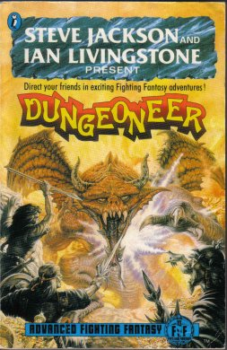

---
tags:
    - AdvancedFightingFantasy
    - ArsMagica
    - D&D
    - FightingFantasy
    - Froika
    - Légendes
    - Links
    - Mega
    - Pendragon
    - Rêve de Dragon
    - Runequest
    - Shadowrun
    - Simulacres
    - Troika
    - Warhammer
---

# A la recherche du meilleur système (simple) de JDR (2)

J'ai un peu modifié [mon programme de stats de combats](https://github.com/orey/jdr/blob/master/D6-System-Combat/proba-versus2.js) pour qu'il prenne en compte les modificateurs de type `2d6+2` ou `1d10-1`. Mon but était de vérifier que le système `d6` est bien moins avantageux pour celui qui qui a un modificateur plus faible qu'un système linéaire `d12`. Vous me direz, c'est évident. En fait oui.

Prenons le cas d'un combat avec AFF et donc un combat avec `COMP+2d6+Talent` contre un monstre ayant `COMP+2d6`. Il s'agit donc de comparer les courbes de deux entités ayant `2d6+A` et `2d6+B` et de les comparer avec le cas où l'on utiliserait un `d12`.

| Joueur 1 | Joueur 2 | Proba Jet 1 > Jet 2 | Proba Jet 1 &le; Jet 2 |
|----------|----------|---------------------|------------------------|
| `2d6`    | `2d6+4`  | `10%`               | `90%`                  |
| `1d12`   | `1d12+4` | `19%`               | `81%`                  |

Soit près de deux fois plus de chances de réussir dans le cas du `d12`.

Dans le cas d'une victoire ou égalité :

| Joueur 1 | Joueur 2 | Proba Jet 1 &ge; Jet 2 | Proba Jet 1 < Jet 2 |
|----------|----------|------------------------|---------------------|
| `2d6`    | `2d6+4`  | `16%`                  | `84%`               |
| `1d12`   | `1d12+4` | `25%`                  | `75%`               |

C'est complètement différent.

Je ne vais pas me paraphraser quand à l'[analyse des jeux D6](../pages/D6-Combat.md) mais on comprend pourquoi les systèmes `d20` ou `d100` se sont imposés : parce qu'ils sont plus *fair play* et n'offre pas les phénomènes de déformation des coubes à `nd6`.

Notons que même pour les jets sous la `COMP+Talent` ou la `COMP+Magie`, et même si le score total est de `11` ou plus, `12` étant toujours un échec, il reste une chance sur douze (`8%`) d'échouer. Alors que le pourcentage de chances de faire un double `6` sur `2d6` est de `1/36` soit à peine `3%`.

Froika! risque donc d'être un système `d12` qui sera donc compatible avec Troika! et AFF mais en plus linéaire. Il reste juste à limiter la `COMP` à la création du perso. Je trouve `6+1d6` trop permissif, `3+1d3` trop punitif, il reste `6+1d4` ou `6+1d3`. A voir.

_19 septembre 2022_

---

# A la recherche du meilleur système (simple) de JDR (1)

## Gestion des tests simples

Les tests simples sont utilisés pour les tests de compétences. Il faut tester le PJ pour savoir s'il réussit ou pas.

Selon les jeux, la compétence testée (parfois appelée caractéristique, talent, ou autre) est soit une constante (par exemple `45%` ou `12`), soit quelque chose de variable (par exemple `4d6` ou `1d8`).

Le test peut prendre deux une des deux grandes formes suivantes :

* Si la compétence est une **constante**, le jet de dés permet de se mesurer à elle : il faut faire soit inférieur ou égal à la compétence (courant), soit supérieur ou égal (plus rare).
* Si la compétence est une **variable**, le MJ doit déterminer un facteur de difficulté : le jet devra donc battre ce facteur, souvent supérieur ou égal à ce dernier.

Généralement, les systèmes de JDR gèrent ce cas sans problème notable. Il faut juste s'assurer que les statistiques ne soient pas tordues (voir [l'article sur les systèmes D6](../pages/D6-systems.md)).

Il faut noter une différence importante sur les tests à base de compétence : le test de la compétence constante n'oblige pas le MJ à déterminer un facteur de difficulté dans la plupart des cas. Des bonus et malus peuvent être appliqués dans des cas exceptionnels mais le joueur connaît sa chance de réussite de base dans tous les cas.

Par exemple, sur un système en pourcentage, si je possède `60%` dans une compétence, je comprend immédiatement mes chances de réussite, le `d100` étant, de plus, une distribution statistique linéaire (ce qui n'est pas le cas de `3d6` par exemple).

Les systèmes à **seuil de difficulté** ont le désavantage de faire appel au MJ pour toutes les situations, ce qui, à la longue, peut entraîner un sentiment d'arbitraire chez les joueurs.

J'avoue que personnellement, je préfère les jets contre des scores de compétences fixes. Comme j'évite les bonus/malus, sauf cas exceptionnel ou scène cruciale, le jeu va plus vite.

## Les deux grands problèmes à résoudre

En fait, à mon avis, les deux grands problèmes de conception d'un système de JDR sont les suivants :

* **Équilibrer les combats** (mêlée et à distance entre les joueurs et les adversaires),
* **Équilibrer la magie** (ou les pouvoirs psy), à la fois entre les joueurs (pour un certain équilibre du groupe) et avec les adversaires.

Certains jeux comme Call Of Cthulhu simplifient un peu le problème en déclarant que la magie est finalement réservée aux adversaires (fous). Certes, un PJ peut connaître un sort, mais pas au sens D&D.

D'autres jeux comme D&D deviennent intéressants dès lors que tous les PJs sont d'un niveau suffisant, et donc que les PJs ayant des sorts peuvent les utiliser. Dans les premiers niveaux, l'intérêt est quand même très limité. Et, à plus haut niveau, l'équilibre redevient compliqué (et n'est pas le même suivant les éditions).

D'autres jeux comme Ars Magica préviennent dès le début que le magicien sera le plus fort et de loin (et donc les PJs ne sont pas équilibrés).

Dans les nouveaux moteurs de jeux simplifiés (FU, Black Hack et consorts), je reste sur ma faim car cette équation est finalement souvent mal résolue. En fait, je cherche depuis longtemps un moteur de jeux simplifié gérant correctement la magie et les combats avec des mécanismes simples et extensibles.

## La façon de Dungeoneer de résoudre le problème

Dans ma recherche, après avoir traduit et compressé les règles de Fighting Fantasy (disponible [ici](../downloads/fighting-fantasy.md) ou sur [itch.io](https://rouboudou.itch.io/fighting-fantasy), j'ai récupéré une copie d'[Advanced Fighting Fantasy - Dungeoneer](https://en.wikipedia.org/wiki/Dungeoneer), une extension du jeu de Steve Jackson et de Ian Livingstone.

_Advanced Fighting Fantasy - Dungeoneer_

L'extension concerne deux dimensions :

* Des talents (compétences avancées ou *advanced skills*),
* Un système de magie.

Les talents fonctionnent comme des bonus, par exemple un talent de combat à l'épée de 2 donnera un bonus de 2 lors du combat contre l'adversaire. Ainsi, le joueur tirera `COMP+2D6+2` contre un adversaire.

Le joueur a `COMP` points à répartir dans ses talents.

La système de magie est assez malin et en deux temps :

* A la création du PJ, le joueur doit choisir de combien de points il ampute sa `COMP` pour créer son score de magie (pris sur les points de compétences avancées). Supposons que j'ai tiré `1d6+6` pour ma `COMP` et que j'obtienne `10`. Je décide d'affecter `4` points à la magie. J'aurais donc `COMP=6` et `Magie (4)`. Pour réussir un sort, je devrai donc faire un jet sous ma `COMP+Magie`, ce qui est ma `COMP` initiale.
* Suivant la difficulté du sort, je perdrai un certain nombre de `PdV`.
* Cela signifie aussi que pour toutes mes autres compétences non magiques, ma `COMP` restera à `6` et donc j'aurai moins de chances de réussite _structurellement_.
* Le nombre de points restant pour les autres talents est de `COMP-Magie= 10-4=6` ce qui équilibre la magie avec les autres compétences.

Évidemment, dans ce système, on peut se poser la question si faire un jet de `2d6` sous la `COMP+Compétence avancée` n'est pas un peu facile. Il est précisé dans le jeu qu'un `12` est toujours un échec, mais effectivement, on retrouve l'aspect un peu "facile" de Fighting Fantasy original.

## La façon Troika!

Troika! prend une approche encore plus simple sur deux dimensions :

* La `COMP` est tirée avec `1d3+3` seulement, ce qui rend les jets sous la `COMP+Compétence avancée` (beaucoup) plus difficiles (trop sans doute) ;
* La connaissance d'un sort est un talent comme un autre (même si l'utilisation des sorts fait perdre des points de vie).

Il y a certains avantages à ce système :

* Il est encore plus simple que celui de Dungeoneer ;
* Il permet à tous les archétypes de personnage d'avoir des talents dont des sorts, sans distinction ;
* Il est basé sur un système de points de compétences à répartir qui ne dépend pas de la `COMP` et donc, qui ne possède cet effet "double-peine" qui est qu'une `COMP` faible implique une restriction sur les talents à la création du personnage (comme dans Dungeoneer).

Les règles proposent de créer des archétypes à partir de `10` points de talents, même si, dans le livre de base, certains archétypes sont créés à partir de `13` voire `14` points de talents.

## Une grille d'analyse hyper-simple des moteurs de JDR

Cela fait donc une grille d'analyse à trois dimensions très simple :

| Dimension                          | Enjeu                                                                         | Difficulté de conception |
|------------------------------------|-------------------------------------------------------------------------------|--------------------------|
| Tests simples                      | Ne pas faire intervenir le MJ pour des facteurs de difficulté à chaque action | Moyen                    |
| Équilibre des combats              | Entre un PJ et un adversaire (combat en mêlée et à distance)                  | Facile                   |
| Équilibre de la magie/pouvoirs psy | Dans la dimension, équilibre des PJs ensemble, et contre les adversaires      | Difficile                |

## Application à quelques jeux

Prenons les notes possibles suivantes :

* `A` : très bien pris en charge ;
* `B` : moyennement pris en charge ;
* `C` : mal pris en charge ;
* `I` : inapplicable, le jeu a évité le problème. 

| Jeu            | Tests simples | Equilibre combats                     | Equilibre magie / psy                | Complexité |
|----------------|---------------|---------------------------------------|--------------------------------------|------------|
| CoC            | `A`           | `A`                                   | `I`                                  | 2          |
| D&D            | `A`           | `A`                                   | `A`, `B` ou `C` suivant les éditions | 3          |
| GURPS          | `A`           | `A`                                   | `A`                                  | 3          |
| FF             | `A`           | `A`                                   | `I`                                  | 1          |
| AFF Dungeoneer | `A`           | `A`                                   | `A`                                  | 1          |
| Troika!        | `A`           | Sans doute `B`                        | `A`                                  | 1          |
| Ars Magica     | `A`           | `A`                                   | `I`                                  | 3          |
| Risus          | `B`           | `B` voir [ici](../pages/D6-Combat.md) | `B`                                  | 1          |
| Mini6          | `B`           | `B` voir [ici](../pages/D6-Combat.md) | `B`                                  | 1          |

Bon, Dungeoneer et Troika! mènent la compétition, le second étant quand même très inspiré (voire souvent copié) sur le premier.

_18 septembre 2022_

---

# NeoMega, ça roule

Ahaha, je travaille sur NeoMega, motorisé par Froika! et j'ai déjà pas mal de matériel.

_18 septembre 2022_

---

# NeoMega pour Froika!

Bon, la réflexion avance. Dès que j'ai fini la traduction de Troika! (nom actuel Froika!), je me lance dans l'adaptation à Méga. Si j'aime beaucoup l'univers et le travail remarquable fait dans le cadre de l'[Encyclopédie Galactique](https://www.messagers-galactiques.com/), je trouve que de nombreux points n'ont pas été exploités :

* Tout d'abord, la timeline décrite dans Méga 3 et étoffée dans Méga 4 reste évasive et des détails manquent quant à l'*Eclipse des Soleils* et les fameuses *Choses du Vide*.
* Ensuite, le fait de pouvoir transiter est déjà quelque chose de potentiellement déstabilisant pour une nation galactique, mais le fait de pouvoir se transférer dans quelqu'un d'autre pose un problème de sécurité galactique. Il est donc obligatoire que certains états aient, à un moment, considéré la Guilde comme une menace à éliminer. Ou alors, il était tentant de rassembler des Mégas renégats pour prendre le contrôle de l'AG. Je me souviens des livres de Philip Dick : quand un monde est empli de gens ayant des pouvoirs psy, toute la "texture" du monde est différente.
* De plus, le monde de l'AG est un peu un monde de bisounours. Je ne dis pas que j'adore les mondes violents et apocalyptiques, mais un peu plus de plausibilité donnerait du corps au monde de Méga.

C'est pourquoi, je vais travailler en ce sens. Possible que ça ne donne pas grand chose, mais on sait jamais.

_04 septembre 2022_

---

# Langue de pute

J'ai donc fait une synthèse des scénarios des vieux Casus (première série) pour retrouver principalement tout ce qui concernant Cthulhu et Méga. J'ai aussi concaténé tout ce que je trouvais sur Laelith, première édition, y compris les scénarios D&D de Denis Beck.

J'ai découvert pas mal de choses :

* L'indécision totale du journal et son incapacité à suivre un sujet très longtemps.
* L'incompréhensible soutien à Simulacres, ce jeu complètement merdique, malgré les efforts démentiels de son auteur pour l'imposer de force et en mettre de partout, alors qu'à l'époque, les systèmes D&D et AdC étaient les plus pratiqués. Au lieu de faire des pages et des pages pour Simulacres, pourquoi ne pas traduire les scénarios pour les différents systèmes de jeux ? Avec le recul, on voit que l'Heroic Fantasy à la D&D ou l'horreur lovecraftienne à la Call Of Cthulhu passent par tous les systèmes...
* L'incompréhensible spécialisation des scénarios à un système de jeu. Par exemple, tout jeu D&D aurait pu avoir sa traduction pour Runequest ou Warhammer. Je crois avoir vu cela dans un seul numéro de Casus. Et comment font les joueurs ? Ils font la traduction seuls ? Ils sont supposés connaître tous les jeux et posséder tous les suppléments ?
* L'hyperfocalisation sur Shadowrun qui n'est tout de même pas le jeu du siècle.
* Des scénarios sur des jeux de troisième zone, hyper-spécialisés, impossibles à trouver en boutique à l'époque et impossibles à adapter.
* Un soutien absolu à *Rêve de Dragon* que, franchement, personne ne jouait autour de moi. Bon, OK, Denis Gerfaud est sympa, mais quand même.
* Je m'étais toujours demandé pourquoi Pendragon n'avait pas percé en France, mais c'était parce que tout le monde voulait faire la promo des Légendes de la Table Ronde qui, vu de moi, fut un bide complet. On en arrive un moment au comble : l'auteure du jeu LDLTR (Anne Vétillard) écrivant des scénarios pour Pendragon ! Mais si tard... Pendragon est méconnu en France et LDLTR est tombé dans l'oubli. C'est la double-peine ! Quel gâchis !
* Pourquoi avoir gardé des pages sur les wargames ? Il y avait des lecteurs ?
* Et la pub... Mon dieu, tant de pubs...

Au final, quand on se tape tous les Casus première mouture, on comprend comment, petit à petit, le public a fui. Sur certains numéros, il n'y a rien à garder, même du côté des scénarios.

Enfin, il reste certains scénarios pas mal, mais ils sont souvent des mêmes auteurs (notamment Denis Beck et Tristan Lhomme, j'aime bien aussi Jean Balczesak)...

_Tempus fugit_.

_28 août 2022_

---

# Un été tranquille

Bon, pas mal de choses :

* Je poursuis la traduction de Troika! avec une approche un peu personnelle des illustrations. Mais c'est lent.
* J'ai pas mal travaillé sur la comparaison entre les systèmes de jeu de Fighting Fantasy, celui de Advanced Fighting Fantasy 1e, et celui de Troika!. Ce n'est pas encore prêt mais c'est assez intéressant.
* En parallèle, je travaille sur l'adaptation du système AFF à Méga, pour avoir quelque chose plus élaboré que [ça](https://rouboudou.itch.io/mega) mais quand même hyper-simple.
* J'ai découvert *Ars Magica* pendant les vacances notamment avec la deuxième édition de 1989 de *Lion Rampant* (avant les versions *White Wolf*). J'avoue que ce jeu est assez fascinant, un peu dans le genre du jeu de rôle que j'aurais toujours voulu jouer au Moyen-âge.  J'y reviendrai.
* J'ai trouvé une bonne occase de D&D 4e DMG sur eBay. Je suis content.
* Je me suis fait une compil des scénarios pour Méga des vieux Casus. Je pense à la faire imprimer par Lulu. J'ai fait pareil pour les scénars Cthulhu.
* J'ai travaillé sur une page de Links en anglais qui vient d'un refresh de [cette page](https://github.com/orey/ttrpg).

Au fait, D&D 6e est en route ! Ça se passe ici : <https://www.dndbeyond.com/one-dnd>. Excitant, non ?

_27 août 2022_

---
