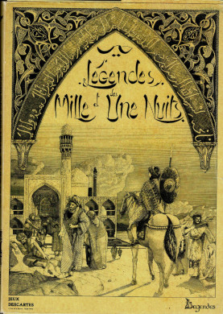
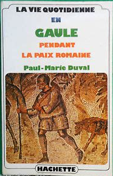
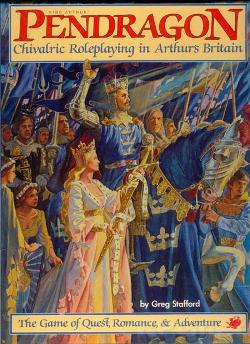

---
tags:
    - AdvancedFightingFantasy
    - ArsMagica
    - D&D
    - FightingFantasy
    - Froika
    - Légendes
    - Links
    - Mega
    - Pendragon
    - Rêve de Dragon
    - Runequest
    - Shadowrun
    - Simulacres
    - Troika
    - Warhammer
---

# Tables

* <a href="#accessibilite">Table 2 : Table d'accessibilité des JDR</a>
* <a href="#moteurs">Table 1 : Grille d'analyse des moteurs de JDR</a>

---
# Légendes : le multi-bide du JDR français

Ce qui suit est une analyse personnelle de quelqu'un qui a vécu les événements en tant que MJ et joueur. Je ne dis pas que mon expérience est représentative mais parfois, il faut mettre les pieds dans le plat dans une France qui n'ose plus regarder ni ses échecs, ni ses succès en face.

## Légendes, le jeu injouable

C'est l'histoire d'une déception.

Quand j'étais jeune, <mygame>Légendes</mygame> me semblait une alternative à la folie <mygame>D&D</mygame> et à l'approche de bourrins qui en découlait trop souvent. Quoi que le jeu ait eu une réputation de jeu hyper-complexe, en tant que MJ, je me souviens d'avoir cassé ma tirelire pour acheter les règles complètes. Nous avions à faire à un jeu supposément *générique* et déjà, à l'époque, le concept me séduisait.

J'avoue avoir été refroidi et être resté perplexe devant la réelle complexité du jeu. D'un autre côté, j'avais été prévenu.

<myimage>Légendes, les règles complètes</myimage>

Le jeu me paraissait *injouable*.

Plus tard, je me suis quand même procuré <mygame>Légendes des 1001 nuits</mygame>, parce que j'aimais bien l'univers. Le travail sur le background était vraiment sérieux mais je ne voyais pas comment je pouvais faire jouer ce jeu, en tous cas, pas avec le moteur de jeu original.

Cela revient depuis plusieurs fois dans ce blog, mais à l'époque, peu de gens avaient vraiment le temps ou les compétences  d'adapter des suppléments d'un jeu pour un autre. La belle pochette de pochette de <mygame>Légendes des 1001 nuits</mygame> est donc restée sur l'étagère. Je l'ai toujours.
 

<myimage>Légendes des mille et une nuits, un joli background pas facile d'accès</myimage>

Plus tard, dans une convention de jeux à Morestel, je me décide à jouer à <mygame>Légendes Celtiques</mygame> avec, manifestement, un MJ compétent ayant digéré les folles mécaniques. Je m'en souviens encore...

Sans parler de la longueur du processus de création des personnages, une fois à la table, le bilan fut désastreux : après 6 heures de jeu, nous n'en sommes toujours qu'au début du scénario. Nous avons principalement joué un combat d'une minute de jeu (60 secondes) en 4h30 ! Hé oui, le combat seconde par seconde... C'était trop pour moi.

En fait, à l'époque, que ce soit <mygame>Légendes Celtiques</mygame> ou <mygame>Légendes des 1001 nuits</mygame>, il faut voir qu'il était compliqué d'intéresser des joueurs à ces univers. Jouer des Gaulois dans un monde avec de la magie *à la marge*, ce n'est pas très facile.

Car, quoiqu'on puisse en penser, les points de repères du joueur des années 80 dans le monde celtique ne sont pas très nombreux.

## La difficulté du genre historico-magique

Ce genre "historico-magique" est très intéressant intellectuellement, mais très compliqué à faire jouer et à jouer dans les deux dimensions suivantes :

* Les joueurs n'ont pas forcément la *connaissance historique* du monde ;
* Ces derniers n'ont pas non plus la *connaissance de l'interprétation de la magie* qui est faite par le jeu.

<myu>Note</myu> : Voir la <a href="#moteurs">grille d'analyse des moteurs de JDR</a> et l'importance de la magie.

Le travail du MJ est d'autant plus complexe. Si j'étais cynique, je dirais que ce genre a un côté "prof d'histoire" ou "prof de français".

Quand on lit certains de ces jeux, on a l'impression de lire les bouquins de la série "La vie quotidienne".

C'est vrai pour le monde des <mygame>Légendes Celtiques</mygame>, mais aussi pour le monde des 1001 nuits qui, quoique beaucoup plus magique, est au final peu connu. On connaît Ali Baba, Aladdin, les génies et les tapis volants, mais souvent, cela ne va pas plus loin. Comment pouvoir se projeter (à l'époque) dans un monde très religieux gouverné par la présence d'Allah et par une vision musulmane du monde ?

Attention, je ne mets pas en cause les auteurs (notamment [Jean-Marc Montel](https://www.legrog.org/biographies/jean-marc-montel)) qui ont vraiment accompli un morceau de bravoure...

Mais quid de leur travail ? Où est-il ? Nulle part ! Descartes se fait racheter et puis, pouf, le contenu disparaît dans les limbes ! Il n'est même pas publié en PDF comme les vieilles versions de <mygame>AD&D</mygame>. Incroyable comme nous, français, pouvons gâcher notre talent !

Mais heureusement que les américains ne font pas la même chose ! Sinon , nous ne jouerions plus à <mygame>AD&D</mygame> ni à <mygame>CoC</mygame> !

Pour en revenir à l'approche de <mygame>Légendes</mygame>, les autres jeux de rôles traitent le sujet différemment. La fantasy s'appuie sur un imaginaire médiéval-fantastique très malléable et très ouvert, et les jeux d'horreur contemporaine se situent dans des univers proches du nôtre. De plus, ces deux types de jeux mettent au centre du jeu la découverte : des souterrains ("dungeons") pour le premier, et de l'horreur cachée pour le second.

## Les trois dimensions de l'accessibilité du jeu

On pourrait proposer une grille d'analyse des jeux basée sur la capacité des joueurs à accéder facilement à l'univers :

* Dans sa **dimension pragmatique** : est-ce que le joueur peut rapidement "intuiter" des postures compatibles avec l'univers ?
* Dans sa **dimension magique** : est-ce que le joueur peut rapidement intuiter ce qui est faisable par la magie ?

Avec ces deux dimensions, nous pourrions définir une grille de lecture de l'**accessibilité du monde** au joueur, un genre de ticket d'entrée pour les joueurs.

Je vais rajouter une troisième dimension qui me tient à coeur : le pourquoi. Pourquoi jouer dans ce monde ? Pourquoi est-ce intéressant ? Quel type de personnages est intéressant à vivre dans ce monde ? Quelle est la grande motivation des joueurs, de tous les joueurs ?

Le jeu historique est vraiment le jeu pour qui cette question est la plus naturelle : certes, la période révolutionnaire est intéressante historiquement parlant, mais est-il intéressant de jouer des acteurs de cette période historique quand on n'est ni un prof d'histoire, ni un prof de français ?

Je vais nommer cette troisième dimension : la **motivation fondamentale**, sous-entendu, "pour jouer".

La quatrième dimension sera la **complexité du système de jeu** qui est quand même un paramètre important dans l'équation.

Nous pouvons définir une échelle à trois valeurs :

* Facile : 3 points,
* Moyenne : 2 points,
* Difficile : 1 point,
* Très difficile : 0 points.

Ensuite, faisons les calculs et regardons les résultats !

Table 2 : Accessibilité des jeux de rôles

| Jeu                     | Access. Monde    | Access. Magie    | Motivation fondamentale | Complexité jeu     | Accessibilité |
|-------------------------|------------------|------------------|-------------------------|--------------------|---------------|
| Cthulhu                 | Facile (f)(3)    | Facile (g)(3)    | Facile (h)(3)           | Facile (3)         | 4.00          |
| Star Wars               | Facile (d)(3)    | Facile (d)(3)    | Facile (e)(3)           | Facile (3)         | 4.00          |
| D&D                     | Facile (a)(3)    | Facile (b)(3)    | Facile (c)(3)           | Difficile (1)      | 3.30          |
| Esoterrorists           | Facile (f)(3)    | Moyenne (l)(2)   | Facile (m)(3)           | Moyenne (2)        | 2.50          |
| Pendragon               | Moyenne (i)(2)   | Facile (g)(2)    | Facile (r)(3)           | Facile (3)         | 2.50          |
| Runequest               | Moyenne (n)(2)   | Facile (b)(2)    | Facile (c)(3)           | Moyenne (2)        | 2.25          |
| Alternity Dark Matter   | Facile (f)(3)    | Moyenne (l)(2)   | Moyenne (o)(2)          | Moyenne (2)        | 2.25          |
| Méga                    | Moyenne (p)(2)   | Moyenne (l)(2)   | Facile (q)(3)           | Moyenne (2)        | 2.25          |
| Ars Magica              | Moyenne (i)(2)   | Moyenne (j)(2)   | Facile (k)(3)           | Difficile (1)      | 2.00          |
| Hurlements              | Moyenne (i)(2)   | Difficile (s)(1) | Difficile (t)(1)        | Facile (3)         | 1.75          |
| Légendes des 1001 nuits | Difficile (u)(1) | Difficile (v)(1) | Difficile (w)(1)        | Très difficile (0) | **0.75**      |
| Légendes Celtiques      | Difficile (u)(1) | Difficile (v)(1) | Difficile (w)(1)        | Très difficile (0) | **0.75**      |

Explications :

| Lettre | Explication                                                                                                              |
|--------|--------------------------------------------------------------------------------------------------------------------------|
| a      | Imaginaire médiéval-fantastique très imprécis                                                                           |
| b      | Tout est possible                                                                                                       |
| c      | Aventures, pouvoir, richesse                                                                                            |
| d      | Monde de Star wars, avec la Force comme magie                                                                           |
| e      | Lutter contre l'empire                                                                                                  |
| f      | Monde contemporain                                                                                                      |
| g      | La magie est essentiellement réservée aux PNJs donc on peut dire que le jeu "évite" un peu le problème                  |
| h      | Lutter contre les horreurs                                                                                              |
| i      | Le Moyen-Age                                                                                                            |
| j      | Le jeu est conçu autour de la magie                                                                                     |
| k      | Etre un mage                                                                                                            |
| l      | La magie et les pouvoirs psy                                                                                            |
| m      | Lutter contre les esoterroristes                                                                                        |
| n      | Glorantha n'est pas complètement intuitif comme monde                                                                   |
| o      | Pas de grands ennemis                                                                                                   |
| p      | Monde space-opera un peu spécial                                                                                        |
| q      | Etre un Méga                                                                                                            |
| r      | Chevalerie                                                                                                              |
| s      | Magie peu claire centrée autour des lycanthropes au Moyen-Age                                                           |
| t      | Jouer des gens dans une caravane, mais quelle est la motivation (l'initiation ? mais n'est-ce pas un peu prétentieux ?) |
| u      | Monde compliqué à appréhender pour les joueurs                                                                          |
| v      | Univers magique non intuitif                                                                                            |
| w      | Ne pas jouer des héros mais des personnages ordinaires                                                                  |

Même pour un jeu comme <mygame>Pendragon</mygame>, on voit que l'accessibilité du jeu est plus faible que les jeux *mainstream*, même pour des français ayant étudié longuement et plusieurs fois le Moyen-Age, et ayant une connaissance moyenne de la Légende Arthurienne.

Pendragon, première édition, 1985

Notons que <mygame>Légendes</mygame> arrive dans le peloton de queue. D'un autre côté,  c'est moi qui note.

## La double peine ?

Sans vouloir faire de mauvais esprit, jouer à <mygame>Légendes</mygame>, c'est un peu la double peine :

* Les règles sont hyper-compliquées ;
* L'univers a une accessibilité faible, voire très faible, pour les joueurs.

Mais pourquoi cumuler les deux difficultés ? Cette question m'a souvent turlupiné.

Mettons que je sois créateur de JDR : je fais un effort sur l'univers, supposons la Gaule. Déjà le jeu ne s'adressera qu'à une frange très particulière de joueurs, des joueurs intéressés par vivre des aventures dans un autre temps, légèrement teinté de magie, une magie qui plus est vue comme optionnelle...

Bref, comme je suis très malin, je vais, en plus, choisir un système de jeu hyper-complexe et "simulationniste" ? Soit c'est de la prétention incroyable, soit de la stupidité... Ou alors un peu des deux.

Sans doute le problème est-il lié au sujet du "play-testing". Quand un jeu sort aux US, il aura été testé et éprouvé par beaucoup de joueurs. D'où les multiples éditions du jeu, pour prendre en compte les retours du terrain. D'où un business récurrent de la vente des éditions successives (héhé pas fous les gars). D'où la nécessité de suivre la gamme... en ne faisant pas travailler que ses potes... Oui parce que dans notre monde français, il faut le reconnaître, nous sommes quand même dans le **copinage** beaucoup plus que dans la **compétence**.

En France, nous sommes trop forts *tout de suite*. Nous publions des jeux *parfaits* qui n'ont pas besoin d'une seconde édition ; ou alors 20 ans après quand les jeunes d'autrefois sont devenus des cadres nostalgiques et lisent les beaux bouquins très chers de JDR dans leur lit le soir en ayant peur de les abîmer.

<mygame>Méga</mygame>, avec ses 5 éditions, fait figure d'exception et c'est tant mieux. Au moins, ses créateurs acceptent le retour du terrain et les changements ou précisions de règles.

*[Peut-être que <mygame>NeoMega</mygame> va mettre un coup de pied dans la fourmilière du monde pépère des Mégas un peu "fonctionnaires" sur les bords !]*

Conséquence pour <mygame>Légendes</mygame> : il faut être (très) motivé en tant que MJ et avoir des joueurs très motivés pour aller dans cette direction, sachant qu'en plus, à l'époque, les ouvrages de la gamme sont tous sauf donnés.

## Premières Légendes, le désastre

Poursuivons.

La série <mygame>Premières Légendes</mygame> commet, selon moi, deux erreurs fondamentales :

* Elle reprend la marque <mygame>Légendes</mygame>, qui avait quand même une connotation négative de jeu injouable ;
* Elle ajoute le terme *Premières* qui produit une réelle catastrophe marketing.

Premières Légendes de la Table Ronde

Là où <mygame>D&D</mygame> propose deux séries, le <mygame>D&D</mygame> "normal" et un jeu "advanced", <mygame>AD&D</mygame> pour les joueurs confirmés, <mygame>Premières Légendes</mygame> donne l'impression d'un jeu pour les enfants (alors qu'il est encore hyper-complexe), **c'est le marketing AD&D à l'envers !**

En plus, la couverture est hideuse !

L'effet est donc incroyablement percutant : *Premières Légendes, c'est comme le jeu hypercomplexe, mais pour les blaireaux* (sous-entendu les non rôlistes).

Il aurait fallu, je pense :

* Trouver un autre nom,
* Trouver un autre système de jeux, pour rendre plus accessible ces univers...

Bon, je sais, ce que je propose ressemble un peu à l'approche de <mygame>GURPS</mygame>.

Ce qui est incompréhensible, c'est que Descartes re-signe pour trois produits des plus confus.

1. <mygame>La Table Ronde</mygame> sort en 1986, soit un an après la parution de <mygame>Pendragon</mygame> aux Etats-Unis, la même année que la traduction en français dudit jeu chez *Gallimard* (un travail de cochon). Le jeu qui n'a rien à voir avec la Table Ronde, aurait dû s'appeler _Légendes du Moyen-Age_. Il se passe au XIIIème siècle et est quand même très historique...

2. <mygame>Légendes Celtiques</mygame> en 1987, rajoute à la confusion, en particulier des suppléments : est-ce qu'un  upplément <mygame>Légendes Celtiques</mygame> est utilisable avec <mygame>(Premières) Légendes Celtiques</mygame> sachant que le système de jeu est "presque" compatible mais pas complètement ? Mais pourquoi se lancer dans un tel imbroglio ? Parfois, il faut savoir abandonner une marque...

3. <mygame>Légendes de la Vallée des Rois</mygame> en 1988 apporte un peu d'air frais à la série grâce au travail de [Christian Caroli](https://www.legrog.org/biographies/christian-caroli). Mais là encore, même si le produit est travaillé, l'accessibilité du jeu est super super faible, tellement que cela signera l'arrêt de mort de la gamme.

Encart positif :

* Si vous voulez jouer en 2022 des chevaliers, jouez à <mygame>Pendragon</mygame>.
* Si vous voulez jouer des gaulois, malheureusement, ça va être chaud : regardez sur la scène des JDR indie des fois que quelqu'un ait eu l'idée d'adapter <mygame>Légendes</mygame> à un moteur de jeu *jouable* ; ou alors Jouez à GURPS Celtic Myths.

<myimage>GURPS Celtic Myths</myimage>

* Si vous voulez jouer dans le monde des Pharaons, je vous conseille GURPS Egypt. Ou alors quelqu'un devra faire l'effort d'adapter le contenu de M. Caroli à un système de jeu moins débile.

<myimage>GURPS Egypt</myimage>

Sur ce dernier jeu, ne nous méprenons pas, je pense que la qualité du contenu français est *meilleure*, mais la jouabilité est bien moindre. Donc, il faut faire un choix :

* Soit ceux qui possèdent les droits de <mygame>Légendes de la Vallée des Rois</mygame> font un reboot avec le même contenu *édité* autrement, par quelqu'un d'autre, et pour un autre système de jeu, jouable, celui-là (et pourquoi pas pour plusieurs... oulala, c'est chaud !), sachant que les joueurs d'aujourd'hui sont encore moins sensibles à l'univers ;
* Soit le travail peut rester dans les limbes, et on joue à autre chose ou alors on joue à GURPS en anglais.

Moi, j'ai un travail full time, donc sur ce coup-ci, ce n'est pas moi qui vous aiderait.

Blague à part.

La gamme <mygame>Légendes</mygame> va souffrir du syndrome français : pas de suivi, pas de "service après-vente" (SAV).

En fait, c'est tout le contraire chez les américains - alors que souvent, le jeu est l'oeuvre d'une seule personne (au moins au début) :

* Des jeux play-testés,
* Une accessibilité travaillée, et retravaillée à chaque édition (aussi parce que les joueurs changent, et donc les demandes du "marché" changent),
* Un suivi avec des suppléments, ce qui veut dire que les gens croient au jeu et que le jeu a une vraie "part de marché" (oulala le gros mot en France, berk !).

## Bref

Je suis peut-être négatif mais nous avons là l'exemple type de la prétention française :

* Des jeux très complexes,
* Dans des univers difficiles d'accès pour les joueurs,
* Aucun suivi (les français n'aiment pas le support après-vente),
* Un marketing très nase,
* Et surtout... une bonne grosse dose de prétention de faire mieux que les ricains, parce que, attention, nous on est **cultivés** et on sait jouer dans des mondes historiques de profs d'histoire (avec un peu de magie, mais pas trop quand même sinon, c'est trop de la superstition, ça fait pas assez rationnel et cultivé),
* Une compréhension faible des règles de base du business (faire plaisir à ses **clients** et non à ses copains).

Parfois, je trouve que nous, les français, sommes vraiment des gros lourds prétentieux, des idéologues. Pas étonnant que nous soyons détestés à l'étranger.

Et que nous jouions à des jeux américains...

25 septembre 2022

---

# A la recherche du meilleur système (simple) de JDR (2)

J'ai un peu modifié [mon programme de stats de combats](https://github.com/orey/jdr/blob/master/D6-System-Combat/proba-versus2.js) pour qu'il prenne en compte les modificateurs de type `2d6+2` ou `1d10-1`. Mon but était de vérifier que le système `d6` est bien moins avantageux pour celui qui qui a un modificateur plus faible qu'un système linéaire `d12`. Vous me direz, c'est évident. En fait oui.

Prenons le cas d'un combat avec <mygame>AFF</mygame> et donc un combat avec `COMP+2d6+Talent` contre un monstre ayant `COMP+2d6`. Il s'agit donc de comparer les courbes de deux entités ayant `2d6+A` et `2d6+B` et de les comparer avec le cas où l'on utiliserait un `d12`.

| Joueur 1 | Joueur 2 | Proba Jet 1 > Jet 2 | Proba Jet 1 &le; Jet 2 |
|----------|----------|---------------------|------------------------|
| `2d6`    | `2d6+4`  | `10%`               | `90%`                  |
| `1d12`   | `1d12+4` | `19%`               | `81%`                  |

Soit près de deux fois plus de chances de réussir dans le cas du `d12`.

Dans le cas d'une victoire ou égalité :

| Joueur 1 | Joueur 2 | Proba Jet 1 &ge; Jet 2 | Proba Jet 1 < Jet 2 |
|----------|----------|------------------------|---------------------|
| `2d6`    | `2d6+4`  | `16%`                  | `84%`               |
| `1d12`   | `1d12+4` | `25%`                  | `75%`               |

C'est complètement différent.

Je ne vais pas me paraphraser quand à l'[analyse des jeux D6](../pages/D6-Combat.md) mais on comprend pourquoi les systèmes `d20` ou `d100` se sont imposés : parce qu'ils sont plus *fair play* et n'offre pas les phénomènes de déformation des coubes à `nd6`.

Notons que même pour les jets sous la `COMP+Talent` ou la `COMP+Magie`, et même si le score total est de `11` ou plus, `12` étant toujours un échec, il reste une chance sur douze (`8%`) d'échouer. Alors que le pourcentage de chances de faire un double `6` sur `2d6` est de `1/36` soit à peine `3%`.

Froika! risque donc d'être un système `d12` qui sera donc compatible avec Troika! et AFF mais en plus linéaire. Il reste juste à limiter la `COMP` à la création du perso. Je trouve `6+1d6` trop permissif, `3+1d3` trop punitif, il reste `6+1d4` ou `6+1d3`. A voir.

19 septembre 2022

---

# A la recherche du meilleur système (simple) de JDR (1)

## Gestion des tests simples

Les tests simples sont utilisés pour les tests de compétences. Il faut tester le PJ pour savoir s'il réussit ou pas.

Selon les jeux, la compétence testée (parfois appelée caractéristique, talent, ou autre) est soit une constante (par exemple `45%` ou `12`), soit quelque chose de variable (par exemple `4d6` ou `1d8`).

Le test peut prendre deux une des deux grandes formes suivantes :

* Si la compétence est une **constante**, le jet de dés permet de se mesurer à elle : il faut faire soit inférieur ou égal à la compétence (courant), soit supérieur ou égal (plus rare).
* Si la compétence est une **variable**, le MJ doit déterminer un facteur de difficulté : le jet devra donc battre ce facteur, souvent supérieur ou égal à ce dernier.

Généralement, les systèmes de JDR gèrent ce cas sans problème notable. Il faut juste s'assurer que les statistiques ne soient pas tordues (voir [l'article sur les systèmes D6](../pages/D6-systems.md)).

Il faut noter une différence importante sur les tests à base de compétence : le test de la compétence constante n'oblige pas le MJ à déterminer un facteur de difficulté dans la plupart des cas. Des bonus et malus peuvent être appliqués dans des cas exceptionnels mais le joueur connaît sa chance de réussite de base dans tous les cas.

Par exemple, sur un système en pourcentage, si je possède `60%` dans une compétence, je comprend immédiatement mes chances de réussite, le `d100` étant, de plus, une distribution statistique linéaire (ce qui n'est pas le cas de `3d6` par exemple).

Les systèmes à **seuil de difficulté** ont le désavantage de faire appel au MJ pour toutes les situations, ce qui, à la longue, peut entraîner un sentiment d'arbitraire chez les joueurs.

J'avoue que personnellement, je préfère les jets contre des scores de compétences fixes. Comme j'évite les bonus/malus, sauf cas exceptionnel ou scène cruciale, le jeu va plus vite.

## Les deux grands problèmes à résoudre

En fait, à mon avis, les deux grands problèmes de conception d'un système de JDR sont les suivants :

* **Équilibrer les combats** (mêlée et à distance entre les joueurs et les adversaires),
* **Équilibrer la magie** (ou les pouvoirs psy), à la fois entre les joueurs (pour un certain équilibre du groupe) et avec les adversaires.

Certains jeux comme <mygame>Call Of Cthulhu</mygame> simplifient un peu le problème en déclarant que la magie est finalement réservée aux adversaires (fous). Certes, un PJ peut connaître un sort, mais pas au sens <mygame>D&D</mygame>.

D'autres jeux comme <mygame>D&D</mygame> deviennent intéressants dès lors que tous les PJs sont d'un niveau suffisant, et donc que les PJs ayant des sorts peuvent les utiliser. Dans les premiers niveaux, l'intérêt est quand même très limité. Et, à plus haut niveau, l'équilibre redevient compliqué (et n'est pas le même suivant les éditions).

D'autres jeux comme <mygame>Ars Magica</mygame> préviennent dès le début que le magicien sera le plus fort et de loin (et donc les PJs ne sont pas équilibrés).

Dans les nouveaux moteurs de jeux simplifiés (<mygame>FU</mygame>, <mygame>Black Hack</mygame> et consorts), je reste sur ma faim car cette équation est finalement souvent mal résolue. En fait, je cherche depuis longtemps un moteur de jeux simplifié gérant correctement la magie et les combats avec des mécanismes simples et extensibles.

## La façon de Dungeoneer de résoudre le problème

Dans ma recherche, après avoir traduit et compressé les règles de <mygame>Fighting Fantasy</mygame> (disponible [ici](../downloads/fighting-fantasy.md) ou sur [itch.io](https://rouboudou.itch.io/fighting-fantasy), j'ai récupéré une copie d'[Advanced Fighting Fantasy - Dungeoneer](https://en.wikipedia.org/wiki/Dungeoneer), une extension du jeu de Steve Jackson et de Ian Livingstone.

<myimage>Advanced Fighting Fantasy - Dungeoneer</myimage>

L'extension concerne deux dimensions :

* Des talents (compétences avancées ou *advanced skills*),
* Un système de magie.

Les talents fonctionnent comme des bonus, par exemple un talent de combat à l'épée de 2 donnera un bonus de 2 lors du combat contre l'adversaire. Ainsi, le joueur tirera `COMP+2D6+2` contre un adversaire.

Le joueur a `COMP` points à répartir dans ses talents.

La système de magie est assez malin et en deux temps :

* A la création du PJ, le joueur doit choisir de combien de points il ampute sa `COMP` pour créer son score de magie (pris sur les points de compétences avancées). Supposons que j'ai tiré `1d6+6` pour ma `COMP` et que j'obtienne `10`. Je décide d'affecter `4` points à la magie. J'aurais donc `COMP=6` et `Magie (4)`. Pour réussir un sort, je devrai donc faire un jet sous ma `COMP+Magie`, ce qui est ma `COMP` initiale.
* Suivant la difficulté du sort, je perdrai un certain nombre de `PdV`.
* Cela signifie aussi que pour toutes mes autres compétences non magiques, ma `COMP` restera à `6` et donc j'aurai moins de chances de réussite _structurellement_.
* Le nombre de points restant pour les autres talents est de `COMP-Magie= 10-4=6` ce qui équilibre la magie avec les autres compétences.

Évidemment, dans ce système, on peut se poser la question si faire un jet de `2d6` sous la `COMP+Compétence avancée` n'est pas un peu facile. Il est précisé dans le jeu qu'un `12` est toujours un échec, mais effectivement, on retrouve l'aspect un peu "facile" de Fighting Fantasy original.

## La façon Troika!

Troika! prend une approche encore plus simple sur deux dimensions :

* La `COMP` est tirée avec `1d3+3` seulement, ce qui rend les jets sous la `COMP+Compétence avancée` (beaucoup) plus difficiles (trop sans doute) ;
* La connaissance d'un sort est un talent comme un autre (même si l'utilisation des sorts fait perdre des points de vie).

Il y a certains avantages à ce système :

* Il est encore plus simple que celui de <mygame>Dungeoneer</mygame> ;
* Il permet à tous les archétypes de personnage d'avoir des talents dont des sorts, sans distinction ;
* Il est basé sur un système de points de compétences à répartir qui ne dépend pas de la `COMP` et donc, qui ne possède cet effet "double-peine" qui est qu'une `COMP` faible implique une restriction sur les talents à la création du personnage (comme dans <mygame>Dungeoneer</mygame>).

Les règles proposent de créer des archétypes à partir de `10` points de talents, même si, dans le livre de base, certains archétypes sont créés à partir de `13` voire `14` points de talents.

## Une grille d'analyse hyper-simple des moteurs de JDR

Cela fait donc une grille d'analyse à trois dimensions très simple :

Table 1 : Grille d'analyse des moteurs de JDR

| Dimension                          | Enjeu                                                                         | Difficulté de conception |
|------------------------------------|-------------------------------------------------------------------------------|--------------------------|
| Tests simples                      | Ne pas faire intervenir le MJ pour des facteurs de difficulté à chaque action | Moyen                    |
| Équilibre des combats              | Entre un PJ et un adversaire (combat en mêlée et à distance)                  | Facile                   |
| Équilibre de la magie/pouvoirs psy | Dans la dimension, équilibre des PJs ensemble, et contre les adversaires      | Difficile                |

## Application à quelques jeux

Prenons les notes possibles suivantes :

* `A` : très bien pris en charge ;
* `B` : moyennement pris en charge ;
* `C` : mal pris en charge ;
* `I` : inapplicable, le jeu a évité le problème. 

| Jeu            | Tests simples | Equilibre combats                     | Equilibre magie / psy                | Complexité |
|----------------|---------------|---------------------------------------|--------------------------------------|------------|
| CoC            | `A`           | `A`                                   | `I`                                  | 2          |
| D&D            | `A`           | `A`                                   | `A`, `B` ou `C` suivant les éditions | 3          |
| GURPS          | `A`           | `A`                                   | `A`                                  | 3          |
| FF             | `A`           | `A`                                   | `I`                                  | 1          |
| AFF Dungeoneer | `A`           | `A`                                   | `A`                                  | 1          |
| Troika!        | `A`           | Sans doute `B`                        | `A`                                  | 1          |
| Ars Magica     | `A`           | `A`                                   | `I`                                  | 3          |
| Risus          | `B`           | `B` voir [ici](../pages/D6-Combat.md) | `B`                                  | 1          |
| Mini6          | `B`           | `B` voir [ici](../pages/D6-Combat.md) | `B`                                  | 1          |

Bon, <mygame>Dungeoneer</mygame> et <mygame>Troika!</mygame> mènent la compétition, le second étant quand même très inspiré (voire souvent copié) sur le premier.

18 septembre 2022

---

# NeoMega, ça roule

Ahaha, je travaille sur <mygame>NeoMega</mygame>, motorisé par <mygame>Froika!</mygame> (en fait plutôt <mygame>AFF</mygame>) et j'ai déjà pas mal de matériel.

18 septembre 2022

---

# NeoMega pour Froika!

Bon, la réflexion avance. Dès que j'ai fini la traduction de <mygame>Troika!</mygame> (nom actuel <mygame>Froika!</mygame>), je me lance dans l'adaptation à <mygame>Méga</mygame>.

Même si j'aime beaucoup l'univers et le travail remarquable fait dans le cadre de l'[Encyclopédie Galactique](https://www.messagers-galactiques.com/), je trouve que de nombreux points n'ont pas été exploités.

Tout d'abord, la timeline décrite dans <mygame>Méga 3</mygame> et étoffée dans <mygame>Méga 4</mygame> reste évasive et des détails manquent quant à l'*Eclipse des Soleils* et les fameuses *Choses du Vide*.

Ensuite, le fait de pouvoir **transiter** est déjà quelque chose de potentiellement déstabilisant pour une nation galactique (possibilité de vois des armées débarquer par des tétraèdres), mais le fait de pouvoir **se transférer dans quelqu'un d'autre** pose un problème de *sécurité galactique*. Il est donc obligatoire que certains états aient, à un moment, considéré la Guilde comme une menace à éliminer. Ou alors, il était obligatoire que certains renégats aient une envie folle de prendre le contrôle de royaumes ou de l'AG.

Je me souviens des livres de Philip Dick : quand un monde est empli de gens ayant des pouvoirs psy, toute la "texture" du monde est différente. Je pense que les potentialités de <mygame>Méga</mygame> n'ont pas été exploitées complètement. On en est resté à un monde un peu bisounours où les Mégas se baladent comme ils veulent avec des pouvoirs capables de changer le cours de l'histoire (le sujet est en filigrane dans Méga 2).

C'est pourquoi, je vais travailler en ce sens, un genre de réinterprétation de l'univers. Possible que ça ne donne pas grand chose, mais on sait jamais.

04 septembre 2022

---

# Langue de pute

J'ai donc fait une synthèse des scénarios des vieux Casus (première série) pour retrouver principalement tout ce qui concernant <mygame>Cthulhu</mygame> et <mygame>Méga</mygame>.

J'ai aussi concaténé tout ce que je trouvais sur <mygame>Laelith</mygame>, première édition, y compris les scénarios <mygame>D&D</mygame> de Denis Beck (avant la parution du <mygame>Laelith 2e</mygame> dans le format éphémère du _Casus_ deuxième formule, sachant qu'on est maintenant à <mygame>Laelith 3e</mygame>, des très beaux livres de collection pour les quadra/quinca nostalgiques mais ayant des sous).

J'ai (re)découvert pas mal de choses :

* L'indécision totale du journal et son incapacité à suivre un sujet très longtemps.
* L'incompréhensible soutien à <mygame>Simulacres</mygame>, ce jeu complètement merdique, malgré les efforts démentiels de son auteur pour l'imposer de force et en mettre de partout, alors qu'à l'époque, les systèmes <mygame>D&D</mygame> et <mygame>AdC</mygame> étaient les plus pratiqués. Au lieu de faire des pages et des pages pour <mygame>Simulacres</mygame>, pourquoi ne pas traduire les scénarios pour les différents systèmes de jeux ? Avec le recul, on voit que l'Heroic Fantasy à la <mygame>D&D</mygame> ou l'horreur lovecraftienne à la Call <mygame>Of Cthulhu</mygame> passent par tous les systèmes...
* L'incompréhensible spécialisation des scénarios à un système de jeu. Par exemple, tout scénario <mygame>D&D</mygame> aurait pu avoir sa traduction pour <mygame>Runequest</mygame> ou <mygame>Warhammer</mygame>. Je crois avoir vu cela dans un seul numéro de Casus. Et comment font les joueurs ? Ils font la traduction seuls ? Ils sont supposés connaître tous les jeux et posséder tous les suppléments ? Hé non, ils sont supposés les jouer avec <mygame>Simulacres</mygame> !
* L'hyperfocalisation sur <mygame>Shadowrun</mygame> qui n'est tout de même pas le jeu du siècle.
* Des scénarios sur des jeux de troisième zone, hyper-spécialisés, impossibles à trouver en boutique à l'époque et tellement spécifiques qu'ils en étaient impossibles à adapter.
* Un soutien absolu à <mygame>Rêve de Dragon</mygame> que, franchement, personne ne jouait autour de moi. Bon, OK, Denis Gerfaud est sympa, mais quand même.
* Je m'étais toujours demandé pourquoi <mygame>Pendragon</mygame> n'avait pas percé en France, mais c'était parce que tout le monde voulait faire la promo des <mygame>Légendes de la Table Ronde</mygame> qui, vu de moi, fut un bide complet (la traduction nase de Gallimard en 1986 n'a pas aidé). Dans les _Casus_ première version, à un certain moment, on en arrive un moment au comble : l'auteure du jeu LDLTR (Anne Vétillard) écrivant des scénarios pour <mygame>Pendragon</mygame> ! On croît rêver !
* Pourquoi avoir gardé des pages sur les wargames ? Il y avait des lecteurs ?
* Et la pub... Mon dieu, tant de pubs...

Au final, quand on se tape tous les Casus première mouture, on comprend comment, petit à petit, le public a fui. Sur certains numéros, il n'y a rien à garder, même du côté des scénarios.

Enfin, il reste certains scénarios pas mal, mais ils sont souvent des mêmes auteurs (notamment Denis Beck et Tristan Lhomme, j'aime bien aussi Jean Balczesak)...

_Tempus fugit_.

28 août 2022

---

# Un été tranquille

Bon, pas mal de choses :

* Je poursuis la traduction de <mygame>Troika!</mygame> avec une approche un peu personnelle des illustrations. Mais c'est lent.
* J'ai pas mal travaillé sur la comparaison entre les systèmes de jeu de <mygame>Fighting Fantasy</mygame>, celui de <mygame>Advanced Fighting Fantasy 1e</mygame>, et celui de <mygame>Troika!</mygame>. Ce n'est pas encore prêt mais c'est assez intéressant.
* En parallèle, je travaille sur l'adaptation du système <mygame>AFF</mygame> à <mygame>Méga</mygame>, pour avoir quelque chose plus élaboré que [ça](https://rouboudou.itch.io/mega) mais quand même hyper-simple.
* J'ai découvert <mygame>Ars Magica</mygame> pendant les vacances notamment avec la deuxième édition de 1989 de *Lion Rampant* (avant les versions *White Wolf*). J'avoue que ce jeu est assez fascinant, un peu dans le genre du jeu de rôle que j'aurais toujours voulu jouer au Moyen-âge.  J'y reviendrai.
* J'ai trouvé une bonne occase de <mygame>D&D</mygame> 4e DMG sur eBay. Je suis content.
* Je me suis fait une compil des scénarios pour <mygame>Méga</mygame> des vieux Casus. Je pense à la faire imprimer par Lulu. J'ai fait pareil pour les scénars <mygame>Cthulhu</mygame>.
* J'ai travaillé sur une page de Links en anglais qui vient d'un refresh de [cette page](https://github.com/orey/ttrpg).

Au fait, <mygame>D&D</mygame> 6e est en route ! Ça se passe ici : <https://www.dndbeyond.com/one-dnd>. Excitant, non ?

27 août 2022

---
