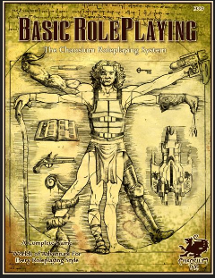

---
tags:
    - Ars Magica
    - Basic Roleplaying System
    - GURPS
    - Légendes de la Vallée des Rois
    - Rêve de Dragon
---

# Quelques mots sur Rêve de Dragon

Je viens de mettre la main sur l'édition du [Scriptorium](https://scriptarium.org/store/category/20-jeu-de-r%C3%B4le/) de <mygame>>Rêve de Dragon</mygame>... Et moi qui trouvait que <mygame>Légendes</mygame> était un jeu compliqué !

15 octobre 2022

---

# Petit statut en passant

J'ai lu ou relu pas mal de choses ces temps-ci.

## Basic Roleplaying System 4e

Basic Roleplaying System 4e

J'avoue que j'aime bien. C'est simple et intuitif et, d'une certaine façon, c'est le système que je connais le mieux. J'ai regardé les pouvoirs psy. Malheureusement, je ne trouve pas ça top. J'aime bien les jets de pourcentage, comparé à des nombres de d6 (qui ont toujours des courbes de probabilités en cloche).

## Légendes de la Valée des Rois

Légendes de la Vallée des Rois

Malgré ma [critique de la gamme Légendes](202209.md#legendes-le-multi-bide-du-jdr-francais), j'ai lu consciencieusement les deux livres de ce jeu que je ne connaissais pas trop.

### Un jeu injouable

Le livre de civilisation est pas mal fait, quoique totalement descriptif. On pourra regretter le manque total de pistes d'intrigues, ou d'idées de scénarios. On est vraiment dans le supplément historique, et c'est vraiment dommage.

Le scénario est à l'avenant : court, simpliste, et insuffisant pour bâtir des personnages qui ont des aventures sur plusieurs sessions.

Là, la barre est très haute et s'adresse à des MJs chevronnés (je ne parle que de l'univers) et des joueurs passionnés. On peut reprendre la table d'accessibilité définie [ici](202209.md#accessibilite).

| Jeu                            | Access. Monde    | Access. Magie    | Motivation fondamentale | Complexité jeu | Accessibilité |
|--------------------------------|------------------|------------------|-------------------------|----------------|---------------|
| Légendes de la Vallée des Rois | Difficile (u)(1) | Difficile (v)(1) | Difficile (w)(1)        | Difficile (1)  | **1.00**/4    |

Table 1 : Accessibilité des Légendes de la Vallée des Rois

On voit bien la marque de fabrique de <mygame>Légendes</mygame>...

Le livre de règles est un ouvrage bizarre. Au début, on pourrait penser que les règles sont simples, mais progressivement, les règles se complexifient jusqu'à devenir franchement complexes, même pour la création des personnages. La magie montre un réel travail, mais nécessitant un énorme effort de mise en pratique. Et puis, avec les deux types de magie correspondant _grosso modo_ aux deux classes sociales, comment constituer un ensemble homogène.

Ce qui est intrigant avec ce genre de jeux, c'est que l'on se demande s'il a été play-testé. Où est l'aventure ou le mystère quand on joue un savetier de la XVIIIème dynastie ? Je me demande s'il est possible de joueur autre chose que des personnages pré-tirés dans cet univers.

### Les éléments d'une seconde édition

Evidemment, si l'on faisait une seconde édition, on pourrait tirer quelque chose du matériau original :

* Il faudrait simplifier drastiquement le système de jeu, et pas forcément le contenu de fond, comme celui de la magie ;
* Il faudrait avoir des règles pour que les personnages soient dans un groupe social homogène (là, on peut être mendiant ou pharaon au tirage, ce qui ne permet pas de faire des groupes homogènes, c'en est même ridicule), ces règles devraient aussi donner des pistes pour des ensembles d'aventures de _groupes_ et non proposer de jouer tous les métiers dans un univers historique ;
* Il faudrait penser un peu différemment la magie, car elle est très complexe ;
* Il faudrait ajouter des idées de scénarios un peu partout dans la timeline historique.

Le sujet religieux est aussi abordé d'un point de vue historique. Cette partie est intéressante, mais elle aurait pu être rendue plus "fantastique" en matérialisant les divers Dieux le long du Nil dans les événements historiques. Je veux dire, si l'on ne tisse pas les dieux dans l'histoire, les créatures à têtes d'animaux tombent un peu comme un cheveu sur la soupe. Il aurait fallu faire deux colonnes : les événements historiques d'un côté et l'interprétation magique de l'autre.

Cela me fait penser à l'approche prise par <mygame>Ars Magica</mygame> : nous sommes bien dans le Moyen-Age historique, mais avec des mages qui ont des pouvoirs et une vision différente de la réalité.

### Les options prises par GURPS

<myimage>GURPS Egypt</myimage>

Si on compare, <mygame>GURPS</mygame> rame un peu quand même dans cet univers antique égyptien, mais fait le choix de simplifier le nombre de profils de PJs, la magie, etc., et d'ouvrir sur d'autres perspectives et d'autres suppléments de la gamme <mygame>GURPS</mygame> qui auraient besoin de backgrounds historiques pour des aventures se déroulant en Egypte. Historiquement, c'est plus sommaire, mais c'est plus jouable et plus ouvert. Certes, on tombe vite dans les momies, dans un cas comme dans l'autre...

C'est le côté difficulté de l'accessibilité du monde et de la magie. Pour les occidentaux que nous sommes, l'Egypte ancienne est quand même lointaine et les archétypes connus de cette période ne sont pas nombreux : pyramides, pharaons, momies...

## Y a-t-il des créateurs dans la salle ?

Ca me donne un genre de goût amer dans la bouche, car <mygame>Légendes de la Vallée des Rois</mygame> est un jeu français, et au final, il n'a pas été joué et, aujourd'hui non plus, il n'est plus joué. Donc l'objectif n'est pas atteint. Après, faut-il sauver tous les jeux ?

Dans mes jeunes années, on avait le choix entre deux types de jeux :

* Des traductions de jeux américains, dont <mygame>D&D</mygame> et <mygame>CoC</mygame>,
* Des jeux français, dont <mygame>L'Ultime Epreuve</mygame>, <mygame>Légendes</mygame>, <mygame>Méga</mygame>, <mygame>Empire Galactique</mygame>, <mygame>Maléfices</mygame>, <mygame>Rêve de Dragon</mygame>, <mygame>Empire et Dynasties</mygame>, <mygame>Bitume</mygame>, etc.

Aujourd'hui, ça me semble plus compliqué. On a beaucoup de traductions (que je trouve souvent pas top), pas mal de trucs issus de SRD américains, à commencer par les SRD de <mygame>D&D 3.5e</mygame>, et quelques rééditions squelettiques ou confidentielles de jeux français de l'époque, je pense à <mygame>Maléfices</mygame> ou à <mygame>Méga 5</mygame>.

| Date | Jeu                     | Editeur                                                                                              | Editions                                  |
|------|-------------------------|------------------------------------------------------------------------------------------------------|-------------------------------------------|
| 1983 | L'ultime Epreuve        | Aucun                                                                                                | Plus d'édition                            |
| 1983 | Légendes                | Aucun                                                                                                | Plus d'édition                            |
| 1984 | **Méga**                | [editions-leha.com](https://editions-leha.com/catalogue-details/mega-le-5e-paradigme-livre-de-base/) | 5ème édition publiée mais non supportée   |
| 1984 | Maléfices               | [arkhane-asylum.fr](https://arkhane-asylum.fr/malefices/)                                            | Seconde édition annoncée mais introuvable |
| 1984 | Empire galactique       | Aucun                                                                                                | Plus d'édition                            |
| 1985 | **Rêve de Dragon**      | [scriptarium.org](https://scriptarium.org/store/category/20-jeu-de-r%C3%B4le/)                       | 3ème édition moyennement supportée        |
| 1986 | Bitume                  | [raise-dead.com](https://raise-dead.com/category/bitume/)                                            | 6ème édition annoncée mais introuvable    |
| 1986 | La Compagnie des Glaces | Aucun                                                                                                | Plus d'édition                            |
| 1986 | Avant Charlemagne       | Aucun                                                                                                | Plus d'édition                            |
| 1988 | Empires et Dynasties    | Aucun                                                                                                | Plus d'édition                            |
| 1988 | Zone                    | Aucun                                                                                                | Plus d'édition                            |
| 1988 | Simulacres              | Aucun                                                                                                | Plus d'éditions                           |
| 1989 | Hurlements              | Aucun                                                                                                | Plus d'éditions                           |
| 1989 | Athanor                 | Aucun                                                                                                | Plus d'éditions                           |
| 1990 | **INS/MV**              | [raise-dead.com](https://raise-dead.com/shop/)                                                       | 5ème édition                              |
| 1991 | Heavy Metal             | Aucun                                                                                                | Plus d'éditions                           |
| 1991 | Bloodlust               | Aucun                                                                                                | Plus d'éditions après Bloodlust Metal     |
| 1992 | **Nephilim**            | [mnemos.com](https://mnemos.com/jeux/)                                                               | 5ème édition                              |

Ce qui veut dire que, pour le vieux joueur que je suis (1989 est ma limite à l'époque), il ne reste que Méga et Rêve de Dragon et encore, pas dans leurs éditions originales.

Les jeux américains ont conservé des empruntes durables parce qu'ils vivent, voire même se répètent à chaque édition : <mygame>D&D</mygame>, on en est à la 5 ; <mygame>CoC</mygame> à la 7 ; et *tutti quanti*. Les présentations changent, les règles évoluent, les scénarios anciens sont revus et d'autre sont créés. Il y a une logique de gamme.

Mais nous les français, on a du mal à suivre nos jeux. Les jeux sont soutenus par leur auteur et puis après, pouf, ils disparaissent. Ils sont difficiles à trouver, à l'heure du PDF et l'impression à la demande !!!! Alors que je peux trouver <mygame>Tunnels & Trolls</mygame> première édition en PDF !!!

Vous les créateurs de JDR français à la retraite, qu'est-ce que vous foutez ? Vous attendez quoi pour faire des PDF, même scannés ?

Par exemple, je veux acheter une première édition de <mygame>Rêve de Dragon</mygame>. Hé bien, je peux me brosser.

9 octobre 2022

