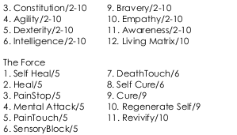
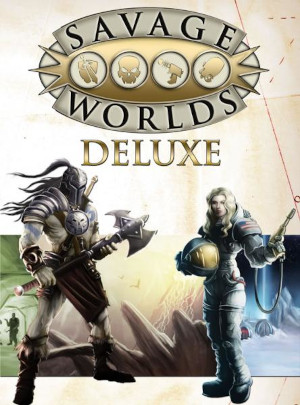
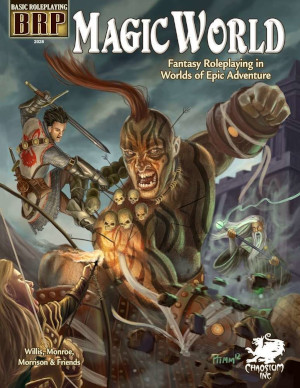
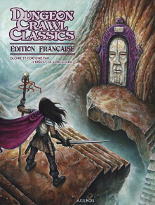

---
tags:
    - AbeBooks
    - Akileos
    - Amazon
    - Architeuthis
    - Ars Magica
    - Aventures Fantastiques
    - Basic Fantasy RPG
    - Basic Roleplaying System
    - Bitume
    - Blood Bowl
    - Bloodlust
    - Call of Cthulhu
    - Casus Belli
    - Chainmail
    - D&D
    - D6 System
    - D20 System
    - DCC
    - Empire Galactique
    - Dragon Radieux
    - Empires & Dynasties
    - Emysfer
    - Epées & Sorcellerie
    - Fate
    - GURPS
    - Gygax
    - Hurlements
    - Laelith
    - La Forge De Papier
    - Légendes
    - Le Bon Coin
    - Le Donjon Du Dragon
    - Les Terres de Matnak
    - Lulu
    - Magnas Veritas
    - Maléfices
    - Mega
    - NeoMega
    - OSRIC
    - PBTA
    - Rakuten
    - Rêve de Dragon
    - Rolemaster
    - Runequest
    - Savage Worlds
    - Simulacres
    - Space Opera
    - Stormbringer
    - Star Wars
    - Swords & Wizardry
    - Troika
    - Tunnels & Trolls
    - Warhammer
---

# Here Be Dragons

## Légende, légende...

Je tombe parfois sur des éléments qui me font douter des choses. J'étais en train de réorganiser mon repo [D&D](https://github.com/orey/ttrpg-DandD) qui commence à contenir plein de choses, quand je suis tombé sur le premier manuscrit OD&D dit *Manuscript Dallhun*, aussi dénommé *Beyond This Point Be Dragons* (le texte est dans le repo).

J'ai lu, voilà quelques temps, que cette mention figurait sur les cartes anciennes en bordure des cartes quand les cartographes ne savaient pas ce qui se trouvait au delà.

J'ai recherché des cartes de ce genre et j'avour n'avoir pas trouvé grand chose, comme quoi, cette mention serait, dans une large partie, une légende.

## Pas même une carte ? non, un seul globe !

Il existe un seul globe (le [globe de Hunt-Lenox](https://en.wikipedia.org/wiki/Hunt–Lenox_Globe)) qui porte une mention de ce type, globe datant de 1510 et que l'on peut trouver sur le site de la [bibliothèque publique de New York](https://digitalcollections.nypl.org/items/16891d60-66fc-0133-fbd6-00505686a51c).

Mais, quand on regarde bien la mention, on voit qu'il n'est pas écrit tout à fait "Here be dragons".

Il est écrit :

ANF UROIN HC SUNT DRACONES

## Traduction

Je préviens de suite : je ne suis pas latiniste et n'ait pas la prétention de bien traduire et donc n'hésitez pas à m'écrire si vous avez des traductions plus convaincantes que ce qui va suivre.

Nous prendrons pour première hypothèse que *HC* est une abréviation de *hunc*, ou de *hic*.

Extrait du *Dictionnaire des abréviations latines et françaises usitées dans les inscriptions lapidaires et métalliques, les manuscrits et les chartes du Moyen-Age*

Pour ce qui est de la première ligne, il semblerait que l'on puisse décomposer les mots en : *AN FURO IN*.

Cela reviendrait à : *An furo in hunc sunt dracones.*

Une traduction pourrait être : *Est-ce que les dragons sont en colère ici ?* ou encore *Est-ce que ces dragons sont furieux ?*

*HC* pourrait aussi être une abréviation de *hic* ce qui ferait *An furo in hic sunt dracones*, ce qui donne un sens légèrement différent.

Une traduction possible serait : *Est-ce que les dragons sont en train de se déchaîner ?* ou *Y a-t-il des dragons furieux ici ?*

Évidemment, si l'on omet le début de la phrase et que l'on ne garde que *hic sunt dracones*, on peut traduire par *voici les dragons* ou *les dragons sont ici*.

*HC* veut aussi dire dans d'autres contextes :

* H.C. : *hic condiderunt*, *ils ont fondé ici* ;
* H.C. : *Hispania citerior*, *l'Espagne est meilleure*.

mais je ne pense pas que ce soit très applicable.

## Conclusion

Enfin, tout ça pour dire que la vision US de la citation prend une citation tronquée, ce qui me rend perplexe.

Dans les années 70, quand le JDR naît avec cette soif d'exploration, ce qui est une anecdote historique due à une seule personne est à l'origine du nom d'un des plus vieux manuscrits de JDR : le manuscrit Dalluhn.

Voir [ici](https://github.com/orey/ttrpg-DandD/tree/master/Before-ODD).

04 novembre 2023

# Diverses choses

## Les pouvoirs psioniques de Eldritch Wizardry de OD&D

Voilà, la traduction et la mise en page sont terminées et le PDF est disponible depuis le 30 août [là](../downloads/eldritch-wizardry.md) ainsi que sur [itch.io](https://rouboudou.itch.io/).

Ce fut un gros travail, surtout que la seconde partie propose une remise en ordre des règles en mode fouillis que l'on trouve dans le manuel original.

Je comprends pourquoi un certain nombre de gens ont fait des clones à l'époque de *D&D 3/3.5 sur les premières versions de *D&D*. Ces versions sont simples et permettent de jouer à l'ancienne.

## C'est quoi jouer Old School ?

J'arrive 20 ans après la bataille mais j'ai remis une pièce dans le [forum de DDD](https://www.donjondudragon.fr/forum/zone-des-membres/la-taverne/qu-est-ce-que-le-old-school-10877.html?start=100).

"OSR pour moi, c'est d'abord être "libre" en tant que joueur, c'est faire ce que l'on veut. Cela veut dire partir de la ville alors que le scénario doit se passer là, tuer le gentil par erreur et finir ses jours en prison après un procès en grande pompe et une séance de fouet en place publique devant la famille de celui que l'on était supposé aider, aller dans un donjon et ressortir sans avoir tué le grand Manitou parce que plus de vivres et plus de torches, etc.

C'est aussi s'amuser dans les combats avec trois fois rien de règles : faire des cascades, tenter des choses à la noix comme se battre en escaladant une statue, couper la tentacule qui vous soulève du sol (et se vautrer sur un tapis de kobolds), jeter des choses au visage des adversaires, se jeter des armes entre amis au lieu de ramasser une épée qui a glissé à l'autre bout de la pièce, se battre sur une passerelle en feu ou dans un bateau entraîné par des rapides, etc.

C'est déjouer des pièges marrants (et possiblement meurtriers), c'est aller dans des endroits qui font peur, c'est aller vite en évitant les combats parce que les monstres errants n'ont pas de trésors sur eux et ne on ne veut pas risquer de mourir pour rien, c'est avoir un objet magique qui est top et qu'on utilise tant qu'on peut dans toutes les situations saugrenues, jusqu'à ce que quelqu'un ait envie de nous le voler ou ne nous donne pas le choix que de le céder pour sortir vivants d'un mauvais pas.

C'est aussi rencontrer des PNJ très courtois mais hyper dangereux dont on ne connaît pas les pouvoirs et qui peuvent être susceptibles, c'est être obligés de faire une quête parce que le client a un moyen de pression sur vous, c'est avoir peur dans un monde de fantasy où l'on ne sait pas à qui on à faire, c'est jouer avec les circonstances dans un monde hostile et donc peu tolérant aux grosses conneries, c'est trouver des alliés, ou inventer une belle histoire que le MJ accepte d'intégrer sur le pouce de mon oncle gladiateur à la retraite qui connaissait le milieu du crime, c'est faire face à des monstres qui ont peur et qui partent en courant parce que la moitié de leur groupe a été décimée, ou qui veulent bien négocier si on leur donne la dague qui éclaire "pour donne plus facilement la tétée à mes petits chéris", c'est tomber dans un piège où il faut se marier ou s'engager 20 ans dans l'armée du Duc Morein ayant pour mission de nettoyer la plaine de Barzail de ses habitations troglodytes trolls...

Mais c'est pour moi, avant tout la liberté d'incarner un personnage sans regarder sa feuille, ses compétences, ses talents et tous ses bonus (on les connaît).

Pour un MJ, cela veut dire improvisation (et tables aléatoires), ouverture d'esprit, surfer sur les idées des joueurs, sur leurs défauts aussi, c'est se laisser baratiner (sans jet de dés), arbitrer dans le sens "on va voir si le truc loufoque que vous tentez marche", c'est connaître les règles tellement par cœur que jamais on ne regarde le manuel, c'est jouer des PNJ qui peuvent trouver trouver un intérêt à une situation, ou sont joueurs avec les joueurs, ou sont mauvais et fomentent, ou ont un côté singulier que les joueurs n'oublieront pas.

Et pour moi, c'est vraiment top quand il y a quelque chose à comprendre dans le scénario (même si les joueurs peuvent aller off-track complet et qu'ils ne comprendront peut-être jamais en ratant le maigre fil conducteur qu'ils pourront peut-être rependre dans une autre session sous une autre forme). Il faut que ce soit amusant et qu'il y ait du rythme, que les gens vivent quelque chose qui ne ressemble pas à quelque chose de trop linéaire, de trop scénarisé (genre DL). Par contre le donjon exploration doit, à mon sens, alterner avec des choses à l'air libre, des chemins, des ruines, des forêts, des villages, des montagnes, des endroits hostiles desquels on se protège partiellement via diverses protections magiques, des peuples étranges, des PNJs, des PNJs et des PNJs...

Car OSR ou pas, il faut jouer des rôles !

En PJ, la [vision OSR](../files/divers/(2008) A quick primer for Old School Gaming - Matthew Finch.pdf) de Matthew Finch (Swords and Wizardry) et un [document bizarre](../files/divers/(2020) zoz.pdf) sur un "gourou" en OSR donnant des leçons d'OSR (en anglais les deux mais sympas à lire)."

Un bon forum et un bon site que j'ai déjà cité plusieurs fois.

## Lexique de traduction D&D

Cela m'amène au sujet de la traduction de D&D. Trois sites francophones (que j'ai déjà cités) proposent des traductions et beaucoup de contenu :

* [La Forge de Papier](http://la-forge-de-papier.over-blog.com/2020/04/liste-des-pdf-en-telechargement-sur-la-forge.html), manifestement en pause de puis peu, maintenant après l'énorme travail accompli ces derniers temps, on peut comprendre ;
* [Le Donjon du Dragon](https://www.donjondudragon.fr) avec énormément de contenu accessible aux membres ;
* [Aide D&D](https://www.aidedd.org) dédié à D&D 5e avec en gros tout le contenu disponible librement en français (ce qui est assez énorme en fait, montrant que WotC n'est pas si méchant que ça, on voudrait bien voir ça chez une boîte de JDR française).

Le sujet de la traduction se pose car, mal traduits, les suppléments D&D peuvent devenir injouables, et on peut affirmer que pas mal de traductions sont vraiment mauvaises. J'ai eu accès au [lexique D&D BECMI de DDD](https://docs.google.com/spreadsheets/d/1-eQB5vKyOoE4fy0896pDmoOtbgdNiaiD1Kai0MFmqrc/edit#gid=0) et il faut que j'ajoute les traductions que je propose pour Eldritch Wizardry qui n'a jamais été traduit en français.

Il faut aussi que je poursuivre mon repo git sur le sujet.

## Empire Galactique

J'ai mis la main récemment sur la première version d'*Empire Galactique* de 1984. On est là, typiquement, dans le jeu qui aurait pu cartonner mais deux péchés (habituels en France) ont tué le jeu :

* Après la publication de la première édition, un seul supplément est publié, un recueil de 5 scénarios, *Aux frontières de l'Empire*, et il faudra attendre 1987, soit plus de deux ans plus tard pour voir apparaître l'*Encyclopédie Galactique*, qui ne propose pas de scénarios mais détaille le background du jeu.
* Fin 1987, alors que tout le monde attendait des scénarios, le jeu sort... dans une nouvelle édition en poche avec de nouvelles règles ! Cela achèvera de tuer le jeu, car en 1988, Star Wars D6 débarque en français et reléguera *Empire Galactique* à l'état de souvenir.

Cette nouvelle version des règles fait apparaître des pictogrammes. Je ne sais pas ce que les autres en pensent, mais je fais une allergie complète à ce genre de présentation pour les débiles, que ce soit dans *Empire Galactique*, dans l'horrible *Simulacres*, ou même dans *Star Wars FFG*. Je ne sais pas d'où sort l'idée saugrenue que des pictogrammes seront plus faciles à manipuler pour les joueurs et le MJ que des mots et des nombres.

## Le suivi des gammes françaises

Le manque de suivi dans les gammes (françaises) est une maladie française dont j'ai souvent parlé en ces pages. En relisant un vieux *Dragon Radieux* récemment, j'ai retrouvé un article de Paul Chion qui se plaignait de la même chose.

D'un autre côté, quand il est devenu éditeur, il a été face un peu au même problème :

* *Empires et Dynasties* n'a eu que trois suppléments et a fait face au problème incarné par le jeu fait par un seul créateur ;
* *Hurlements* a été un peu plus suivi mais le thème très étroit (et un peu idéologique) au final tourné court.

Hé oui, le jeu fait tout seul par un auteur unique qui est bon dans tout, ça tourne court, souvent, sauf peut-être pour *Rêve de Dragon* récupéré par une communauté de fans, ou pour *INS/MV*.

Il a aussi fait face à la faillite, alors que d'autres ont fait face au rachat puis au changement de stratégie, par exemple *Siroz* devenu *Idéojeux* devenu *Asmodée* qui a racheté *Jeux Descartes* pour, finalement, faire autre chose que du JDR, et pour être finalement racheté par *Embracer*.

24 septembre 2023

# Des trucs sur D&D

Bon, là, évidemment, je suis immergé dans D&D ce qui, je pense, ne m'est jamais arrivé auparavant. Commencer par OD&D est une expérience très intéressante qui m'inspire quelques commentaires.

## OD&D : une profusion d'idées

Comme dans touts les innovations, le début est souvent très fertile en idées, en tentatives, en ouverture d'esprit.

Prenons un exemple non tiré du monde des JDR : prenons l'informatique. Lorsque la programmation orientée objet est née, de nombreuses questions ont foisonné dans tous les sens créant diverses choses étranges qui ont un jour abouti à (horreur) C++. Plus que C++, le livre de Gamma et al. de 1994, *Design Patterns, elements of reusable object-oriented software* a terrassé toute réflexion : le livre était intelligent, puissant, lourd, construit. Il permit l'émergence de softwares professionnels mais au détriment de l'innovation. Oubliées toutes les idées innovantes. Nous étions revenus au monde industriel. Globalement, les idées ont été oubliées pendant presque 20 ans et il a fallu attendre le développement de Javascript pour voir un modèle différent émerger.

OD&D, c'est un peu la même chose. Quoique mis en forme de façon difficile à lire et à exploiter, OD&D est un capharnaüm d'inventions.

On pourrait croire au premier abord que toutes ces listes de choses sont un répertoire plus ou moins hétérogène mais, la plupart du temps, ces listes modélisent différents éléments de différents mondes de fantaisie que l'on trouve dans les livres de fantasy de différents auteurs (voir [les références de GaryGygax ici](https://orey.github.io/blog/blog/202301/#la-cerise-sur-le-gateau-dcc)). De plus, les diverses éléments de modélisation de ces mondes renvoient les uns aux autres : les sorts renvoient aux monstres qui renvoient aux objets magiques. Toutes ces références permettent de modéliser plusieurs univers mais on distingue, malgré une mise en page un peu compliquée, un vrai souci de cohérence parmi ces "sous-groupes".

Par exemple, à l'usage, il paraît difficile de joueur à OD&D sans prendre quelques options de *Greyhawk*. En effet, le modèle basique développé dans les livrets bruns originaux de OD&D s'appuie sur *Chaimail*, le wargame que Gygax avait fait avant D&D. Ce n'est que dans *Greyhawk* que le système de combat (avec sensibilité aux armes) se développe vraiment. J'ai d'ailleurs traduit les tables principales dans la traduction des pouvoirs psioniques (voir ci-dessous).

Ce qui est amusant, c'est de découvrir que certains traits de OD&D sont présents dans les monstres ou les objets magiques de D&D 5e... Je trouve ça assez touchant. L'esprit de base de Gygax hante encore des productions qui lui sont de très loin postérieures.

## Jouer avec les règles avec OD&D

En traduisant les pouvoirs psioniques (et quelques sorts connectés), j'ai pu constater que Gygax aimait beaucoup jouer avec les règles, en inventer, les imbriquer, les emboîter, leur donner une logique propre. Certaines sont de véritables micro-jeux. Bien entendu, à ce moment, je ne pense pas que la cohérence ait été le cadet de ses soucis. Et comme OD&D ne propose pas vraiment de monde (*Greyhawk* est embryonnaire et *Blackmoor* est quand même un tout petit endroit), les règles complètes donnent la possibilité de modéliser les différents univers de fantasy et d'ouvrir le jeu à d'autres perspectives.

Cet amour des règles, ces dernières ayant toujours des objectifs de simulation, est très intéressant, car le système n'apparaît jamais comme étant rigide. Le coup du nombre de niveaux de monstres, par exemple, est très intéressant, le groupe d'opposants étant vus comme une entité globale au travers du nombre de dés de dommages que le groupe peut encaisser.

Chaque sort, chaque pouvoir psionique peut devenir un mini-système dans lequel le niveau de maîtrise (encore un concept intéressant) intervient. Dans une mise en page hyper-compacte, l'inventivité est remarquable et il faut se pencher profondément dans les règles pour comprendre toutes les références que ces dernières font entre elles.

Evidemment, il est fort possible que toutes ces règles n'aient pas été "play-testées" pendant des mois, mais soient le fruit d'une logique de semi-improvisation en mode "homebrew" (faites à la maison).

On est loin des jeux modernes ultra-optimisés et ultra équilibrés dont D&D 4e est sans doute l'un des plus beaux représentants.

## Le courant OSR

Evidemment, cela explique le courant OSR, très bien décrit par Matthew Finch, l'auteur de *Swords and Wizardry*, dans son papier *[A Quick Primer for Old School Gaming](https://archive.org/details/a-quick-primer-for-old-school-gaming/A%20Quick%20Primer%20for%20Old%20School%20Gaming/)* :

* Des règles simples,
* De l'improvisation des joueurs et du MD qui ne passent pas leur temps à regarder ce que leur personnage est capable de faire, mais qui le font, le plus souvent sans jet de dés,
* Du fun et du rythme.

Je reviendrai sur Finch et sur ses versions de *Swords & Wizardry*.

## Publication par WotC du SRD 5.1 en français

Hé oui, le voilà : la page sur [D&D Beyond](https://www.dndbeyond.com/community-update#SRDv51Localization) et le SRD en question : https://media.wizards.com/2023/downloads/dnd/SRD_CC_v5.1_FR.pdf sous licence Creative Commons.

Cela ne remet pas en cause le travail d'équipes comme celles de [aidedd.org](https://aidedd.org) (qui a déjà traduit le SRD) ou du [la Forge de Papier](http://la-forge-de-papier.over-blog.com/) ou du [Donjon du Dragon](https://www.donjondudragon.fr/ "Donjon du Dragon") mais cela montre aussi que la France est un marché dont WotC devrait s'occuper un peu plus.

## Des sites en français au contenu exceptionnel

C'est vrai que ces trois sites offrent un contenu assez exceptionnel en français et on voit que nous avons des amoureux de D&D à la manoeuvre. [aidedd.org](https://aidedd.org) est centré sur D&D 5e et propose plein de matériel fruit des différentes publications libres en français ou en anglais de WotC ; [la Forge de Papier](http://la-forge-de-papier.over-blog.com/) est centré sur D&D BX, mais propose aussi d'autres choses ; le [Donjon du Dragon](https://www.donjondudragon.fr/ "Donjon du Dragon") travaille un peu sur toutes les versions D&D jusqu'à AD&D 2e.

Je ne sais pas s'il existe des sites francophones sur la 3.X ou sur la 4e (très décriée) mais pour le moment, avec ces trois sites, vous devriez avoir de quoi faire.

## Glossaire et Open5e

Je viens de créer un repo Git pour mettre sous forme structurée le glossaire de traduction anglais-français de D&D.

Cette tâche est immense et probablement, ce ne sera probablement qu'une tentative que je ne pourrai pas terminer mais je pense que ce glossaire devrait être open source et en données structurées, par exemple pour pouvoir être utilisé par des sites de VTT, ou en complément avec des initiatives telles que <https://open5e.com> de mettre tout ce qui est disponible en SRD, en OGL et en CC4 en données structurées.

Open5e est une initiative très intéressante, même si elle est à la fois complexe (trouver la bonne structuration des données) et très consommatrice en temps. Avoir tout le SRD D&D 5e, et d'autres SRDs, en format `json` est un défi. A voir ce que ça va donner.

Il n'empêche que de disposer d'un glossaire global D&D anglais français ne serait pas du luxe.

En attendant, j'ai aggloméré les deux glossaires D&D que j'ai trouvés (3.5e des anciennes éditions Asmodée sur [archive.org](https://archive.org)) et celui de AideDD.org pour la 5e dans un seul PDF disponible [ici](https://github.com/orey/DD-glossaire/blob/main/GlossaireDD3-DD5.pdf).

15 août 2023

---

# Les pouvoirs psioniques de OD&D

J'étais en train de chercher à comprendre les pouvoirs psioniques de OD&D dans le Supplément III de OD&D Eldritch Wizardry, quand j'ai voulu en faire une simplification. En ces pages, j'ai fait une première version très incomplète de la simplification du jeu, puis je me suis dit qu'il fallait faire ça sérieusement. Mais faire une réinterprétation du jeu sans l'avoir traduit au préalable m'a semblé un peu étrange. J'ai donc traduit la partie psionique, ajouté les références que cette partie fait aux autres parties de D&D et proposé une réinterprétation des règles.

Vous pouvez trouvez dans la zone [téléchargement](../downloads/eldritch-wizardry.md) le PDF.

15 août 2023

# Space Opera et les pouvoirs psionics

En cherchant dans les ancêtres du JDR, j'ai rouvert un vieux PDF de *Space Opera* de 1984, et là surprise devant l'étendue de la partie sur les pouvoirs psioniques.

Ces pouvoirs sont bien classés par catégorie et ils ne peuvent s'acquérir que progressivement, les uns après les autres.

Pour NéoMega, on voit que *Personality Transfer* est le pouvoir numéro 22 de la catégorie *Télépathie* (pouvoir de niveau 7). En d'autres termes, dans le monde de *Space Opera*, les Mégas d'autrefois devraient posséder les 21 pouvoirs précédents pour pourvoir bénéficier du transfert, transfert d'ailleurs qualifié de très dangereux.

J'ai toujours trouvé que ce pouvoir avait un côté excessif. Dès lors que l'on peut se transférer facilement dans le super méchant, il faut faire attention à ce que le pouvoir ne ruine pas le scénario.

18 juin 2023

---

# Des arrivées

## D&D 4e

Je complète mes bouquins de base de D&D 4e en anglais et en français. Oui, je sais, j'arrive après la bataille mais on fait ce qu'on peut.

J'aimerais bien chopper le Handbook 3 qui propose les classes de persos ayant des psioniques.

## Pouvoirs psychiques

Pour le coup, je pense avoir fait une bonne affaire en dégottant une version neuve du *Complete Psionics Handbook*.

C'est un peu un classique. Déjà, à l'époque de AD&D 1e, Gygax avait fait une synthèse des psioniques à la fin du PHB, un truc un peu compressé. J'en parlerai peut-être dans [mon article sur le sujet](../pages/psionics.md).

## Kezaco Savage Worlds

Sinon, dans les trucs divers, j'ai choppé une version ancienne de *Savage Worlds*, la première édition je pense.

Je ne me suis pas encore intéressé au système. Je ferai ça un de ces jours. En tous cas, le format est agréable.

## Du côté de chez Lulu

Sinon, j'ai reçu de Lulu les deux *Anashiva Reahna* qui me manquaient en reprint, la *Mangoranii* et l'*Art de la Guerre*. Je pense avoir *grosso modo* les trucs publiés Par Durand-Peyrolles sur *Empires & Dynasties*.

## Une interview de Croc

J'ai écouté une petite [interview récente](https://www.youtube.com/watch?v=52abztCDziw) de [Croc](https://fr.wikipedia.org/wiki/Croc_(auteur_de_jeux)) sur Youtube. Marrant qu'il soit toujours dans le circuit et toujours fidèle à lui-même.

Je l'ai croisé lors d'une semaine de jeux à Morestel en 1987 ou 1988 sans doute, un truc organisé par le *Dragon Radieux*, Paul et Pascaline Chion. Je me souviens d'un *Blood Bowl* grandeur nature... Tout ça ne nous rajeunit pas. A l'époque, nous avions joué à *Légendes*, à *Empires & Dynasties*, avec Patrick Durand-Peyrolles himself, et à *Rêve de Dragon* avec [Denis Gerfaud](https://fr.wikipedia.org/wiki/Denis_Gerfaud) himself.

J'en ai gardé un vrai dégoût pour *Légendes* où nous avons joué pendant 3h30 un combat de 1 minute ! En une après-midi, nous avons fait quelques mètres en dehors du village celte pour se faire attaquer et... c'est tout ! C'est affligeant et pas ma façon de faire du JDR (voir [mes autres articles](https://orey.github.io/blog/tags/#legendes) sur le sujet).

Croc a parlé du fait qu'il était impatient dans les jeux et qu'il maîtrisait le système de jeu parfaitement pour ne pas avoir à ouvrir un livre durant le jeu. Je comprends cela. Il faut que la partie mécanique aille vite. Si les joueurs prennent de temps à discuter pendant les phases d'enquêtes, c'est normal, mais la partie combat doit dépoter.

Il a aussi mentionné la dualité de la scène indépendante internationale et française du JDR avec, à la fois, des mécaniques de jeu très innovantes et des univers pas très créatifs. J'avoue que je suis d'accord avec cette analyse, moi qui revient dans ce monde de nombreuses années après l'avoir quitté. Il déplore que le monde du JDR n'ait pas créé plus de *Campagne Impériale* que cela, et je suis bien d'accord.

J'ai une petite expérience des jeux écrits par Croc, jeux, qui généralement, ne m'ont pas complètement enthousiasmé :

* J'ai fait jouer *Bitume*, mais je ne suis pas fan ;
* J'ai joué à *Magnas Veritas*, mais je n'ai pas été emballé ;
* J'ai joué à *Bloodlust* et j'ai bien aimé le coup des armes possédées ; ça fait un peu *Stormbringer* généralisé dans le monde de *Warhammer* ; mais je pense que c'est un peu trop dark pour moi.

Dans les jeux qui ont été cités, peut-être que *Scales* est celui qui m'intéresserait le plus. Je ne sais pas si on peut encore trouvé le bouquin.

## NeoMega

Voilà, je continue à travailler épisodiquement sur *NeoMega*, notamment sur un nouveau scénario qui se situe avant le *Grand Isolement*.

11 juin 2023

---

# Un petit tour des pouvoirs psy ("psionics")

J'ai toujours beaucoup plus aimé les pouvoirs psy que la magie, même si les magies de *Cthulhu* ou de *Stormbringer* me plaisaient bien parce qu'elles étaient soit réservées aux méchants, soit tellement dangereuses que leur utilisation était peu recommandée si l'on voulait vivre.

La magie de base dans la plupart des jeux de rôles ne me plaisait pas tellement : la magie ouvrait souvent sur de nombreux sous-systèmes peu cohérents dans l'univers. Mais à la réflexion, peut-être était-ce la manière d'exercer la magie qui ne me plaisait pas trop chez les joueurs : une façon mécanique un peu bourrine, et justement, dénuée de magie.

J'ai acheté des vieux *Ars Magica* voilà quelques temps et je dois dire que j'aime bien, même s'il faudrait que j'investisse un peu plus de temps dans le jeu. J'ai un peu l'impression que *Ars Magica* est le *Hurlements* que nous aurions dû avoir, mais c'est un autre débat.

D'ailleurs, ça ma fait penser que je dois mettre en ligne un édito de Paul Chion, l'ancien rédacteur en chef de *Dragon Radieux* sur le JDR français. C'est très amusant avec le recul.

Sans doute aussi suis-je un enfant de *Méga 2* et non de *D&D*. J'ai pourtant eu *D&D* avant, mais sans y joueur pendant très longtemps, n'étant pas un grand adepte du dungeon crawling.

Toujours est-il que ce tour des pouvoirs psy démarre par *Eldritch Wizardry* de *D&D 0e*. Autant vous prévenir, il faut être motivé pour comprendre ce machin : c'est un capharnaüm infâme de règles psioniques mêlées avec des règles sur le druide et autres suppléments. Franchement, je pense que c'est un des pires modules de tout les temps, sachant que, dans la partie psioniques, des tables citées plusieurs fois manquent !

Je vais donc l'élire : *Grand prix de la pire édition dans le monde du JDR* !

Toujours est-il que j'ai démarré une page sur le sujet : [pouvoirs psychiques dans le JDR](../pages/psionics.md). C'est un "work in progress".

En fait, je le fais un peu parce que j'aime bien l'archéologie, et aussi un peu pour *NeoMega*, où les pouvoirs psy sont centraux à l'univers mais avec beaucoup de limitations.

3 juin 2023

# Réalisations et investigations

## Réalisations

Commençons par les réalisations : le scénario pour *Troika!* est quasiment terminé. Il manque la table des rencontres plus une ou deux relectures pour les détails et la cohérence.

J'ai pas mal hésité à sortir le bouquin comme ça. Je voulais rajouter quelques sorts qui ne figuraient pas dans le livre original. En format A4, on est déjà au delà des 130 pages. J'ai peur qu'avec *NeoMega!*, le livre ne devienne plus épais encore, surtout avec la campagne qui va avec. Je suis assez partagé.

Pour ce qui est de NeoMega, j'ai pas mal travaillé les pouvoirs psy qui étaient utiles dans cette version. Je ne souhaite pas rentrer tout de suite dans les catalogues comme on les trouve dans les autres JDR.

J'ai consulté *GURPS Psionics* et c'est bien fait, beaucoup plus complexe que ce dont j'ai besoin.

Je suis en train de regarder le *Psionic Power* de *D&D 4e* mais il faut que je récupère les bases du jeu avant de me lancer dans cette lecture. On y trouve des classes de personnages utilisant les pouvoirs psychiques (je n'aime pas dire "psioniques", je ne sais pas pourquoi).

## Investigations sur D&D 4e

Bon, inutile de rappeler que cette édition fut la plus controversée de toutes les éditions de D&D. Le choc a été fort sur toute la communauté, notamment au niveau du système de jeu, que l'on a taxé, de manière un peu facile, de s'inspirer des jeux de rôles en ligne.

### La genèse de D&D 4e

En fait, je conseille la lecture de *Wizzards Presents Races and Classes* qui retrace, vu de l'intérieur, la genèse de D&D 4e.

C'est très intéressant.

La feuille de route de Bill Slavicsek de mai 2005 donne le ton avec des buts de conception du jeu (je traduis ses 8 demandes au groupe de designers).

**1. Le jeu doit être un jeu de rôles médiéval-fantastique**

*Cela reste DUNGEONS & DRAGONS, et nous devons rester fidèles à nos racines.*

**2. Le Dungeon Master comme Storyteller**

*Nous avons discuté de l'impasse du DM comme opposant aux joueurs, et donc nous croyons que le DM comme Storyteller est un concept plus fort et mieux adapté à notre propriété intellectuelle.*

**3. Une expérience de jeu coopératif**

*De même, nous voulons maintenir l'aspect coopératif et équipe des groupes d'aventuriers.*

**4. Mécaniques de base**

*Il faut garder le d20, les jets élevés indiquant un bon résultat, les classes, les niveaux, et les races fantastiques. Il faut que le jeu reste unifié et solide dans ses mécaniques, et il faut suivre cette voie dans tous ses aspects.*

**5. Des tactiques tridimensionnelles**

*Nous voulons continuer d'utiliser des figurines localisées dans des carrés de 1.5 mètre ("5-foot squares"). Nous voulons concevoir des mini-jeux (escarmouche) pour fonctionner avec le JDR. Nous en reparlerons prochainement.*

**6. Des options et non pas des restrictions**

*Nous voulons maintenir cette philosophie dans la nouvelle édition, même si nous entrevoyons des endroits dans le jeu où nous voudrions mettre en place quelques restrictions pour l'équilibre du jeu.*

**7. Améliorer le jeu**

*Pour bien présenter une nouvelle édition au public, nous devons créer un meilleur jeu, plus rapide et plus robuste. Les améliorations devraient inclure quelque chose de cool à chaque niveau, plus de place à la conception pour les options des personnages (mais attention à la complexité), un meilleur mélange de mécaniques ("crunch") et d'histoire ou d'éléments de roleplay ("fluff"). Supprimer les règles, les sorts et les sous-systèmes problématiques.*

**8. Faire un jeu facile à concevoir, à développer, à éditer**

*D&D 3.0/3.5 est un monstre dans lequel il est très difficile de construire, depuis les blocs de statistiques jusqu'à l'équilibre des rencontres. Corrigeons ce problème une fois pour toutes et rendons facile la création de produits dans le futur. Si nous pouvions passer moins de temps sur les détails et plus sur le facteur facilité pour les conceptions futures, nous serions tous gagnants.*

### Qu'est-ce qu'un jeu extensible ?

Donc, force est de constater que l'équipe de conception du jeu a suivi les recommandations, notamment la dernière qui est fondamentale : pour qu'un jeu soit extensible, il faut qu'il propose une certaine "horizontalité", soit des principes fondateurs sur lesquels il est possible de bâtir facilement aujourd'hui comme demain. Les jeux qui complexifient le système et le verrouillent rendent complexes toutes les évolutions.

Évidemment, les américains y voient un problème financier, mais le problème est, comme le dit Slavicsek, avant tout un problème de conception. Si je voulais être ironique, je dirais que le point 8 pourrait se résumer à : comment *D&D 4* devient aussi souple que *GURPS Core System* ?

Une des premières choses que l'on apprend dans le *Races & Classes*, c'est que le défi est relevé au travers des *sources de pouvoirs* ("power sources"). Dans la mesure où chaque classe peut tirer de sa propre source de pouvoir ses pouvoirs, le système remplit sa promesse de pouvoir être extensible à l'infini : les sources de pouvoirs "génèrent" des différentes classes (et il sera donc possible d'en créer de nouvelles dans le futur).

Il reste toujours possible de spécialiser "en profondeur" les classes, mais "verticalement, sans impacter les autres classes, car n'ayant pas la même source de pouvoirs, elles ne sont pas "en collision" ou en risque d'incohérence.

Bien sûr, cela implique que *le guerrier a une structure de pouvoirs qui est la même que celle des magiciens et aux clercs*, même si son pouvoir est "martial", alors que les autres sont respectivement "arcanes" ou "divins". Ainsi, une source de pouvoirs "psionic" est envisageable *à côté* des autres (cf. *Player's Guide volume 2*). A chacun sa source de pouvoirs !

Ce choix de conception a de multiples avantages :

* Chaque niveau de personnage peut être "tuné" aux petits oignons, et donc être "cool à passer (besoin numéro 7 de Slavicsek).
* Comme l'échelle de tous les pouvoirs est absolue (en gros chaque pouvoir est décrit de la même façon sur une échelle universelle), les différentes classes de personnages sont comparables en puissance !
* D'où il s'en suit que le jeu peut être équilibré parce qu'au final, tout en étant dans des "espaces de pouvoirs" différents, les différentes classes peuvent se comparer les unes aux autres et peuvent être réglées les unes sur les autres.

Je voudrais résumer ces choix de conception par le diagramme suivant :

Le modèle est bi-dimensionnel :

* Chaque source de pouvoir (par exemple A) peut abriter plusieurs classes qui ne sont pas toutes développées (par exemple A2) ;
* Il est possible d'ajouter des sources de pouvoirs pour créer de nouvelles classes ;
* Dans le futur, il ne sera pas plus difficile qu'aujourd'hui de créer de nouvelles classes au travers de nouvelles sources de pouvoirs (par exemple D).

On peut dire que la conception du modèle est plutôt bien faite, surtout si l'on envisage un monde avec différents formes de magie. D'un côté, le système de classes et de niveaux est préservé, et de l'autre, il est extensible "horizontalement" (on dirait vraiment qu'on parle de software parfois).

### D&D 4e, copié sur les jeux vidéos ?

Il est possible que le système soit copié sur les jeux massivement multijoueurs mais ce n'est pas évident au premier abord. Rodney Thompson, dans le *Races and Classes*, indique qu'une des grandes inspirations de *D&D 4e* est *Star Wars d20 Saga Edition*.

Haha, on rigole bien fort quand on sait que le lead designer de la première édition de Star Wars d20 n'est autre que...

... Bill Slavicsek lui-même ! On n'est jamais mieux servi que par soi-même ! En gros, huit ans après avoir fait lui-même le travail, Slavicsek envoie le message suivant : *je me suis fait chier à adapter le système d20 à l'univers de Star Wars, donc les petits amis, prenez-en de la graine pour D&D 4e !*

En tous cas, j'avoue que cette lecture est très intéressante et que je suis très agréablement surpris par ce système de jeu. On a souvent dit que le jeu serait sorti sous n'importe quel autre nom, il aurait fait un buzz du tonnerre et c'est sans doute vrai. Parce que le jeu venait après D&D 3.5e, il a été conspué un peu rapidement sans doute. Mais j'y reviendrai.

### D&D 4e, le choc qui a créé DCC ?

Je vais vous livrer une interprétation personnelle. Le système d20 appliqué aux univers modernes, ça faisait tripper pas grand monde dans les années 2000, parce que cela semblait un choix par défaut depuis la faillite de [West End Games](https://en.wikipedia.org/wiki/West_End_Games) et donc la disparition du support de Star Wars d6.

Mais quand D&D 4e est sorti, le monde de l'OGL, des copies de OD&D/D&D/AD&D/AD&D 2e/D&D 3.0/3.5, s'est pris une grosse baffe dans la tête ! Car si le jeu a "déplu" (enfin commercialement je crois que c'est un vrai succès par rapport à l'édition 3.0/3.5), il a complètement refondu la base de D&D en brisant la plupart des totems !

Je pense que Joseph Goodman, qui faisait alors des scénarios pour D&D 3.0/3.5 s'est fait électrocuter (il faut que je recherche des interviews de lui à cette époque) ! Alors que des milliers de joueurs (et Paizo avec *Pathfinder*) restaient coincés dans la nostalgie d'une copie littérale d'une des versions du passé, Wizzards sortait un jeu qui cassait la baraque, un vrai D&D mais complètement refondu avec un côté jeu de plateau tactique super amusant ! Incroyable !

Tout le monde n'a pas compris d'ailleurs, à commencer par Paizo, tellement la refonte et la pulvérisation des tabous Gygaxiens a été forte ! Un D&D cohérent, amusant, à la mécanique bien huilée, réinventant tous les univers du maître Gygax mais en voulant être jouable :

* *Forgotten Realms* : mouais pas le plus réussi ;
* *Dark Sun* : on dirait que D&D 4e a été fait pour Dark Sun,
* Les manuels sur les plans sont totalement refondus pour devenir jouables,
* Les autres, je connais trop peu.

Pour moi, Goodman s'est dit : " *D&D 4e a brisé tous les tabous. Qu'est-ce que je voudrais mettre dans mon OGL ? Un peu de Cthulhu, un peu de Stormbringer avec les effets retour de la magie quand elle rate, un peu de OD&D, un peu de fantasy genre l'[appendix N de AD&D](https://orey.github.io/blog/blog/202301/#la-cerise-sur-le-gateau-dcc). Hé voilà ! Je peux faire de l'OGL perso, sans me prendre les foudres de tous les extrémistes : ils s'acharnent sur D&D 4e ! Quelle bonne aubaine* !"

C'est devenu *DCC*. Mais, finalement, ce jeu super innovant n'est qu'OGL libéré, décomplexé, après *D&D 4e* qui casse la baraque de Gygax et reconstruit un immeuble à la place !

### Des faits, rien que des faits

Bon, stoppons-là les suppositions. Je poursuis ma lecture du *Races and Classes* et je vais peut-être apprendre encore des choses. Je vous dirai.

## Rêve de Dragon (1985)

J'ai retrouvé une vieille copie de la première édition, mais alors en mauvais état. Mais pourquoi, me direz-vous, alors que le jeu est disponible dans sa troisième édition sur le site [scriptarium.org](https://scriptarium.org/store/category/20-jeu-de-r%C3%B4le/) ? Parce que j'aime bien comprendre les évolutions du jeu et suivre la chronologie. J'avoue que quand je jeu est sorti en 1985, je n'avais pas l'argent pour l'acheter. En plus, je jouais à *Méga 2*.

Je suis donc en train de bouquiner cette première version pour me faire une idée. Le premier sentiment est que le jeu est compliqué...

### Space Opera (1981)

Autre jeu dont j'entendais souvent parler les gens plus âgés autour de moi dans les années 80 : *Space Opera*. Ayant appris que le jeu possédait des règles pour les pouvoirs psy, je me dis que cela valait le coup de lire le Core Manual. C'est dans ma to-do list. C'est marrant, je ne me souviens pas de pouvoirs psy dans *Traveller*. Mais je connais mal le jeu aussi.

21 mai 2023

---

# Plein de choses

Bon, ce blog n'est pas très vivant. Faisons un petit bilan des dernières nouvelles.

## Troika!NeoMega!

Je suis toujours en train de travailler sur ce projet. J'ai fait un petit update sur [itch.io](https://rouboudou.itch.io/troikaneomega/devlog/494594/finalisation-de-la-traduction-du-srd-de-troika), mais c'est un gros travail si l'on veut faire un produit pas trop pourri. Là, je finalise le premier scénario, celui de Troika! Puis je passerai à la partie NeoMega!

On ne se rend pas compte du temps que tout cela peut prendre lorsque l'on fait tout, écriture, mise en page, illustrations, cartes ! Cela me fait comprendre toute la machinerie derrière de beaux projets comme Call of Cthulhu 7e.

## Call of Cthulhu

Parlons-en de CoC. J'ai fini l'état des lieux des suppléments en français et en anglais. Puis j'ai acheté en ligne des versions anciennes de la cinquième et de la sixième édition en anglais. J'ai découvert la septième édition qui est une belle production, sortant un peu des deux colonnes en noir et blanc, même si ces présentations ont leur charme.

CoC est vraiment un jeu qui me correspond, et cela depuis toujours. Les enquêtes, le système de combat et de magie qu'il vaut mieux éviter si l'on ne veut pas mourir trop vite, de nombreux PNJ, c'est ma vision du JDR.

Pour le moment, je lis la cinquième édition en anglais.

Truc marrant : j'ai acquis récemment un vieux jeu français (j'y reviendrai), et le vendeur m'a envoyé un numéro récent de [Architeutis](https://www.philibertnet.com/fr/15078-architeuthis) parlant de la faillite de la société *Sans Détour*, éditrice en français de la sixième édition de CoC.

Bon, soyons francs : je n'ai jamais aimé le mise en page de cette sixième édition française, et old school que je suis, je préfère les vieux produits *Jeux Descartes*. C'est un jeu que j'achète et non une œuvre d'art !

Concernant CoC sixième édition, je n'ai pas eu le temps d'investiguer.

J'ai relu la nouvelle *The Call of Cthulhu* en introduction, mais je ne suis pas allé plus loin.

Enfin, je prévois de virer toutes mes vieilles photocopies d'antan et de les remplacer par des prints Lulu prochainement. Quel merveilleux jeu !

En ce qui concerne la septième édition, je n'y suis pas encore : je rattrape mon retard. Je n'aime pas trop les caractéristiques des PJs en pourcentages... je ne vois pas d'où ça sort (à part virer la table de résistance). Mouais, je verrai ça plus tard. Finissons d'abord la 5e et on verra ensuite.

## CoC, un jeu vivant depuis 1981 !

Je vais en profiter pour faire un peu de provocation : j'ai acheté ma première version de l'*Appel de Cthulhu* vers 1983 (seconde édition) et depuis, le jeu est maintenu !

Quel jeu français bénéficie d'un tel support, d'éditions successives et de qualité dans les contenus ? Hein ? Parce que c'est facile de sortir un jeu et puis de laisser tomber vos joueurs.

C'est, je crois la grande différence entre les américains et nous : nous avons plein d'*égos* pour faire des jeux (comme si la mécanique de jeux était un problème) mais pas des masses de gens pour soutenir le jeu sur le long terme (scénarios, extensions).

C'est notre côté procédurier, administratif à nous les français : on adore les lois, des tonnes de lois et de règlements qui tuent tout et paralysent tout. Et le jeu de rôles en est une illustration un peu affligeante, je l'avoue.

Par exemple, un jeu comme *Rêve de Dragon* aurait dû cartonner depuis des décennies en France. Mais bon, quand on regarde les règles, on est vraiment calmé. C'est comme jouer à Rolemaster.

C'est sympa mais le côté ultra-spécifique et ultra-crunchy est quand même très dur pour un produit : c'est comme des boulets que l'on porte. Il est difficile pour les autres de faire des scénarios pour votre jeu et il est difficile pour vos MJs d'évoluer sans vous derrière. C'est ce qu'on pourrait appeler des impasses...

## Complétion de D&D 4e en anglais

Un détail : il me manquait le Monster Manual de D&D 4e.

C'est maintenant chose faite (j'ai choppé un vieux machin pas trop usagé).

Marrant comme cette édition ressemble une BD... Je n'ai pas encore creusé pourquoi le système de jeu avait tant défrayé la chronique.

## GURPS 3e

Hé oui, j'ai craqué. Je n'avais jamais lu les règles de GURPS en mode papier, et j'ai eu une bonne occasion sur la troisième édition en anglais.

En fait, je cherche des systèmes de pouvoirs qui me fassent tripper et donc je commence par les grands classiques. Et là, j'avoue que c'est pas mal.

J'aime bien :

* La mécanique à deux niveaux : vous avez un score dans le pouvoir et une compétence dans le pouvoir psy qui y est rattaché ;
* La couverture des pouvoirs psy et leur classification ;
* Les mécanismes liés à la volonté (une genre de mode "boost") mais qui épuisent le personnage.

Un must.

J'ai un peu regardé le supplément sur les pouvoirs psioniques.

Et ça me paraît être un bon supplément. Il faut que je me le procure pour creuser un peu.

Tout cela, c'est dans le cadre de *NeoMega*. J'ai déjà une liste de pouvoirs psy, mais je suis très ouvert à des ouvrages de gens ayant passé beaucoup plus de temps que moi sur le sujet.

## La Forge de Papier / le Donjon du Dragon

Bon, ben là, je pense qu'il faut réaliser que nous avons des fous furieux passionnés par D&D, B/X en particulier. J'avoue que je lis tout, je télécharge tout et je suis super content que des gens comme ça existent. Je pense qu'ils m'ont fait comprendre D&D après toutes ces années.

Encore une fois, pour les fans de D&D old school : [La Forge de Papier](http://la-forge-de-papier.over-blog.com/).

Bon, là aussi, force est de constater que ces gens ne sont pas sains d'esprit ! Ils ont abusé de D&D et ont dû perdre quelques points de SAN (c'est certain que les D&D guyz sont mauvais en jet de 1D100 sous la SAN, car tout ce qui n'est pas D20...) pour vouloir traduire tous les suppléments de l'univers que TSR a un jour produits (314 containers équivalent vingt-pieds selon mes estimations).

Le lien : [Donjon du Dragon](https://www.donjondudragon.fr/).

D'ailleurs, je viens de demander à Lulu de m'imprimer D&D 0e (les trois livrets bruns traduits par le Donjon du Dragon). Par contre, guys, je les ai imprimés en US Letter, parce qu'à mon grand âge, des pages denses en A5, c'est compliqué.

## Tourisme en Italie et BRP

A l'occasion d'un peu de tourisme en Italie, j'ai fait l'acquisition de la dernière mouture de *Magic World*, de Chaosium.

Comment dire, je suis un peu déçu. Je ne pensais pas acheter une version de *BRP* avec un saupoudrage de magie. Pas du tout d'inventivité dans la magie... On dirait un vrai sous-produit. *Runequest* est bien plus complet en fait.

D'ailleurs, après m'être fait voir, je suis allé sur le site de Chaosium pour voir que le produit n'était même plus marketé (il reste en vente en PDF sur [DriveThru](https://www.drivethrurpg.com/product/128323/Magic-World)).

Bref, ne pas acheter, surtout si on connaît les autres produits *BRP*.

Au fait, la dernière édition de *BRP* vient de sortir en PDF. J'attends la finalisation de la licence ORC qui devrait décoincer un peu la licence third-party *BRP*. Je l'avais regardée mais elle est trop contraignante. Espérons que ORC changera la donne.

## Moment nostalgie : Stormbringer

Enfin, cet achat inopportun aura eu la vertu de me faire rouvrir un vieux classeur avec une vieille copie de la deuxième édition de Stormbringer en français datant de Mathusalem.

En cherchant une version PDF de ce jeu que j'ai perdu il y a bien longtemps, j'ai trouvé ce site, [elric.melnibonee.free.fr](http://elric.melnibonee.free.fr/spip.php?rubrique6), site sur lequel vous pourrez trouver les PDF des deux premières éditions françaises.

Évidemment, là, la magie est d'un autre niveau. Mais c'est grâce, je pense, à la plume de Ken St-André, l'inventeur de *Tunnels & Trolls*, un fin connaisseur de l'œuvre de Moorcock.

J'ai demandé à Lulu de me réimprimer la première édition, ce qui est un mauvais plan car j'ai toujours un gros classeur avec la copie de la seconde édition que je ne vis pas pouvoir bazarder...

## Les sites d'occasions

C'est vrai qu'en France, nous pouvons trouver pas mal d'occasions sur divers sites :

* [eBay](https://ebay.fr) : pas mal de chose, mais c'est souvent assez cher. Mais bon,  j'ai trouvé pas mal de choses intéressantes.
* [Rakuten](https://rakuten.fr) : j'ai trouvé pas mal de choses sur Rakuten. J'aime bien même si le site est un peu nase (recherches impossibles en multipages dans le boutiques).
* [Le Bon Coin](https://www.leboncoin.fr/) : je découvre. Jamais utilisé mais pas mal de gens ont plein de choses à vendre.
* [Abebooks](https://www.abebooks.fr/) : pour les livres anciens. On ne trouve pas souvent des choses, et elles sont souvent chères, mais parfois, on peut trouver des choses intéressantes.

Sinon, j'achète assez peu de neuf, sauf en PDF sur [drivethru](https://www.drivethrurpg.com), et encore, c'est pour faire imprimer par [Lulu](htpps://lulu.com).

Le problème de Lulu, c'est que c'est long ! Je voyais une australienne l'autre fois sur Internet qui disait que, pour vendre son bouquin, elle passait par [Amazon KDP](https://kdp.amazon.com/) parce que c'était beaucoup plus rapide. Je la crois. Pas possible de vendre un bouquin à des clients sur Lulu tellement c'est long. Pour autant, l'impression est faite en France et est de bonne qualité. Donc, parfait pour un usage personnel.

## Quelques découvertes

A l'occasion de ma commande sur [Le plumier des Chimères](https://plumierdeschimeres.com/) d'un vieux jeu français auquel j'ai un peu joué dans le passé, *Empires et Dynasties*, j'ai reçu dans mon paquet quelques petits cadeaux (merci Philippe Jaillet, responsable des jeux Posidonia).

Une remarque préalable de la part de celui qui travaille sur un reboot de "*Mega*" (*NeoMega*), la production est très belle et très travaillée. On voit un vrai travail qui ne ferait pas rougir un éditeur américain.

Mais... Ce qui va suivre n'engage que moi mais il y a un gros "mais".

*Emysfer* est un monde intéressant. On a envie d'y jouer, vraiment. Les descriptions des différentes races sont sympas, inventives, amusantes et l'on imagine bien ce que l'on peut vivre à la table de jeu.

En ce qui concerne les *Les terres de Matnak*, c'est pareil : la bestialité dans les humains, le fait de lutter contre, tout ça, c'est super, comme univers.

## La malédiction des jeux français

Venons-en au "mais".

Mais pourquoi inventer des systèmes de jeu "à la con" ? Je suis navré mais il faut que quelqu'un le dise. Ces jeux sont des univers très intéressants pour un système de jeu médiéval fantastique comme *D&D*, *GURPS*, *BRP Runequest*, *Warhammer*, *Troika!*, etc. Mais pourquoi réinventer un système de jeu complet ?

J'ai vu dans les critères du Graal d'Or "adéquation du système de jeu avec l'univers". C'est vraiment horrible : c'est une volonté, un objectif, de faire des systèmes de jeu merdiques, hyper complexes, spécifiques, qui dans deux ans ne seront plus jamais supportés...

J'avoue que j'ai toujours eu du mal à comprendre ce phénomène.

Côté systèmes de jeux, il existe tellement de choses bien (et "open source"). Pour ne citer que les plus connus :

* *D&D*, *d20 system* : avec l'[OGL](https://en.wikipedia.org/wiki/Open_Game_License), on peut dire qu'on peut maintenant tordre les règles dans tous les sens avec la bénédiction de Wizards.
* *BRP* : avec la nouvelle licence [ORC](https://paizo.com/community/blog/v5748dyo6si9y?First-Draft-of-the-ORC-License-Ready-for), le système de jeu va devenir plus facile encore à utiliser.
* *GURPS* : quand on a lu quelques extensions, on voit comment avoir des mondes avec leurs règles spécifiques dans un univers de jeu connu par les joueurs et les MJs.
* *Fate* : dans le genre, j'accommode tout à ma sauce, Fate est le bon candidat.
* *d6 system* : beaucoup de matériel open source en ligne faciles à utiliser.
* *PbtA* : Dieu sait que je n'aime pas ce système de jeu, mais bon, il est utilisable.

Les éditeurs américains ont fait des efforts ces dernières années. Et pourquoi ne pas sortir l'univers comme un supplément à divers systèmes de jeux ? C'est la même question que je posais voilà quelques mois : pourquoi les scénarios des canards de JDR sont toujours axés sur un jeu et ne proposent pas des déclinaisons sur plusieurs moteurs de jeux ?

Donc, là Posidonia sort deux super produits avec deux bonnes accroches. Mais comme je n'ai pas beaucoup de temps, ni à la table de jeu, ni en mode prep, il me faut quelque chose qui se décline vite sur un système que je connaisse.

Pour *les Terres de Matnak*, la Bestialité aurait pu ressembler à la Santé Mentale de CoC, car techniquement, c'est très proche. Vu comme ça, je peux l'intégrer dans une campagne med-fan BRP.

*Emysfer* est un monde jouable dans plein de jeux, mais ce n'est pas un vrai jeu. Ce n'est pas parce que j'ai un ensemble de compétences spécifiques que je suis obligé de réécrire le moteur de jeu tout entier !

Car, sur le sujet du système de jeu, ces deux jeux n'ont rien d'innovant : ils sont très classiques en définitive (hormis un vocabulaire parfois pompeux plein de "concepts à la con").

Il reste le sujet d'"acheter des narrations", manifestement très en vogue sur la Côté d'Azur, un genre de mode participatif des joueurs dans un jeu crunchy... J'avoue que je n'ai pas tellement compris comment ça marchait. Cela me paraît assez compliqué.

## Où est le produit ?

Alors bon, je ne suis qu'un simple utilisateur, ayant pas mal joué et ayant des velléités d'adapter (à la marge) un jeu super simpliste pour jouer sur le pouce dans un univers que j'aime. Je ne connais pas tout ce que connaissent les gens qui se démènent pour crowdfunder les jeux indies français.

Mais, je pense que nous avons un défaut grave de compréhension du marché.

Si je veux faire jouer ma table avec des règles à moi dans un univers à moi, c'est cool, je ne demande rien à personne.

Mais quand je veux publier, il faut se poser une grande question : le produit va être vendu ; est-ce que je veux en vendre ?

Parce que, au delà d'une niche de gens qui vont permettre au crowdfunding de marcher, est-ce que je veux que le jeu soit encore là dans dix ans ? Est-ce que je ne fais que répondre à mon égo de montrer à tous quel concepteur hors pair je suis et "comme il est bien" le monde que j'ai inventé ?

Supposons que *Emysfer* soit un monde pour D&D 5e :

* Je peux jouer en France dans ce monde ;
* Je peux favoriser que des aventures soient faites par d'autres et donc ouvrir une communauté de joueurs ;
* Je peux le traduire ;
* Je peux le vendre sur [Dungeon Masters Guild](https://www.dmsguild.com/) ;
* Dans 3 ans, je peux en faire une seconde édition pour D&D 6e.

Attention, je ne suis pas un agent de Wizards ! Mais là, on tient quelque chose. L'aspect game design reviendrait, dans ce cas, à adapter à D&D 5e les concepts très spécifiques aux monde de *Emysfer* (la mémoire surtout).

Pareil pour les *Terres de Matnak*, sachant que le monde pourrait être facilement adapté à Warhammer. Il faut voir aussi ce qui existe : il serait étonnant que AD&D 1e ou Warhammer n'aient pas évoqué les transformations bestiales des humains.

Avec une approche d'extension, idéalement multi-système de jeux, le monde peut perdurer.

Alors que des gens comme moi n'ont plus envie de lire des bouquins de règles avec plein de trucs bizarres. Par contre, nous sommes consommateurs de mondes (ou de morceaux de mondes) et de scénarios épiques.

Ce n'est pas de ma faute si la plupart des moteurs de jeux puissants viennent des US : ils sont six fois plus nombreux que nous, donc tout est plus play-testé, industrialisé, peaufiné, édition après édition.

Nous, on galère, parce qu'il est très compliqué de monter des communautés de JDR chez nous : elles sont hyper fractionnées. Et donc, tout le monde tire la langue.

## Architeuthis

Philippe Jaillet m'a aussi envoyé gratuitement le numéro 1 d'Architeuthis. Déjà, le nom du magazine est compliqué à retenir. Dans l'édito, il s'y plaint de l'état du marché français.

Je suis d'accord avec lui, mais ce n'est pas en publiant des micro-JDR sans communauté que l'on pourra redresser la barre.

Casus Belli avait, dans le temps, tenté de surmonter ce problème, d'abord en s'accrochant à *BRP*, puis à *Simulacres* qui est un jeu ultra-merdique. L'idée était que chaque scénario pouvait être décliné dans le moteur de jeux générique "français", bonne idée en soi, sauf que je n'ai jamais réussi à digérer les "concepts" de *Simulacres*.

Il en résulte un problème de fond : nous sommes pilotés par les jeux US (oui) et la multitude de jeux français atomise le marché (oui) avec des prix horribles (oui) et des toutes petites séries (oui).

C'est ce que je trouve top avec DCC : même prix en euros qu'en dollars : 40€ le jeu et 10 € les scénars. De belles illustrations en NB par contre, c'est du old school.

En comparaison : *Laelith* la cité : 70€ ; *Rêve de Dragon* + *Invitation au Voyage* 55€+55€ ; *Méga 5*, en rupture de stock aussitôt après sa sortie, aucun suivi commercial ; *Maléfices*, rupture de stock ; etc.

Alors, oui, ce sont des œuvres d'art, mais on peut jouer avec ? Et quel suivi ?

J'ai acheté *Empires et Dynasties* par nostalgie et parce que j'avais perdu mon exemplaire. Philippe Jaillet en avait un neuf (miracle ?).

Ce jeu propose un effort énorme de description du monde de Réah mais, il n'a pas été un succès, parce qu'il cumule deux désavantages : un monde complexe et inconnu, complètement lié à son auteur, et un système de jeu spécifique (voir mon sujet sur [l'accessibilité des JDR](./2022.md#les-trois-dimensions-de-laccessibilite-du-jeu)). Jamais personne n'a pu écrire de suppléments à *E&D* sauf Durand-Peyrolles. Ah, c'est dommage.

Mais même pour *Rêve de Dragon*, regardez les auteurs des scénarios dans les canards de l'époque, il se comptent sur les doigts d'une main. Ce n'est pas une communauté.

## Conclusion

Au final, c'est beaucoup de talent qui se perd, beaucoup d'énergie, tout cela parce que, du temps de *Légendes*, comme de *Blood Lust*, comme maintenant des jeux récents, nous les français sommes **toujours dans le même paradigme** qui nous fait préférer nos petites créations persos, souvent peu innovantes au niveau des mécaniques de jeu, au détriment de nos univers de jeux qui, eux, sont riches mais restent dans leur ghetto.

Parce qu'on ne veut pas jouer le jeu des méchants américains ?

Deux solutions donc à mon avis :

* Faites des suppléments pour les moteurs de jeux connus et publiez sur les canaux US (drivethru, itch, Amazon) ;
* Travaillez à un moteur de jeu français type Simulacres que chacun customisera dans son coin (je n'y crois pas trop).

Le comble de cette situation est qu'il faut qu'on m'offre un magazine lors d'une commande pour que j'apprenne l'existence de plein de jeux français...

Pauvre de nous.

14 mai 2023

# Une belle fin d'année et un beau début d'année

Ces derniers mois, j'ai découvert pas mal de choses...

## Epées & Sorcellerie

Epées et Sorcellerie, première édition anglaise

J'avais acheté, voilà quelques temps, Epées et Sorcellerie, dans sa première édition anglaise. Malheureusement, on ne trouve pas la même édition en français (peut-être [là](https://sites.google.com/site/wizardinabottle/epeesetsorcellerie), le *E&S_Beta.pdf*). Nicolas Desseaux a créé ce jeu en fonction de son interprétation des trois petits livres bruns (D&D 0e) et de la façon de jouer dans les années 70 (on notera le remplacement du D20 par 2D6, ce qui change un peu les probabilités).

J'avais trouvé pas mal à l'époque ce jeu, mais je cherchais quelque chose plus proche du Moldvay de mon adolescence. Le livre était allé directement sur l'étagère.

## Aventures Fantastiques

Aventures Fantastiques, de Nicolas Desseaux

Même si le titre n'est pas grandiose, en décembre, en zonant un peu sur Internet, je tombe sur les [Aventures Fantastiques](https://www.donjondudragon.fr/clones/aventures-fantastiques/7405-aventures-fantastique-v1-77.html) de Nicolas Desseaux. J'avoue avoir été agréablement surpris par le PDF. Le jeu est simple et complet et conforme à ce que j'avais retenu de mon exemplaire de Moldvay quand je l'avais encore. C'est quand même un gros boulot avec beaucoup de contenu. Chapeau M. Desseaux !

## Swords & Wizardry

Swords & Wizardry, Core Rules

Par rebond, peu de temps après, je tombe sur [les règles Core de Swords & Wizardry](https://www.drivethrurpg.com/product/62346/Swords--Wizardry-Core-Rules), un joli PDF que je me fais imprimer par Lulu. J'étais content car je tenais quelque chose de très proche de ma cible, même si cette dernière était un peu confuse.

Ce jeu, créé par Matt Finch est disponible en trois éditions : une light, une Core et une complète. Manifestement, la source est un mélange de B/X et de BECMI.

## Basic Fantasy Roleplaying Game

J'avoue avoir, ces dernières années, pas mal utilisé BFRP en raison du matériel disponible en ligne, et aussi d'une traduction acceptable.

J'avais, à l'époque, pas mal regardé OSRIC, mais le volume du bouquin m'avait fait un peu peur.

## Petite réflexion sur les éditions OSR

En me baladant dans les éditions OSR inspirées de D&D, force est de constater que l'innovation n'est pas au rendez-vous. Certes, les vieux comme moi aiment bien retrouver leurs jeux d'ados, mais les contraintes ont changé : certains jouent moins souvent et veulent rigoler. Je ne dis pas de jouer des personnages trop puissants mais démarrer avec un clerc de niveau 1 sans aucun sort et avec 3 PdV, c'est craignos quand on ne joue pas souvent.

Une interrogation de fond que j'ai quand à ces jeux OSR est pourquoi ont-ils tous gardé la magie vancienne, qui n'est quand même pas géniale. J'ai droit à un sort de niveau 1, je le prépare et puis une fois jeté, je l'oublie ? Et j'ai 1d4 PdV ? Ouah, ça aussi c'est bien nase. Le guerrier lui, peut taper autant de fois qu'il veut, même à bas niveau. Je ne dis pas qu'il faille aller dans l'autre extrémité mais vraiment, cette magie vancienne n'a jamais été de mon goût.

Donc, pas d'innovation dans ces jeux OSR ? OK, ils respectent le maître Gygax (moi aussi d'ailleurs, je vénère la première édition d'AD&D), mais ce n'est pas une raison pour limiter l'usage de la licence OGL à une copie pure et simple du passé.

Quelle étrange manque d'ambition que cela... Quand on voit les efforts immenses déployés à écrire ces bouquins, ne serait-ce que ceux que j'ai cités, dont les PDF sont gratuits, c'est fou de ne pas avoir proposé quelques petites modifications.

Pour en revenir à la magie, on dirait que c'est un tabou. Après quelques recherches, j'ai trouvé :

* Un vague supplément de D&D ([AD&D Player's Options: Spells & Magic](https://archive.org/details/tsr02163playersoptionspellsmagic)) qui définit un système de magie à points mais très proche du système de base ;
* Le supplément apparemment très connu de Matt Blakeley, [The Elements of Magic](https://www.drivethrurpg.com/product/16681/The-Elements-of-Magic-Original), qui propose une vision assez nouvelle de la magie quoique encore très compatible avec D&D.

Non, il semble que, dans l'OSR, pour avoir le système de jeu de D&D mais une magie non vancienne, il faille joueur à autre chose.

Oui, ce sont des clones, j'ai compris. Mais quand même...

## La Forge de Papier

Puis j'ai découvert la [Forge de Papier](http://la-forge-de-papier.over-blog.com/). Alors là, chapeau. Ce site de fans de D&D reprend des jeux et des modules du passé et les revoit, complète, traduit, corrige. C'est hallucinant. La matériel produit est de niveau professionnel, c'est gratuit et cela donne accès à des textes depuis longtemps difficiles à trouver et dont les traductions originales étaient souvent défectueuses (je ne vous dis pas les efforts qu'il m'a fallu pour comprendre mon Moldvay en français avant de jouer pour la première fois !).

C'est hallucinant. Bravo, bravo et mille merci !

Moi qui me plaignait de ne pas voir de nouvelles éditions des vieux jeux de rôles français, des équipes françaises d'une qualité exceptionnelle travaillent. Allez sur leur site, et aidez-lez si vous le pouvez.

Pour ma part, je prévois de me faire imprimer B/X en français dans les versions "Forge" par Lulu bientôt (héhéhé, rire sardonique).

## Le Donjon du Dragon

Je me suis aussi inscrit sur le site [Donjon Du Dragon](https://www.donjondudragon.fr/) où un grand nombre de fans de D&D se sont retrouvés pour travailler sur des projets de traduction et de réédition de suppléments passés. Je n'ai pas eu le temp de bien découvrir le site mais j'ai lu [quelques numéros de rétro-donj](http://www.dd-add.fr/viewtopic.php?f=37&t=352) et j'ai appris plein de choses.

## La cerise sur le gâteau : DCC

Oui, alors après la jouissance, la double jouissance !

Je venais juste de finir la version révisée par la Forge de Moldvay, que je tombe sur une version de DCC en anglais. Je suis resté sur le derche ! Tout ce dont j'avais rêvé était là :

* Une grande compatibilité avec D&D (et donc une facilité d'adaptation de n'importe quel scénario D&D),
* Un esprit très D&D (avec les races comme classes),
* Un système de jeu revu avec des dés bizarres,
* Des innovations partout permettant de prendre en compte les contraintes des joueurs actuels (tout le monde ne peut pas jouer en campagnes),
* Un système de magie revu avec des effets amusants (et meurtriers),
* Etc.

Sur l'esprit, je dois dire que je tire mon chapeau à Joseph Goodman son créateur et que j'adhère à 100% avec sa démarche. On pourrait la résumer aux points suivants :

1. Goodman recherche l'esprit du D&D des origines non seulement au travers des règles, mais au travers des sources du jeu, souvent assimilée à l'appendice N de AD&D 1e, appendice dont le contenu était déjà sorti dans le numéro 4 du Dragon trois années auparavant.

Les lectures recommandées par GG dans The Dragon numéro 4 en 1976

L'appendice N de GG dans le Dungeon Master's Guide en 1979

Goodman cherche a retraduire cet esprit dans les règles, notamment de la magie. En cela, il garde pas mal de mécaniques de base type D20 mais en les tordant pour qu'elles s'adaptent plus à cet univers où la magie est dangereuse. Ce faisant, il propose des "corrections" au système de jeu et force est de constater que ces corrections sont bienvenues.

2. Le livre est gouverné par un vrai souci d'efficacité et de logique et de caractérisation très précise des sorts et de leurs effets.

3. Goodman vante l'innovation et incite les gens qui aiment la fantasy à utiliser les licences OGL pour innover et non pas pour refaire du D&D ou du AD&D exactement comme autrefois. Espérons qu'il ouvre la voie à du nouveau, dans un monde où le conformisme est quand même important.

Si c'est pour jouer à D&D, pourquoi jouer à un retro-clone et pas à D&D (d'où l'importance des travaux de la Forge) ?

Mr Goodman, belle leçon !

Après avoir lu près de 100 pages en anglais, je me suis aperçu qu'il existait une version française et que pas mal de gens sur le net disaient du bien de la traduction. Je l'ai commandée dare-dare sur le site de [l'éditeur Akileos](https://akileos.fr/boutique/index.php?id_product=265&id_product_attribute=0&rewrite=dungeon-crawl-classics-edition-francaise-pdf-offert&controller=product) et j'ai reçu le PDF et le bouquin en parfait état dans un délai raisonnable.

Le bouquin est hallucinant : un gros pavé de presque 500 pages avec une couverture cartonnée, proposant un grand nombre d'illustrations de grande qualité (très retro- donj). La traduction est super (super boulot de l'éditeur de BD Akileos) et voilà !

Là, j'ai de quoi m'amuser pendant quelques temps !

8 janvier 2023

