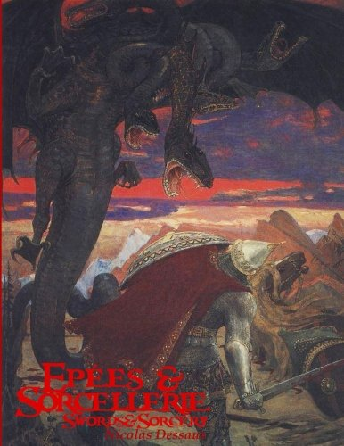

---
tags:
    - Akileos
    - Aventures Fantastiques
    - Basic Fantasy RPG
    - D&D
    - DCC
    - Epées & Sorcellerie
    - Gygax
    - La Forge De Papier
    - Le Donjon Du Dragon
    - OSRIC
    - Swords & Wizardry
---

# Quelques news

Bon, ce blog n'est pas très vivant. Faisons un petit bilan des dernières nouvelles.

## Troika!NeoMega!

Je suis toujours en train de travailler sur ce projet. J'ai fait un petit update sur [itch.io](https://rouboudou.itch.io/troikaneomega/devlog/494594/finalisation-de-la-traduction-du-srd-de-troika), mais c'est un gros travail si l'on veut faire un produit pas trop pourri. Là, je finalise le premier scénario, celui de Troika! Puis je passerai à la partie NeoMega!

On ne se rend pas compte du temps que tout cela peut prendre lorsque l'on fait tout, écriture, mise en page, illustrations, cartes ! Cela me fait comprendre toute la machinerie derrière de beaux projets comme Call of Cthulhu 7e.

##  

# Une belle fin d'année et un beau début d'année

Ces derniers mois, j'ai découvert pas mal de choses...

## Épées & Sorcellerie

Epées et Sorcellerie, première édition anglaise

J'avais acheté, voilà quelques temps, Epées et Sorcellerie, dans sa première édition anglaise. Malheureusement, on ne trouve pas la même édition en français (peut-être [là](https://sites.google.com/site/wizardinabottle/epeesetsorcellerie), le *E&S_Beta.pdf*). Nicolas Desseaux a créé ce jeu en fonction de son interprétation des trois petits livres bruns (D&D 0e) et de la façon de jouer dans les années 70 (on notera le remplacement du D20 par 2D6, ce qui change un peu les probabilités).

J'avais trouvé pas mal à l'époque ce jeu, mais je cherchais quelque chose plus proche du Moldvay de mon adolescence. Le livre était allé directement sur l'étagère.

## Aventures Fantastiques

Aventures Fantastiques, de Nicolas Desseaux

Même si le titre n'est pas grandiose, en décembre, en zonant un peu sur Internet, je tombe sur les [Aventures Fantastiques](https://www.donjondudragon.fr/clones/aventures-fantastiques/7405-aventures-fantastique-v1-77.html) de Nicolas Desseaux. J'avoue avoir été agréablement surpris par le PDF. Le jeu est simple et complet et conforme à ce que j'avais retenu de mon exemplaire de Moldvay quand je l'avais encore. C'est quand même un gros boulot avec beaucoup de contenu. Chapeau M. Desseaux !

## Swords & Wizardry

Swords & Wizardry, Core Rules

Par rebond, peu de temps après, je tombe sur [les règles Core de Swords & Wizardry](https://www.drivethrurpg.com/product/62346/Swords--Wizardry-Core-Rules), un joli PDF que je me fais imprimer par Lulu. J'étais content car je tenais quelque chose de très proche de ma cible, même si cette dernière était un peu confuse.

Ce jeu, créé par Matt Finch est disponible en trois éditions : une light, une Core et une complète. Manifestement, la source est un mélange de B/X et de BECMI.

## Basic Fantasy Roleplaying Game

J'avoue avoir, ces dernières années, pas mal utilisé BFRP en raison du matériel disponible en ligne, et aussi d'une traduction acceptable.

J'avais, à l'époque, pas mal regardé OSRIC, mais le volume du bouquin m'avait fait un peu peur.

## Petite réflexion sur les éditions OSR

En me baladant dans les éditions OSR inspirées de D&D, force est de constater que l'innovation n'est pas au rendez-vous. Certes, les vieux comme moi aiment bien retrouver leurs jeux d'ados, mais les contraintes ont changé : certains jouent moins souvent et veulent rigoler. Je ne dis pas de jouer des personnages trop puissants mais démarrer avec un clerc de niveau 1 sans aucun sort et avec 3 PdV, c'est craignos quand on ne joue pas souvent.

Une interrogation de fond que j'ai quand à ces jeux OSR est pourquoi ont-ils tous gardé la magie vancienne, qui n'est quand même pas géniale. J'ai droit à un sort de niveau 1, je le prépare et puis une fois jeté, je l'oublie ? Et j'ai 1d4 PdV ? Ouah, ça aussi c'est bien nase. Le guerrier lui, peut taper autant de fois qu'il veut, même à bas niveau. Je ne dis pas qu'il faille aller dans l'autre extrémité mais vraiment, cette magie vancienne n'a jamais été de mon goût.

Donc, pas d'innovation dans ces jeux OSR ? OK, ils respectent le maître Gygax (moi aussi d'ailleurs, je vénère la première édition d'AD&D), mais ce n'est pas une raison pour limiter l'usage de la licence OGL à une copie pure et simple du passé.

Quelle étrange manque d'ambition que cela... Quand on voit les efforts immenses déployés à écrire ces bouquins, ne serait-ce que ceux que j'ai cités, dont les PDF sont gratuits, c'est fou de ne pas avoir proposé quelques petites modifications.

Pour en revenir à la magie, on dirait que c'est un tabou. Après quelques recherches, j'ai trouvé :

* Un vague supplément de D&D ([AD&D Player's Options: Spells & Magic](https://archive.org/details/tsr02163playersoptionspellsmagic)) qui définit un système de magie à points mais très proche du système de base ;
* Le supplément apparemment très connu de Matt Blakeley, [The Elements of Magic](https://www.drivethrurpg.com/product/16681/The-Elements-of-Magic-Original), qui propose une vision assez nouvelle de la magie quoique encore très compatible avec D&D.

Non, il semble que, dans l'OSR, pour avoir le système de jeu de D&D mais une magie non vancienne, il faille joueur à autre chose.

Oui, ce sont des clones, j'ai compris. Mais quand même...

## La Forge de Papier

Puis j'ai découvert la [Forge de Papier](http://la-forge-de-papier.over-blog.com/). Alors là, chapeau. Ce site de fans de D&D reprend des jeux et des modules du passé et les revoit, complète, traduit, corrige. C'est hallucinant. La matériel produit est de niveau professionnel, c'est gratuit et cela donne accès à des textes depuis longtemps difficiles à trouver et dont les traductions originales étaient souvent défectueuses (je ne vous dis pas les efforts qu'il m'a fallu pour comprendre mon Moldvay en français avant de jouer pour la première fois !).

C'est hallucinant. Bravo, bravo et mille merci !

Moi qui me plaignait de ne pas voir de nouvelles éditions des vieux jeux de rôles français, des équipes françaises d'une qualité exceptionnelle travaillent. Allez sur leur site, et aidez-lez si vous le pouvez.

Pour ma part, je prévois de me faire imprimer B/X en français dans les versions "Forge" par Lulu bientôt (héhéhé, rire sardonique).

## Le Donjon du Dragon

Je me suis aussi inscrit sur le site [Donjon Du Dragon](https://www.donjondudragon.fr/) où un grand nombre de fans de D&D se sont retrouvés pour travailler sur des projets de traduction et de réédition de suppléments passés. Je n'ai pas eu le temp de bien découvrir le site mais j'ai lu [quelques numéros de rétro-donj](http://www.dd-add.fr/viewtopic.php?f=37&t=352) et j'ai appris plein de choses.

## La cerise sur le gâteau : DCC

Oui, alors après la jouissance, la double jouissance !

Je venais juste de finir la version révisée par la Forge de Moldvay, que je tombe sur une version de DCC en anglais. Je suis resté sur le derche ! Tout ce dont j'avais rêvé était là :

* Une grande compatibilité avec D&D (et donc une facilité d'adaptation de n'importe quel scénario D&D),
* Un esprit très D&D (avec les races comme classes),
* Un système de jeu revu avec des dés bizarres,
* Des innovations partout permettant de prendre en compte les contraintes des joueurs actuels (tout le monde ne peut pas jouer en campagnes),
* Un système de magie revu avec des effets amusants (et meurtriers),
* Etc.

Sur l'esprit, je dois dire que je tire mon chapeau à Joseph Goodman son créateur et que j'adhère à 100% avec sa démarche. On pourrait la résumer aux points suivants :

1. Goodman recherche l'esprit du D&D des origines non seulement au travers des règles, mais au travers des sources du jeu, souvent assimilée à l'appendice N de AD&D 1e, appendice dont le contenu était déjà sorti dans le numéro 4 du Dragon trois années auparavant.

Les lectures recommandées par GG dans The Dragon numéro 4 en 1976

L'appendice N de GG dans le Dungeon Master's Guide en 1979

Goodman cherche a retraduire cet esprit dans les règles, notamment de la magie. En cela, il garde pas mal de mécaniques de base type D20 mais en les tordant pour qu'elles s'adaptent plus à cet univers où la magie est dangereuse. Ce faisant, il propose des "corrections" au système de jeu et force est de constater que ces corrections sont bienvenues.

2. Le livre est gouverné par un vrai souci d'efficacité et de logique et de caractérisation très précise des sorts et de leurs effets.

3. Goodman vante l'innovation et incite les gens qui aiment la fantasy à utiliser les licences OGL pour innover et non pas pour refaire du D&D ou du AD&D exactement comme autrefois. Espérons qu'il ouvre la voie à du nouveau, dans un monde où le conformisme est quand même important.

Si c'est pour jouer à D&D, pourquoi jouer à un retro-clone et pas à D&D (d'où l'importance des travaux de la Forge) ?

Mr Goodman, belle leçon !

Après avoir lu près de 100 pages en anglais, je me suis aperçu qu'il existait une version française et que pas mal de gens sur le net disaient du bien de la traduction. Je l'ai commandée dare-dare sur le site de [l'éditeur Akileos](https://akileos.fr/boutique/index.php?id_product=265&id_product_attribute=0&rewrite=dungeon-crawl-classics-edition-francaise-pdf-offert&controller=product) et j'ai reçu le PDF et le bouquin en parfait état dans un délai raisonnable.

Le bouquin est hallucinant : un gros pavé de presque 500 pages avec une couverture cartonnée, proposant un grand nombre d'illustrations de grande qualité (très retro- donj). La traduction est super (super boulot de l'éditeur de BD Akileos) et voilà !

Là, j'ai de quoi m'amuser pendant quelques temps !

8 janvier 2023

