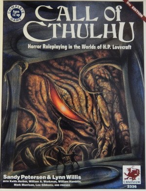
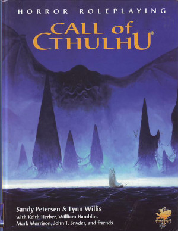

---
tags:
    - AbeBooks
    - Amazon
    - Architeuthis
    - Basic Roleplaying System
    - Call of Cthulhu
    - Casus Belli
    - D&D
    - DCC
    - Empires & Dynasties
    - Emysfer
    - Fate
    - GURPS
    - Laelith
    - Le Bon Coin
    - Les Terres de Matnak
    - Lulu
    - Maléfices
    - Mega
    - NeoMega
    - PBTA
    - Rakuten
    - Rêve de Dragon
    - Rolemaster
    - Runequest
    - Simulacres
    - Stormbringer
    - Troika
    - Tunnels & Trolls
---

# Mai 2023

Bon, ce blog n'est pas très vivant. Faisons un petit bilan des dernières nouvelles.

## Troika!NeoMega!

Je suis toujours en train de travailler sur ce projet. J'ai fait un petit update sur [itch.io](https://rouboudou.itch.io/troikaneomega/devlog/494594/finalisation-de-la-traduction-du-srd-de-troika), mais c'est un gros travail si l'on veut faire un produit pas trop pourri. Là, je finalise le premier scénario, celui de Troika! Puis je passerai à la partie NeoMega!

On ne se rend pas compte du temps que tout cela peut prendre lorsque l'on fait tout, écriture, mise en page, illustrations, cartes ! Cela me fait comprendre toute la machinerie derrière de beaux projets comme Call of Cthulhu 7e.

## Call of Cthulhu

Parlons-en de CoC. J'ai fini l'état des lieux des suppléments en français et en anglais. Puis j'ai acheté en ligne des versions anciennes de la cinquième et de la sixième édition en anglais. J'ai découvert la septième édition qui est une belle production, sortant un peu des deux colonnes en noir et blanc, même si ces présentations ont leur charme.

CoC est vraiment un jeu qui me correspond, et cela depuis toujours. Les enquêtes, le système de combat et de magie qu'il vaut mieux éviter si l'on ne veut pas mourir trop vite, de nombreux PNJ, c'est ma vision du JDR.

Pour le moment, je lis la cinquième édition en anglais.

Truc marrant : j'ai acquis récemment un vieux jeu français (j'y reviendrai), et le vendeur m'a envoyé un numéro récent de [Architeutis](https://www.philibertnet.com/fr/15078-architeuthis) parlant de la faillite de la société *Sans Détour*, éditrice en français de la sixième édition de CoC.

Bon, soyons francs : je n'ai jamais aimé le mise en page de cette sixième édition française, et old school que je suis, je préfère les vieux produits *Jeux Descartes*. C'est un jeu que j'achète et non une œuvre d'art !

Concernant CoC sixième édition, je n'ai pas eu le temps d'investiguer.

J'ai relu la nouvelle *The Call of Cthulhu* en introduction, mais je ne suis pas allé plus loin.

Enfin, je prévois de virer toutes les copies d'antan et de les remplacer par des prints Lulu prochainement. Quel merveilleux jeu !

En ce qui concerne la septième édition, je n'y suis pas encore : je rattrape mon retard. Je n'aime pas trop les caractéristiques des PJs en pourcentages... je ne vois pas d'où ça sort (à part virer la table de résistance). Mouais, je verrai ça plus tard. Finissons d'abord la 5e et on verra ensuite.

## CoC, un jeu vivant depuis 1981 !

Enfin, je voulais en profiter pour faire un peu de provocation : j'ai acheté ma première version de l'*Appel de Cthulhu* vers 1983 (seconde édition) et depuis, le jeu est maintenu !*

Quel jeu français bénéficie d'un tel support, d'éditions successives et de qualité dans les contenus ? Hein ? Parce que c'est facile de sortir un jeu et puis de laisser tomber vos joueurs.

C'est, je crois la grande différence entre les américains et nous : nous avons plein d'*égos* pour faire des jeux (comme si la mécanique de jeux était un problème) mais pas des masses de gens pour soutenir le jeu sur le long terme (scénarios, extensions).

C'est notre côté procédurier, administratif à nous les français : on adore les lois, des tonnes de lois et de règlements qui tuent tout et paralysent tout. Et le jeu de rôles en est une illustration un peu affligeante, je l'avoue.

Par exemple, un jeu comme *Rêve de Dragon* aurait dû cartonner depuis des décennies en France. Mais bon, quand on regarde les règles, on est vraiment calmé. C'est comme jouer à Rolemaster.

C'est sympa mais le côté ultra-spécifique et ultra-crunchy est quand même très dur pour un produit : c'est comme des boulets que l'on porte. Il est difficile pour les autres de faire des scénarios pour votre jeu et il est difficile pour vos MJs d'évoluer sans vous derrière. C'est ce qu'on pourrait appeler des impasses...

## Complétion de D&D 4e en anglais

Un détail : il me manquait le Monster Manual de D&D 4e.

C'est maintenant chose faite (j'ai choppé un vieux machin pas trop usagé).

Marrant comme cette édition ressemble une BD... Je n'ai pas encore creusé pourquoi le système de jeu avait tant défrayé la chronique.

## GURPS 3e

Hé oui, j'ai craqué. Je n'avais jamais lu les règles de GURPS en mode papier, et j'ai eu une bonne occasions sur la troisième édition en anglais.

En fait, je cherche des systèmes de pouvoirs qui me fassent tripper et donc je commence par les grands classiques. Et là, j'avoue que c'est pas mal.

J'aime bien :

* La mécanique à deux niveaux : vous avez un score dans le pouvoir et une compétence dans le pouvoir psy qui y est rattaché ;
* La couverture des pouvoirs psy et leur classification ;
* Les mécanismes liés à la volonté (une genre de mode "boost") mais qui épuisent le personnage.

Un must.

J'ai un peu regardé le supplément sur les pouvoirs psioniques.

Et ça me paraît être un bon supplément. Il faut que je me le procure pour creuser un peu.

Tout cela, c'est dans le cadre de *NeoMega*. J'ai déjà une liste de pouvoirs psy, mais je suis très ouvert à des ouvrages de gens ayant passé beaucoup plus de temps que moi sur le sujet.

## La Forge de Papier / le Donjon du Dragon

Bon, ben là, je pense qu'il faut réaliser que nous avons des fous furieux passionnés par D&D, B/X en particulier. J'avoue que je lis tout, je télécharge tout et je suis super content que des gens comme ça existent. Je pense qu'ils m'ont fait comprendre D&D après toutes ces années.

Encore une fois, pour les fans de D&D old school : [La Forge de Papier](http://la-forge-de-papier.over-blog.com/).

Bon, là aussi, force est de constater que ces gens ne sont pas sains d'esprit ! Ils ont abusé de D&D et ont dû perdre quelques points de SAN (c'est certain que les D&D guyz sont mauvais en jet de 1D100 sous la SAN, car tout ce qui n'est pas D20...) pour vouloir traduire tous les suppléments de l'univers que TSR a un jour produits (314 containers équivalent vingt-pieds selon mes estimations).

Le lien : [Donjon du Dragon](https://www.donjondudragon.fr/).

D'ailleurs, je viens de demander à Lulu de m'imprimer D&D 0e (les trois livrets bruns traduits par le Donjon du Dragon). Par contre, guys, je les ai imprimés en US Letter, parce qu'à mon grand âge, des pages denses en A5, c'est compliqué.

## Tourisme en Italie et BRP

A l'occasion d'un peu de tourisme en Italie, j'ai fait l'acquisition de la dernière mouture de *Magic World*, de Chaosium.

Comment dire, je suis un peu déçu. Je ne pensais pas acheter une version de BRP avec un saupoudrage de magie. Pas du tout d'inventivité dans la magie... On dirait un vrai sous-produit.

D'ailleurs, après m'être fait voir, je suis allé sur le site de Chaosium pour voir que le produit n'était même plus marketé (il reste en vente en PDF sur [DriveThru](https://www.drivethrurpg.com/product/128323/Magic-World)).

Bref, ne pas acheter, surtout si on connaît les autres produits BRP.

Au fait, la dernière édition de BRP vient de sortir en PDF. 

## Moment nostalgie : Stormbringer

Enfin, cet achat inopportun aura eu la vertu de me faire rouvrir un vieux classeur avec une vieille copie de la deuxième édition de Stormbringer en français datant de Mathusalem.

En cherchant une version PDF de ce jeu que j'ai perdu il y a bien longtemps, j'ai trouvé ce site, [elric.melnibonee.free.fr](http://elric.melnibonee.free.fr/spip.php?rubrique6), site sur lequel vous pourrez trouver les PDF des deux premières éditions françaises.

Évidemment, là, la magie est d'un autre niveau. Mais c'est grâce, je pense, à la plume de Ken St-André, l'inventeur de *Tunnels & Trolls*, un fin connaisseur de l'œuvre de Moorcock.

J'ai demandé à Lulu de me réimprimer la première édition, ce qui est un mauvais plan car j'ai toujours un gros classeur avec la copie de la seconde édition.

## Les sites d'occasions

C'est vrai qu'en France, nous pouvons trouver pas mal d'occasions sur divers sites :

* [eBay](https://ebay.fr) : pas mal de chose, mais c'est souvent assez cher. Mais bon,  j'ai trouvé pas mal de choses intéressantes.
* [Rakuten](https://rakuten.fr) : j'ai trouvé pas mal de choses sur Rakuten. J'aime bien même si le site est un peu nase (recherches impossibles en multipages dans le boutiques).
* [Le Bon Coin](https://www.leboncoin.fr/) : je découvre. Jamais utilisé mais pas mal de gens ont plein de choses à vendre.
* [Abebooks](https://www.abebooks.fr/) : pour les livres anciens. On ne trouve pas souvent des choses, et elles sont souvent chères, mais parfois, on peut trouver des choses intéressantes.

Sinon, j'achète assez peu de neuf, sauf en PDF sur [drivethru](https://www.drivethrurpg.com), et encore, c'est pour faire imprimer par [Lulu](htpps://lulu.com).

Le problème de Lulu, c'est que c'est long ! Je voyais une australienne l'autre fois sur Internet qui disait que, pour vendre son bouquin, elle passait par [Amazon KDP](https://kdp.amazon.com/) parce que c'était beaucoup plus rapide. Je la crois. Pas possible de vendre un bouquin à des clients sur Lulu tellement c'est long. Pour autant, l'impression est faite en France et est de bonne qualité. Donc, parfait pour un usage personnel.

## Quelques découvertes

A l'occasion de ma commande sur [Le plumier des Chimères](https://plumierdeschimeres.com/) d'un vieux jeu français auquel j'ai un peu joué dans le passé, *Empires et Dynasties*, j'ai reçu dans mon paquet quelques petits cadeaux (merci Philippe Jaillet, responsable des jeux Posidonia).

Une remarque préalable de la part de celui qui travaille sur un reboot de "*Mega*" (*NeoMega*), la production est très belle et très travaillée. On voit un vrai travail qui ne ferait pas rougir un éditeur américain.

Mais... Ce qui va suivre n'engage que moi mais il y a un gros "mais".

*Emysfer* est un monde intéressant. On a envie d'y jouer, vraiment. Les descriptions des différentes races sont sympas, inventives, amusantes et l'on imagine bien ce que l'on peut vivre à la table de jeu.

En ce qui concerne les *Les terres de Matnak*, c'est pareil : la bestialité dans les humains, le fait de lutter contre, tout ça, c'est super, comme univers.

## La malédiction des jeux français

Venons-en au "mais".

Mais pourquoi inventer des systèmes de jeu "à la con" ? Je suis navré mais il faut que quelqu'un le dise. Ces jeux sont des univers très intéressants pour un système de jeu médiéval fantastique comme *D&D*, *GURPS*, *BRP Runequest*, *Warhammer*, *Troika!*, etc. Mais pourquoi réinventer un système de jeu complet ?

J'ai vu dans les critères du Graal d'Or "adéquation du système de jeu avec l'univers". C'est vraiment horrible : c'est une volonté, un objectif, de faire des systèmes de jeu merdiques, hyper complexes, spécifiques, qui dans deux ans ne seront plus jamais supportés...

J'avoue que j'ai toujours eu du mal à comprendre ce phénomène.

Côté systèmes de jeux, il existe tellement de choses bien (et "open source"). Pour ne citer que les plus connus :

* *D&D* : avec l'[OGL](https://en.wikipedia.org/wiki/Open_Game_License), on peut dire qu'on peut maintenant tordre les règles dans tous les sens avec la bénédiction de Wizards.
* *BRP* : avec la nouvelle licence [ORC](https://paizo.com/community/blog/v5748dyo6si9y?First-Draft-of-the-ORC-License-Ready-for), le système de jeu va devenir plus facile encore à utiliser.
* *GURPS* : quand on a lu quelques extensions, on voit comment avoir des mondes avec leurs règles spécifiques dans un univers de jeu connu par les joueurs et les MJs.
* *Fate* : dans le genre, j'accommode tout à ma sauce, Fate est le bon candidat.
* *PbtA* : Dieu sait que je n'aime pas ce système de jeu, mais bon, il est utilisable.

Les éditeurs américains ont fait des efforts ces dernières années. Et pourquoi ne pas sortir l'univers comme un supplément à divers systèmes de jeux ? C'est la même question que je posais voilà quelques mois : pourquoi les scénarios des canards de JDR sont toujours axés sur un jeu et ne proposent pas des déclinaisons sur plusieurs moteurs de jeux ?

Donc, là Posidonia sort deux super produits avec deux bonnes accroches. Mais comme je n'ai pas beaucoup de temps, ni à la table de jeu, ni en mode prep, il ma faut quelque chose qui se décline vite sur un système que je connaisse.

Pour *les Terres de Matnak*, la Bestialité aurait pu ressembler à la Santé Mentale de CoC, car techniquement, c'est très proche. Vu comme ça, je peux l'intégrer dans une campagne med-fan BRP.

*Emysfer* est un monde jouable dans plein de jeux, mais ce n'est pas un vrai jeu. Ce n'est pas parce que j'ai un ensemble de compétences spécifiques que je suis obligé de réécrire le moteur de jeu tout entier !

Car, sur le sujet du système de jeu, ces deux jeux n'ont rien d'innovant : ils sont très classiques en définitive (hormis un vocabulaire parfois pompeux plein de "concepts à la con").

Il reste le sujet d'"acheter des narrations", manifestement très en vogue sur la Côté d'Azur, un genre de mode participatif des joueurs dans un jeu crunchy... J'avoue que je n'ai pas tellement compris comment ça marchait. Cela me paraît assez compliqué.

## Où est le produit ?

Alors bon, je ne suis qu'un simple utilisateur, ayant pas mal joué et ayant des velléités d'adapter (à la marge) un jeu super simpliste pour jouer sur le pouce dans un univers que j'aime. Je ne connais pas tout ce que connaissent les gens qui se démènent pour crowdfunder les jeux indies français.

Mais, je pense que nous avons un défaut grave de compréhension du marché.

Si je veux faire jouer ma table avec des règles à moi dans un univers à moi, c'est cool, je ne demande rien à personne.

Mais quand je veux publier, il faut se poser une grande question : le produit va être vendu ; est-ce que je veux en vendre ?

Parce que, au delà d'une niche de gens qui vont permettre au crowdfunding de marcher, est-ce que je veux que le jeu soit encore là dans dix ans ? Est-ce que je ne fais que répondre à mon égo de montrer à tous quel concepteur hors pair je suis et "comme il est bien" le monde que j'ai inventé ?

Supposons que *Emysfer* soit un monde pour D&D 5e :

* Je peux jouer en France dans ce monde ;
* Je peux favoriser que des aventures soient faites par d'autres et donc ouvrir une communauté de joueurs ;
* Je peux le traduire ;
* Je peux le vendre sur [Dungeon Masters Guild](https://www.dmsguild.com/) ;
* Dans 3 ans, je peux en faire une seconde édition pour D&D 6e.

Attention, je ne suis pas un agent de Wizards ! Mais là, on tient quelque chose. L'aspect game design reviendrait, dans ce cas, à adapter à D&D 5e les concepts très spécifiques aux monde de *Emysfer* (la mémoire surtout).

Pareil pour les *Terres de Matnak*, sachant que le monde pourrait être facilement adapté à Warhammer. Il faut voir aussi ce qui existe : il serait étonnant que AD&D 1e ou Warhammer n'aient pas évoqué les transformations bestiales des humains.

Avec une approche d'extension, idéalement multi-système de jeux, le monde peut perdurer.

Alors que des gens comme moi n'ont plus envie de lire des bouquins de règles avec plein de trucs bizarres. Par contre, nous sommes consommateurs de mondes (ou de morceaux de mondes) et de scénarios épiques.

Ce n'est pas de ma faute si la plupart des moteurs de jeux puissants viennent des US : ils sont six fois plus nombreux que nous, donc tout est plus play-testé, industrialisé, peaufiné, édition après édition.

Nous, on galère, parce qu'il est très compliqué de monter des communautés de JDR chez nous : elles sont hyper fractionnées. Et donc, tout le monde tire la langue.

## Architeuthis

Philippe Jaillet m'a aussi envoyé gratuitement le numéro 1 d'Architeuthis. Déjà, le nom du magazine est compliqué à retenir. Dans l'édito, il s'y plaint de l'état du marché français.

Je suis d'accord avec lui, mais ce n'est pas en publiant des micro-JDR sans communauté que l'on pourra redresser la barre.

Casus Belli avait, dans le temps, tenté de surmonter ce problème, d'abord en s'accrochant à *BRP*, puis à *Simulacres* qui est un jeu ultra-merdique. L'idée était que chaque scénario pouvait être décliné dans le moteur de jeux générique "français", bonne idée en soi, sauf que je n'ai jamais réussi à digérer les "concepts" de *Simulacres*.

Il en résulte un problème de fond : nous sommes pilotés par les jeux US (oui) et la multitude de jeux français atomise le marché (oui) avec des prix horribles (oui) et des toutes petites séries (oui).

C'est ce que je trouve top avec DCC : même prix en euros qu'en dollars : 40€ le jeu et 10 € les scénars. De belles illustrations en NB par contre, c'est du old school.

En comparaison : *Laelith* la cité : 70€ ; *Rêve de Dragon* + *Invitation au Voyage* 55€+55€ ; *Méga 5*, en rupture de stock aussitôt après sa sortie, aucun suivi commercial ; *Maléfices*, rupture de stock ; etc.

Alors, oui, ce sont des œuvres d'art, mais on peut jouer avec ? Et quel suivi ?

J'ai acheté *Empires et Dynasties* par nostalgie et parce que j'avais perdu mon exemplaire. Philippe Jaillet en avait un neuf (miracle ?).

Ce jeu propose un effort énorme de description du monde de Réah mais, il n'a pas été un succès, parce qu'il cumule deux désavantages : un monde complexe et inconnu, complètement lié à son auteur, et un système de jeu spécifique (voir mon sujet sur [l'accessibilité des JDR](./202209.md#les-trois-dimensions-de-laccessibilite-du-jeu)).

## Conclusion

Au final, c'est beaucoup de talent qui se perd, beaucoup d'énergie, tout cela parce que, du temps de *Légendes*, comme de *Blood Lust*, comme maintenant des jeux récents, nous les français sommes **toujours dans le même paradigme** qui nous fait préférer nos petites créations persos, souvent peu innovantes au niveau des mécaniques de jeu, au détriment de nos univers de jeux qui, eux, sont riches mais restent dans leur ghetto.

Deux solutions donc à mon avis :

* Faites des suppléments pour les moteurs de jeux connus et publiez sur les canaux US (drivethru, itch, Amazon) ;
* Travaillez à un moteur de jeu français type Simulacres que chacun customisera dans son coin (je n'y crois pas trop).

Le comble de cette situation est qu'il faut qu'on m'offre un magazine lors d'une commande pour que j'apprenne l'existence de plein de jeux français...

Pauvre de nous.

14 mai 2023

