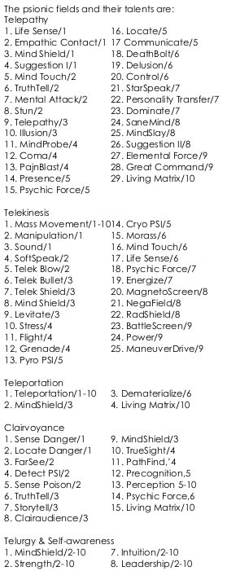
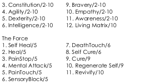
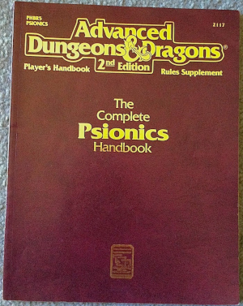
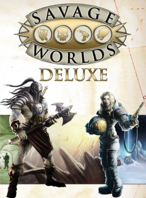

---
tags:
    - Ars Magica
    - Bitume
    - Blood Bowl
    - Bloodlust
    - Call of Cthulhu
    - D&D
    - Dragon Radieux
    - Empires & Dynasties
    - Hurlements
    - Légendes
    - Magnas Veritas
    - Mega
    - NeoMega
    - Rêve de Dragon
    - Savage Worlds
    - Space Opera
    - Stormbringer
    - Warhammer
---

# Space Opera et les pouvoirs psionics

En cherchant dans les ancêtres du JDR, j'ai rouvert un vieux PDF de *Space Opera* de 1984, et là surprise devant l'étendue de la partie sur les pouvoirs psioniques.

Ces pouvoirs sont bien classés par catégorie et ils ne peuvent s'acquérir que progressivement, les uns après les autres.

Pour NéoMega, on voit que *Personality Transfer* est le pouvoir numéro 22 de la catégorie *Télépathie* (pouvoir de niveau 7). En d'autres termes, dans le monde de *Space Opera*, les Mégas d'autrefois devraient posséder les 21 pouvoirs précédents pour pourvoir bénéficier du transfert, transfert d'ailleurs qualifié de très dangereux.

J'ai toujours trouvé que ce pouvoir avait un côté excessif. Dès lors que l'on peut se transférer facilement dans le super méchant, il faut faire attention à ce que le pouvoir ne ruine pas le scénario.

18 juin 2023

---

# Des arrivées

## D&D 4e

Je complète mes bouquins de base de D&D 4e en anglais et en français. Oui, je sais, j'arrive après la bataille mais on fait ce qu'on peut.

J'aimerais bien chopper le Handbook 3 qui propose les classes de persos ayant des psioniques.

## Pouvoirs psychiques

Pour le coup, je pense avoir fait une bonne affaire en dégottant une version neuve du *Complete Psionics Handbook*.

C'est un peu un classique. Déjà, à l'époque de AD&D 1e, Gygax avait fait une synthèse des psioniques à la fin du PHB, un truc un peu compressé. J'en parlerai peut-être dans [mon article sur le sujet](../pages/psionics.md).

## Kezaco Savage Worlds

Sinon, dans les trucs divers, j'ai choppé une version ancienne de *Savage Worlds*, la première édition je pense.

Je ne me suis pas encore intéressé au système. Je ferai ça un de ces jours. En tous cas, le format est agréable.

## Du côté de chez Lulu

Sinon, j'ai reçu de Lulu les deux *Anashiva Reahna* qui me manquaient en reprint, la *Mangoranii* et l'*Art de la Guerre*. Je pense avoir *grosso modo* les trucs publiés Par Durand-Peyrolles sur *Empires & Dynasties*.

## Une interview de Croc

J'ai écouté une petite [interview récente](https://www.youtube.com/watch?v=52abztCDziw) de [Croc](https://fr.wikipedia.org/wiki/Croc_(auteur_de_jeux)) sur Youtube. Marrant qu'il soit toujours dans le circuit et toujours fidèle à lui-même.

Je l'ai croisé lors d'une semaine de jeux à Morestel en 1987 ou 1988 sans doute, un truc organisé par le *Dragon Radieux*, Paul et Pascaline Chion. Je me souviens d'un *Blood Bowl* grandeur nature... Tout ça ne nous rajeunit pas. A l'époque, nous avions joué à *Légendes*, à *Empires & Dynasties*, avec Patrick Durand-Peyrolles himself, et à *Rêve de Dragon* avec [Denis Gerfaud](https://fr.wikipedia.org/wiki/Denis_Gerfaud) himself.

J'en ai gardé un vrai dégoût pour *Légendes* où nous avons joué pendant 3h30 un combat de 1 minute ! En une après-midi, nous avons fait quelques mètres en dehors du village celte pour se faire attaquer et... c'est tout ! C'est affligeant et pas ma façon de faire du JDR (voir [mes autres articles](https://orey.github.io/blog/tags/#legendes) sur le sujet).

Croc a parlé du fait qu'il était impatient dans les jeux et qu'il maîtrisait le système de jeu parfaitement pour ne pas avoir à ouvrir un livre durant le jeu. Je comprends cela. Il faut que la partie mécanique aille vite. Si les joueurs prennent de temps à discuter pendant les phases d'enquêtes, c'est normal, mais la partie combat doit dépoter.

Il a aussi mentionné la dualité de la scène indépendante internationale et française du JDR avec, à la fois, des mécaniques de jeu très innovantes et des univers pas très créatifs. J'avoue que je suis d'accord avec cette analyse, moi qui revient dans ce monde de nombreuses années après l'avoir quitté. Il déplore que le monde du JDR n'ait pas créé plus de *Campagne Impériale* que cela, et je suis bien d'accord.

J'ai une petite expérience des jeux écrits par Croc, jeux, qui généralement, ne m'ont pas complètement enthousiasmé :

* J'ai fait jouer *Bitume*, mais je ne suis pas fan ;
* J'ai joué à *Magnas Veritas*, mais je n'ai pas été emballé ;
* J'ai joué à *Bloodlust* et j'ai bien aimé le coup des armes possédées ; ça fait un peu *Stormbringer* généralisé dans le monde de *Warhammer* ; mais je pense que c'est un peu trop dark pour moi.

Dans les jeux qui ont été cités, peut-être que *Scales* est celui qui m'intéresserait le plus. Je ne sais pas si on peut encore trouvé le bouquin.

## NeoMega

Voilà, je continue à travailler épisodiquement sur *NeoMega*, notamment sur un nouveau scénario qui se situe avant le *Grand Isolement*.

11 juin 2023

---

# Un petit tour des pouvoirs psy ("psionics")

J'ai toujours beaucoup plus aimé les pouvoirs psy que la magie, même si les magies de *Cthulhu* ou de *Stormbringer* me plaisaient bien parce qu'elles étaient soit réservées aux méchants, soit tellement dangereuses que leur utilisation était peu recommandée si l'on voulait vivre.

La magie de base dans la plupart des jeux de rôles ne me plaisait pas tellement : la magie ouvrait souvent sur de nombreux sous-systèmes peu cohérents dans l'univers. Mais à la réflexion, peut-être était-ce la manière d'exercer la magie qui ne me plaisait pas trop chez les joueurs : une façon mécanique un peu bourrine, et justement, dénuée de magie.

J'ai acheté des vieux *Ars Magica* voilà quelques temps et je dois dire que j'aime bien, même s'il faudrait que j'investisse un peu plus de temps dans le jeu. J'ai un peu l'impression que *Ars Magica* est le *Hurlements* que nous aurions dû avoir, mais c'est un autre débat.

D'ailleurs, ça ma fait penser que je dois mettre en ligne un édito de Paul Chion, l'ancien rédacteur en chef de *Dragon Radieux* sur le JDR français. C'est très amusant avec le recul.

Sans doute aussi suis-je un enfant de *Méga 2* et non de *D&D*. J'ai pourtant eu *D&D* avant, mais sans y joueur pendant très longtemps, n'étant pas un grand adepte du dungeon crawling.

Toujours est-il que ce tour des pouvoirs psy démarre par *Eldritch Wizardry* de *D&D 0e*. Autant vous prévenir, il faut être motivé pour comprendre ce machin : c'est un capharnaüm infâme de règles psioniques mêlées avec des règles sur le druide et autres suppléments. Franchement, je pense que c'est un des pires modules de tout les temps, sachant que, dans la partie psioniques, des tables citées plusieurs fois manquent !

Je vais donc l'élire : *Grand prix de la pire édition dans le monde du JDR* !

Toujours est-il que j'ai démarré une page sur le sujet : [pouvoirs psychiques dans le JDR](../pages/psionics.md). C'est un "work in progress".

En fait, je le fais un peu parce que j'aime bien l'archéologie, et aussi un peu pour *NeoMega*, où les pouvoirs psy sont centraux à l'univers mais avec beaucoup de limitations.

3 juin 2023

