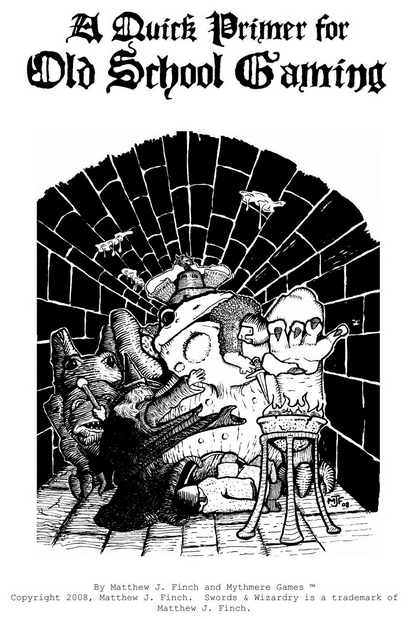

---
tags:
    - Chainmail
    - D&D
    - Swords & Wizardry
---

# Des trucs sur D&D

Bon, là, évidemment, je suis immergé dans D&D ce qui, je pense, ne m'est jamais arrivé auparavant. Commencer par OD&D est une expérience très intéressante qui m'inspire quelques commentaires.

## OD&D : une profusion d'idées

Comme dans touts les innovations, le début est souvent très fertile en idées, en tentatives, en ouverture d'esprit.

Prenons un exemple non tiré du monde des JDR : prenons l'informatique. Lorsque la programmation orientée objet est née, de nombreuses questions ont foisonné dans tous les sens créant diverses choses étranges qui ont un jour abouti à (horreur) C++. Plus que C++, le livre de Gamma et al. de 1994, *Design Patterns, elements of reusable object-oriented software* a terrassé toute réflexion : le livre était intelligent, puissant, lourd, construit. Il permit l'émergence de softwares professionnels mais au détriment de l'innovation. Oubliées toutes les idées innovantes. Nous étions revenus au monde industriel. Globalement, les idées ont été oubliées pendant presque 20 ans et il a fallu attendre le développement de Javascript pour voir un modèle différent émerger.

OD&D, c'est un peu la même chose. Quoique mis en forme de façon difficile à lire et à exploiter, OD&D est un repaire d'inventivité. On pourrait croire au premier abord que toutes ces listes de choses sont un répertoire plus ou moins hétérogène mais, la plupart du temps, ces listes modélisent différents éléments de différents mondes de fantaisie que l'on trouve dans les livres de fantasy de différents auteurs (voir [ici](https://orey.github.io/blog/blog/202301/#la-cerise-sur-le-gateau-dcc) pour les références de Gary Gygax). De plus, les diverses éléments de modélisation de ces mondes renvoient les uns aux autres : les sorts renvoient aux monstres qui renvoient aux objets magiques. Toutes ces références permettent de modéliser plusieurs univers mais on distingue, malgré une mise en page un peu compliquée, un vrai souci de cohérence.

Par exemple, à l'usage, il paraît difficile de joueur à OD&D sans prendre quelques options de *Greyhawk*. En effet, le modèle basique développé dans les livrets bruns originaux de OD&D s'appuie sur *Chaimail*, le wargame que Gygax avait fait avant D&D. Ce n'est que dans *Greyhawk* que le système de combat (avec sensibilité aux armes) ne se développe vraiment. J'ai d'ailleurs traduit les tables principales dans la traduction des pouvoirs psioniques (voir ci-dessous).

Ce qui est amusant, c'est de découvrir que certains traits de OD&D sont présents dans les monstres ou les objets magiques de D&D 5e... Je trouve ça assez touchant. L'esprit de base de Gygax hante encore des productions qui lui sont de très loin postérieures.

## Jouer avec les règles avec OD&D

En traduisant les pouvoirs psioniques (et quelques sorts connectés), j'ai pu constater que Gygax aimait beaucoup jouer avec les règles, en inventer, les imbriquer, les emboîter, leur donner une logique propre. Bien entendu, à ce moment, je ne pense pas que la cohérence ait été le cadet de ses soucis. Et comme OD&D ne propose pas vraiment de monde (*Greyhawk* est embryonnaire et *Blackmoor* est quand même un tout petit endroit), les règles complètes donnent la possibilité de modéliser les différents univers de fantasy et d'ouvrir le jeu à d'autres perspectives.

Cet amour des règles, ces dernières ayant toujours des objectifs de simulation, est très intéressant, car le système n'apparaît jamais comme étant rigide. Le coup du nombre de niveaux de monstres, par exemple, est très intéressant, le groupe d'opposants étant vus comme une entité globale au travers du nombre de dés de dommages que le groupe peut encaisser.

Chaque sort, chaque pouvoir psionique peut devenir un mini-système dans lequel le niveau de maîtrise (encore un concept intéressant) intervient. Dans une mise en page, hyper-compacte, l'inventivité est remarquable et il faut se pencher profondément dans les règles pour comprendre toutes les références que ces dernières font entre elles.

Evidemment, il est fort possible que toutes ces règles n'aient pas été "play-testées" pendant des mois, mais soit le fruit d'une logique de semi-improvisation en mode "homebrew" (faites à la maison).

On est loin des jeux modernes ultra-optimisés et ultra équilibrés dont D&D 4e est sans doute l'un des plus beaux représentants.

## Le courant OSR

Evidemment, cela explique le courant OSR, très bien décrit par Matthew Finch, l'auteur de *Swords and Wizardry*, dans son papier *[A Quick Primer for Old School Gaming](https://archive.org/details/a-quick-primer-for-old-school-gaming/A%20Quick%20Primer%20for%20Old%20School%20Gaming/)* :

* Des règles simples,
* De l'improvisation des joueurs et du MD qui ne passent pas leur temps à regarder ce que leur personnage est capable de faire, mais qui le font,
* Du fun et du rythme.

## Publication par WotC du SRD 5.1 en français

Hé oui, le voilà : la page sur [D&D Beyond](https://www.dndbeyond.com/community-update#SRDv51Localization) et le SRD en question : https://media.wizards.com/2023/downloads/dnd/SRD_CC_v5.1_FR.pdf sous licence Creative Commons.

Cela ne remet pas en cause le travail d'équipes comme celles de [aidedd.org](https://aidedd.org) (qui a déjà traduit le SRD) ou du [la Forge de Papier](http://la-forge-de-papier.over-blog.com/) ou du [Donjon du Dragon](https://www.donjondudragon.fr/ "Donjon du Dragon") mais cela montre aussi que la France est un marché dont WotC devrait s'occuper un peu plus.

## Glossaire et Open5e

Je viens de créer un repo Git pour mettre sous forme structurée le glossaire de traduction anglais-français de D&D.

Cette tâche est immense et probablement, ce ne sera probablement qu'une tentative que je ne pourrai pas terminer mais je pense que ce glossaire devrait être open source et en données structurées, par exemple pour pouvoir être utilisé par des sites de VTT, ou en complément avec des initiatives telles que <https://open5e.com> de mettre tout ce qui est disponible en SRD, en OGL et en CC4 en données structurées.

Open5e est une initiative très intéressante, même si elle est à la fois complexe (trouver la bonne structuration des données) et très consommatrice en temps. Avoir tout le SRD D&D 5e, et d'autres SRDs, en format `json` est un défi. A voir ce que ça va donner.

Il n'empêche que de disposer d'un glossaire global D&D anglais français ne serait pas du luxe.

En attendant, j'ai aggloméré les deux glossaires D&D que j'ai trouvés (3.5 des anciennes éditions Asmodée sur [archive.org](https://archive.org)) et celui de AideDD.org pour la 5e dans un seul PDF disponible [ici](https://github.com/orey/DD-glossaire/blob/main/GlossaireDD3-DD5.pdf).

15 août 2023

---

# Les pouvoirs psioniques de OD&D

J'étais en train de chercher à comprendre les pouvoirs psioniques de OD&D dans le Supplément III de OD&D Eldritch Wizardry, quand j'ai voulu en faire une simplification. En ces pages, j'ai fait une première version très incomplète de la simplification du jeu, puis je me suis dit qu'il fallait faire ça sérieusement. Mais faire une réinterprétation du jeu sans l'avoir traduit au préalable m'a semblé un peu étrange. J'ai donc traduit la partie psionique, ajouté les références que cette partie fait aux autres parties de D&D et proposé une réinterprétation des règles.

Vous pouvez trouvez dans la zone [téléchargement](../downloads/eldritch-wizardry.md) le PDF.

15 août 2023

