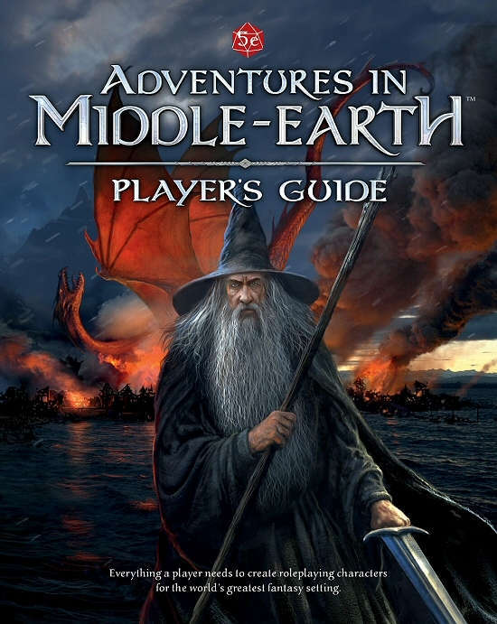

---
tags:
    - Adventures in Middle-Earth
    - Basic Roleplaying System
    - Call of Cthulhu
    - D&D
    - Lord of the Rings
---

# Bonne année 2024 !

Hello et bonne année aux égarés qui regardent parfois cette page !

## Licenciements chez Hasbro/WotC

Hé oui, c'est la mode dans certaines boîtes américaines de licencier les gens vers le 15 décembre et c'est ce qu'a fait Hasbro en décembre dernier. Comme vous le savez sûrement, *D&D* est une marque de Wizards of the Coast, qui est une filiale de Hasbro, la boîte qui fait les jouets.

En 2023, Hasbro a fait des [pertes records](https://investor.hasbro.com/news-releases/news-release-details/hasbro-reports-third-quarter-2023-financial-results) dans sa branche *entertainment* et a donc lancé un grand plan de réduction de personnel. Quand on regarde les chiffres, on voit qu'il était difficile de ne pas faire quelque chose.

J'ai fait une [petite présentation](../files/divers/20240103 Licenciements chez Hasbro-WotC.pdf) pour expliquer les choses.

Elle est aussi disponible sur le forum de [aideDD.org](https://forum.aidedd.org/viewtopic.php?p=310901#p310901).

Bon, certes, virer les gens chez WotC est plutôt étrange si on considère que c'est la seule activité en bonne forme économique (quoique, si on y regarde bien, les profits soient constants malgré un chiffre d'affaires en hausse, mais ce peut être une indication d'un gros investissement sur le digital).

Ce qui me paraît le plus surprenant est le limogeage de Mike Mearls, le co-auteur de D&D 5e, avec Jeremy Crawford. Evidemment, Mike ne travaillait plus sur D&D depuis un petit moment, il travaillait pour Magic the Gathering.

## OGL, piège à cons ?

Sur le podcast de [enworld.org](https://www.enworld.org/threads/podcast-279-hasbro-layoffs-and-d-ds-future.701655/), les intervenants se désolaient que *D&D* soit devenu LE plus gros JDR du monde, loin derrière les autres.

Je ne vais faire de la critique facile, mais tout ça, c'est quand même dû à la licence OGL... dont beaucoup de gens du milieu du JDR bénéficient !

Quand WotC publient la version 3 de *D&D* en OGL, ils font un coup de maître :

* Ils apparaissent comment des grands seigneurs en ouvrant leur système de jeu, ainsi que beaucoup de contenu.
* Ils apparaissent comme des précurseurs en abandonnant des droits d'auteurs et en créant un marché, le fameux marché du "D20 Compatible".
* Mais, ce que les gens ont du mal à comprendre, c'est qu'ils créent un marché de **suiveurs**, avec qui gens qui sont dans leur sillon.
* Ils enchaînent ainsi un bon nombre de sociétés de jeu tierces : difficile voire impossible de trouver son marché sans faire du D20 ; et quand on en fait, on a besoin des 3 manuels de *D&D 3e*.

Avec la version 4, WotC brise les tabous. J'en ai déjà parlé dans le passé : ils reviennent à un jeu tactique, hyper structuré, ayant besoin d'un plateau de jeu avec des figurines. La licence OGL devient [GSL](https://en.wikipedia.org/wiki/Game_System_License), un machin plus restrictif qui n'est pas très simple à utiliser.

Avec la version 5e de *D&D*, WotC revient aux fondamentaux de la licence OGL... et enchaîne une nouvelle fois toute l'industrie du JDR.

## D&D 5e, une réussite totale en termes de produit

*D&D 5e* est une réussite totale en raison, selon votre serviteur, des dimensions suivantes :

### 1. D&D 5e : le consensus

Le jeu reprend un certain esprit des origines au niveau des règles :

* Les règles sont simples, beaucoup plus que pour la 3e.
* Tout n'est pas écrit, tout n'est pas totalement structuré, et le tout est assez cohérent ; en cela, on retrouve un peu du D&D des origines.
* Le jeu n'est plus tactique et ne nécessite plus forcément un plateau et des figurines.
* La 5e apporte un certain consensus : les vieux briscards de *OD&D* et *AD&D* peuvent s'adapter facilement, les fans de la 3/3.5e ont un petit pas à faire pour passer en 5e et les utilisateurs de la 4e peuvent garder leurs sourcebooks et changer facilement de système.

### 2. Règles complètes gratuites

Les règles de base sont disponibles gratuitement et complètes. Puis sortira le SRD, encore plus gros et encore plus complet. Au niveau des joueurs, il est possible de jouer à *D&D 5e* avec uniquement du matériel gratuit.

Cela augmente la pression sur les éditeurs alternatifs de faire des produits compatibles 5e. Comme les règles (et un gros morceau de contenu) sont disponibles gratuitement, tout pousse les éditeurs alternatifs à ne pas créer de système de jeu.

Un exemple de cela est la licence *Lords of the Rings* qui n'arrive pas à se passer de la 5e : d'abord chez Cubicle 7 avec la série *Adventures in Middle-Earth*, puis chez Free League avec *Lords of the Rings RPG* sur base de la 5e.

### 3. Une présence en ligne tous azymuts

La gestion des campagnes est faite en ligne au travers de la *Adventurer's Ligue*, qui joue le rôle de *play testing* grandeur nature. Quand la campagne est terminée, on voit apparaître un livre complet, souvent de bonne qualité :

* *Tyranny of Dragons*,
* *Elemental Evil*,
* *Rage of Deamons*,
* *Curse of Strahd*,
* Etc.

Une gestion des contenus officiels et communautaires en ligne avec [D&D Beyond](https://www.dndbeyond.com) et [DMS Guild](https://www.dmsguild.com).

### 4. Une disponibilité de toutes les anciennes gammes

Tous les anciens produits des anciennes éditions sont toujours disponibles à la vente, tous en PDF et quelques uns en print-on-demand (notamment sur [DriveThru](https://www.drivethrurpg.com/index.php?src=sistersite)).

### Conclusion

Hé oui, avec cette force de frappe et cette présence tous azymuts, difficile d'échapper à la grosse Bertha *D&D*.

En d'autres termes, OGL = piège à cons, et comme dit Morrus dans son podcast, la domination de *D&D* est aujourd'hui bien supérieure à ce qu'elle était dans les années 80 !

Reste nos amis de Chaosium qui résistent encore et toujours à l'envahisseur avec le *Basic Roleplaying System* (même si ce dernier a été un peu modifié dans *Call of Cthulhu 7e* avec des caractéristiques en pourcentage... non reprises dans BRPS 5e).

## De l'utilisation des IA dans les illustrations de JDR

Bon, là, je veux dire, tout le monde est en plein hypocrisie. Ceux qui ont [Photoshop](https://www.adobe.com/products/photoshop.html) savent que le software est blindé d'IA. Si on s'intéresse un peu aux écoles d'arts, on voit que la maîtrise des IA type Midjourney ou Dall-E est dans le programme.

Donc arrêtez l'hypocrisie : oui, les IA font faire très mal au métier d'illustrateur sauf si ce dernier se spécialise dans leur utilisation. C'est irréversible, et cela touchera le monde du JDR comme les autres mondes : pour des raisons de coûts.

Dans le monde des artistes, cela touchera aussi les pratiques. Mais, ne soyons pas naïfs. Cela les touche déjà depuis un moment. On peut toujours faire de la peinture à l'huile, mais les illustrateurs d'aujourd'hui ne le font plus parce que c'est trop compliqué et long. Est-ce que demain, les illustrateurs ne seront pas des champions de l'utilisation des IA et de la retouche pour faire l'équivalent des belles images faites à la main d'aujourd'hui ? Ben si, en fait.

Entre nous, même dans le monde *D&D* qui a un standard de qualité, toutes les illustrations d'aujourd'hui ne cassent pas trois pattes à un canard. *There is room for improvement*.

Alors bien sûr, quand un artiste se fait injustement accuser de ne pas avoir dessiné quelque chose mais qu'on le calomnie sur le net en prétendant le contraire, ça craint. C'est ce qui est arrivé à Nestor Ossandón à propos du dessin ci-dessous.

Hé non, ce n'est fait avec de l'IA. Voir [le site de Nestor](https://www.artstation.com/artwork/04qgD8).

Sinon, l'IA, c'est l'évolution... Est-ce que c'est mieux ou pire, je ne sais pas, mais ça va changer des choses.

Sans compter que les IA ne vont pas causer du souci qu'aux illustrateurs ! L'onde de choc ne fait que démarrer.

04 janvier 2024

