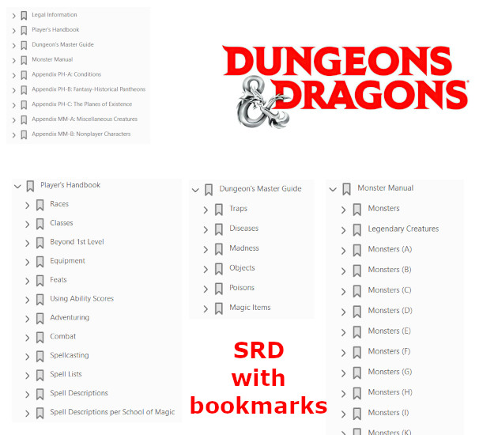

---
tags:
    - Basic Roleplaying System
    - Chaosium
    - D&D
    - Wizards of the Coast
---

# Du SRD, de l'OGL et de l'ORC !

Hello et bienvenue aux égarés qui regardent parfois cette page !

A l'orée de ce printemps 2024, je me résous à faire une petite bafouille. Je ne parlerai pas du contexte politique intérieur ni extérieur de la France. Mais plutôt de mes activités rôlistes, pour ceux que ça intéresse.

## Le plus récent : D&D SRD avec bookmarks en français en anglais

Bon, certes WotC a publié des documents SRDs en anglais et en français, mais les bookmarks ne sont soit pas là, soit en vrac. J'ai corrigé cela avec une petite publication [itch.io](https://rouboudou.itch.io) :

* Un [PDF en anglais](https://rouboudou.itch.io/dd-srd-51-pdf-with-full-bookmarks) avec tous les bookmarks,
* Un [PDF en français](https://rouboudou.itch.io/dd-srd-51-pdf-with-full-bookmarks) avec les bookmarks réarrangés.

En fait, en regardant sur [drivethru](URL), des gens font payer le positionnement de bookmarks sur les documents originaux Wizards. C'est certain que cela représente un certain travail. Mais, comme le contenu (assez important voire énorme) est gratuit, je trouve ça un peu mesquin de faire payer les bookmarks, même si sans bookmarks, c'est chiant de naviguer dans les PDFs.

Bon, enfin, vous avez un truc exploitable pour mobile et tablette.

## Le SRD de D&D 5e

Bon, disons-le, c'est un bouquin de bonne facture :

* +400 pages de trucs, dont tout ce qu'il faut pour joueur à D&D 5e en anglais et en français ;
* Les règles et beaucoup de contenu ;
* Une traduction pas trop nase et "officielle".

Encore une fois, je tire mon chapeau à WotC, même si c'est une société américaine avec ses gros défauts. Il faut saluer quand même cette volonté de donner à la communauté. Les joueurs ne se souviennent pas (ou n'étaient pas nés), mais c'est pas TSR qui aurait fait ça ! Et en plus, ils livrent +400 Pages en français sans que des gros vilains comme les *BBE* viennent vous soutirer des sous.

Oui, je n'aime pas les *BBE*. Ils ne rappellent la mafia de *Casus* qui faisait la pluie et le beau temps dans le monde rôlistes des années 80 avec leur ton pourri ironique des *"mecs qui n'assument pas de jouer au JdR et qui doivent absolument tourner tout en dérision"*. Heureusement, Descartes était un peu à l'écart de cette mafia de copains qui, à la française, avait créé un genre de sectes de copinage où certains en "croquaient" et d'autres non... Beurk...

Pas du tout l'esprit *Jeux et Stratégies*. C'est pourquoi je m'enorgueillis de ne pas avoir un seul BBE dans ma bibliothèque ! Quand je pense à ce qu'ils ont voulu faire à WotC avec leur [plagiat honteux](https://black-book-editions.fr/actualite.php?id=3187), je ne suis pas surpris.

Bon, enfin, c'est ma compréhension de l'incident. Critiquez les méchants WotC, bonnes gens, mais regardez dans les faits ceux qui mettent à disposition des contenus très épais gratuitement, avec des règles pour faire vos propres produits...

## La licence ORC

Certaines boutiques contestant la licence OGL dans le monde du JdR, Paizo et Chaosium, entre autres, se sont alliées pour créer une autre licence : ORC. Intéressant.

La licence définit essentiellement les contours entre trois types de contenus :

1. Le contenu sur lequel il n'est pas possible de mettre un copyright (pour faire simple les règles) ;
2. Le contenu protégé (*Reserved Material*) qu'il n'est pas possible de copier sans l'autorisation des auteurs ;
3. Le contenu "ouvert" (*License Material*) dont il est possible de dériver des choses.

Par défaut :

* Tout ce qui est règles du jeu (au sens large) est public ;
* Tout ce qui est lié à des lieux, des personnages, etc. est "privé" ; il faut donc spécifier ce que la licence couvre pour "ouvrir son contenu en open source".

Ce qui est assez novateur dans ce mode de licence, est de tenter de vraiment faire la part des choses entre les trois types de contenus et de prendre pour base la jurisprudence américaine qui dit que *les règles de jeu ne peuvent pas donner lieu à un dépôt de copyright*. Cette affirmation est une vérité, mais le fait de la postuler change un peu la donne et cela dans deux dimensions :

* N'importe qui peu faire une extension pour un système de jeu X ou Y sans voir à payer de royalties. Les royalties peuvent s'expliquer dans le cadre de l'utilisation d'une *marque* mais pas dans l'utilisation d'une mécanique de jeu.
* La licence ORC définit une filiation : si vous dérivez de nos règles de jeu, alors vous acceptez obligatoirement de donner vos innovations de mécaniques à la communauté des designers œuvrant dans le même système de jeu.

Le premier point précise la logique de WotC dans la mesure où n'importe qui peut se déclarer compatible avec 5e sans mettre un logo. Le second indique que les mécaniques de jeu, une fois leur filiation déclarée, doivent rendre leu innovations "ouvertes". Cela concerne les sorts, les monstres et les objets magiques, mais pas leur filiation avec des noms propres (voir [ORC AxE](https://www.chaosium.com/content/orclicense/ORC_AxE_FINAL.pdf)).

Ce qui est drôle est que, si l'on y regarde de plus près, le SRD de D&D 5e est totalement dans la ligne de la licence ORC (bien que ce contenu ait été publié sous les licences OGL et CC 4.0) : les sorts et les objets magiques ont perdu leurs noms propres pour devenir des "mécaniques".

## Un champ d'opportunités ?

Cette innovation de licence est très intéressante dans la mesure où :

* Elle affirme haut et fort que les mécanismes de jeu ne sont pas "patentables" et qu'ils appartiennent à la communauté, eux ainsi que tous leurs dérivés et enfants ;
* Elle pérennise l'ouverture du contenu en permettant aux auteurs de protéger un contenu (proche de celui du droit d'auteur) ainsi que de le donner à la communauté s'ils le souhaitent.

Dans ce sens, on peut dire que cette licence ORC est un "OGL 2.0".

Une question alors : combien de temps faudra-t-il à WotC pour adopter la licence ORC (ou créer son clone) ?

## Ouverture de BRP 5e en ORC

Bon alors, évidemment, Chaosium s'est engouffrée  dans le sujet ORC et a publié quasiment toute la 5e de Basic RolePlaying (BRP) system en ORC (et en RTF modifiable en plus, petit message adressé à WotC en passant, ces derniers ne fournissant que du PDF pénible à retraiter).

Ne cachons pas notre plaisir, je suis content ! BRP est un des systèmes que j'aime le plus et je suis content de pouvoir imaginer de pouvoir créer un univers BRP "vendable" au travers de cette licence (même si je ne le ferai sans doute jamais). A première vue, la licence ORC a décoincé nos amis de Chaosium qui mettaient, du temps de la 4e, des contraintes fortes à l'utilisation du système de jeu BRP.

Il faut que je regarde ce que fait Paizo dans le domaine.

Tout cela va dans le bon sens...

17 mars 2024

