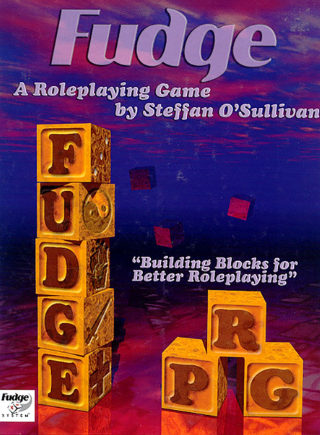

---
tags:
    - Basic Roleplaying System
    - Call of Cthulhu
    - Cepheus
    - Cypher
    - D&D
    - Empire Galactique
    - FU
    - Fudge
    - Games Workshop
    - GURPS
    - Mega
    - Mongoose
    - Risus
    - Space Opera
    - Traveller
    - Warhammer
---

# Cypher : à éviter

On dit souvent qu'on ne peut pas être bon en tout. S'il est bon en création d'univers et d'aventures, Monte Cook ne semble pas bon en *game design*. C'est dommage mais cela semble un fait incontestable.

Si la mécanique de base ressemble à *D&D* (1d20 + modificateurs contre une difficulté), tout est plus compliqué et confus.

## Une création des PJ confuse

La création des persos tout d'abord. Cela part d'un postulat un peu simpliste : "I am an *adjective noun* that *verbs*", avec :

* Le nom représentant la classe/le type de PJ (tous univers),
* L'adjectif qui est le "descriptor" du PJ (tous univers),
* Le verbe qui est un peu son point fort (spécifique au genre), le "focus".

J'avoue que représenter tous les types de personnages dans tous les univers par quatre pauvres classes/types de personnages est réellement étouffant, surtout si l'on considère que le Warrior et l'Explorer ont quand même beaucoup en commun (1 seul point de différence sur les scores par défaut !).

J'ai fait une petite table dans [cet article](https://github.com/orey/ttrpg/tree/master/Cypher).

| Stat /character Type | Warrior (Might) | Warrior (Speed) | Adept       | Explorer | Speaker     |
|----------------------|-----------------|-----------------|-------------|----------|-------------|
| Might                | 10              | 10              | 7           | 10       | 8           |
| Speed                | 10              | 10              | 9           | 9        | 9           |
| Intellect            | 8               | 8               | 12          | 9        | 11          |
| Points to assign     | +6              | +6              | +6          | +6       | +6          |
| Effort Tier 1        | 1               | 1               | 1           | 1        | 1           |
| Edge Tier 1          | Might 1         | Speed 1         | Intellect 1 | Might 1  | Intellect 1 |

Si l'on regarde d'autres systèmes génériques, que ce soit *GURPS* ou *Basic Roleplaying*, on ne sent pas cet espace aussi restreint. Même dans le SRD de *D&D* 5e, nous avons 12 classes de personnages, juste pour faire du *D&D* ! Là, quatre classes de personnages dont deux sont presqu'identiques.

Ensuite, le fait que les PJs n'aient que 3 caractéristiques (Might, Speed, Intellect) renforce ce sentiment de ne pas avoir beaucoup de choix. Dans les JDR génériques disponibles, les caractéristiques sont plus étendes, notamment *D&D* (6) et *Basic Roleplaying* (7 voire 8 avec avec la SAN). Même GURPS en a 4 de base et quelques unes dérivées.

En plus, tout est très rigide. Les types de personnages n'offrent pas beaucoup de choix dans leur développement qui est souvent très tactique, beaucoup plus que les avantages des classes de *D&D*.

La partie Descriptor me met particulièrement en colère. Quand on vit dans le monde des JDR, on ne peut pas ne pas connaître *Risus* (1993), *Fudge* (1995) ou même *FU* (2010).

Dans ces trois exemples de jeux, les descriptors sont plus ou moins libres et donnent l'occasion d'une discussion avec le MJ pour bénéficier des bonus dus au descriptors.

Mais dans Cypher, les descriptors sont imposés, et ils apportent leur lot d'Abilities (des Skills, des Avantages, des augmentations de pools, des Pouvoirs, etc.) alors même que le joueur a fait des choix structurants dans la partie Type de personnage. Difficile donc d'être cohérent. Il faut revenir en arrière aux abilities liées au type de PJ.

Ne vous inquiétez pas, Monte nous refait le coup une seconde fois ! Hé oui, car il faut maintenant choisir le Focus qui lui aussi apporte son lot d'Abilities. Et donc tout est à recommencer.

Et je n'aime pas les descriptors imposés. Soit, les descriptors sont liés à du roleplay, souvent pour gagner un avantage quand ces derniers sont applicables, soit il faut utiliser des quantifications.

Oui alors, OK, Monte ne voulait pas faire comme les autres, et notamment il ne voulait pas que la création de personnage soit "habituelle" : caractéristiques, puis compétences, puis talents, puis sorts ou psioniques.

Il n'empêche que la promesse initiale d'avoir une création de PJ facile est, opérationnellement, ratée.

## Des règles étrangement compliquées

Il faut aussi comprendre les pools et le rôle de l'Effort qui est en fait un bonus caché : l'Effort diminue la difficulté de 1 et donc octroie un genre de bonus de +3 au d20. Comme le PJ doit diminuer la difficulté (je reviendrai sur ce point) plutôt qu'augmenter ses modificateurs, la mécanique est inversée.

En plus, elle introduit une notion de gestion des "ressources" car les pools ont aussi un genre de rôle de points de vie mélangés avec des points de magie, sachant qu'on a quand même une jauge de blessures... Ouah, pas facile à capter tout ça.

On notera que les pools ne sont pas des pools de dés, mais des pools de points qui sont consommés lors de l'utilisation de certains avantages (abilities)... Bof.

## Diminuer la difficulté

Alors que nous sommes dans un système de type d20 + modificateurs contre une difficulté, toute une partie des règles vise à *diminuer la difficulté*. Ce n'est pas facilement jouable, car la difficulté est donnée par le MJ et doit être modifiée par les joueurs...

C'est très contre-intuitif car, sans être un fan absolu de *D&D*, dans 5e, les joueurs empilent les bonus mais la difficulté de l'action est *absolue*, elle n'est pas relative aux joueurs.

En plus, les difficultés vont par palier de 3, ce qui ne facilite pas les choses (alors que les bonus de D&D sont souvent sur des paliers de 2, ce qui est plus facile à compter).

Plus d'informations sur [github.com/orey/ttrpg/Cypher](https://github.com/orey/ttrpg/tree/master/Cypher).

## L'intrusion du MJ

Alors là, je dois être stupide mais je n'ai pas compris : le MJ est toujours "intrusif" dans la mesure où il gère l'univers et le comportement des PNJ.

La première excuse pour cette mécanique est que les joueurs font tous les jets. En fait, ce n'est pas vrai. De ce que j'ai compris les joueurs font tous les jets *durant le combat* mais ils n'ont pas à faire tous les jets relatifs aux comportements des PNJ, c'est absurde. Les PNJ vont donc se comporter comme le veut le MJ.

L'intervention est présentée comme apportant une complication, complication qui doit être payée par un point d'expérience du MJ envers le joueur.

On continue dans la confusion totale : quelle expérience a été gagnée par le joueur ? Aucune. Est-ce que ce dernier a fait une action héroïque de sorte qu'on le gratifie d'un point de chance/de héros/ de destin/ de force ? Non.

> This means that the GM uses experience points as a narrative tool. Whenever it seems appropriate, he can introduce complications into the game that affect a specific player, but when he does so, he gives that player 1 XP.

C'est grotesque.

Et d'abord, comment le MJ sait qu'il est intrusif et non qu'il joue le scénario prévu ? Il se peut qu'une complication soit prévue dans la scène, c'est même généralement le cas. Alors les joueurs vont pleurer pour avoir des points d'expérience parce que le MJ apporte des complications ? C'est débile.

Cerise sur le gâteau, le joueur peut refuser l'intrusion en perdant un point d'expérience. Monte indique que c'est peu probable parce que les joueurs ne veulentAn example frequently used in the Numenera rulebook is the appearance of unexpected reinforcements: The GM uses an intrusion and two more chirogs drop out of the leafy canopy above you!

Let’s break down the options here:

The GM could decide NOT to have any reinforcements up.
The GM could decide that the two chirogs are DEFINITELY there and the players have no say about it.
The GM could decide that the two chirogs MIGHT be there and use a GM intrusion to negotiate their arrival with the players.
A purely traditional RPG only offers the first two options (and those options still exist in Numenera); but the intrusion mechanic offers the third. sans doute pas perdre leurs points. Et donc quoi ? Qu'est-ce qui se passe ?

Parce que si le jeu était narrativiste, ce serait le joueur qui raconterait comment se déroulent les événements. Mais là, non, il ne fait que choisir, en mode meta-gaming, une option ou une autre.

Même les exemples de Monte sont foireux :

> GM intrusion is a way to facilitate what goes on in the world outside the characters. Can the minotaur track the PCs’ movements through the maze? Will the fraying rope hold?

Pour moi, nous sommes dans du GMing de base.

> Say the PCs find a hidden console with some buttons. They learn the right order in which to press the buttons, and a section of the floor disappears. As the GM, you don’t ask the players specifically where their characters are standing. Instead, you give a player 1 XP and say, “Unfortunately, you’re standing directly over this new hole in the floor.” If he wanted, the player could refuse the XP, spend one of his own, and say, “I leap aside to safety.” Most likely, though, he’ll make the defense roll that you call for and let it play out.

Donc quoi, pour chaque scène où il y des complications, pour que les joueurs daignent les accepter, on leur donne des cookies ?

> There are two ways for the GM to handle this kind of intrusion. You could say, “You’re standing in the wrong place, so make a roll.” (It’s a Speed defense roll, of course.) Alternatively, you could say, “You’re standing in the wrong place. The floor opens under your feet, and you fall down into the darkness.” In the first example, the PC has a chance to save himself. In the second example, he doesn’t. Both are viable options. The distinction is based on any number of factors, including the situation, the characters involved, and the needs of the story. This might seem arbitrary or even capricious, but you’re the master of what the intrusion can and can’t do. RPG mechanics need consistency so players can make intelligent decisions based on how they understand the world to work. But they’ll never base their decisions on GM intrusions. They don’t know when intrusions will happen or what form they will take. GM intrusions are the unpredictable and strange twists of fate that affect a person’s life every day.

Je ne comprends rien à ce long blabla général et surtout, je ne vois pas ce que ça apporte (à part filer des récompenses aux joueurs pour qu'ils acceptent les problèmes).

Le fait est qu'il y a d'autres moyens que le méta-gaming pour avoir des surprises dans l'intrigue.

> When player modifications (such as skill, Effort, and so on) determine that success is automatic, the GM can use GM intrusion to negate the automatic success. The player must roll for the action at its original difficulty level or target number 20, whichever is lower.

Oui, mais on peut aussi le faire avec un malus circonstanciel qui justifie que l'action ne soit pas automatique. Comme c'est le MJ qui décide du malus, qu'est-ce que ça change ?

Quelle usine à gaz pour rien ! Sans compter que cela rajoute un aspect grippe-sous chez les joueurs qui doivent attendre avec avidité toutes les interventions négatives du MJ en disant que c'est une intrusion.

J'ai lu l'article sur [The Alexandrian](https://thealexandrian.net/wordpress/35499/roleplaying-games/numenera-the-art-of-gm-intrusions) sur les GM intrusions, mais je ne suis pas convaincu.

La plupart des jeux proposent des mécaniques de complications suite à des échecs critiques. Si vous jouez à *AD&D* 1e, vous savez que Gygax avait de nombreuses tables aléatoires à tiroirs pour apporter un peu de surprise dans les scénarios, que ce soit aux joueurs ou au MD.

Voici un exemple pris sur The Alexandrian :

> An example frequently used in the Numenera rulebook is the appearance of unexpected reinforcements: The GM uses an intrusion and two more chirogs drop out of the leafy canopy above you!

> Let’s break down the options here:

> -The GM could decide NOT to have any reinforcements up.

> -The GM could decide that the two chirogs are DEFINITELY there and the players have no say about it.

> -The GM could decide that the two chirogs MIGHT be there and use a GM intrusion to negotiate their arrival with the players.

> A purely traditional RPG only offers the first two options (and those options still exist in Numenera); but the intrusion mechanic offers the third.

Mais pas du tout. Dans beaucoup de scénarios, le MJ a une table des rencontres ou il a un certain pourcentage de chances que les choses se passent. S'il juge même à la volée, en fonction de la tension autour de la table, il n'interrompt pas le jeu pour laisser voir la mécanique et casser l'ambiance.

Peut-être ai-je trop joué à *CoC* mais je ne me vois pas du tout faire ça quand l'ambiance est installée. De plus, je trouve cela très prétentieux de la part du MJ, car les joueurs, normalement, dans le monde du JDR, font ce qu'ils veulent. Ils ont donc de multiples occasions de créer de la surprise et de solliciter la créativité du MJ (sauf dans un donjon super cadré bien sûr).

Un autre exemple pris par The Alexandrian est d'utiliser cette mécanique pour compenser les défaillances des règles. Là, les bras m'en tombent. Comme si le MJ ne pouvait pas gérer ça sans meta-gaming.

Une chose est certaine : le méta-gaming n'est vraiment pas mon truc. Tout comme les jeux type PbtA. *I'm too old for this shit*.

## Caricature et assemblage de trucs à la mode (de l'époque)

On n'a pas de système de magie, pas de système psionique, les univers sont décrits en 8 pages tout au plus (urg!) et le reste est finalement aride comme le système lui-même. C'est une vraie caricature de système, un bric à brac qui ne donne pas envie et ne fait pas rêver.

Sans compter que le tout n'est pas simple du tout au final, car il faut prendre en compte plein de choses pour jouer.

En fait, cela sent un peu l'assemblage de trucs éparses, de machins à la mode bricolés. Il ne manque que les pools de dés 6 et je pense qu'on a tout.

J'ai dû refaire des tables qui manquent pour jouer ou créer les personnages (qui se ressemblent énormément), car le contenu de ces tables est décrit dans le texte. Le jeu a beau avoir un SRD, si on regarde en arrière, presque dix ans après sa sortie, c'est un bide. Et, malheureusement, c'est mérité.

Je cherchais un système générique et je ne choisirai pas Cypher. Autant prendre la base de *D&D*, de *GURPS*, de *Basic RP* ou même de *Risus* et bricoler un truc.

Je ne sais pas ce que vaut *Numenera* ou *The Strange*, mais pour ma part, je passe à autre chose et oublie ce machin complètement nase.

Note : je n'ai que la première édition de 2015 entre les mains et je ne sais pas si la seconde a été modifiée ou pas, mais si j'en juge au SRD, pas tellement.

Lien : The Alexandrian

8 mai 2024

# Traveller, Cepheus et tutti quanti

## Traveller, l'original

Je ne suis pas un fan de *Traveller*, ni un connaisseur à vrai dire. A l'époque, nous jouions plutôt à *Space Opera* ou à *Méga 2*. Certaines de mes connaissances étaient plutôt dans *Empire Galactique* qui est un jeu pas mal dans sa première version.

Deux ou trois trucs étaient sympas dans les règles, de mémoire :

* Le système de codage de personnage avec des caractéristiques en hexadécimal,
* Le système d'expérience qui permettait de faire jouer des personnages expérimentés dès le début du scénario.

A l'époque, il n'y avait pas de pouvoirs psioniques, ce qui, pour moi, était vraiment compliqué, ce sujet étant bien développé dans *Space Opera* et dans *Méga*.

En décembre 2021, Games Workshop a rendu [gratuit les 3 premiers livres](https://preview.drivethrurpg.com/en/product/355200/Classic-Traveller-Facsimile-Edition) du *Classic Traveller* de 1977 en mode OCR sur DriveThru. Si vous ne les avez pas, c'est un must.

A cette occasion, je me suis fait un petit print Lulu, mais j'avoue ne pas avoir lu entièrement les livres.

Il y a un côté amusant à avoir une repro des JDR de l'époque. Je sais que [certains sont passés maîtres](http://la-forge-de-papier.over-blog.com) dans l'art de la restauration et de la reproduction. C'est mon côté "papier". Même si j'ai récemment acheté les PDF de la v4 de *Warhammer*, je suis moins à l'aise sur les tablettes qu'avec des choses tangibles.

Pour en revenir à Games Workshop, l'éditeur de jeux gardera la licence jusqu'à 1995 environ puis cette dernière changera de mains, en passant par GURPS, pour arriver jusqu'à Mongoose.

## Le SRD de Traveller version Mongoose

En 2008, Mongoose publie sa première version de Traveller, ainsi qu'un SRD dont voici les versions [PDF](../files/divers/Mongoose_Traveller_-_SRD_(v1.0).pdf) et [Word](../files/divers/Traveller_SRD_v1.0.doc) originales (on trouve le contenu sur pas mal de sites mais le PDF original n'est pas présent partout).

C'est une version épurée du jeu mais avec, à ma grande surprise, des pouvoirs psioniques.

Note : on notera l'immense stupidité d'avoir inclus la licence OGL V1.0a de WotC à la fin du SRD de *Traveller*. *Traveller* n'a rien à voir avec WotC et il n'est pas besoin de "se couvrir" sous la licence bidon WotC pour pouvoir reprendre les règles d'un jeu de 1977. C'est juste la loi américaine sur le copyright (voir mon article sur le sujet des [licences dans le JDR](../pages/licences.md)).

Parfois, l'aspect moutonnier du monde du JDR est impressionnant. Pour des gens qui passent une grosse partie de leur vie à écrire des règles du jeu, ne pas avoir compris les règles de la loi américaine sur le copyright, alors que cette connaissance est au cœur de leur business, est pour moi une énigme.

## 2016 : arrivée du Cepheus engine

Le *Cepheus* engine est une version étendue du moteur de *Traveller*. Il est [disponible en ligne](https://www.orffenspace.com/cepheus-srd/) gratuitement depuis pas mal de temps. Le document est aussi sur [DriveThru](https://preview.drivethrurpg.com/en/product/186894/Cepheus-Engine-System-Reference-Document) en "pay what you want".

Voir l'[analyse de licence CSL](../pages/licences.md#rapide-analyse-de-la-licence-cepheus-engine).

## Traduction française

Le SRD de Cepheus a été traduit en français par Jack C. Munchkin, un passionné de *Traveller*, en 2022. Voici les liens :

* La [page expliquant tout](https://oldschoolnostalgia.wordpress.com/cepheus/),
* Le [PDF du SRD en français](https://oldschoolnostalgia.files.wordpress.com/2023/02/cepheus-srd-vf.pdf).

07 avril 2024

