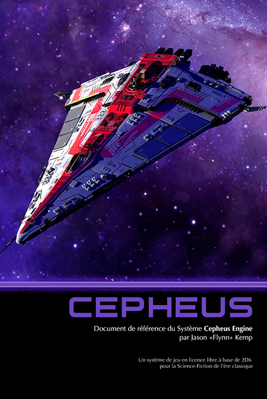

---
tags:
    - Cepheus
    - Cypher
    - Empire Galactique
    - Games Workshop
    - GURPS
    - Mega
    - Mongoose
    - Space Opera
    - Traveller
    - Warhammer
---

# Traveller, Cepheus et tutti quanti

## Traveller, l'original

Je ne suis pas un fan de *Traveller*, ni un connaisseur à vrai dire. A l'époque, nous jouions plutôt à *Space Opera* ou à *Méga 2*. Certaines de mes connaissances étaient plutôt dans *Empire Galactique* qui est un jeu pas mal dans sa première version.

Deux ou trois trucs étaient sympas dans les règles, de mémoire :

* Le système de codage de personnage avec des caractéristiques en hexadécimal,
* Le système d'expérience qui permettait de faire jouer des personnages expérimentés dès le début du scénario.

A l'époque, il n'y avait pas de pouvoirs psioniques, ce qui, pour moi, était vraiment compliqué, ce sujet étant bien développé dans *Space Opera* et dans *Méga*.

En décembre 2021, Games Workshop a rendu [gratuit les 3 premiers livres](https://preview.drivethrurpg.com/en/product/355200/Classic-Traveller-Facsimile-Edition) du *Classic Traveller* de 1977 en mode OCR sur DriveThru. Si vous ne les avez pas, c'est un must.

A cette occasion, je me suis fait un petit print Lulu, mais j'avoue ne pas avoir lu entièrement les livres.

Il y a un côté amusant à avoir une repro des JDR de l'époque. Je sais que [certains sont passés maîtres](http://la-forge-de-papier.over-blog.com) dans l'art de la restauration et de la reproduction. C'est mon côté "papier". Même si j'ai récemment acheté les PDF de la v4 de *Warhammer*, je suis moins à l'aise sur les tablettes qu'avec des choses tangibles.

Pour en revenir à Games Workshop, l'éditeur de jeux gardera la licence jusqu'à 1995 environ puis cette dernière changera de mains, en passant par GURPS, pour arriver jusqu'à Mongoose.

## Le SRD de Traveller version Mongoose

En 2008, Mongoose publie sa première version de Traveller, ainsi qu'un SRD dont voici les versions [PDF](../files/divers/Mongoose_Traveller_-_SRD_(v1.0).pdf) et [Word](../files/divers/Traveller_SRD_v1.0.doc) originales (on trouve le contenu sur pas mal de sites mais le PDF original n'est pas présent partout).

C'est une version épurée du jeu mais avec, à ma grande surprise, des pouvoirs psioniques.

Note : on notera l'immense stupidité d'avoir inclus la licence OGL V1.0a de WotC à la fin du SRD de *Traveller*. *Traveller* n'a rien à voir avec WotC et il n'est pas besoin de "se couvrir" sous la licence bidon WotC pour pouvoir reprendre les règles d'un jeu de 1977. C'est juste la loi américaine sur le copyright (voir mon article sur le sujet des [licences dans le JDR](../pages/licences.md)).

Parfois, l'aspect moutonnier du monde du JDR est impressionnant. Pour des gens qui passent une grosse partie de leur vie à écrire des règles du jeu, ne pas avoir compris les règles de la loi américaine sur le copyright, alors que cette connaissance est au cœur de leur business, est pour moi une énigme.

## 2016 : arrivée du Cepheus engine

Le *Cepheus* engine est une version étendue du moteur de *Traveller*. Il est [disponible en ligne](https://www.orffenspace.com/cepheus-srd/) gratuitement depuis pas mal de temps. Le document est aussi sur [DriveThru](https://preview.drivethrurpg.com/en/product/186894/Cepheus-Engine-System-Reference-Document) en "pay what you want".

Voir l'[analyse de licence CSL](../pages/licences.md#rapide-analyse-de-la-licence-cepheus-engine).

## Traduction française

Le SRD de Cepheus a été traduit en français par Jack C. Munchkin, un passionné de *Traveller*, en 2022. Voici les liens :

* La [page expliquant tout](https://oldschoolnostalgia.wordpress.com/cepheus/),
* Le [PDF du SRD en français](https://oldschoolnostalgia.files.wordpress.com/2023/02/cepheus-srd-vf.pdf).

07 avril 2024

