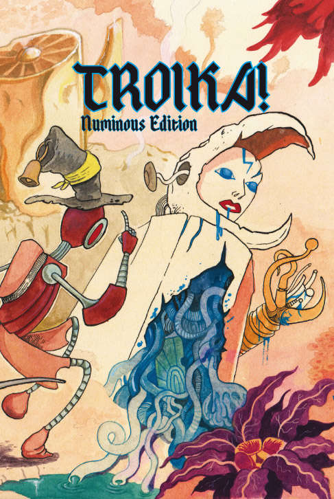

---
tags:
    - Basic Roleplaying System
    - D&D
    - D6 System
    - Star Wars
    - Troika
---

# A propos du lien Classe d'Armure et D20

## La CA, un concept composite

Je me suis souvent demandé quelle était le concept derrière la classe d'Armure de D&D, AC en français et CA en anglais. Mais, depuis quelques temps, à l'occasion de la finalisation de la traduction de Troika!, je me suis posé des questions de *game design*, j'ai lu pas mal de choses et les choses se sont éclairées.

(En fait, la traduction est terminée depuis longtemps, elle n'a pas été faite par une IA, mais j'avais encore quelques retouches à faire et je ne trouve pas le temps de la finaliser.)

Je faisais des recherches sur les systèmes D6. J'ai déjà pas mal écrit sur ces sujets dans ces pages (sur les [systèmes](../pages/D6-systems.md), sur le [combat](../pages/D6-Combat.md) et sur les [seuils de difficulté](../pages/D6-TargetNumber.md)).

Le premier doute que j'ai eu était relatif au système de combat de Risus, système dans lequel des clichés en nombre de D6 peuvent s'affronter. Il s'avère qu'un décalage de 1D, par exemple un cliché à 3D contre un cliché à 4D, génère des probabilités très peu en faveur du cliché le plus faible. J'avais déjà remarqué ça dans le système D6, et dans Star Wars, il y a des années. Un décalage faible dans la mesure des compétences implique une différence de probabilités forte dans le jeu, ce qui pose un problème d'équilibre.

Ces réflexions m'ont mené récemment vers la notion de CA de D&D. En effet, dans D&D, l'attaquant ne fait pas de duel mais joue contre un facteur de difficulté fixe, la CA. Outre le fait que le jeu soit plus rapide, cette CA cumule plusieurs concepts :

* L'armure et les boucliers,
* La dextérité et donc la capacité à être touché (sous-entendu les esquives et parades),
* Les diverses protections supplémentaires, notamment magiques,
* Les circonstances du combat (dans AD&D 1e, la CA du bouclier (+1) ne compte que si le PJ fait face à l'adversaire).

Lorsque le jet de D20 est supérieur ou égal à la CA, l'adversaire prend des dommages et perd des points de vie (PdV).

Il faut noter que, même au premier niveau, les personnages peuvent blesser des monstres très puissants, car la CA est en quelque sorte "bornée" et les règles suivantes sont appliquées :

* Une CA de 20 est atteignable par tous et peu de monstres dépassent la CA de 20 ;
* Un monstre est difficile à tuer s'il a une haute CA (dans D&D 5e) et s'il a beaucoup de PdV.

Ainsi la CA va avec la progression des PdV, ce qui est vrai pour les monstres mais aussi pour les PJs. D'où les niveaux.

Même s'il n'a pas pour but d'être simulationniste, mais plutôt logique et efficace, le concept de CA a été beaucoup décrié, si bien qu'il n'est pas très courant de le voir implémenté dans des jeux plus récents. Pourtant, il perdure et je vais donner une possible explication quant à sa durée de vie exceptionnelle.

## Deux types de combats

Dans D&D, l'attaque dans le combat est résolue en *un seul jet* : 1D20 + modificateurs contre la CA. C'est une mécanique de seuil. Ce seuil est la plupart du temps statique, la CA étant notée sur la feuille de personnage.

La plupart des autres jeux vont proposer *deux jets*, un pour l'attaquant et un pour le défenseur. Dans la plupart de ces systèmes, le vainqueur de l'attaque inflige des dommages au vaincu et ce dernier subit une perte de PdV qui est tempérée par l'armure qu'il porte, armure qui absorbe tout ou partie de la perte.

Les jeux proposant cette mécanique de "duel" sont souvent plus compliqués, plus lourds, et plus meurtriers :

* Plus compliqués d'abord parce qu'en plus des deux jets et du décompte complexe de PdV, les concepteurs rajoutent souvent des fioritures simulationnistes (parade, esquive, localisation des blessures, armures localisées sur le personnage, armures ayant aussi des PdV et étant abîmées par des coups absorbés, armures au potentiel de protection représenté par des jets de dés, etc.) ;
* Plus lourds, parce qu'au final, le combat interrompt le jeu plus longtemps et tous les joueurs ne sont pas forcément passionnés par ces phases (même si les MJs le sont) ;
* Plus meurtriers car pouvant cumuler une réussite critique chez l'attaquant avec un échec critique chez le défenseur, ce qui peut occasionner la mort instantanée d'un PJ, résultat d'une action purement aléatoire.

La létalité des combats est adaptée  un certain type de jeu et de joueurs, mais force est de constater que la mort d'un PJ due uniquement à l'aléa a quelque chose d'anti-jeu-de-rôles, car elle ne résulte pas de l'action directe des PJs. Ou plutôt, elle va décourager les combats et donc être adaptée à des jeux plus modernes où les combats faciaux sont létaux, mais pas à des mondes de *high fantasy*.

## Deux types de systèmes de magie

Nous pouvons constater le même type de dichotomie avec les systèmes de magie. Dans D&D, le magicien lance un certain nombre de sorts par jour, mais il ne lance pas les dés pour les lancer : le succès est automatique. Le défenseur fait, lui, un jet de sauvegarde contre le niveau magique du magicien et du sort. C'est encore une mécanique de seuil à simple jet.

Dans la plupart des autres jeux, nous avons deux jets : le magicien doit réussir son jet pour réussir son sort, et le défenseur peut faire aussi un jet de sauvegarde. C'est le cas de la plupart de systèmes de magie de BRP. Les chances de réussite sont donc très amoindries, et il reste frustrant pour le joueur d'échouer sur un sort basique alors qu'il possède 75% de chances de réussite. C'est encore une mécanique de duel à deux jets.

## CA et D20

D&D est donc bien un jeu plus simple et plus efficace que les jeux implémentant un double jet, moins simulationniste et plus adapté à de la *high fantasy*.

Pour en revenir à la CA, dans la mesure où le jeu rend la plupart des monstres "atteignables" à tous les joueurs de tous les niveaux en raison de leur CA ne dépassant qu'exceptionnellement 20 (un jet de 20 en attaque a 5% de chances de se produire, cela sans compter les bonus divers), il est donc requis que la chance de toucher un monstre ayant une CA de 20, ne soit pas nulle.

Or, si nous voulons atteindre un seuil S avec de multiples D6, comme 3D6 pour atteindre S=18, il est nécessaire de considérer l'effet courbe en cloche des probabilités. Pour avoir 5% de chances d'atteindre ou de dépasser un seuil S le plus élevé possible avec 3D6, il faut S=16. Avec 2D6, nous n'avons pas cette finesse : moins de 3% de chances de faire 12 et plus de 8% de chances de faire 11 ou plus.

Force est de constater qu'introduire de l'aléa avec les dés polyédriques classiques (D6, D8, D10, D12, D20) dans le but de dépasser un seuil S avec environ 5% de chances de réussite, la linéarité des probabilités du D20 (5% à chaque pas) l'assure. Elle permet de garantir que les PJs de bas niveau pourront toucher des CA élevées et porter des dommages, et donc contribuer à un combat contre un adversaire très puissant, tout comme les PJs de haut niveau.

La mécanique D20 + CA est donc à la fois efficace, robuste car fonctionnant avec tous les niveaux, et au final amusante, car elle n'exclue pas les joueurs de faible niveau.

## Introduire la CA dans des jeux à duels ?

Dans les [jeux de la gamme D6](https://ogc.rpglibrary.org/index.php?title=OpenD6), les choses ne sont pas simples, ne serait-ce que parce la probabilité de faire des grands chiffres est faible (courbe en cloche).

Cela ouvre aussi une perspective un peu différente sur l'immense littérature "D20" qui a été générée après la sortie de la première licence OGL, et le fait que beaucoup de jeux aux règles différentes ont fait une version D20. Il faudrait prendre le temps de comparer avec les systèmes d'origine.

09 mars 2025

