---
tags:
    - Alternity
    - Basic Fantasy RPG
    - Basic Roleplaying System
    - Black Hack
    - Black Sword Hack
    - Cairn
    - Castles & Crusades
    - Chaosium
    - D6 System
    - D20 System
    - D&D
    - DCC
    - Index Card
    - Into the Odd
    - Knave
    - Microlite
    - Mörk Borg
    - Old-School Essentials
    - OSRIC
    - Searchers of the Unknown
    - Shadowdark
    - Swords & Wizardry
    - The Power
    - Troika
    - Whitehack
    - Wizards of the Coast
---

# A propos de la deuxième vague de l'OSR

On a souvent l'habitue de considérer que ce qui est écrit en anglais est bien meilleur que ce qui écrit en français, d'où l'écrasement que nous subissons de la part des JDR américains, anglais, voire nordiques. Hé bien, ms amis, je vais mettre les pieds dans le plat, mais la deuxième vague de l'OSR, j'ai comme l'impression que c'est de la grosse daube.

## C'est quoi la première vague ?

Tout d'abord OSR signifie : *Old-School Revival* ou *Old School Renaissance*.

Quand WotC sort sa [licence OGL](../pages/licences.md), l'édition 3e de D&D ne plaît pas à tous. Cette licence permet à de nombreux auteurs de se lancer dans la constitution de jeux utilisant des mécaniques de jeu liées à *D&D* ou à *AD&D* et à rechercher le "feeling" des premières éditions, tout cela sans payer de droits, ni être approuvé par WotC.

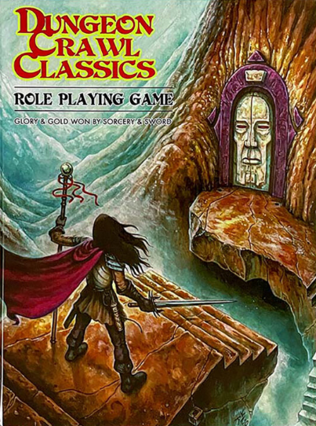

Nous pouvons diviser ces initiatives en deux types :

* Des "rétro-clones" de *D&D* ou de *AD&D*,
* Des variations basées sur des anciennes versions de *D&D* et/ou *AD&D*.

Je vais citer les plus grands noms de l'OSR, dont la plupart commencent par des éditions gratuites avant de tenter de monétiser leur travail.

| Jeu                    | Type         | Inspiré par | Date de publication |
|------------------------|--------------|-------------|---------------------|
| Castles & Crusades     | Variation    | D&D 3e      | 2003                |
| OSRIC                  | Rétro-clone  | AD&D 1e     | 2006                |
| Basic Fantasy RPG      | Rétro-clone  | D&D B/X     | 2007                |
| Labyrinth Lord         | Rétro-clone  | Moldvay     | 2007                |
| Swords & Wizardry      | Rétro-clone  | OD&D        | 2009                |
| Dungeon Crawl Classics | Jeu original | AD&D        | 2012                |
| Old-School Essentials  | Rétro-clone  | D&D B/X     | 2018                |

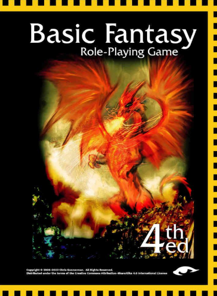

Ces différents noms représentent l'essence de l'OSR première vague. On y trouve un travail de fond sur les règles inventées par Gary Gygax, Dave Arneson et leurs successeurs, ainsi que pour certains, des propositions d'améliorations, ou de personnalisations allant plus ou moins loin, DCC étant un modèle du genre - d'où un certain succès.

## L'OSR minimaliste

En parallèle de la vague OSR dite "sérieuse", se développe une vague très importante de jeux minimalistes qui vont donner lieux à de nombreuses variations ou "hacks". Je citerai les deux plus importants :

| Jeu                      | Type        | Inspiré par | Date de publication |
|--------------------------|-------------|-------------|---------------------|
| Microlite                | Minimaliste | D&D 3e      | 2006                |
| Searchers of the Unknown | Minimaliste | AD&D        | 2009                |

Ces jeux sont gratuits, comme le sont toutes leurs variations. Ces jeux, au delà de l'exercice de style, servent souvent pour des one-shots et revendiquent un certain aspect parodique.

## La deuxième vague de l'OSR

Bien que les jeux ci-dessous ne soient pas identiques (je donnerai une mention un peu spéciale au *Whitehack* qui est un précurseur, avec son projet proche de DCC ; et à *Troika!* qui est une tentative très partielle et un peu j'm'en-foutiste de faire un vrai jeu avec un vrai univers), les autres ont, le plus souvent les caractéristiques suivantes :

* La première édition propose un ensemble hétéroclite des règles souvent simplistes écrites en gros caractères, inspirées plus ou moins d'une version de D&D ou du système d20 ;
* Le background est caricatural et/ou vraiment ridicule, la palme revenant à *Mörk Borg* avec son univers black metal en carton pâte ;
* Les règles simplistes sont un prétexte aux hacks et aux "house rules", ou règles maison inventées par les MJs ;
* Les variations entre ces divers jeux sont très faibles ;
* Le jeu se présente comme une preview d'une deuxième édition, payante celle-là, proposant plus de matériel mais souvent gardant les défauts de la première version.

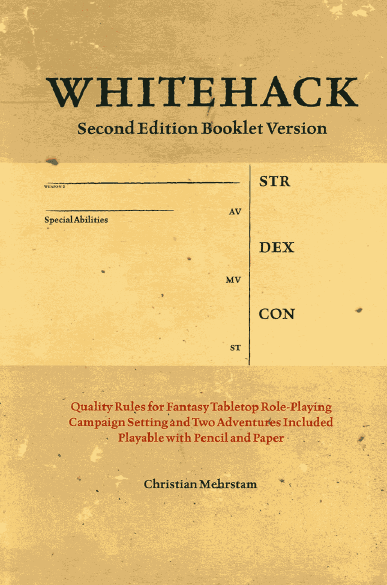

| Jeu              | Type      | Inspiré par               | Date de publication |
|------------------|-----------|---------------------------|---------------------|
| Whitehack        | Variation | OD&D                      | 2013                |
| Into the Odd     | Variation | Divers D&D                | 2015                |
| Black Hack       | Variation | OD&D                      | 2016                |
| Index Card       | Variation | Divers D&D                | 2017                |
| Troika!          | Variation | Advanced Fighting Fantasy | 2017                |
| Knave            | Variation | Divers D&D                | 2019                |
| Mörk Borg        | Variation | Divers D&D                | 2020                |
| Black Sword Hack | Variation | Divers D&D                | 2020                |
| Cairn            | Variation | Divers D&D                | 2022                |
| Shadow Dark      | Variation | Divers D&D                | 2023                |

Clairement, nous pouvons affirmer que les jeux cités ci-dessus, à part peut-être le *Whitehack* (et Troika!) jouent la simplicité :

* Ils utilisent l'argument marketing de l'OSR, sachant que la plupart des créateurs n'ont jamais joué aux anciennes versions de *D&D* ;
* Ils font des variations parfois minimalistes sur les règles d20, *variations qui n'apportent rien* et dont le but semble uniquement de vendre ou de se faire passer pour des designers hors pair ;
* Ils gardent l'ambiguïté d'une compatibilité avec la 5e ;
* Ils sont obsédés des règles mais ne brillent pas par leur contenu en terme de gamme et de scénarios ;
* Ils montrent un absence d'effort, de travail, d'originalité, qui fascine.

Mesdames et messieurs les designers, nous avons des jeux OSR première vague, nous avons les jeux originaux D&D réédités par WotC, nous avons des jeux nouveaux inspirés par D&D (*Worlds without Number*, *Barbarians of Lemuria*, etc.), est-ce que vous pouvez utiliser vos dons de game design pour nous faire des choses nouvelles au lieu de nous polluer avec vos grosses daubes inutiles, aussi bien au niveau des règles que des univers ?

&nbsp;

# Trouvé dans la cave : The Power (1997)

Bon, le Grog a déjà critiqué ce jeu [ici](https://www.legrog.org/jeux/power/power-en) mais je vais quand même en dire deux mots.

Publié en 1997, ce jeu n'a pas eu de suite, ni de suppléments.

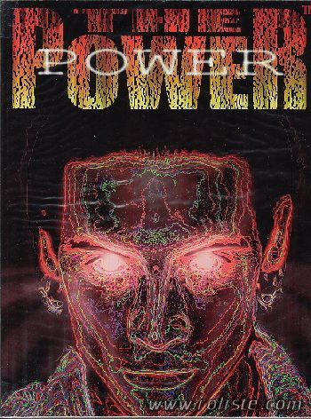

La mécanique de jeu est assez simple : 1d20 en dessous d'un seuil, le seuil étant déterminé par l'ajoût de trois score :

* Une caractéristique (notée sur 10),
* Une affinité (notée sur 5),
* Une compétence (notée sur 5).

| The Power    | D&D          | Power       |
|--------------|--------------|-------------|
| Strength     | Strength     | Telekinesis |
| Agility      | Dexterity    | Telekinesis |
| Stamina      | Constitution | Pyrokenesis |
| Constitution | Constitution | Biokinesis  |
| Logic        | Intelligence | Thelepathy  |
| Perception   | Wisdom       | Thelethesia |
| Reaction     | Dexterity    | Teletempora |
| Empathy      | Charisma     | Empathesia  |

Une fois le jet effectué, la marge de réussite ou d'erreur indique quel est le niveau de succès ou d'échec. Ce qui n'est pas très intuitif, c'est la composition des trois axes, sachant que le MJ doit projeter toute action non automatique sur ce référentiel.

On notera quelques mécanismes intéressants dans le cadre des pouvoirs psychiques.

Tout d'abord, leur énergie vient des rêves. Les psychistes sont des *dreambenders*, des plieurs de rêves. C'est par le rêve qu'ils ont été contactés par un mentor.

Ensuite, le mécanisme de base des pouvoirs psychiques est de "projeter" une de ses caractéristiques dans le monde réel au travers d'un lien avec *DreamTime*, l'univers des rêves.

Cette projection peut être physique ou émotionnelle, elle est faite durant la phase de *DreamLink*. Les auteurs parlent de *familiarité* à la discrétion du MJ, et c'est cet exact terme qui sera repris par Skip Williams dans son appendix 1 à son *Advanced Player's Guide* en 2005 et en 2009 dans son *Psychic's Handbook*.

J'aurais pas mal de choses à dire mais le temps me manque.

*(18 mai 2025)*

&nbsp;

# Les pouvoirs psy dans Alternity (1999)

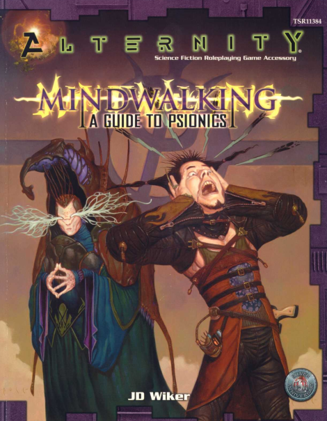

Je continue dans l'exploration des systèmes psioniques après ma traduction des [pouvoirs psychiques de *D&D 0e*](../downloads/eldritch-wizardry.md) (1976).

Ci-dessous est la classification des pouvoirs par caractéristique due l'on trouve dans *Alternity*, le jeu de SF de WotC lancé puis abandonné peu après son rachat de TSR au profit de toute la gamme d20, notamment le *d20 Modern* et *d20 Future*.

Bref, le côté intéressant de la conception est que les pouvoirs sont rattachés à une caractéristique différente, alors que dans les systèmes émulant la magie, on se retrouve vite avec la caractéristique Wisdom ou Intelligence comme base de tous les bonus. *D&D 5e* a un peu varié cette unicité de caractéristique entre les différentes classes de personnages (par exemple le Barde utilisant le Charisma pour la magie) mais sinon, cette affectation des pouvoirs à différentes caractéristiques est intéressante car elle peut même permettre de n'avoir que des personnages "psychistes" mais dont les points forts sont sur différentes caractéristiques.

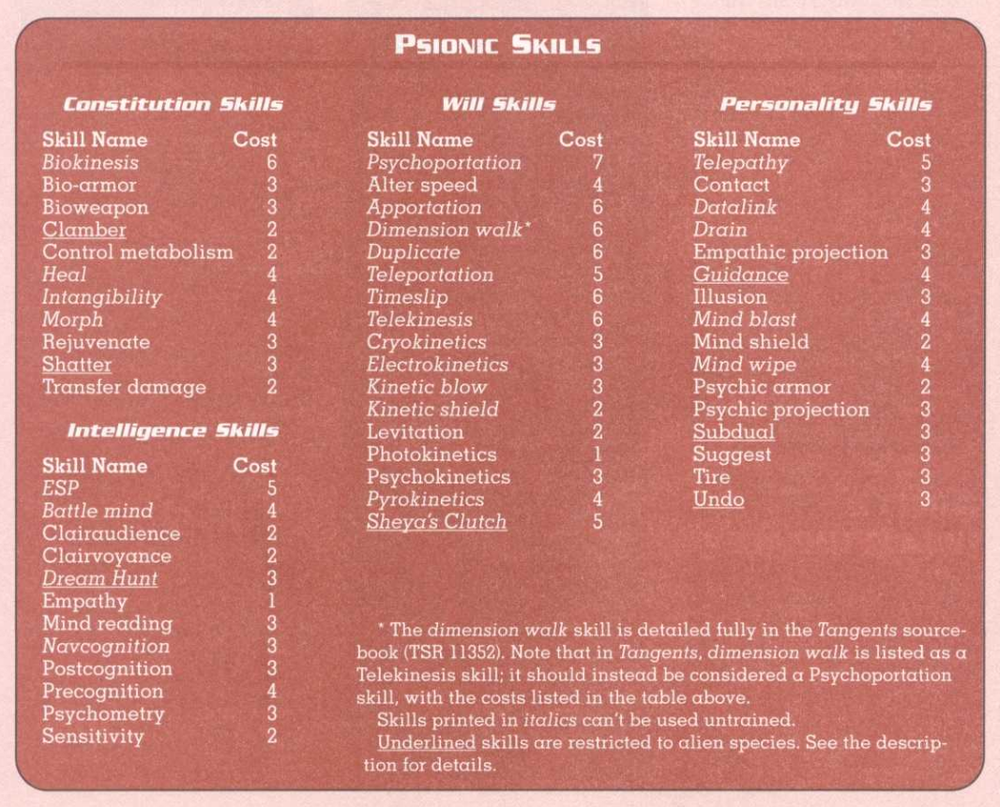

Le système d'*Alternity* est assez intéressant. Bien sûr, le psychiste possède des points d'énergie psionique égaux à sa Will, ce qui rappelle le système de magie de *BRP* avec les points de magie égaux au Power. Petite innovation, ce nombre de points peut être multiplié par un facteur 0.5 si le personnage n'est pas uniquement un psychiste et 1.5 s'il est un [Fraal](https://alternityrpg.fandom.com/wiki/Fraal).

Mais c'est dans le système de combat que se situe la partie intéressante. Certes, si un psychiste utilise la télékinésie pour se battre ou un autre pouvoir psychique, nous revenons à du classique avec un combat à mains nues, en mêlée ou à distance. Mais quand le combat se déroule sur le plan psychique, *Alternity* distingue trois cas :

* Les assauts,
* Les subversions,
* les pièges.

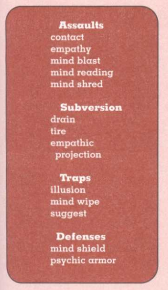

Le système en lui-même n'est pas génial. Les assauts font l'objet d'un jet de compétence psy avec comme modificateurs en gros la résistance du personnage attaqué (modificateur de Will). Ce dernier peut potentiellement "parer" mentalement s'il possède Mind Shield. Si le coup est gagnant, le défenseur peut réduire les points perdus en utilisant Psychic Armor. Mouais.

Le problème de ce système est qu'il n'est pas très homogène. Dans certaines versions de *D&D*, le système assume d'aller un peu plus loin avec une Psychic Armor Class, ce qui fait que tous les personnages peuvent être concernés. Là, juste ceux qui ont les caractéristiques peuvent se défendre activement.

Gygax avait déjà tenté de contourner ce problème, même si son système dans *D&D 0e* n'était pas très lisible. Au fur et à mesure que le personnage progresse dans l'acquisition de pouvoirs, ils gagne des attaques et des défenses psychiques.

Les subversions sont des genres d'assauts destinés à affaiblir l'opposant. Les pièges sont un concept intéressant, sachant que la victime doit cumuler un certain nombre des succès pour s'en sortir. Cela ressemble un peu aux règles de Méga 2 pour se sortir d'un transfert.

Bref, ce bouquin n'a pas marqué l'histoire mais je retiens deux idées intéressantes :

* Les pouvoirs sont associés à différentes caractéristiques,
* Les combats psychiques peuvent être "typés".

10 mai 2025

# Relativité du système d100 du BRP de Chaosium

En complément de la page sur [les moteurs de jeux de rôle génériques](../pages/moteurs-generiques.md), notons que le moteur de jeu d100 *BRP* de Chaosium est bâti sur des hypothèses plus dures pour les PJs que le système *D&D*.

Voir la page dédiée : [réflexions sur le système d100 de BRP](../pages/analyse-d100.md)

Lien vers le [SRD de BRP v5](https://github.com/orey/jdr-brp/tree/master/source) et sa licence ORC.

1er mai 2025

# Le SRD 5.2 de D&D

Le voilà : [SRD5.2 CC](https://www.dndbeyond.com/srd "SRD").

Dans les points importants :

* Il y a tout pour jouer à *D&D* et créer ses propres contenus avec ;
* La mise en page est mieux faite que le SRD 5.1 ;
* Un gros effort a été fait sur les Challenge Ratings (j'en parlerai sans doute plus en détails dans le futur) ;
* La licence OGL est abandonnée.

Bon, disons-le tout net, Jeremy Crawford (photo ci-dessus) a pris le pouvoir absolu sur *D&D 5e*, ce qui explique l'augmentation de la qualité des "livrables", que ce soit au niveau du SRD ou au niveau des livres qui sont extrêmement travaillés par lui et son équipe. Il ne faut pas bouder notre plaisir, même si je sais que WotC est souvent considéré comme une boîte de gros vilains. Mais le numéro 1 est toujours critiqué. Toujours est-il que les règles de *D&D* n'ont jamais été aussi claires et aussi bien expliquées.

Le fait que la licence OGL soit abandonnée marque aussi la fin d'une époque, ainsi que celle des concepts un peu étrange redéfinissant les concepts basiques du droit d'auteur. Crawford a étudié le sujet et est revenu au bon sens d'utiliser des licences revues par des juristes et conformes au droit d'auteur, soit à loi américaine. Pour plus d'informations sur ces licences, voir mon [article dédié](../pages/licences.md).

1er mai 2025

# Un update du SRD de D&D pour la 5.5

Wizards vient [d'annoncer](https://www.dndbeyond.com/posts/1949-coming-april-22-publish-your-own-creations-using) que le SRD 5.2 serait disponible mardi 22 avril 2025.

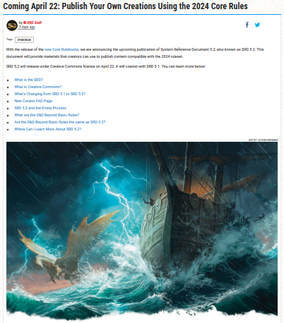

Héhé, on peut déjà trouver les Basic Rules 2024 sur [github.com/orey/DD-5e/](https://github.com/orey/DD-5e/tree/master/Free%20Rules%20(2024)) en version LibreOffice. Ca fait déjà un joli document de +700 pages.

Mais c'est une bonne nouvelle, les règles sont vraiment devenues épurées et de très bonne facture.

19 avril 2025

# Le vieux de la vieille

Quand je traîne sur Internet pour regarder les JDR, force est de constater que c'est un sport de vieux schnocks. Je voyais la newsletter de Chaosium pour le coffret des *Cults of Runequest*, ça fait un peu peur.

Il y a quelque chose de décalé de vouloir se retrouver en groupes en réel pour jouer (j'ai encore du mal avec les vidéos sur le net, ça me rappelle un peu trop les visio-confs du boulot).

Mais avec l'âge vient la sagesse... ou pas. Hugo disait (de mémoire) : "*avec le temps, les hommes deviennent comme les fruits : les bons mûrissent, les mauvais pourrissent*". Nous supposerons que ce qui suit fait partie de la première catégorie pour nous attaquer aux moteurs de jeux génériques.

## Y'en a plein mais quand on est vieux...

Les moteurs de JDR génériques sont nombreux mais, quand on a roulé sa bosse, on commence à avoir un certain recul.

J'ai fait une page sur les moteurs de jeux génériques, page que je vais enrichir progressivement. Je tourne autour et je reste sur mes fondamentaux de vieux :

* *D&D*, surtout la 5.5e, j'en reparlerai ;
* *Basic Roleplaying* de Chaosium ;
* *GURPS*, ou plutôt, *GURPS Ultralite 4e* ;
* *Microlite20*, sans doute le meilleur jeu du monde.

Aller sur [la page des moteurs de jeux de rôle génériques](../pages/moteurs-generiques.md).

19 avril 2025

# L'OSR est-il mort ?

## Une vidéo sur Shadowdark

Au hasard de mes pérégrinations sur le net, je suis tombé sur [cette vidéo](https://www.youtube.com/watch?v=m973drfhC-8) sur Shadowdark dans [Coup Critique](https://www.youtube.com/@CoupCritique). [Arkane Asylum](https://arkhane-asylum.fr) est en train de traduire le jeu et propose déjà les quick starters en français. Une campagne de financement va être bientôt lancée.

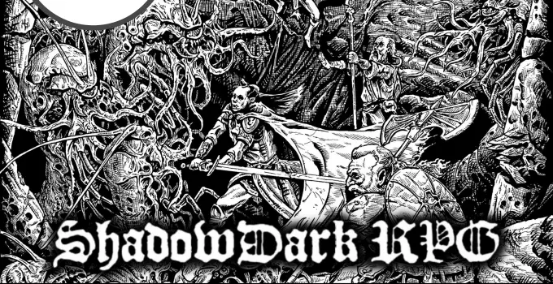

J'avais téléchargé voilà quelques temps le quick start et j'avoue que je n'avais pas été convaincu. Un jeu de plus OSR. Dans la vidéo, les protagonistes expliquent quelques spécificités du jeu : les torches ont une durée de vie d'une heure et aucun PJ ne voit dans le noir, la progression a un côté aléatoire, la création des personnages est un peu celle des personnages de niveau zéro de *DCC*, etc. Le jeu en lui-même, dans sa version complète, propose plein de tables aléatoires.

Le jeu est facile à prendre en mains mais la question est : au delà du fait que le jeu ait été fait par une américaine assez bonne communiquante et assez douée, qu'est-ce que ce jeu apporte ? Une ambiance spéciale ? Mouais. Peut-être une facilité à jouer en solo.

## Pourquoi l'OSR ?

Nous avons beaucoup écrit sur l'[OGL](../pages/licences.md) (*Open Gaming License*) qui a permis le mouvement OSR (*Old School Revival*).

L'OSR, pour moi a eu trois phases :

* 2000 : l'explosion
    * l'OGL sort et c'est l'explosion des contenus OSR. Wizards of the Coast ne poursuivra pas les gamers qui produisent du contenu à partir des règles de D&D. Cet OSR retournera à des jeux plus proches des originaux, simplifiés ou non, en réaction, en quelque sorte à D&D 3.0/3.5.
* 2008 : le renforcement
    * la sortie de D&D 4e renforce le mouvement OSR dans la mesure où D&D est devenu un jeu de plateau très technique, un peu à contre-courant de la tendance du marché.
* 2014 : le fin des haricots
    * la sortie de D&D 5e va tuer l'OSR. D&D est devenu un jeu très simple, gardant des parties de la troisième édition mais de manière simplifiée et couplé avec un contenu énorme et de belles campagnes.
* 2024 : le coup de grâce
    * La sortie de D&D 5.5e en 2024 va finir de l'achever. Le jeu est propre, bien organisé, simple, facile à prendre en mains, rodé sur des milliers de tables.

Donc en 2025, quel est l'intérêt à se tourner de nouveau vers l'OSR ? Au niveau des règles, pas grand chose. Au niveau prix, nous sommes dans des prix dépassant les 50$ avec certes pas mal de contenus. Mais d'autres systèmes sont disponibles gratuitement comme le [Black Sword Hack](https://blackswordhack.github.io/index.html), systèmes que, pour ma part, je ne trouve pas super emballants. J'ai aussi dans ma bibliothèque le *White Hack* : bof.

Je ne suis pas vendu à WotC, mais leurs produits sont quand même assez jolis, même si nous gardons un petit côté Woke qui me gêne un peu (Pathfinder 2e est un peu plus *roots* dans le style), qui plus est dans certaines campagnes, j'y reviendrai un jour.

Mais bon, au niveau système de jeu, les [free rules](https://www.dndbeyond.com/sources/dnd/free-rules) sont quand même un bel exercice de clarification permettant de jouer dans pas mal d'univers, y compris des univers de fantasy un peu dark.

Je reste toujours un peu perplexe quant aux paraphrases : elles veulent apporter des choses mais souvent, l'original est mieux. J'aurais compris si Shadowdark avait été un supplément pour la 5.5e avec une atmosphère spéciale, une interprétation des règles, plein de tables et de façons de jouer en solo. Mais à quoi bon refaire, une fois encore, longtemps après la bataille, les règles de D&D 5e ?

# A propos du lien Classe d'Armure et D20

## La CA, un concept composite

Je me suis souvent demandé quelle était le concept derrière la classe d'Armure de D&D, AC en français et CA en anglais. Mais, depuis quelques temps, à l'occasion de la finalisation de la traduction de Troika!, je me suis posé des questions de *game design*, j'ai lu pas mal de choses et les choses se sont éclairées.

(En fait, la traduction est terminée depuis longtemps, elle n'a pas été faite par une IA, mais j'avais encore quelques retouches à faire et je ne trouve pas le temps de la finaliser.)

Je faisais des recherches sur les systèmes D6. J'ai déjà pas mal écrit sur ces sujets dans ces pages (sur les [systèmes](../pages/D6-systems.md), sur le [combat](../pages/D6-Combat.md) et sur les [seuils de difficulté](../pages/D6-TargetNumber.md)).

Le premier doute que j'ai eu était relatif au système de combat de Risus, système dans lequel des clichés en nombre de D6 peuvent s'affronter. Il s'avère qu'un décalage de 1D, par exemple un cliché à 3D contre un cliché à 4D, génère des probabilités très peu en faveur du cliché le plus faible. J'avais déjà remarqué ça dans le système D6, et dans Star Wars, il y a des années. Un décalage faible dans la mesure des compétences implique une différence de probabilités forte dans le jeu, ce qui pose un problème d'équilibre.

Ces réflexions m'ont mené récemment vers la notion de CA de D&D. En effet, dans D&D, l'attaquant ne fait pas de duel mais joue contre un facteur de difficulté fixe, la CA. Outre le fait que le jeu soit plus rapide, cette CA cumule plusieurs concepts :

* L'armure et les boucliers,
* La dextérité et donc la capacité à être touché (sous-entendu les esquives et parades),
* Les diverses protections supplémentaires, notamment magiques,
* Les circonstances du combat (dans AD&D 1e, la CA du bouclier (+1) ne compte que si le PJ fait face à l'adversaire).

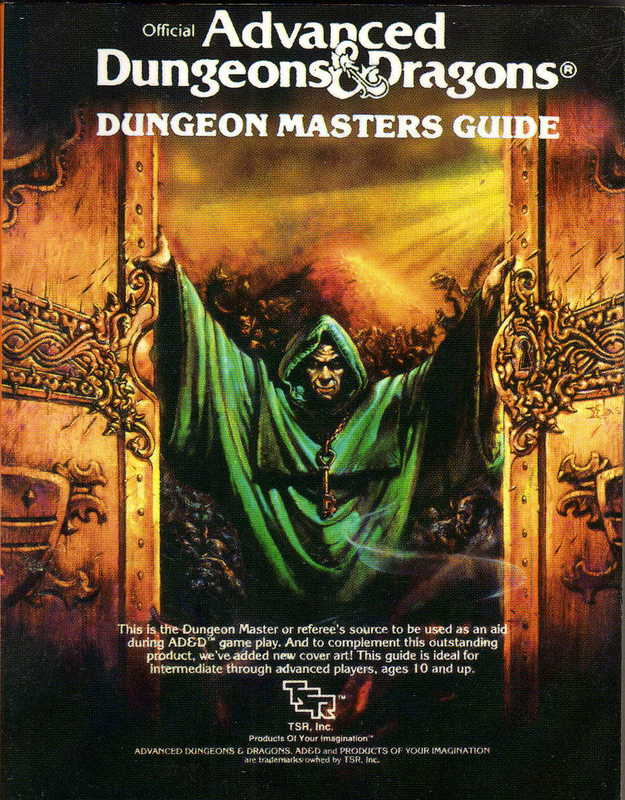

Lorsque le jet de D20 est supérieur ou égal à la CA, l'adversaire prend des dommages et perd des points de vie (PdV).

Il faut noter que, même au premier niveau, les personnages peuvent blesser des monstres très puissants, car la CA est en quelque sorte "bornée" et les règles suivantes sont appliquées :

* Une CA de 20 est atteignable par tous et peu de monstres dépassent la CA de 20 ;
* Un monstre est difficile à tuer s'il a une haute CA (dans D&D 5e) et s'il a beaucoup de PdV.

Ainsi la CA va avec la progression des PdV, ce qui est vrai pour les monstres mais aussi pour les PJs. D'où les niveaux.

Même s'il n'a pas pour but d'être simulationniste, mais plutôt logique et efficace, le concept de CA a été beaucoup décrié, si bien qu'il n'est pas très courant de le voir implémenté dans des jeux plus récents. Pourtant, il perdure et je vais donner une possible explication quant à sa durée de vie exceptionnelle.

## Deux types de combats

Dans D&D, l'attaque dans le combat est résolue en *un seul jet* : 1D20 + modificateurs contre la CA. C'est une mécanique de seuil. Ce seuil est la plupart du temps statique, la CA étant notée sur la feuille de personnage.

La plupart des autres jeux vont proposer *deux jets*, un pour l'attaquant et un pour le défenseur. Dans la plupart de ces systèmes, le vainqueur de l'attaque inflige des dommages au vaincu et ce dernier subit une perte de PdV qui est tempérée par l'armure qu'il porte, armure qui absorbe tout ou partie de la perte.

Les jeux proposant cette mécanique de "duel" sont souvent plus compliqués, plus lourds, et plus meurtriers :

* Plus compliqués d'abord parce qu'en plus des deux jets et du décompte complexe de PdV, les concepteurs rajoutent souvent des fioritures simulationnistes (parade, esquive, localisation des blessures, armures localisées sur le personnage, armures ayant aussi des PdV et étant abîmées par des coups absorbés, armures au potentiel de protection représenté par des jets de dés, etc.) ;
* Plus lourds, parce qu'au final, le combat interrompt le jeu plus longtemps et tous les joueurs ne sont pas forcément passionnés par ces phases (même si les MJs le sont) ;
* Plus meurtriers car pouvant cumuler une réussite critique chez l'attaquant avec un échec critique chez le défenseur, ce qui peut occasionner la mort instantanée d'un PJ, résultat d'une action purement aléatoire.

La létalité des combats est adaptée  un certain type de jeu et de joueurs, mais force est de constater que la mort d'un PJ due uniquement à l'aléa a quelque chose d'anti-jeu-de-rôles, car elle ne résulte pas de l'action directe des PJs. Ou plutôt, elle va décourager les combats et donc être adaptée à des jeux plus modernes où les combats faciaux sont létaux, mais pas à des mondes de *high fantasy*.

## Deux types de systèmes de magie

Nous pouvons constater le même type de dichotomie avec les systèmes de magie. Dans D&D, le magicien lance un certain nombre de sorts par jour, mais il ne lance pas les dés pour les lancer : le succès est automatique. Le défenseur fait, lui, un jet de sauvegarde contre le niveau magique du magicien et du sort. C'est encore une mécanique de seuil à simple jet.

Dans la plupart des autres jeux, nous avons deux jets : le magicien doit réussir son jet pour réussir son sort, et le défenseur peut faire aussi un jet de sauvegarde. C'est le cas de la plupart de systèmes de magie de *BRP*. Les chances de réussite sont donc très amoindries, et il reste frustrant pour le joueur d'échouer sur un sort basique alors qu'il possède 75% de chances de réussite. C'est encore une mécanique de duel à deux jets.

## CA et D20

D&D est donc bien un jeu plus simple et plus efficace que les jeux implémentant un double jet, moins simulationniste et plus adapté à de la *high fantasy*.

Pour en revenir à la CA, dans la mesure où le jeu rend la plupart des monstres "atteignables" à tous les joueurs de tous les niveaux en raison de leur CA ne dépassant qu'exceptionnellement 20 (un jet de 20 en attaque a 5% de chances de se produire, cela sans compter les bonus divers), il est donc requis que la chance de toucher un monstre ayant une CA de 20, ne soit pas nulle.

Or, si nous voulons atteindre un seuil S avec de multiples D6, comme 3D6 pour atteindre S=18, il est nécessaire de considérer l'effet courbe en cloche des probabilités. Pour avoir 5% de chances d'atteindre ou de dépasser un seuil S le plus élevé possible avec 3D6, il faut S=16. Avec 2D6, nous n'avons pas cette finesse : moins de 3% de chances de faire 12 et plus de 8% de chances de faire 11 ou plus.

Force est de constater qu'introduire de l'aléa avec les dés polyédriques classiques (D6, D8, D10, D12, D20) dans le but de dépasser un seuil S avec environ 5% de chances de réussite, la linéarité des probabilités du D20 (5% à chaque pas) l'assure. Elle permet de garantir que les PJs de bas niveau pourront toucher des CA élevées et porter des dommages, et donc contribuer à un combat contre un adversaire très puissant, tout comme les PJs de haut niveau.

La mécanique D20 + CA est donc à la fois efficace, robuste car fonctionnant avec tous les niveaux, et au final amusante, car elle n'exclue pas les joueurs de faible niveau.

## Introduire la CA dans des jeux à duels ?

Dans les [jeux de la gamme D6](https://ogc.rpglibrary.org/index.php?title=OpenD6), les choses ne sont pas simples, ne serait-ce que parce la probabilité de faire des grands chiffres est faible (courbe en cloche).

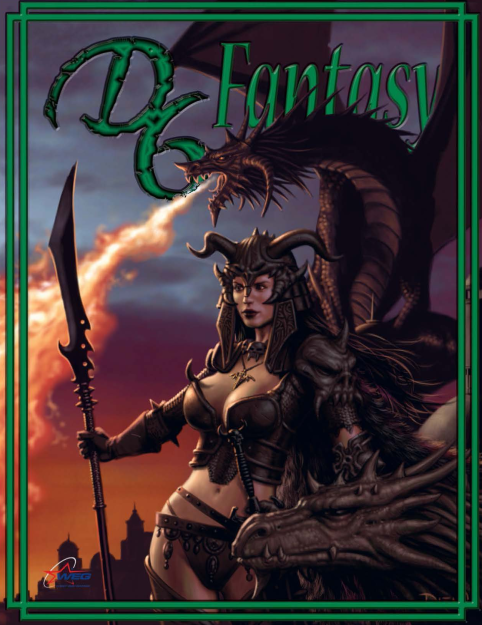

Cela ouvre aussi une perspective un peu différente sur l'immense littérature "D20" qui a été générée après la sortie de la première licence OGL, et le fait que beaucoup de jeux aux règles différentes ont fait une version D20. Il faudrait prendre le temps de comparer avec les systèmes d'origine.

## Conclusion

Il manquait la conclusion à cet article. Si l'on veut un jeu amusant dans lequel chaque joueur, quelque soit son niveau, peut avoir une chance de toucher un adversaire, il faut donc que la "résistance" totale de cet adversaire soit un seuil fixe atteignable par tous. Si nous mettons ce seuil à un pur aléa, non modifié par des bonus ou des malus, que nous fixons une valeur arbitraire à 5%, le d20 paraît le meilleur choix (20 est toujours un succès, critique de surcroît).

Les créatures doivent avoir un seuil fixe pour être touché et ce seuil représente une difficulté majorée pour permettre à tous de toucher et de porter des dégâts. Les dégâts et les points de vie  géreront le delta de niveau entre les personnages et les monstres.

Il faut donc voir que le couple d20+CA est d'une rare puissance en termes de mécanique de jeu, et les deux mécanismes sont étroitement liés. Nous parlons bien de jeu ici et non pas d'une mécanique simulationniste. Ce couple est efficace, rapide et amusant, et cela explique certainement sa pérennité au travers des diverses éditions de D&D.

08 avril 2025

