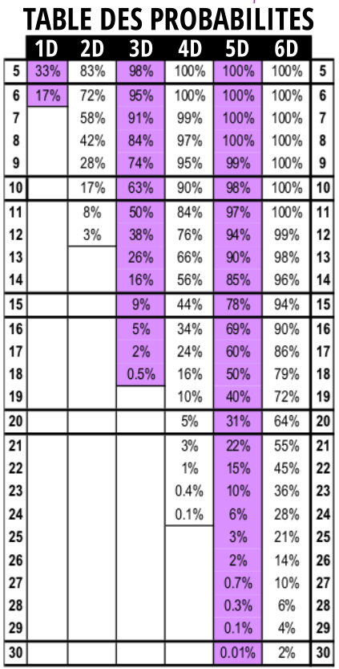

---
tags:
    - Basic Roleplaying System
    - D&D
    - DCC
    - Ghostbusters
    - Pathfinder
    - Risus
    - Runequest
    - Shadowrun
    - Star Wars
---

# Qu'est-ce qu'un bon moteur de jeu de combat ?

## Tout sauf les probabilités

La question a l'air stupide, tellement stupide que je ne vois personne se la poser vraiment. Dans les forums type reddit, par exemple [ici](https://www.reddit.com/r/rpg/comments/1cvh4cx/what_are_some_of_your_favourite_combat_systems_in/), les arguments donnés en faveur des systèmes de combat sont les suivants :

* Intérêt tactique, voire positionnement des PJs sur une grille permettant de visualiser précisément les actions,
* Détails dans les options de jeu,
* Fluidité du système,
* Réalisme,
* Rapidité,
* Etc.

Le système de *D&D* est décrié de manière générale comme étant le plus mauvais système de combat en comparaison de toutes les innovations de ces 40 dernières années. Cette critique unanime a un côté étrange dans la mesure où *Pathfinder 2e* est loué (alors que l'on retrouve un certain esprit *D&D 4e* dans ce jeu).

Pour autant, l'aspect probabilités du système n'est pas abordé, sans doute parce qu'il n'est pas trivial de calculer les probabilités de succès dans des combats, surtout des combats avec des actions possibles des deux protagonistes, l'un attaquant et l'autre parant ou esquivant.

## Les critères

On peut donc se demander quels sont les critères qui permettent de dire qu'un système de combat est bon. C'est d'ailleurs une question que posent certains protagonistes du forum Reddit, question à laquelle personne ne répond vraiment.

Nous avons vu dans [l'analyse du système de combat du système D6](../pages/D6-Combat.md) que ce système était assez frustrant pour les joueurs dans la mesure où un décalage de 1D entre les deux combattant donnait un avantage très important au combattant ayant le plus grand score. Sur la table de jeu, cela se constate par une certaine frustration des joueurs qui ont l'impression de rater souvent alors que leurs scores en compétences de combat peuvent être importants. Pour le MJ, c'est aussi compliqué : comment équilibrer les ennemis dans une partie si 1D de différence implique presque obligatoirement la victoire de l'un des deux camps ?

Le premier critère de qualité d'un système de combat devrait donc être que les combats soient "intéressants" dans une certaine mesure et donc que des adversaires avec des scores relativement proches, disons à plus ou moins 30%, puissent avoir une chance de créer un combat dont l'issue est incertaine. De manière générale, un combat entre un adversaire fort et un PJ juste un peu plus faible pourrait être qualifié de :

* Très motivant aux alentours de 50% de chances de réussite (une chance sur deux),
* Difficile mais motivant aux alentours de 30% de chances de réussite (une chance sur trois).

Dès que les chances de réussite atteignent une chance sur 4 (25%) ou sur 5 (20%), l'issue du combat est statistiquement déterminée d'avance.

Pour autant, il faut matérialiser une différence entre les personnages expérimentés, voire maîtres en leur domaine, et les personnages débutants, forcément moins expérimentés.

## L'approche "Bounded Accuracy" de *D&D* 5e

L'approche de *D&D* laisse toujours une probabilité de toucher à tous les personnages, quel que soit leur niveau (concept de "Bounded Accuracy", voir [ici](https://www.dndlounge.com/bounded-accuracy-5e/) et dans les liens plus bas). L'idée est que, quelque soit son niveau, n'importe quel personnage a environ 65% de toucher. Les dommages infligés dépendent, eux, du niveau, tout comme le nombre de points de vie. Bien que ce système soit imparfait, il faut lui reconnaître le fait d'être le fruit d'une longue conception, consciente et prudente.

Si, à l'inverse, nous considérons BRP ou Runequest, nous restons sur une conception volontairement plus déséquilibrée (voir [mon analyse du système d100](../pages/analyse-d100.md)).

*Risus* est le bon candidat pour tout analyser, car il est simpliste et donc il est facile de comparer les différents systèmes de combat.

## A lire

* [Bounded Accuracy](../pages/BoundedAccuracy.md) par Rodney Thompson.
* [Bounded Accuracy 5e (DnD Design Guide)](https://www.dndlounge.com/bounded-accuracy-5e/).
* [A Unified Theory of 5e Combat Design](https://dramaticquestings.substack.com/p/a-unified-theory-of-5e-combat-design).
* [Mechanic Overview: Armor Class 5e](https://arcaneeye.com/players/armor-class-5e/).

*(4 janvier 2026)*

&nbsp;

# Un problème de statistiques

## Des systèmes statistiquement opaques

J'ai déjà, sur ce blog, parlé de nombreuses fois des problèmes de statistiques dans les JDR, notamment à l'occasion de l'étude du système D6 dans les combats (voir [ici](../pages/D6-Combat.md).

De fait, beaucoup de systèmes sont opaques et cela dans un double sens :

* Il est  très complexe de savoir *quelle chance réelle* les joueurs ont pendant les combats ;
* Ils ne sont pas équilibrés et la progression par expérience peut vite introduire des déséquilibes importants dans le jeu.

## Le dice pool dans *Risus*

Aimant beaucoup le système *Risus* des Clichés, mais le trouvant déséquilibré par le système D6 (le système traditionnel où l'on ajoute les valeurs des dés lancés, comme avec *Ghostbusters* ou *Star Wars* 1e), j'ai cherché les systèmes alternatifs. Un de ces systèmes est le fameux pool de dés, chaque dé indiquant un succès ou un échec.

On peut trouver cette proposition dans:

* [Risus Reloaded](https://www.risusiverse.com/home/optional-rules/risus-reloaded)),

Comme Risus se joue avec des D6, j'ai considéré la solution du pool de D6, un pool naturel sans explosion de dés (les 6 comptent comme un succès mais peuvent être rejoués). J'ai considéré que tirer 1, 2 ou 3 était un échec, et 4, 5 ou 6 était un succès. On trouve des variantes de cela avec un jeu sur la parité : pair est un succès et impair est un échec. Le fait est que le dé a une chance sur deux d'être un succès et une chance sur deux d'être un échec.

Tout d'abord, il faut calculer les probabilités de succès des pools de dés en termes de nombre de succès. Cela peut servir pour la résolution de tâches simples.

La table 1 représente ces probabilités avec 'F' signifiant "Failure" et 'S' "Success".

| A   | F     | 1S    | 2S    | 3S    | 4S    | 5S    | 6S    | 7S    | 8S   | 9S   | 10S  |
|-----|-------|-------|-------|-------|-------|-------|-------|-------|------|------|------|
| 1D  | 50.0% | 50.0% |       |       |       |       |       |       |      |      |      |
| 2D  | 25.0% | 50.0% | 25.0% |       |       |       |       |       |      |      |      |
| 3D  | 12.5% | 37.5% | 37.5% | 12.5% |       |       |       |       |      |      |      |
| 4D  | 6.2%  | 25.0% | 37.5% | 25.0% | 6.2%  |       |       |       |      |      |      |
| 5D  | 3.1%  | 15.6% | 31.2% | 31.2% | 15.6% | 3.1%  |       |       |      |      |      |
| 6D  | 1.6%  | 9.4%  | 23.4% | 31.2% | 23.4% | 9.4%  | 1.6%  |       |      |      |      |
| 7D  | 0.8%  | 5.5%  | 16.4% | 27.3% | 27.3% | 16.4% | 5.5%  | 0.8%  |      |      |      |
| 8D  | 0.4%  | 3.1%  | 10.9% | 21.9% | 27.3% | 21.9% | 10.9% | 3.1%  | 0.4% |      |      |
| 9D  | 0.2%  | 1.8%  | 7.0%  | 16.4% | 24.6% | 24.6% | 16.4% | 7.0%  | 1.8% | 0.2% |      |
| 10D | 0.1%  | 1.0%  | 4.4%  | 11.7% | 20.5% | 24.6% | 20.5% | 11.7% | 4.4% | 1.0% | 0.1% |

*Table 1: Probabilités de nombre de succès par pool de D6*

Ces probabilités sont strictes, ce qui veut dire que si je joue un Viking (5) à Risus, j'ai exactement 31.2% de chances d'avoir 3 succès sur un jet de 5 dés.

On voit vite que la gestion des difficultés n'est pas pas simple. Dès que les personnages ont des clichés à 3D, ils ont 50% de chances d'avoir 2 succès ou plus. Pour le MJ, c'est un casse tête de déterminer la difficulté de l'action, notamment parce que les clichés de niveau bas n'ont juste pas la possibilité d'atteindre un certain nombre de succès.

Ces remarques sont valables pour les jeux utilisant les pools de dés de manière générale.

## Probabilités pour les combats en pool de D6

J'ai un peu cherché dans les sites en anglais mais je n'ai rien trouvé (ce qui m'étonne) concernant les probabilités de réussite en combat. En effet, dans ce type d'affrontement, le concept est toujours le même :

* Un personnage A possède une compétence représentée par un pool de dés ;
* Un personnage B possède, lui aussi, une compétence représentée par un pool de dés ;
* Celui qui gagnera la passe (ou le round) est celui qui aura le plus de succès.

Calculer les probabilités de succès pour A n'est pas très compliqué. Voilà ce que je trouve avec [quelques lignes de python](https://github.com/orey/ttrpg-software/blob/master/python/Dice%20pool%20probabilities/proba-pool-combat.py) :

| **A/B** | 1D    | 2D    | 3D    | 4D    | 5D    | 6D    | 7D    | 8D    | 9D    | 10D   |
|---------|-------|-------|-------|-------|-------|-------|-------|-------|-------|-------|
| 1D      | 25.0% | 12.5% | 6.2%  | 3.1%  | 1.6%  | 0.8%  | 0.4%  | 0.2%  | 0.1%  | 0.0%  |
| 2D      | 50.0% | 31.2% | 18.8% | 10.9% | 6.2%  | 3.5%  | 2.0%  | 1.1%  | 0.6%  | 0.3%  |
| 3D      | 68.8% | 50.0% | 34.4% | 22.7% | 14.5% | 9.0%  | 5.5%  | 3.3%  | 1.9%  | 1.1%  |
| 4D      | 81.2% | 65.6% | 50.0% | 36.3% | 25.4% | 17.2% | 11.3% | 7.3%  | 4.6%  | 2.9%  |
| 5D      | 89.1% | 77.3% | 63.7% | 50.0% | 37.7% | 27.4% | 19.4% | 13.3% | 9.0%  | 5.9%  |
| 6D      | 93.8% | 85.5% | 74.6% | 62.3% | 50.0% | 38.7% | 29.1% | 21.2% | 15.1% | 10.5% |
| 7D      | 96.5% | 91.0% | 82.8% | 72.6% | 61.3% | 50.0% | 39.5% | 30.4% | 22.7% | 16.6% |
| 8D      | 98.0% | 94.5% | 88.7% | 80.6% | 70.9% | 60.5% | 50.0% | 40.2% | 31.5% | 24.0% |
| 9D      | 98.9% | 96.7% | 92.7% | 86.7% | 78.8% | 69.6% | 59.8% | 50.0% | 40.7% | 32.4% |
| 10D     | 99.4% | 98.1% | 95.4% | 91.0% | 84.9% | 77.3% | 68.5% | 59.3% | 50.0% | 41.2% |

*Table 2: probabilités de succès de A contre B en mode "dice pool"*

Dans cette table, vous trouvez les pourcentages de succès strict de A dont le pool de dés est représenté en ligne face à un adversaire B dont le pool est en colonne.

Ainsi, si A a un pool de 4D et qu'il combat contre B ayant un pool de 5D, la chance stricte de gagner est de 25.4%. L'inverse (A possède un pool de 5D et B un de 4D) donne 50%.

Encore une fois, il n'est pas très facile de faire un jugement sur l'instant ni même d'anticiper les chances de succès des joueurs. Ces systèmes à opposition sont assez dangereux pour le MJ dans la mesure où il prend le risque qu'un combat tourne mal malgré des compétences faciales élevées pour les joueurs.

## BRP plus transparent ? Pas du tout !

J'ai déjà abordé ce point mais tous les systèmes de combat dans lesquels le défenseur peut neutraliser l'attaque posent aussi un problème.

Par exemple dans BRP, prenons le cas où mon personnage A a 60% de chances de toucher à l'épée. Oui, mais si je suis face à un adversaire B qui a 80% de toucher (et donc de parer), la chance complète de toucher pour mon personnage est 60% x (100-80=)20% = 12% ! C'est complètement incroyable. De son côté, mon opposant a 80% x 40% = 32% de toucher vraiment, soit presque 3 fois plus que moi ! Facialement, nous n'avons que 20% d'écart de compétences. Voir sur le sujet mon [analyse du système d100](../pages/analyse-d100.md).

Remettons cela dans la perspective de *D&D* et de sa classe d'armure.

Supposons que A et B aient 20% de différence sur leur CA, avec CA(A) = 10 et CA(B)= 10 x 1.2 = 12. Considérons que A ne possède pas de bonus de caractéristique applicable et un bonus de maîtrise de +2. Il lancera donc d20+2 contre 12. Il égalera ou dépassera la CA(B) dans 11 cas sur 20 soit une probabilité de toucher de 55%. A l'inverse, B que nous considérerons sans bonus de caractéristique et aussi avec un bonus de maîtrise de +2 lancera 1d20+2 pour battre une CA de 10, soit 13/20 = 65%. Sans surprise, les 20% de moins de CA se traduisent (toutes choses égales par ailleurs) par 10% de chances de gagner en plus.

Je ne vais pas refaire mon pénible, mais on comprend pourquoi les rôlistes aimant les combats jouent à *D&D* et pas à *Runequest*. Cela dit sans compter le fait que l'adversaire ne répond pas dans *D&D* mais qu'il est représenté par sa CA, qui est un seuil de difficulté, ce qui permet d'exprimer des probabilités claires. Voir sur le sujet de la classe d'armure mon [article](https://orey.github.io/blog/blog/2025/#a-propos-du-lien-classe-darmure-et-d20)).

## La proposition de "No-Pool Risus" (NPR)

[No-Pool Risus](https://darkwormcolt.wordpress.com/2024/07/25/risus-appreciation-no-pool-risus-complete-rules/) est une autre alternative au pool de D6. Empruntant à la logique de *DCC*, *NPR* propose une chaîne de dés (dice chain) allant du d2 jusqu'au d20. 

L'idée de NPR est de remplacer les pools de dés par des dés coûtant le même prix (entre parenthèses).

| **A/B**  | d2 (1) | d4 (2) | d6 (3) | d8 (4) | d10 (5) | d12 (6) | d14 (7) | d16 (8) | d18 (9) | d20 (10) |
|----------|--------|--------|--------|--------|---------|---------|---------|---------|---------|----------|
| d2 (1)   | 25.0%  | 12.5%  | 8.3%   | 6.3%   | 5%      | 4.2%    | 3.6%    | 3.1%    | 2.8%    | 2.5%     |
| d4 (2)   | 62.5%  | 37.5%  | 25%    | 18.8%  | 15%     | 12.5%   | 10.7%   | 9.4%    | 8.3%    | 7.5%     |
| d6 (3)   | 75%    | 58.3%  | 41.7%  | 31.3%  | 25%     | 20.8%   | 17.9%   | 15.6%   | 13.9%   | 12.5%    |
| d8 (4)   | 81.2%  | 68.8%  | 56.3%  | 43.8%  | 35%     | 29.2%   | 25%     | 21.9%   | 19.4%   | 17.5%    |
| d10 (5)  | 85%    | 75%    | 65%    | 55%    | 45%     | 37.5%   | 32.1%   | 28.1%   | 25%     | 22.5%    |
| d12 (6)  | 87.5%  | 79.2%  | 70.8%  | 62.5%  | 54.2%   | 45.8%   | 39.3%   | 34.4%   | 30.6%   | 27.5%    |
| d14 (7)  | 89.3%  | 82.1%  | 75%    | 67.9%  | 60.7%   | 53.6%   | 46.4%   | 40.6%   | 36.1%   | 32.5%    |
| d16 (8)  | 90.6%  | 84.4%  | 78.1%  | 71.9%  | 65.6%   | 59.4%   | 53.1%   | 46.9%   | 41.7%   | 37.5%    |
| d18 (9)  | 91.7%  | 86.1%  | 80.6%  | 75%    | 69.4%   | 63.9%   | 58.3%   | 52.8%   | 47.2%   | 42.5%    |
| d20 (10) | 92.5%  | 87.2%  | 82.5%  | 77.5%  | 72.5%   | 67.5%   | 62.5%   | 57.5%   | 52.5%   | 47.5%    |

*Table 3: probabilités de succès de A contre B en mode "dice-chain"*

C'est un peu mieux que le mode pool de dés car les progressions sont moins violentes.

Un bon point : il est amusant de joueur avec tout plein de dés différents. Si, en plus, vous avez des dés Zocchi DCC, cela peut ajouter au plaisir.

## La solution "Ye Good Olde System"

[Ye Good Olde System](https://www.risusiverse.com/home/optional-rules/ye-good-olde-system), c'est *Risus* avec la mécanique de *D&D* adaptée au D6: *Stat + Dice VS Difficulty*. "Stat" est le score du Cliché et "Dice" est un D6.

La table de difficulté est modifiée :

| TN  | Comment                                                 |
|-----|---------------------------------------------------------|
| 1   | Automatic. Don't bother rolling.                        |
| 2   | So you stepped on that ant. Congratulations.            |
| 3   | Only a first-day rookie may fail.                       |
| 4   | Challenge for a schmuck, routine for a pro.             |
| 5   | That seems a bit hard.                                  |
| 6   | A challenge of a professional.                          |
| 7   | Wow, that jump was... Impressive.                       |
| 8   | An heroic challenge. Really inventive or tricky stunts. |
| 9   | I can't believe you just did it. Amazing.               |
| 10  | A challenge for a Master. Nearly superhuman difficulty. |
| 11+ | You've GOT to be kidding. Actual superhuman difficulty. |

*Table 4: difficultés dans "YGOS"*

En fait, cette table est biaisée car elle ne reflète pas la répartition originale de Risus. Or, les probabilités sont faciles à déterminer :

| Cliché/TN+ | 1    | 2    | 3     | 4     | 5     | 6     | 7     | 8     | 9     | 10    | 11    | 12    |
|------------|------|------|-------|-------|-------|-------|-------|-------|-------|-------|-------|-------|
| 1          | 100% | 100% | 83.3% | 66.7% | 50%   | 33.3% | 16.7% | 0%    | 0%    | 0%    | 0%    | 0%    |
| 2          | 100% | 100% | 100%  | 83.3% | 66.7% | 50%   | 33.3% | 16.7% | 0%    | 0%    | 0%    | 0%    |
| 3          | 100% | 100% | 100%  | 100%  | 83.3% | 66.7% | 50%   | 33.3% | 16.7% | 0%    | 0%    | 0%    |
| 4          | 100% | 100% | 100%  | 100%  | 100%  | 83.3% | 66.7% | 50%   | 33.3% | 16.7% | 0%    | 0%    |
| 5          | 100% | 100% | 100%  | 100%  | 100%  | 100%  | 83.3% | 66.7% | 50%   | 33.3% | 16.7% | 0%    |
| 6          | 100% | 100% | 100%  | 100%  | 100%  | 100%  | 100%  | 83.3% | 66.7% | 50%   | 33.3% | 16.7% |
| 7          | 100% | 100% | 100%  | 100%  | 100%  | 100%  | 100%  | 100%  | 83.3% | 66.7% | 50%   | 33.3% |
| 8          | 100% | 100% | 100%  | 100%  | 100%  | 100%  | 100%  | 100%  | 100%  | 83.3% | 66.7% | 50%   |
| 9          | 100% | 100% | 100%  | 100%  | 100%  | 100%  | 100%  | 100%  | 100%  | 100%  | 83.3% | 66.7% |
| 10         | 100% | 100% | 100%  | 100%  | 100%  | 100%  | 100%  | 100%  | 100%  | 100%  | 100%  | 83.3% |

*Table 5: probabilités de succès contre un TN dans "YGOS"*

Si l'on reprend l'ancien Risus, les difficultés allaient de 5 en 5 :

*Table 6: Probabilités dans le Risus original*

Avec *YGOS*, le TN = 6 est intéressant car les Cliché (1) on 1 chance sur 3, les Cliché (2) 1 sur 2, les Cliché(3), 3 sur 3 et à partir du Cliché (4), c'est presque garanti. Pour les petits Clichés, le TN = 5 est aussi intéressant.

Pour les Clichés plus élevés (normalement à la création, aucun Cliché ne peut excéder 6D), le TN =  donne necore 50% de chances de réussite à un expert.

Les probabilités sont, pour les combats :

| **A/B** | 1     | 2     | 3     | 4     | 5     | 6     | 7     | 8     | 9     | 10    |
|---------|-------|-------|-------|-------|-------|-------|-------|-------|-------|-------|
| 1       | 41.7% | 27.8% | 16.7% | 8.3%  | 2.8%  | 0%    | 0%    | 0%    | 0%    | 0%    |
| 2       | 58.3% | 41.7% | 27.8% | 16.7% | 8.3%  | 2.5%  | 0%    | 0%    | 0%    | 0%    |
| 3       | 72.2% | 58.3% | 41.7% | 27.8% | 16.7% | 8.3%  | 2.5%  | 0%    | 0%    | 0%    |
| 4       | 83.3% | 72.2% | 58.3% | 41.7% | 27.8% | 16.7% | 8.3%  | 2.5%  | 0%    | 0%    |
| 5       | 91.7% | 83.3% | 72.2% | 58.3% | 41.7% | 27.8% | 16.7% | 8.3%  | 2.5%  | 0%    |
| 6       | 97.2% | 91.7% | 83.3% | 72.2% | 58.3% | 41.7% | 27.8% | 16.7% | 8.3%  | 2.5%  |
| 7       | 100%  | 97.2% | 91.7% | 83.3% | 72.2% | 58.3% | 41.7% | 27.8% | 16.7% | 8.3%  |
| 8       | 100%  | 100%  | 97.2% | 91.7% | 83.3% | 72.2% | 58.3% | 41.7% | 27.8% | 16.7% |
| 9       | 100%  | 100%  | 100%  | 97.2% | 91.7% | 83.3% | 72.2% | 58.3% | 41.7% | 27.8% |
| 10      | 100%  | 100%  | 100%  | 100%  | 97.2% | 91.7% | 83.3% | 72.2% | 58.3% | 41.7% |

*Table 7: probabilités de succès de A contre B en mode *D&D**

La table 7 a un avantage important, celui de respecter les écarts. Un Cliché C1 (4) contre un C2 (5) aura toujours 27.8% de chances de gagner, chance identique entre un C3 (2) et un C4 (3). Et donc, au niveau expérience, progresser dans la grille, veut dire décaler ses chances vers la droite. Ce système est lisible et compréhensible.

Malheureusement, il n'est pas très fun. Lancer 1D, D6 de surcroît, pour tout résoudre n'est pas très amusant.

## La suite au prochain épisode

Le game design n'est pas un exercice simple et des systèmes très simples d'apparence comme *BRP* peuvent avoir des effets pervers. Je vais continuer d'explorer un peu les variantes Risus, histoire de parvenir à une version jouable sur le pouce. *YGOS* fait le job mais n'est pas très emballant.

*(3 janvier 2026)*

