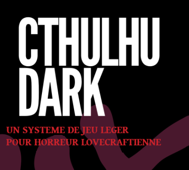
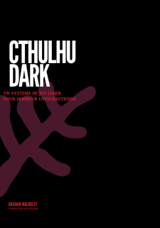
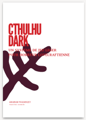

---
tags:
    - Cthulhu Dark
    - Download
---

Cthulhu Dark, le jeu de rôles complet de Graham Walmsley traduit en français et dans un PDF gratuit de 6 pages !

Nous vous proposons deux versions :

* Version "dark"
* Version "imprimable"

# Utilisation

Idéal pour initier des joueurs au monde de Lovecraft et aux horreurs lovecraftiennes, ainsi que pour recycler vos scénarios Cthulhu sans vous remettre dans le système de jeu original.
Système de jeu

Le système de jeu ultra-simple inventé par Graham est totalement adapté à l'univers du Mythe de Cthulhu et maîtrisable en quelques minutes.
Et enfin...

Attention, la Folie vous guette !

# Liens

N'hésitez pas à acheter les suppléments de Graham (en anglais pour le moment) : https://thievesoftime.bigcartel.com

<table>
<tr>
<td><button type="submit" style="font-size:16px;border-radius: 4px;font-weight: bold;background:#fa5c5c;color:white;padding:10px" onclick="window.location.href='../../files/cthulhu-dark/cthulhu-dark-fr-v1-0.pdf';">Télécharger</button></td>
<td style="font-size:16px">cthulhu-dark-fr-v1-0.pdf</td>
</tr>
<tr>
<td><button type="submit" style="font-size:16px;border-radius: 4px;font-weight: bold;background:#fa5c5c;color:white;padding:10px" onclick="window.location.href='../../files/cthulhu-dark/cthulhu-dark-fr-print-v1-0.pdf';">Télécharger</button></td>
<td style="font-size:16px">cthulhu-dark-fr-print-v1-0.pdf</td>
</tr>
</table>

