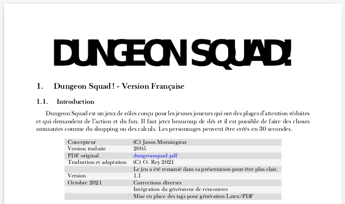

---
tags:
    - DungeonSquad
    - Download
---

DungeonSquad! est un jeu de rôles simple et amusant usant de dés polyédriques. Il est parfaitement adapté pour jouer avec les enfants et les initier au jeu de rôle.

Vous pouvez aussi télécharger :

* L'écran du MJ,
* Les feuilles de personnage,
* Le générateur de labyrinthe.

<table>
<tr>
<td><button type="submit" style="font-size:16px;border-radius: 4px;font-weight: bold;background:#fa5c5c;color:white;padding:10px" onclick="window.location.href='../../files/dungeonsquad/DungeonSquad-VersionFrancaise-OreyJdr01.pdf';">Télécharger</button></td>
<td style="font-size:16px">DungeonSquad-VersionFrancaise-OreyJdr01.pdf</td>
</tr>
<tr>
<td><button type="submit" style="font-size:16px;border-radius: 4px;font-weight: bold;background:#fa5c5c;color:white;padding:10px" onclick="window.location.href='../../files/dungeonsquad/DungeonSquadFr-Ecran.pdf';">Télécharger</button></td>
<td style="font-size:16px">DungeonSquadFr-Ecran.pdf</td>
</tr>
<tr>
<td><button type="submit" style="font-size:16px;border-radius: 4px;font-weight: bold;background:#fa5c5c;color:white;padding:10px" onclick="window.location.href='../../files/dungeonsquad/DungeonSquadFr-FeuillePerso.pdf';">Télécharger</button></td>
<td style="font-size:16px">DungeonSquadFr-FeuillePerso.pdf</td>
</tr>
<tr>
<td><button type="submit" style="font-size:16px;border-radius: 4px;font-weight: bold;background:#fa5c5c;color:white;padding:10px" onclick="window.location.href='../../files/dungeonsquad/GenerateurDeLabyrinthe-OreyJdr02.pdf';">Télécharger</button></td>
<td style="font-size:16px">GenerateurDeLabyrinthe-OreyJdr02.pdf</td>
</tr>
</table>

