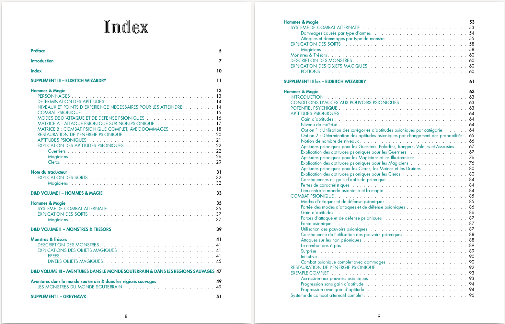
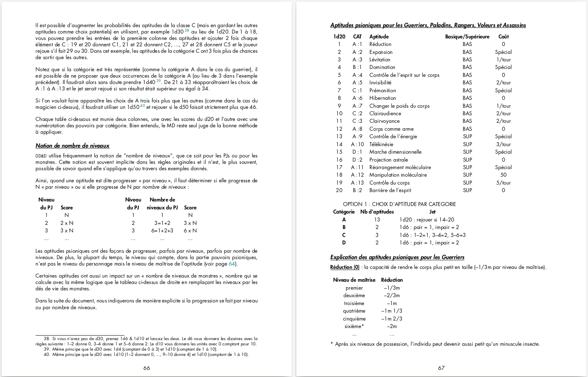

---
tags:
    - D&D
    - Download
---

# A l'origine des pouvoirs psioniques dans le jeu de rôles

Le terme anglais *psionic* a été utilisé la première fois en 1951 dans une nouvelle de science-fiction écrite par Jack Williamson, *The Greatest Invention*, publié dans le magazine *Astounding Science Fiction*. Il est la compression de deux termes : *psi* dans le sens de phénomène psychique,
et *electronics*. *Psionics* devient un terme décrivant la discipline qui étudie les phénomènes psychiques avec les moyens de l’ingénierie moderne de l’époque, soit l’électronique. Malgré la promotion de personnes comme John W. Campbell, le terme restera utilisé uniquement dans le monde de
la science-fiction, avant d’être intégré dans le monde des jeux de rôles.

La version originale de Donjons & Dragons, dite OD&D, est publiée en 1974 sous la forme de trois livrets à la couverture marron. On trouve dans le premier livret, *Men & Magic*, un certain nombre de sorts ressemblant à des pouvoirs psychiques, et dans le deuxième, *Monsters & Treasures*, les
premières références à des pouvoirs psychiques, dans la section traitant des épées magiques. A l’époque, le terme *psionic* n’est pas utilisé.

En 1976, dans le troisième supplément Eldritch Wizardry cosigné par Gary Gygax et Brian Blume, publié après *Greyhawk* et *Blackmoor*, les pouvoirs psychiques arrivent dans le monde des personnages-joueurs et des personnages-non-joueurs. Les règles sont présentées de manière assez
chaotique, ce qui générera vite la réputation d’un système injouable dans le monde des joueurs.

Derrière la juste critique sur la présentation, beaucoup de joueurs semblent avoir rejeté le supplément en raison du fait même de proposer, en extension à un jeu médiéval-fantastique, une gestion des pouvoirs mentaux, habituellement présents dans les univers de science-fiction.

Nous proposons ici une double présentation des règles psioniques du supplément *Eldritch Wizardry*, supplément qui contient d’autres choses non traduites en ces pages (notamment le Druide, des monstres, etc.) :

* La première partie propose une traduction complète, la plus fidèle possible, des règles originales relatives aux pouvoirs psioniques. En effet, le texte original étant touffu, nous avons veillé à traduire le plus fidèlement possible ses nuances (ce qui donne un style parfois
un peu lourd, proche du style original). Dans cette partie, nous avons tenté de respecter l’aspect original des règles (polices, alignements, etc.).
* Cette première partie a été, en quelque sorte, « augmentée » : en effet, *Eldritch Wizardry* étant une extension de OD&D, le texte pointe vers les références présentes dans les livrets précédents ; nous avons extrait ces références pour en proposer une traduction au sein même de ce livre, de sorte que cette compilation devrait se suffire à elle-même et ne pas
nécessiter d’ouvrir les ouvrages précédents de la série.
* La seconde partie propose une réorganisation complète de ces règles visant à les présenter de manière plus claire et plus logique ; nous espérons que nous aurons été à la hauteur du chantier, plus complexe qu’il n’y paraissait au départ.

La consultation de certains sites américains a été nécessaire pour s’assurer de la bonne compréhension de certaines règles ambiguës qui, encore aujourd’hui, provoquent des commentaires et des incompréhensions.

Une fois éclairci, le système se montre très intéressant, non seulement parce qu’il est très « gygaxien » (on le voit notamment au travers de l’utilisation de règles gigognes), mais aussi parce qu’il est le premier système complet de pouvoirs psychiques, très différent de la magie de OD&D,
et qu’il inspirera beaucoup d’autres systèmes de pouvoirs basés sur la consommation de points d’énergie psionique.

Rouboudou

Août 2023

# Téléchargements

Téléchargez le document.

<table>
<tr>
<td><button type="submit" style="font-size:16px;border-radius: 4px;font-weight: bold;background:#fa5c5c;color:white;padding:10px" onclick="window.location.href='../../files/eldritch-wizardry/EldritchWizardry-PouvoirsEtCombatPsionique-FR-v1-0.pdf';">Télécharger v1.1</button></td>
<td style="font-size:16px;vertical-align:middle;">EldritchWizardry-PouvoirsEtCombatPsionique-FR-v1-1.pdf</td>
</tr>
<tr>
<td><button type="submit" style="font-size:16px;border-radius: 4px;font-weight: bold;background:#fa5c5c;color:white;padding:10px" onclick="window.location.href='../../files/eldritch-wizardry/EldritchWizardry-PouvoirsEtCombatPsionique-FR-v1-0.pdf';">Télécharger v1.0</button></td>
<td style="font-size:16px;vertical-align:middle;">EldritchWizardry-PouvoirsEtCombatPsionique-FR-v1-0.pdf</td>
</tr>
</table>

# License

Ce document est une oeuvre de fan, est gratuit et ne peut être vendu et est mis à disposition sous la licence OGL.

## OPEN GAME LICENSE Version 1.0a

The following text is the property of Wizards of the Coast, Inc. and is Copyright 2000 Wizards of the Coast, Inc (”Wizards”). All Rights Reserved.

1. Definitions :

(a)”Contributors” means the copyright and/or trademark owners who have contributed Open Game
Content ;

(b)”Derivative Material” means copyrighted material including derivative works and translations (in-
cluding into other computer languages), potation, modification, correction, addition, extension, up-
grade, improvement, compilation, abridgment or other form in which an existing work may be recast,
transformed or adapted ;

(c) ”Distribute” means to reproduce, license, rent, lease, sell, broadcast, publicly display, transmit or
otherwise distribute ;

(d)”Open Game Content” means the game mechanic and includes the methods, procedures, pro-
cesses and routines to the extent such content does not embody the Product Identity and is an enhan-
cement over the prior art and any additional content clearly identified as Open Game Content by
the Contributor, and means any work covered by this License, including translations and derivative
works under copyright law, but specifically excludes Product Identity.

(e) ”Product Identity” means product and product line names, logos and identifying marks including
trade dress ; artifacts ; creatures characters ; stories, storylines, plots, thematic elements, dialogue,
incidents, language, artwork, symbols, designs, depictions, likenesses, formats, poses, concepts,
themes and graphic, photographic and other visual or audio representations ; names and descriptions
of characters, spells, enchantments, personalities, teams, personas, likenesses and special abilities ;
places, locations, environments, creatures, equipment, magical or supernatural abilities or effects,
logos, symbols, or graphic designs ; and any other trademark or registered trademark clearly iden-
tified as Product identity by the owner of the Product Identity, and which specifically excludes the
Open Game Content ;

(f) ”Trademark” means the logos, names, mark, sign, motto, designs that are used by a Contributor
to identify itself or its products or the associated products contributed to the Open Game License by
the Contributor

(g) ”Use”, ”Used” or ”Using” means to use, Distribute, copy, edit, format, modify, translate and
otherwise create Derivative Material of Open Game Content.

(h) ”You” or ”Your” means the licensee in terms of this agreement.

2. The License : This License applies to any Open Game Content that contains a notice indicating that
the Open Game Content may only be Used under and in terms of this License. You must affix such
a notice to any Open Game Content that you Use. No terms may be added to or subtracted from
this License except as described by the License itself. No other terms or conditions may be applied
to any Open Game Content distributed using this License.

3. Offer and Acceptance : By Using the Open Game Content You indicate Your acceptance of the
terms of this License.

4. Grant and Consideration : In consideration for agreeing to use this License, the Contributors grant
You a perpetual, worldwide, royalty-free, non-exclusive license with the exact terms of this License to
Use, the Open Game Content.

5. Representation of Authority to Contribute : If You are contributing original material as Open Game
Content, You represent that Your Contributions are Your original creation and/or You have sufficient
rights to grant the rights conveyed by this License.

6. Notice of License Copyright : You must update the COPYRIGHT NOTICE portion of this License
to include the exact text of the COPYRIGHT NOTICE of any Open Game Content You are copying,
modifying or distributing, and You must add the title, the copyright date, and the copyright holder’s
name to the COPYRIGHT NOTICE of any original Open Game Content you Distribute.

7. Use of Product Identity : You agree not to Use any Product Identity, including as an indication as
to compatibility, except as expressly licensed in another, independent Agreement with the owner of
each element of that Product Identity. You agree not to indicate compatibility or co-adaptability with
any Trademark or Registered Trademark in conjunction with a work containing Open Game Content
except as expressly licensed in another, independent Agreement with the owner of such Trademark
or Registered Trademark. The use of any Product Identity in Open Game Content does not constitute
a challenge to the ownership of that Product Identity. The owner of any Product Identity used in Open
Game Content shall retain all rights, title and interest in and to that Product Identity.

8. Identification : If you distribute Open Game Content You must clearly indicate which portions of
the work that you are distributing are Open Game Content.

9. Updating the License : Wizards or its designated Agents may publish updated versions of this
License. You may use any authorized version of this License to copy, modify and distribute any Open
Game Content originally distributed under any version of this License.

10. Copy of this License : You MUST include a copy of this License with every copy of the Open
Game Content You Distribute.

11. Use of Contributor Credits : You may not market or advertise the Open Game Content using the
name of any Contributor unless You have written permission from the Contributor to do so.

12. Inability to Comply : If it is impossible for You to comply with any of the terms of this License
with respect to some or all of the Open Game Content due to statute, judicial order, or governmental
regulation then You may not Use any Open Game Material so affected.

13. Termination : This License will terminate automatically if You fail to comply with all terms herein
and fail to cure such breach within 30 days of becoming aware of the breach. All sublicenses shall
survive the termination of this License.

14. Reformation : If any provision of this License is held to be unenforceable, such provision shall be
reformed only to the extent necessary to make it enforceable.

15. COPYRIGHT NOTICE

Open Game License v 1.0a Copyright 2000, Wizards of the Coast, Inc. System Reference Document Copyright 2000-2003, Wizards of the Coast, Inc. ; Authors Jonathan Tweet, Monte Cook, Skip Williams, Rich Baker, Andy Collins, David Noonan, Rich Redman, Bruce R. Cordell, John D. Rateliff, Thomas Reid, James Wyatt, based on original material by E. Gary Gygax and Dave Arneson.

Les sources de ce document sont les 3 premiers livrets de OD&D et les trois premiers suppléments, à commencer bien sûr par Eldritch Wizardry. Ce contenu est Copyright Wizards of the Coast, Inc.

© Traduction, adaptation et compléments par Olivier (rouboudou) Rey, rey.olivier@gmail.com,

orey.github.io/blog.

END OF LICENSE
