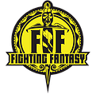
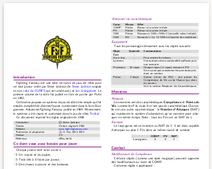

---
tags:
    - FightingFantasy
    - Download
---

Fighting Fantasy est une série de livres de jeux de rôles pour un seul joueur créée par Steve Jackson (le Steve Jackson anglais et non celui de GURPS qui est américain) et Ian Livingstone. Le premier volume de la série fut publié en livre de poche par Pufin en 1982.

Cette série propose un système de jeu de rôles très simple qui fut ensuite complété de diverses façons, notamment dans le livre Dungeoneer, Advanced Fighting Fantasy, publié en 1989. Récemment, le système a été repris et customisé dans le jeu de rôles Troika!.

Ce document reprend les règles originales de 1984.

<table>
<tr>
<td><button type="submit" style="font-size:16px;border-radius: 4px;font-weight: bold;background:#fa5c5c;color:white;padding:10px" onclick="window.location.href='../../files/fighting-fantasy/FightingFantasy-VersionFrancaise-OreyJdr13.pdf';">Télécharger</button></td>
<td style="font-size:16px">FightingFantasy-VersionFrancaise-OreyJdr13.pdf</td>
</tr>
<tr>
<td><button type="submit" style="font-size:16px;border-radius: 4px;font-weight: bold;background:#fa5c5c;color:white;padding:10px" onclick="window.location.href='../../files/fighting-fantasy/FightingFantasy-VersionFrancaise-OreyJdr03.pdf';">Télécharger</button></td>
<td style="font-size:16px">Ancienne version</td>
</tr>
</table>

