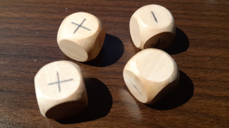

---
tags:
    - Fudge
    - Download
---

Fudge est un jeu de rôles très intéressant avec une mécanique de gestion des échelles très innovante. Il a inspiré Fate et tout un tas de jeux utilisant des adjectifs en lieu et place des valeurs numériques.

Fudge en une page est la traduction du document original en américain.

A consommer sans modération si vous voulez un système de jeu simple, innovant et efficace !

<table>
<tr>
<td><button type="submit" style="font-size:16px;border-radius: 4px;font-weight: bold;background:#fa5c5c;color:white;padding:10px" onclick="window.location.href='../../files/fudge/FudgeEnUnePage-OReyJdr04.pdf';">Télécharger</button></td>
<td style="font-size:16px">FudgeEnUnePage-OReyJdr04.pdf</td>
</tr>
</table>

