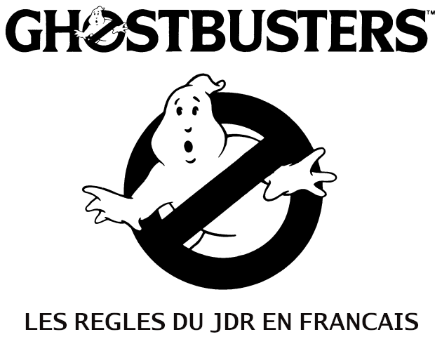
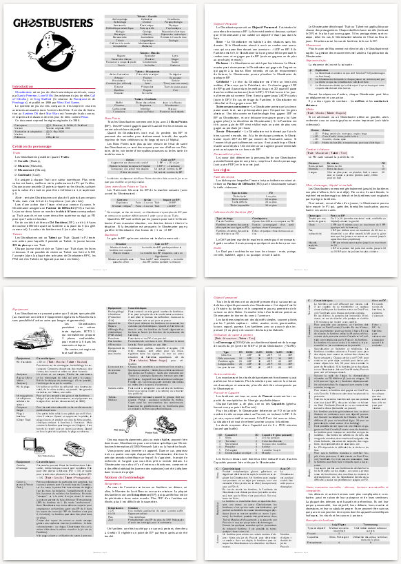

---
tags:
    - Ghostbuster
    - D6 System
    - Download
---

# Un jeu de rôles humoristique conçu par des pointures du genre

[Ghostbusters](https://en.wikipedia.org/wiki/Ghostbusters_(role-playing_game)) est un jeu de rôles humoristique américain, conçu par [Sandy Petersen](https://en.wikipedia.org/wiki/Sandy_Petersen), [Lynn Willis](https://en.wikipedia.org/wiki/Lynn_Willis) (les créateurs du jeu de rôles [Call of Cthulhu](https://en.wikipedia.org/wiki/Call_of_Cthulhu_(role-playing_game))), et [Greg Stafford](https://en.wikipedia.org/wiki/Greg_Stafford) (le créateur de [Runequest](https://en.wikipedia.org/wiki/RuneQuest) et de [Pendragon](https://en.wikipedia.org/wiki/Pendragon_(role-playing_game))), et publié en 1986 par [West End Games](https://en.wikipedia.org/wiki/West_End_Games).

Le système de jeu est très compact et très simple et vise des aventures amusantes dans l’univers des films.

Ce système servira de fondation au [Système D6](https://en.wikipedia.org/wiki/D6_System) dont [Star Wars](https://en.wikipedia.org/wiki/Star_Wars:_The_Roleplaying_Game) est l’exemple le plus connu, et inspirera des dizaines de mini-jeux de rôles comme [Risus](https://orey.github.io/blog/downloads/risus/).

Nous reprenons les règles originales de 1986.

# Un jeu simple et cohérent avec de simples dés à 6 faces

Chaque Ghostbuster possède 4 Traits et 4 Talents (1 par Trait) :

* Muscles,
* Mouvement,
* Cervelle,
* Coolitude.

Il possède aussi des Bons Points pour faire face aux imprévus (et il y en aura !).

Les règles proposent :

* La création des personnages ;
* Les règles du jeu (faire des choses, influence du dé fantôme, duels, combats, équipements, etc.) ;
* Des notions de fantomologie !

# Téléchargements

Téléchargez les règles du jeu et les fiches de personnages.

<table>
<tr>
<td><button type="submit" style="font-size:16px;border-radius: 4px;font-weight: bold;background:#fa5c5c;color:white;padding:10px" onclick="window.location.href='../../files/ghostbusters/Ghostbusters-fr-OReyJdr14-v1-0.pdf';">Télécharger</button></td>
<td style="font-size:16px">Ghostbusters-fr-OReyJdr14-v1-0.pdf</td>
</tr>
<tr>
<td><button type="submit" style="font-size:16px;border-radius: 4px;font-weight: bold;background:#fa5c5c;color:white;padding:10px" onclick="window.location.href='../../files/ghostbusters/Ghostbusters-fr-FeuillePerso-A4.pdf';">Télécharger</button></td>
<td style="font-size:16px">Feuilles de personnages</td>
</tr>
</table>

