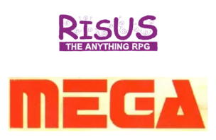

---
tags:
    - Mega
    - Download
---

# Risus pour Méga !

Des règles hyper-simples et graphiques pour jouer à Méga avec les règles hyper-simples de Risus !

Idéal pour jouer sur le pouce à des aventures Méga en gardant l'esprit des différentes versions du jeu (Transit, Transfert, pouvoirs psy) mais sans la complexité du système de jeu !

Allez-y, c'est gratuit !

# Resources pour Méga

* Méga 1 (1984) : [Méga 1](https://archive.org/details/jeux-et-strategie-hs-1)
* Méga 2 (1986) : [Méga 2](https://archive.org/details/jeux-et-strategie-hs-2)
* Méga 3 (1992) : [Fiche Grog](https://www.legrog.org/jeux/mega/mega-3/mega-iii-fr-47583)
* Méga 4 (2012) : [Superbes encyclopédie et scenarii sur messagers-galactiques.com](https://www.messagers-galactiques.com/)
* Méga 5 (2018) : [Fiche Grog](https://www.legrog.org/jeux/mega/mega-5e-paradigme/mega-5e-paradigme-fr)

# Resources pour Risus

* Risus EN : [Risus the RPG](https://www.drivethrurpg.com/product/170294/Risus-The-Anything-RPG) (c) Big Dice Games
* Risus FR : [Risus, traduction de Tristan Lhomme](risus.md)
* [risusrpg.com](https://www.risusrpg.com/)
* [risuiverse](https://www.risusiverse.com/)
* [Ressources Risus FR](risus.md)

<table>
<tr>
<td><button type="submit" style="font-size:16px;border-radius: 4px;font-weight: bold;background:#fa5c5c;color:white;padding:10px" onclick="window.location.href='../../files/mega/Risus-Mega-OReyJdr07.pdf';">Télécharger</button></td>
<td style="font-size:16px">Risus-Mega-OReyJdr07.pdf</td>
</tr>
</table>

