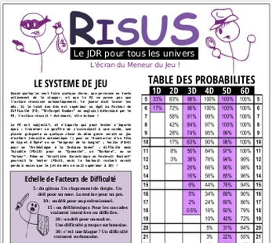
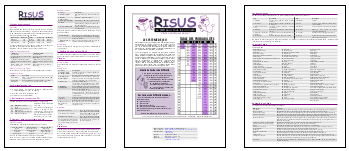

---
tags:
    - Risus
    - Download
---

# Un écran jeu Risus avec toutes les règles !

Vous trouverez ci-dessous un écran (3 x A4 portrait) pour  Risus en français !

Sur la page de gauche, toutes les règles de Risus en une page simple et sans blabla superflu. Sur la page du centre, la traduction de l'écran Risus officiel. Sur la page de droite, des tables Risus pour vous aider à créer un personnage :

* Les douze travaux, où quels types de défis attendent les joueurs dans toutes les aventures ;
* Le dernier Cliché : une table amusante avec des idées plus ou moins sérieuses pour le dernier Cliché (dans l'esprit d'un PJ à 4 Clichés (4) (3) (2) et (1)) ;
* Anatomie d'un Cliché : une table pour expliquer les différentes dimensions du Cliché et potentiellement en choisir des assez vastes pour le jeu. 

Avec cet écran jeu, vous pouvez jouer n'importe où dans n'importe quel univers !

# Un flowchart en français pour Risus avec toutes les fonctions du jeu

* Pratique comme aide-mémoire.
* A imprimer sur du A3/A4 paysage et à attacher sur n'importe quel écran de MJ.
* 2 formats disponibles: PDF et PNG.

# Jouer à Méga, le jeu des messagers galactiques, avec Risus

[C'est possible](mega.md) !

# En prime : la traduction de Tristan Lhomme !

C'est le fichier risus-fr. Il était localisé sur un drive mais il ne semble plus être très accessible donc je le republie.

# Licence

Risus est un jeu en anglais créé par S. John Ross et (C) risusrpg.com/Big Dice Games. Il existe une traduction française de Tristan Lhomme.

# Téléchargements

<table>
<tr>
<td><button type="submit" style="font-size:16px;border-radius: 4px;font-weight: bold;background:#fa5c5c;color:white;padding:10px" onclick="window.location.href='../../files/risus/Risus-JeuEtEcranComplet-3A4-v3-OReyJdr12.pdf';">Télécharger</button></td>
<td style="font-size:16px">Risus-JeuEtEcranComplet-3A4-v3-OReyJdr12.pdf</td>
</tr>
<tr>
<td><button type="submit" style="font-size:16px;border-radius: 4px;font-weight: bold;background:#fa5c5c;color:white;padding:10px" onclick="window.location.href='../../files/risus/Risus-flowchart-big-OReyJdr10.png';">Télécharger</button></td>
<td style="font-size:16px">Risus-flowchart-big-OReyJdr10.png</td>
</tr>
<tr>
<td><button type="submit" style="font-size:16px;border-radius: 4px;font-weight: bold;background:#fa5c5c;color:white;padding:10px" onclick="window.location.href='../../files/risus/Risus-flowchart-OReyJdr10.png';">Télécharger</button></td>
<td style="font-size:16px">Risus-flowchart-OReyJdr10.png</td>
</tr>
<tr>
<td><button type="submit" style="font-size:16px;border-radius: 4px;font-weight: bold;background:#fa5c5c;color:white;padding:10px" onclick="window.location.href='../../files/risus/Risus-flowchart-OReyJdr10.pdf';">Télécharger</button></td>
<td style="font-size:16px">Risus-flowchart-OReyJdr10.pdf</td>
</tr>
<tr>
<td><button type="submit" style="font-size:16px;border-radius: 4px;font-weight: bold;background:#fa5c5c;color:white;padding:10px" onclick="window.location.href='../../files/risus/risus-fr.pdf';">Télécharger</button></td>
<td style="font-size:16px">risus-fr.pdf</td>
</tr>
</table>
