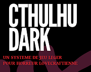
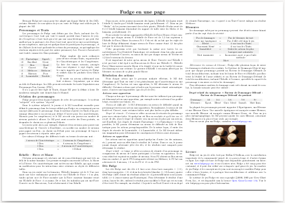

## Cthulhu Fhtagn A Lot

<table>
<tr>
<th> Français </th>
<th> English </th>
</tr>
<tr>
<td> Profitons-en pendant que Cthulhu Fhtagn ! Ce site vous propose diverses choses en français ou en anglais sur les jeux de rôles (JDR). </td>
<td> Enjoy while Cthulhu Fhtagn! This site proposes various stuff in English and French about tabletop roleplaying games (TTRPG). </td>
</tr>
</table>

## The Blog - Le Blog

<table>
<tr>
<td>

</td>
<td>
Parfois en français, parfois en anglais, diverses notes, études et commentaires sur les JDR
  
<a href="./blog/202205/">Le Blog</a>
</td>
<td>
Sometimes in English, sometimes in French, various notes, studies and comments about TTRPG
  
<a href="./blog/202205/">The Blog</a>
</td>
</tr>
</table>

## Téléchargements JDR gratuits

### Cthulhu Dark

<table>
<tr><td></td>
<td><b>Cthulhu Dark JDR en français</b> 
by <a href="https://rouboudou.itch.io">rouboudou</a> 
Cthulhu Dark, le jeu de rôles en français 
 
</td></tr>
</table>

### La Grande Liste des intrigues de JDR

<table>
<tr><td></td>
<td><b>La Grande Liste des intrigues de JDR</b> 
by <a href="https://rouboudou.itch.io">rouboudou</a> 
La Grande Liste des intrigues de JDR 
 
</td></tr>
</table>

### Risus, l'écran-jeu

<table>
<tr><td></td>
<td><b>Risus, l'écran-jeu</b> 
by <a href="https://rouboudou.itch.io">rouboudou</a> 
Risus, l'écran-jeu 
 
</td></tr>
</table>

### Jouer à Méga avec Risus

<table>
<tr><td></td>
<td><b>Méga motorisé par Risus</b> 
by <a href="https://rouboudou.itch.io">rouboudou</a> 
Jouer à Méga avec Risus 
 
</td></tr>
</table>

### Fudge en une page

<table>
<tr><td></td>
<td><b>Fudge en une page</b> 
by <a href="https://rouboudou.itch.io">rouboudou</a> 
Fudge en une page 
 
</td></tr>
</table>

## JDR pour enfants

### DungeonSquad, le JDR pour enfants

<table>
<tr><td></td>
<td><b>DungeonSquad! le JDR</b> 
by <a href="https://rouboudou.itch.io">rouboudou</a> 
DungeonSquad! le JDR 
 
</td></tr>
</table>

### Première Fable, le JDR pour enfants

<table>
<tr><td></td>
<td><b>Première Fable, le JDR</b> 
by rouboudou 
Première Fable le JDR 
<a href="https://orey.github.io/premierefable"><button type="submit" style="font-size:16px;border-radius: 4px;font-weight: bold;background:#fa5c5c;color:white;padding:10px" onclick="window.location.href='https://orey.github.io/premierefable';">Site dédié</button></a> 
</table>

## Mini-sites

| Mini-sites                               | Contenu               |
|------------------------------------------|-----------------------|
| <https://orey.github.io/cthulhu-dark-fr> | Cthulhu Dark en ligne |
| <https://orey.github.io/premierefable>   | Première Fable        |

## Mes repos git de JDR

| Repo généralistes               | Contenu                           |
|---------------------------------|-----------------------------------|
| <https://github.com/orey/jdr>   | Repo principal en français        |
| <https://github.com/orey/ttrpg> | Main English repo                 |
| <https://github.com/orey/DandD> | D&D 0e and AD&D 1e rare resources |

| Repo dédiés                                    | Contenu                              |
|------------------------------------------------|--------------------------------------|
| <https://github.com/orey/cthulhu-dark-fr>      | Cthulhu Dark                         |
| <https://github.com/orey/jdr-biglist-fr>       | La Grande liste des intrigues de JDR |
| <https://github.com/orey/jdr-dungeon-squad-fr> | DungeonSquad!                        |
| <https://github.com/orey/jdr-risus>            | Risus                                |
| <https://github.com/orey/jdr-fudge>            | Fudge                                |
| <https://github.com/orey/mytroika>             | My Troika                            |
| <https://github.com/orey/premierefable>        | Première Fable                                     |

## Links

* [Links](links.md)

## About

* [About me](about.md)

