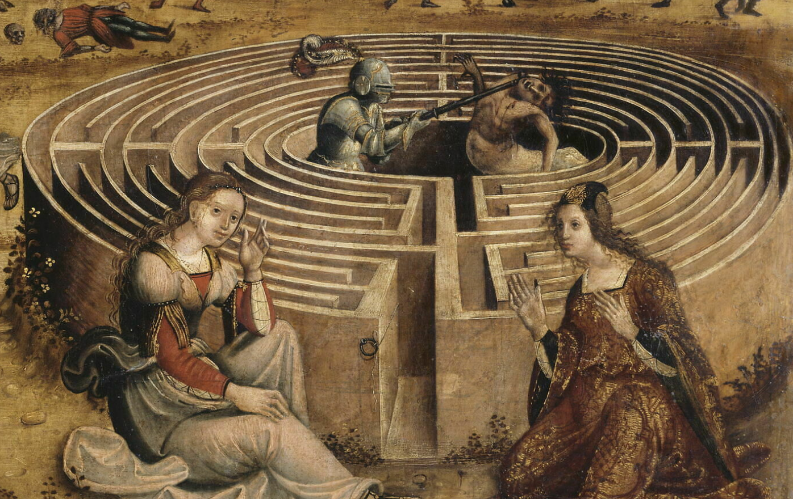

# Cthulhu Fhtagn A Lot

<table>
<tr>
<th> Français </th>
<th> English </th>
</tr>
<tr>
<td style="font-size:16px;color:red;">Profitons-en pendant que Cthulhu Fhtagn ! Ce site vous propose diverses choses en français ou en anglais sur les jeux de rôles (JDR). </td>
<td style="font-size:16px;">Enjoy while Cthulhu Fhtagn! This site proposes various stuff in English and French about tabletop roleplaying games (TTRPG). </td>
</tr>
</table>

# The Blog - Le Blog

<table>
<tr>
<td>

</td>
<td style="font-size:14px;">
<a href="./blog/202308/">Le Blog</a>
 
Parfois en français, parfois en anglais, diverses notes, études et commentaires sur les JDR
</td>
<td style="font-size:14px;">
<a href="./blog/202308/">The Blog</a>
 
Sometimes in English, sometimes in French, various notes, studies and comments about TTRPG
</td>
</tr>
</table>

# Téléchargements JDR gratuits

## OD&D Eldritch Wizardry - Pouvoirs et combat psionique (1976)

<table>
    <tr><td></td>
    <td><b>OD&D Eldritch Wizardry - Pouvoirs et combat psionique (1976), les règles en français</b> 
    par <a href="./about">rouboudou</a> 
    <button  type="submit" style="font-size:16px;border-radius: 4px;font-weight: bold;background:#fa5c5c;color:white;padding:10px" onclick="window.location.href='./downloads/eldritch-wizardry'">Page dédiée</button> 
    </td></tr>
</table>

## Ghostbusters (1986)

<table>
    <tr><td></td>
    <td><b>Ghostbusters (1986), les règles en français</b> 
    par <a href="./about">rouboudou</a> 
    <button  type="submit" style="font-size:16px;border-radius: 4px;font-weight: bold;background:#fa5c5c;color:white;padding:10px" onclick="window.location.href='./downloads/ghostbusters'">Page dédiée</button> 
    </td></tr>
</table>

## Fighting Fantasy (1984)

<table>
    <tr><td></td>
    <td><b>Fighting Fantasy (1984) en français</b> 
    par <a href="./about">rouboudou</a> 
    <button  type="submit" style="font-size:16px;border-radius: 4px;font-weight: bold;background:#fa5c5c;color:white;padding:10px" onclick="window.location.href='./downloads/fighting-fantasy'">Page dédiée</button> 
    </td></tr>
</table>

## Cthulhu Dark

<table>
<tr><td></td>
<td><b>Cthulhu Dark JDR en français</b> 
par <a href="./about">rouboudou</a> 
<button onclick="window.location.href='./downloads/cthulhu-dark'">Page dédiée</button> 
 
<button type="button"  type="submit" style="font-size:16px;border-radius: 4px;font-weight: bold;background:#fa5c5c;color:white;padding:10px" onclick="window.location.href='https://orey.github.io/cthulhu-dark-fr'">Mini-site</button> 
</td></tr>
</table>

## La Grande Liste des intrigues de JDR

<table>
<tr><td></td>
<td><b>La Grande Liste des intrigues de JDR</b> 
par <a href="./about">rouboudou</a> 
<button  type="submit" style="font-size:16px;border-radius: 4px;font-weight: bold;background:#fa5c5c;color:white;padding:10px" onclick="window.location.href='./downloads/grande-liste'">Page dédiée</button>
</td></tr>
</table>

## Risus, l'écran-jeu

<table>
<tr><td></td>
<td><b>Risus, l'écran-jeu</b> 
par <a href="./about">rouboudou</a> 
<button  type="submit" style="font-size:16px;border-radius: 4px;font-weight: bold;background:#fa5c5c;color:white;padding:10px" onclick="window.location.href='./downloads/risus'">Page dédiée</button>
</td></tr>
</table>

## Jouer à Méga avec Risus

<table>
<tr><td></td>
<td><b>Méga motorisé par Risus</b> 
par <a href="./about">rouboudou</a> 
<button  type="submit" style="font-size:16px;border-radius: 4px;font-weight: bold;background:#fa5c5c;color:white;padding:10px" onclick="window.location.href='./downloads/mega'">Page dédiée</button>
</td></tr>
</table>

## Fudge en une page

<table>
<tr><td></td>
<td><b>Fudge en une page</b> 
par <a href="./about">rouboudou</a> 
<button  type="submit" style="font-size:16px;border-radius: 4px;font-weight: bold;background:#fa5c5c;color:white;padding:10px" onclick="window.location.href='./downloads/fudge'">Page dédiée</button>
</td></tr>
</table>

# JDR pour enfants

## DungeonSquad, le JDR pour enfants

<table>
<tr><td></td>
<td><b>DungeonSquad! le JDR</b> 
par <a href="./about">rouboudou</a> 
<button  type="submit" style="font-size:16px;border-radius: 4px;font-weight: bold;background:#fa5c5c;color:white;padding:10px" onclick="window.location.href='./downloads/dungeonsquad'">Page dédiée</button>
</td></tr>
</table>

## Première Fable, le JDR pour enfants

<table>
<tr><td></td>
<td><b>Première Fable, le JDR</b> 
par <a href="./about">rouboudou</a> 
Première Fable le JDR 
<a href="https://orey.github.io/premierefable"><button  type="submit" style="font-size:16px;border-radius: 4px;font-weight: bold;background:#fa5c5c;color:white;padding:10px"  onclick="window.location.href='https://orey.github.io/premierefable';">Site dédié</button></a> 
</td></tr>
</table>

# Links

* [Links](links.md)
* <a href="gme-version1-0.html">GME (beta)</a>

# About

* [About me](about.md)

