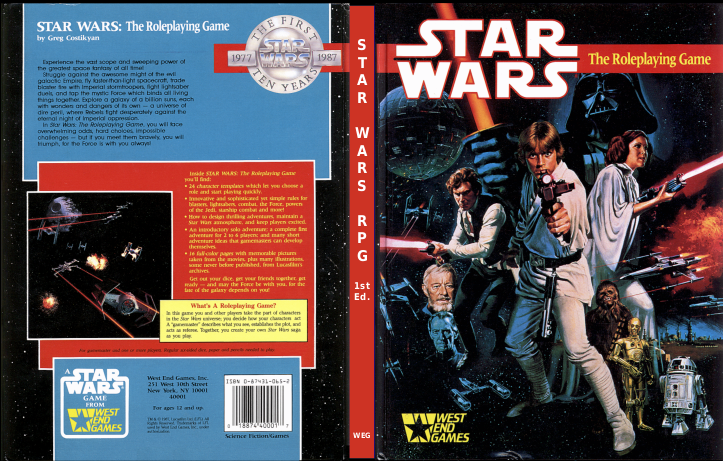

---
tags:
  - Champions
  - D6 System
  - Ghostbusters
  - GURPS
  - Star Wars
---

# Les premiers jeux n'utilisant que des D6

Le premier jeu n'utilisant que des D6 est le JDR *Champions* en 1981. Ce jeu a donné le système *Hero System* plus tard. Dans les années 80, un certain nombre de jeux vont utiliser ce système.

En 1986, sont publiés deux jeux D6 qui ont marqué l'histoire du JDR :

* *GURPS*,
* *Ghostbusters*.

C'est *Ghostbusters* qui va inspirer Greg Costikyan pour le système de jeu de *Star Wars* 1e ("1e" comme "première édition").

*Ghostbusters* est un système simple et amusant (voir [la page dédiée](../downloads/ghostbusters.md) sur ce site).
 

# Ghostbusters RPG, le précurseur

La mécanique de *Ghostbusters* est simple. Les personnages ont des caractéristiques (*Traits*) et des [compétences liées](patterns.md#competences-liees) (*Talents*).

Les joueurs ont 12D à répartir dans les caractéristiques *Brains*, *Muscle*, *Moves*, et *Cool* et doivent choisir une compétence par caractéristique (ce qui leur donne un bonus de +3D lorsqu'ils utilisent cette compétence). En cas de test, le MJ détermine une difficulté sur une [table](patterns.md#table-de-difficultes) et les joueurs lancent les dés correspondant soit à leur caractéristique seule, soit au total de leur caractéristique et de leur compétence.

Pour le combat, le MJ détermine quelle caractéristique/compétence est utilisée par les PJ et les PNJ et le meilleur total l'emporte.

# Star Wars 1e : le premier vrai début de l'aventure D6

La première édition (1e) de *Star Wars* a, en 1987, apporté de nombreuses nouveautés au monde du JDR, en tous cas en France où les systèmes de jeu étaient généralement ou *D&D* avec une mécanique d20 ou *Call of Cthulhu* avec une mécanique d100.

*(Couverture du reprint maison de la première édition US de Star Wars)*

Costikyan va développer le système d'une manière impressionnante et nous allons voir quelques unes de ces mécaniques de jeu. Certaines ont d'ailleurs été corrigées ensuite, pas forcément pour le mieux d'ailleurs.

Nous allons tenter de mettre en perspective historique les règles de *Star Wars* 1e avec les règles des versions ultérieures ou du *D6 System*.

## Personnages

Costikyan garde la mécanique caractéristique et [compétences liées](patterns.md#competences-liees) : les caractéristiques sont nommées *Attributes* et les compétences *Skills*. On compte en moyenne 3D par caractéristiques (comme le jeu en propose 6, nous aurons donc 18D de caractéristiques). Le jeu propose des modèles de personnages qui ont une certaine répartition des 18D sur les 6 caractéristiques : *Strength*, *Dexterity*, *Perception*, *Knowledge*, *Technical*, *Mechanical*.

Les compétences de combat importantes sont classées comme suit :

* Sous *Dexterity* :
  * Esquive
  * Blaster
  * Armes lourdes
  * Mêlée
  * Parade de mêlée
  * Parade de bagarre
* Sous *Strength*
  * Bagarre
  
La difficulté moyenne des actions est de 10, ce qui correspond à environ 60% de chances de réussir pour un PJ ayant une caractéristique de 3D. En effet, la courbe des probabilités de 3D est une courbe en cloche.

Ainsi la probabilité de faire plus qu'un seuil est montrée dans la table suivante :

| Seuil  | Probabilité |
|--------|-------------|
| 3      | 100.00      |
| 4      | 99.54       |
| **5**  | **98.15**   |
| 6      | 95.37       |
| 7      | 90.74       |
| 8      | 83.80       |
| 9      | 74.07       |
| **10** | **62.50**   |
| 11     | 50.00       |
| 12     | 37.50       |
| 13     | 25.93       |
| 14     | 16.20       |
| **15** | **9.26**    |
| 16     | 4.63        |
| 17     | 1.85        |
| 18     | 0.46        |

Par contre, dès lors que la difficulté augmente, les chances d'égaler ou de battre une difficulté diminuent très vite (moins de 10% pour une difficulté 15 pour un score de 3D).

## Round de combat

### Plusieurs actions à la fois

Les PJs possédant des compétences sous forme de nombre de dés, peuvent choisir de faire plus d'une action par round. Lorsque c'est le cas, supposons qu'un PJ veuille fait 2 actions à la fois, toutes ses actions subissent une pénalité de -1D, 3 actions donne une pénalité de -2D sur toutes les actions, etc.

Cette innovation permet à n'importe quel joueur d'avoir l'opportunité de "faire le héros" et elle utilise au mieux l'idée du "[pool de dés](patterns.md#pool-de-des)". Dans *D&D*, il faut avoir beaucoup d'expérience pour disposer de deux attaque par round.

Les combats sont divisés en rounds de 5 secondes divisé en 5 segments : décision, déclaration (joueurs d'abord et MJ ensuite), première action, deuxième action (si elle existe) et potentielles autres actions des PJ/PNJ.

Il n'existe pas de mécanisme d'initiative dans cette version du jeu. Pour autant, le jeu propose un [positionnement physique des joueurs](patterns.md#positionnement-physique-des-joueurs) selon leur rang de perception. La version de Star Wars REUP de 2015 propose un jet de Perception par camp pour trancher le sujet de l'initiative.

### Les compétences de réaction

L'innovation la plus importante, et pourtant une des plus décriée, est la notion de **compétence de réaction** (*Reaction skills*) : l'esquive et les deux parades sont des compétences de réaction. Leur utilisation est intéressante et à l'avantage des joueurs.

Si un joueur n'a pas encore joué son tour, et que son PJ est visé par une attaque, il lui est possible d'utiliser une compétence de réaction *avant son tour* (esquive ou parade). Bien entendu, lorsque le joueur jouera son tour, son action (ou ses actions si le PJ fait de multiples actions dans le round) subiront un malus de -1D.

Le moment intéressant est le suivant : si un PJ a *déjà* joué son tour dans le round et que quelqu'un l'attaque, il peut quand même utiliser une compétence de réaction, mais comme cela sera sa seconde action, il devra le faire avec -1D de malus. Si le joueur avait déclaré vouloir faire deux actions dans le round, ses deux actions auraient -1D de malus. Si une compétence de réaction était utilisée au milieu des deux actions, il devrait tirer la première action avec -1D, la compétence avec -2D et la seconde action avec -2D.

Ce système a été décrié parce qu'il n'était pas "homogène". En effet, le rôle d'une esquive ou d'une parade en cours de round implique de recalculer les chances de succès des actions restantes. On peut voir ça comme une façon extrêmement dynamique de s'adapter à la réalité, et au final assez élégante.

Cette façon de faire a été remise en cause dès le premier compagnon de règles de Star Wars en 1989. La solution proposée est beaucoup moins naturelle : le joueur doit déclarer s'il esquive ou pas en début de round. On retrouve cette approche dans le *D6 System* de 1996. Cela signifie que le PJ ne peut pas improviser durant un round durant 5 secondes.

A noter que Star Wars REUP rétablit la compétence de réaction comme elle existait dans la version originale de 1987 des règles.

Le second élément attaché à la compétence de réaction est le fait que l'utilisation de cette compétence :

* Rend plus difficile le fait de toucher le PJ (mais le pénalise pour le reste de ses actions) en s'additionnant au seuil de difficulté requis pour le toucher (généralement 10, mais ce seuil dépend de la portée des armes) ;
* Est valable pour toutes les attaques que subira le PJ jusqu'à la fin du round.

Les deux points introduisent un côté héroïque au jeu et incitent les joueurs à faire de multiples actions quand ils le peuvent plutôt que d'être certains de toucher.

Dès le compagnon de 1989, et cela sera repris dans le *D6 System* en 1996, le jet de compétences de réaction **remplace** le facteur de difficulté devant être battu par l'agresseur. Si l'on compte en moyenne 3D sur la caractéristique Dexterity, le PJ a presque 40% de chances de diminuer le seuil et donc d'aggraver sa situation.

Certes, il est possible que les playtests aient montré qu'esquiver était donc un moyen commode de ne jamais être touché. En effet, 10 + 3D ferait en moyenne 21, ce qui est impossible à toucher pour un Stormtrooper ayant 3D en tir.

Pour autant, l'idée de remplacer le facteur de difficulté peut vite devenir punitif. Si l'on veut garder l'aspect héroïque de l'action, il faut trouver un compromis :

* Les règles de 1987 sont trop permissives,
* Les règles de 1989/1996 sont trop punitives (à noter que ce sont ces règles qui s'appliquent dans *Star Wars* REUP).

Il y a plusieurs solutions :

* Créer une table de malus pour l'attaquant dépendant du jet sur la compétence de réaction (voit ci-dessous) ;
* Ajouter la moitié de la compétence de réaction au seuil (arrondie à l'inférieur).

| Compétence de réaction | Malus | Seuil base 10 |
|------------------------|-------|---------------|
| 2 - 5                  | +1    | 11            |
| 6 - 10                 | +3    | 13            |
| 11 - 15                | +5    | 15            |
| 16-20                  | +7    | 17            |
| etc.                   | etc.  | etc.          |

Si on ajoute la moitié de la compétence, cela donne en moyenne 5 et donc le seuil à atteindre passe de 10 à 15.

