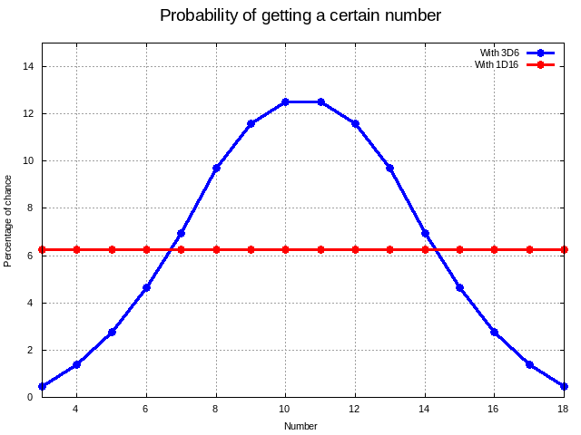
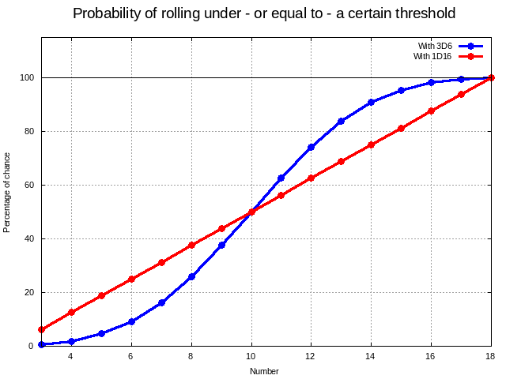
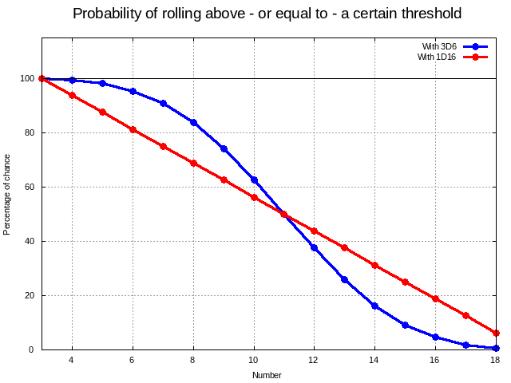
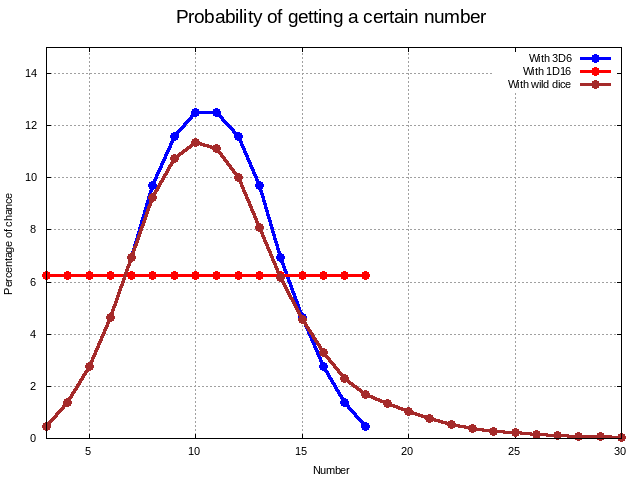
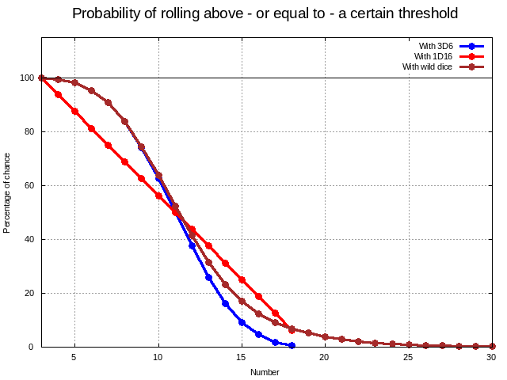

# La courbe de Gauss des probabilités d'un jet de 3D6

Après analyse, le système D6 semble un système fondamentalement défectueux.

En effet, regardons la répartition de 3D6 en termes de probabilités. Quand nous lançons 3D6, nous avons 16 scores possibles. La table suivante compare les probabilités d'obtenir un certain nombre (première colonne) avec 3D6, puis avec un hypothétique "D16" où chaque face aurait la même probabilité d'apparaître (probabilité = 1/16 = 6.25%).

| Nombre | % de chance avec 3D6 | % de chances avec 1D16 |
|--------|----------------------|------------------------|
| 3      | 0,46                 | 6,25                   |
| 4      | 1,39                 | 6,25                   |
| 5      | 2,78                 | 6,25                   |
| 6      | 4,63                 | 6,25                   |
| 7      | 6,94                 | 6,25                   |
| 8      | 9,72                 | 6,25                   |
| 9      | 11,57                | 6,25                   |
| 10     | 12,50                | 6,25                   |
| 11     | 12,50                | 6,25                   |
| 12     | 11,57                | 6,25                   |
| 13     | 9,72                 | 6,25                   |
| 14     | 6,94                 | 6,25                   |
| 15     | 4,63                 | 6,25                   |
| 16     | 2,78                 | 6,25                   |
| 17     | 1,39                 | 6,25                   |
| 18     | 0,46                 | 6,25                   |

La figure suivante compare la répartition de probabilités entre 3D6 et 1D16. On y voit la [gaussienne](https://fr.wikipedia.org/wiki/Fonction_gaussienne) des probabilités de 3D6.

Certains nombres sont beaucoup plus difficiles à atteindre avec 3D6 qu'avec 1D16, notamment les très petits et les très grands nombres.

# Probabilités de faire moins qu'un certain seuil

Si le but est de faire moins qu'un certain seuil, le système D6 est très favorable.

Exemple, considérons par exemple, un jet sous LUCK dans le cadre de Fighting Fantasy, le système de jeu très simple de Steve Jackson (voir [traduction](https://github.com/orey/jdr/tree/master/FightingFantasys-fr)). Avec une valeur de LUCK de 12, nous avons déjà 75% de chances de réussir, ce qui est très favorable  par rapport à un jet avec un D16 où, pour le même score, nous n'aurions qu'aux alentours de 60% de chances de réussir. Avec une LUCK de 14, nous avons 90ù de chances de réussir avec 3D6, contre 75% avec un D16.

| < ou = au seuil | Avec 3D6 | Avec 1D16 |
|-----------------|----------|-----------|
| 3               | 0,46     | 6,25      |
| 4               | 1,85     | 12,5      |
| 5               | 4,63     | 18,75     |
| 6               | 9,26     | 25        |
| 7               | 16,20    | 31,25     |
| 8               | 25,93    | 37,5      |
| 9               | 37,50    | 43,75     |
| 10              | 50,00    | 50        |
| 11              | 62,50    | 56,25     |
| -> 12           | -> 74,07 | -> 62,5   |
| 13              | 83,80    | 68,75     |
| 14              | 90,74    | 75        |
| 15              | 95,37    | 81,25     |
| 16              | 98,15    | 87,5      |
| 17              | 99,54    | 93,75     |
| 18              | 100,00   | 100       |

On obtient la courbe suivante.

# Probabilités de faire plus qu'un certain seuil
 
Le problème est que le système D6 consiste à dépasser un certain seuil en lançant plusieurs dés. Plus le seuil est grand, et plus le nombre de dés est élevé et plus l'atteinte du seuil est improbable.

| > ou = au seuil | Avec 3D6 | Avec 1D16 |
|-----------------|----------|-----------|
| 3               | 100.00   | 100.00    |
| 4               | 99.54    | 93.75     |
| 5               | 98.15    | 87.50     |
| 6               | 95.37    | 81.25     |
| 7               | 90.74    | 75.00     |
| 8               | 83.80    | 68.75     |
| 9               | 74.07    | 62.50     |
| 10              | 62.50    | 56.25     |
| 11              | 50.00    | 50.00     |
| 12              | 37.50    | 43.75     |
| 13              | 25.93    | 37.50     |
| 14              | 16.20    | 31.25     |
| 15              | 9.26     | 25.00     |
| 16              | 4.63     | 18.75     |
| 17              | 1.85     | 12.50     |
| 18              | 0.46     | 6.25      |

On obtient la courbe suivante :

# Introduction du "wild die"

Assez rapidement, dès la seconde édition de Star Wars, les créateurs ont introduit la notion de "wild die", sans doute pour corriger les problèmes de seuils elévés.

Dans les dés jetés, un dé a une couleur différente. Si ce dernier a une valeur de 6, on le relance pour additionner de nouveaux points. On reproduit le système tant que le wild die fait 6.

Les probabilités d'avoir un certain score pour le wild die obéissent à une formule simple :

| Intervalle   | Probabilité avec wild die |
|--------------|---------------------------|
| [1, 5]       | 1/6                       |
| [7, 11]      | (1/6)^2                   |
| [13, 17]     | (1/6)^3                   |
| ...          | ...                       |
| [6n+1, 6n+5] | (1/6)^(n+1)               |

Virtuellement, il existe une change infime pour que l'on fasse un très gros score.

Cela change évidemment la donne. Les probabilités comparées entre 3D6, 1D16 et "2D6+Wild die" sont montrées dans la figure ci-dessous.

L'introduction du wild die a deux effets :
- Une légère correction de la hauteur de la gaussienne,
- Une possibilité d'avoir des tirages supérieurs à 18.

Regardons maintenant la courbe de dépassement de seuil, car le wild die est supposé être utile dans ce cas.

La courbe avec wild die suit la courbe de 3D6 au début pour prendre une position intermédiaire entre la courbe de probabilités linéaires et celle du lancer de 3D6.

Nous pouvons y voir deux avantages :
- Une correction d'environ 50% du biais négatif causé par la mécanique 3D6 au dessus d'un seuil ;
- Il reste, de plus 7% de chances environ de faire 18+ au tirage.

*Conclusion* :  de fait, le wild die est une technique intéressante et amusante mais il ne corrige pas complètement les défauts de lancer un grand nombre de D6 pour dépasser des seuils.

# Autres systèmes de jeux aux probabilités linéaires

Les deux plus grands systèmes de JDR, D&D et Basic Role Playing System (CoC, Runequest, etc.), n'ont pas les défauts des systèmes D6 à seuils :
- Le système D&D qui est construit sur =1D20 + modificateurs > AC ou DC= est un système linéaire ;
- Le système Basic RPS qui est construit sur des pourcentages, =jet sous une compétence=, est aussi un système linéaire.

Ces systèmes utilisant respectivement des seuils à dépasser ou sous lesquels passer ne mettent pas en place de mécanique de déformation des probabilités.

# Repo

Voir le repo source : <https://github.com/orey/jdr/tree/master/D6-System>

