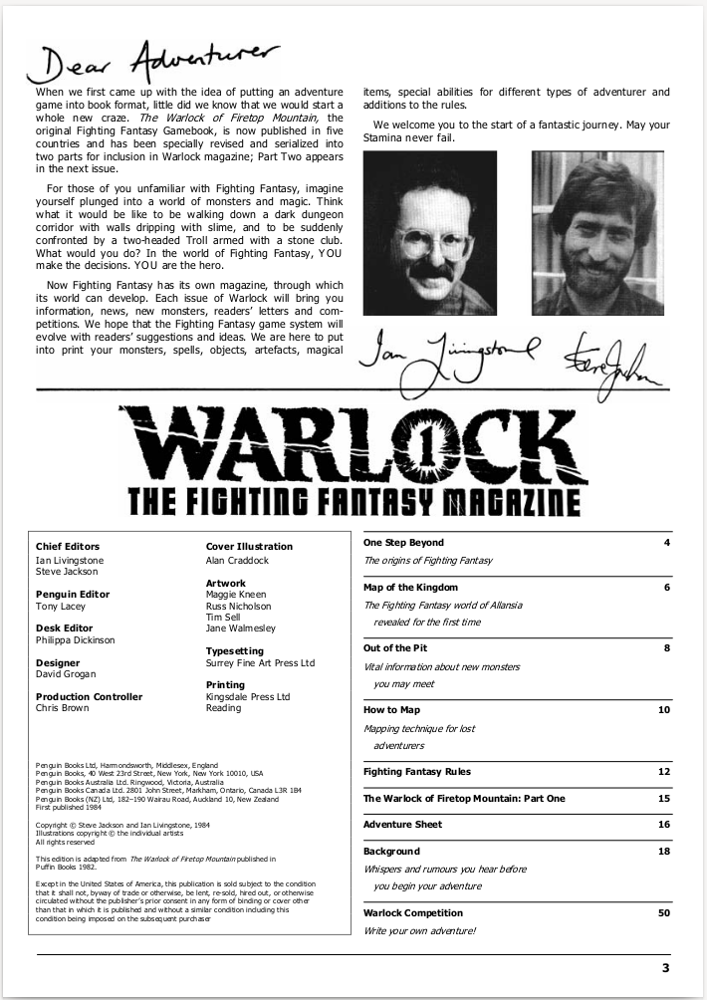

---
tags:
    - FightingFantasy
    - Ghostbusters
    - StarWarsRPG
    - Risus
    - D6 System
---

# 1984 : Fighting Fantasy

En 1984, naissait en Angleterre, le magazine Warlock. Dans son numéro 1, on trouve les premières règles ultra-simplifiées d'un jeu de rôles utilisant seulement des dés à 6 faces.

Les auteurs marqueront l'histoire du JDR en solo :
* [Steve Jackson](https://en.wikipedia.org/wiki/Steve_Jackson_(British_game_designer)) (à ne pas confondre avec le [Steve Jackson](https://en.wikipedia.org/wiki/Steve_Jackson_(American_game_designer)) américain de GURPS) ;
* [Ian Livingstone](https://en.wikipedia.org/wiki/Ian_Livingstone).

En 1984, le personnage possède trois caractéristiques :

* "**Skill**" : **Compétence**, souvent traduit par "Habileté" qui est moins général, et souvent ambigu dans le monde du JDR, où habileté est souvent confondu avec "dextérité" ;
* "**Stamina**" : **Points de vie**, ou constitution ; dans le cadre du jeu, nous sommes plus sur une notion de point de vie ;
* "**Luck**" : **Chance**.

Le système de jeu est optimisé pour jouer des aventures en solo.

Une version "advanced" verra le jour en 1989. Cette dernière introduira la magie et les sorts en tant que consommation de "Stamina", ce qui a été entièrement repris par [Troika](https://en.wikipedia.org/wiki/Steve_Jackson_(American_game_designer)).

_A développer_

---

# 1986 : Ghostbusters

En 1986, naissait [Ghostbusters](https://orey.github.io/blog/blog/202205/#lulu-de-la-joie-pour-les-grognards-deuxieme-partie-ghostbusters), un JDR basé sur l'utilisation exclusive de D6.

Pour la première fois dans les jeux américains, la logique est inversée : au lieu d'avoir des caractéristiques/compétences chiffrées et de faire divers jets de dés pour les tester, le PJ possède un nombre de dés dans les caractéristiques/compétences, et il doit soit battre un seuil de difficulté (dénommé souvent "target number" ou simplement "TN"), soit battre une autre joueur ayant une caractéristique/compétence de défense.

_A développer_

---

# 1987 : Star Wars RPG 1e

_A développer_

---

# 1993 : Risus

Voir <https://rouboudou.itch.io/risus>

_A développer_

---

# 1996 : D6 system

_A développer_

# Comparaison des caractéristiques

La comparaison des caractéristiques est intéressante. Elle montre que, au final, Ghostbusters est un jeu assez classique dans sa structure et qu'il reprend les "standards" de l'époque, soit de D&D et de CoC.

| D&D (1973)       | Call of Cthulhu (1981) | Fighting Fantasy (1984)  | Ghostbusters (1986)         |
|------------------|------------------------|--------------------------|-----------------------------|
| **FOR**ce        | **FOR**ce              | **Skill**                | **Muscles**                 |
| **DEX**terity    | **DEX**terity          | **Skill**                | **Moves**                   |
| **CON**stitution | **CON**stitution       | **Stamina**              | **Brownie Points** (damage) |
| **INT**elligence | **INT**elligence       | **Skill**                | **Brains**                  |
| **WIS**dom       | **POW**er              | Magical skills (Adv. Ed. | Power (GBI)                 |
| **CHA**risma     | **APP**earance         | -                        | -                           |
| WISdom?          | **SAN**ity             | -                        | **Cool**                    |
| -                | -                      | **Luck**                 | **Brownie Points** (boost)  |
| Experience       | Experience             | Experience               | **Brownie Points** (exp)    |

