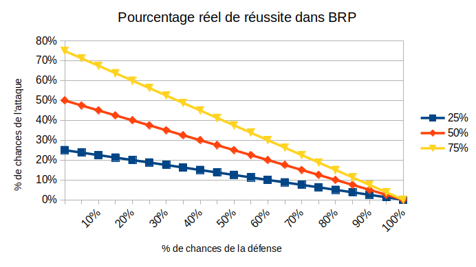
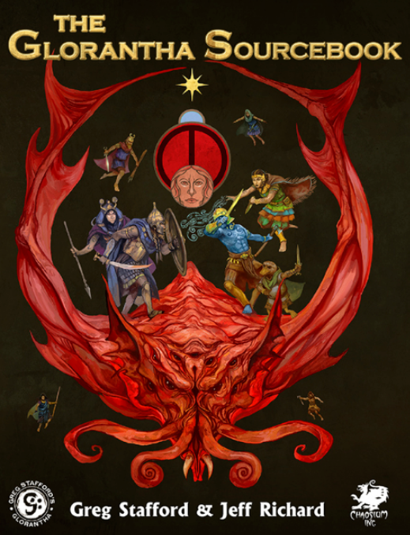

---
tags:
    - Adventures in Fantasy
    - Basic Roleplaying System
    - Cypher
    - D&D
    - DCC
    - Ghostbusters
    - Mythras
    - Runequest
---

# Réflexions sur le système d100 de BRP

## Ressources

* [SRD du Basic Role Playing system](https://github.com/orey/jdr-brp/tree/master/source) de Chaosium, ainsi que vers sa licence ORC.
* [Divers handouts](https://www.chaosium.com/basic-roleplaying-universal-game-engine-pdf/) pour *BRP* v5.
* [Page des moteurs de jeux de rôle génériques](../pages/moteurs-generiques.md).

## Introduction

*BRP* n'est pas un système aussi simple qu'il en a l'air. Des choix de conception le distinguent fondamentalement de *D&D*. Sans émettre de jugement de valeur, il est souvent plus difficile dans *BRP* de faire la même chose que dans *D&D*.

## Structure du combat dans BRP v5

Dans *BRP*, deux jets sont faits à chaque action : un jet pour l'Attaquant et un jet pour le Défenseur. Cette mécanique se retrouve dans de nombreux jeux et n'est pas la même que la mécanique de *D&D* basée sur un seul jet.

*Table 1 : Extrait du SRD de BRP v5*

Le combat est centré sur l'attaquant qui, s'il rate son jet de d100 sous sa compétence de combat, ne touche pas son adversaire. Nous avons la même chose dans *D&D* avec un échec de jet contre la Classe d'Armure (CA).

Mais quand l'attaque est réussie dans *D&D*, les dommages sont calculés, ce qui n'est pas le cas dans *BRP*, en raison du second jet, celui de la défense.

Dans *BRP*, l'adversaire a le choix de parer ou d'esquiver (voir tableau ci-dessus). Si la parade ou l'esquive fonctionne, alors c'est un échec pour l'attaquant.

J'écoutais dernièrement Jason Durall (photo ci-dessus) dire que *BRP* était un jeu "transparent" ([ici](https://www.youtube.com/watch?v=Zte5aFZfiqc)) qui donnait les vraies chances de réussite. C'est vrai pour les compétences, mais pas c'est faux pour le combat, car un "succès" peut devenir facilement un échec.

| Attaquant | Défenseur | % réel de réussite | CA émulée (*) |
|-----------|-----------|--------------------|---------------|
| 25%       | A:25%     | 25% x 75% = *19*%  | 19            |
| 25%       | B:50%     | 25% x 50% = *13*%  | 20            |
| 25%       | C:75%     | 25% x 25% = *6*%   | 22            |
| 50%       | A:25%     | 50% x 75% = *38*%  | 15            |
| 50%       | B:50%     | 50% x 50% = *25*%  | 18            |
| 50%       | C:75%     | 50% x 25% = *13*%  | 20            |
| 75%       | A:25%     | 75% x 75% = *56*%  | 12            |
| 75%       | B:50%     | 75% x 50% = *38*%  | 15            |
| 75%       | C;75%     | 75% x 25% = *19*%  | 19            |

*Table 2 : % réel de réussite en fonction des % d'attaque et de défense*

Ce problème de probabilités est similaire à celui expliqué dans la [page sur les combats avec un système D6](../pages/D6-Combat.md).

Dans le cas de *BRP*, la **probabilité de succès réel** n'est pas la probabilité de succès de l'action.

Nous pouvons tenter d'émuler l'adversaire en mode CA d20 (voir colonne (*)) pour décortiquer un peu le mécanisme, preuve que ce dernier n'est pas complètement transparent.

Prenons un cas moyen de *D&D* : un PJ a +0 dans le Ability Bonus et il est de niveau 1 avec un Proficiency Bonus de +2. Le jet d'attaque est d20+2 (jet allant de 3 à 22).

| Jet | Probabilité % | Jet | Probabilité % |
|-----|---------------|-----|---------------|
| 3   | 100           | 13  | 50            |
| 4   | 95            | 14  | 45            |
| 5   | 90            | 15  | 40            |
| 6   | 85            | 16  | 35            |
| 7   | 80            | 17  | 30            |
| 8   | 75            | 18  | 25            |
| 9   | 70            | 19  | 20            |
| 10  | 65            | 20  | 15            |
| 11  | 60            | 21  | 10            |
| 12  | 55            | 22  | 5             |
    
*Table 3 : Probabilité de toucher pour un PJ de base dans D&D expliquant la CA émulée*

Nous voyons que la CA émulée du Défenseur est *relative*.

| % du Défenseur | CA émulée avec attaquant 25%/50%/75% |
|----------------|--------------------------------------|
| 25             | 19/15/12                             |
| 50             | 20/18/15                             |
| 75             | 22/20/19                             |

*Table 4 : CA variable selon la force de l'attaquant*

Cela signifie qu'un même adversaire est plus ou moins difficile à toucher selon la compétence de l'attaquant.

Ce choix de conception n'est pas le même que le choix de *D&D*, jeu dans lequel la CA de l'adversaire est absolue. Certes, le jet de dé de l'attaquant a plus ou moins de chances de réussir, mais la CA n'est pas variable en fonction de la puissance de l'attaquant.

En quelque sorte, vu du système *D&D*, le système BRP est celui de la double-peine :

* L'attaquant a un score peu élevé et donc moins de chances de toucher, dans l'absolu ;
* Mais en plus, ses chances de toucher sont diminuées par la force de l'attaquant.

*Table 5 : Pourcentage réel de réussite dans BRP suivant la force de l'attaquant*

En fait, le score d'attaque de *BRP* n'est que la limite théorique de la borne supérieure de la probabilité de succès de l'attaquant quand la probabilité de parer/esquiver du défenseur tend vers zéro.

C'est évidemment un choix de conception un peu "punitif" et moins épique que celui de *D&D*. cela veut dire aussi qu'un même adversaire ne représente pas la même difficulté (sous-entendu *absolue*) pour tous les PJs.

## Cas des "special success" et des critiques

Ce choix est par contre mené de manière cohérente dans le système. Par exemple, dans le cas des succès spéciaux et des critiques.

*Table 6 : Table des succès spéciaux et des critiques*

Dans *BRP*, les réussites critiques sont à 1/20 du score de la compétence, tout comme les échecs critiques (à 100% - 1/20 de la compétence). Les succès spéciaux sont à 1/5 du score de compétence.

Ce choix de conception implique que les chances de réussite critique ne sont pas constantes pour tous les PJs mais *relatives* à leur score de compétence.

L'approche de *D&D* est différente : un 1 est toujours un échec critique et un 20 naturel toujours une réussite critique, cela quelque soit les niveaux de compétences.

Encore une fois, *BRP* fait le choix de la relativité.

Notons que la difficulté et la facilité, dans *BRP* v5, sont traitées avec des bonus ou des malus de type : +50%/+20%/+0%/-20%/-50% qui sont, eux, des bonus et malus absolus.

## Conclusion sur les combats

La table 5 devrait, je pense, être intégrée aux règles du jeu de BRP, car elle montre pourquoi ce jeu, dans sa conception même, est punitif pour les joueurs. Non seulement, leur chance de réussite est soumise à une progression, comme dans l'ensemble des jeux, mais en fonction de l'adversaire, ces scores sont encore modifiés lourdement à la baisse.

Plusieurs choses sont ennuyeuses avec des choix de conception de cette sorte :

* Le système n'est pas transparent, comme peut l'être *D&D* ;
* Les joueurs peuvent voir leur personnage mourir du fait du système lui-même et non du fait de leurs actions ;
* Il est très compliqué pour un MJ de créer des rencontres équilibrées, et rien dans le jeu lui-même, ne permet de le faire ; pire que cela, dans le cadre des forums, il semble même que cette option soit défendue depuis les origines : "le jeu n'est pas supposer proposer des rencontres équilibrées". OK.

A noter qu'une manière de corriger le problème serait de définir un "genre de classe d'armure" à la *D&D* et un seul jet d'attaque sans jet de défense de la part de l'adversaire. Cette proposition risque de sembler blasphématoire aux amoureux du d100, mais force est de constater que sans correction, ce système est si punitif qu'il obscurcit le monde lui-même.

## Digression sur la dichotomie créateur de jeu/créateur d'univers

*Runequest* est un jeu qui porte en lui deux fondamentaux :

* L'univers de Glorantha,
* Le système de jeu BRP.

Comme souvent, les créateurs d'univers sont de piètres *game designers* et vice-versa. Est-ce le cas de [Greg Stafford](https://en.wikipedia.org/wiki/Greg_Stafford_(game_designer)), créateur de *Runequest* et co-créateur de BRP avec [Lynn Willis](https://en.wikipedia.org/wiki/Lynn_Willis)? C'est possible. En tous cas, je maintiens que le monde de Runequest aurait pu avoir un tout autre succès avec un système de jeu plus en faveur des joueurs. Le cas de Lynn Willis est assez similaire : célèbre par ses campagnes et ses scénarios, il reste un co-auteur du système de *Ghostbusters*, système fondateur du système D6, système déséquilibré par excellence (voir [ici](../pages/D6-Combat.md) et [là](../pages/D6-TargetNumber.md)).

Ce cas de non cumul des compétences entre *game design* et *content design* est aussi pour moi le fait de Gary Gygax et de Dave Arneson. A mon humble avis, les créateurs du jeu de rôle le plus célèbre du monde ont fait un travail honnête pour *Greyhawk*, mais peu original, et plus confidentiel pour *Blackmoor* (*The First Fantasy Campaign* ou *Adventures in Fantasy*). Plus récemment, je renverrai vers le système de Monte Cook qui, une fois encore, aurait sans doute dû rester dans la création de contenus plus que dans la création de jeu (voir ma critique de [Cypher](http://127.0.0.1:8000/blog/blog/2024/#cypher-a-eviter)).

## Plusieurs systèmes de magie dans BRP

Le système par défaut de *BRP* est un système basé sur les pourcentages. Il faut donc réussir un jet pour que le sort soit effectivement lancé, sachant que la victime peut résister à beaucoup de sorts. Dans *D&D*, le lancement de sorts est automatique mais la victime a, la plupart du temps, un moyen de résister.

Encore une fois, nous voyons une volonté de rendre les choses compliquées : on connaît un sort mais avec un risque important  de ne pas pouvoir le lancer ; et, quand ce dernier les lancé, il se peut que la victime résiste... Cela rend la magie très incertaine. C'est un choix, comme celui que l'on trouve dans *DCC*.

Le système de sorcellerie de *BRP* est beaucoup plus proche de celui de *D&D* : une gestion des ressources (les points de magie), un succès automatique mais avec une capacité à résister de la part de la victime.

Il faut noter que nous sommes ici dans deux conceptions radicalement différentes du jeu, *D&D* assumant être un jeu dans lequel les joueurs doivent pouvoir prendre un certain plaisir et avoir de nombreuses options, et *Runequest* étant un monde déterminé dans lequel toute action est si dangereuse qu'elle peut apporter, dans une large mesure aléatoirement, la mort des PJs. Le choix de DCC est plus un choix de second degré, destiné aux vieux routards cyniques, qui souhaitent  un taux élevé de mortalité et d'effets de bords plus ou moins gore.

## Conclusion

Il me semble étrange de prendre pour postulat de game design le fait que les rencontres puissent être mortelles pour les PJ, cela du fait même du système de jeu et de son côté aléatoire, plus que par les actions des joueurs. Autant, pour Cthulhu, ce système de jeu se justifie, dans la mesure où les joueurs vont essentiellement faire des jets de compétences et assez peu de combats (car trop mortels), ou pour Stormbringer, jeu dans lequel la sorcellerie a une tendance intrinsèque à se terminer par la mort de personnes, autant pour un jeu qui se voudrait explorer un univers original, un système de jeu punitif me paraît le meilleur moyen de faire en sorte que le bébé soit jeté avec l'eau du bain.

Il n'y a qu'à voir le succès de BRP auprès des joueurs : asse faible, malgré, fut un temps, un soutien massif de Casus Belli. Car, s'il se veut générique, BRP n'est pas très bon dans le médiéval-fantastique et ce ne sont pas les diverses éditions de Runequest et de Mythras qui viendront me contredire.

Reste deux possibilités :

* Avoir un BRP plus tolérant, qui ne jette pas le système jet de pourcentage mais qui simplifie et rend plus lisible le système de combat ;
* Adapter Glorantha à la cinquième édition ou à un autre système de jeu.

Car, malgré le nombre très impressionnant de nouveaux systèmes produits ces trente dernières années, le système *D&D*, tant abhorré par tant de gens, reste central au monde du jeu de rôles et, en étudiant les systèmes alternatifs, on découvre assez rapidement que ces systèmes ont souvent plus de défauts que le grand ancêtre.

*(4 janvier 2026)*

