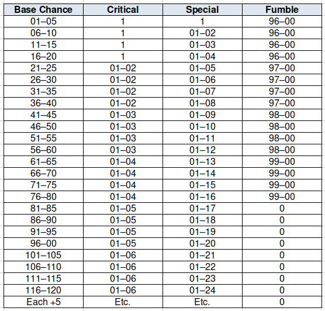

---
tags:
    - Basic Roleplaying System
    - D&D
---

# Réflexions sur le système d100 de BRP

## Ressources

* [SRD du Basic Role Playing system](https://github.com/orey/jdr-brp/tree/master/source) de Chaosium, ainsi que vers sa licence ORC.
* [Divers handouts](https://www.chaosium.com/basic-roleplaying-universal-game-engine-pdf/) pour *BRP* v5.
* [Page des moteurs de jeux de rôle génériques](../pages/moteurs-generiques.md).

## Introduction

*BRP* n'est pas un système aussi simple qu'il en a l'air. Des choix de conception le distinguent fondamentalement de *D&D*. Sans émettre de jugement de valeur, il est souvent plus difficile dans *BRP* de faire la même chose que dans *D&D*.

## Structure du combat dans BRP v5

Dans *BRP*, deux jets sont faits à chaque action : un jet pour l'Attaquant et un jet pour le Défenseur. Cette mécanique se retrouve dans de nombreux jeux et n'est pas la même que la mécanique de *D&D* basée sur un seul jet.

*Table 1 : Extrait du SRD de BRP v5*

Le combat est centré sur l'attaquant qui, s'il rate son jet de d100 sous sa compétence de combat, ne touche pas son adversaire. Nous avons la même chose dans *D&D* avec un échec de jet contre la Classe d'Armure (CA).

Mais quand l'attaque est réussie dans *D&D*, les dommages sont calculés, ce qui n'est pas le cas dans *BRP*, en raison du second jet, celui de la défense.

Dans *BRP*, l'adversaire a le choix de parer ou d'esquiver (voir tableau ci-dessus). Si la parade ou l'esquive fonctionne, alors c'est un échec pour l'attaquant.

J'écoutais dernièrement Jason Durall (photo ci-dessus) dire que *BRP* était un jeu "transparent" ([ici](https://www.youtube.com/watch?v=Zte5aFZfiqc)) qui donnait les vraies chances de réussite. C'est vrai pour les compétences, mais pas entièrement vrai pour le combat, car un "succès" peut devenir facilement un échec.

| Attaquant | Défenseur (succès/échec) | % réel de réussite | CA émulée (*) |
|-----------|--------------------------|--------------------|---------------|
| 25%       | 25%/75%                  | 25% x 75% = *19*%  | 19            |
| 25%       | 50%/50%                  | 25% x 50% = *13*%  | 20            |
| 25%       | 75%/25%                  | 25% x 25% = *6*%   | 22            |
| 50%       | 25%/75%                  | 50% x 75% = *38*%  | 15            |
| 50%       | 50%/50%                  | 50% x 50% = *25*%  | 18            |
| 50%       | 75%/25%                  | 50% x 25% = *13*%  | 20            |
| 75%       | 25%/75%                  | 75% x 75% = *56*%  | 12            |
| 75%       | 50%/50%                  | 75% x 50% = *38*%  | 15            |
| 75%       | 75%/25%                  | 75% x 25% = *19*%  | 19            |

*Table 2 : % réel de réussite en fonction des % d'attaque et de défense*

Ce problème de probabilités est similaire à celui expliqué dans la [page sur les combats avec un système D6](../pages/D6-Combat.md).

Dans le cas de *BRP*, la probabilité de succès réel n'est pas la probabilité de succès de l'action.

Nous pouvons tenter d'émuler l'adversaire en mode CA d20 (voir colonne (*)) pour décortiquer un peu le mécanisme, preuve que ce dernier n'est pas complètement transparent.

Prenons un cas moyen de *D&D* : un PJ a +0 dans le Ability Bonus et il est de niveau 1 avec un Proficiency Bonus de +2. Le jet d'attaque est d20+2 (jet allant de 3 à 22).

| Jet | Probabilité % | Jet | Probabilité % |
|-----|---------------|-----|---------------|
| 3   | 100           | 13  | 50            |
| 4   | 95            | 14  | 45            |
| 5   | 90            | 15  | 40            |
| 6   | 85            | 16  | 35            |
| 7   | 80            | 17  | 30            |
| 8   | 75            | 18  | 25            |
| 9   | 70            | 19  | 20            |
| 10  | 65            | 20  | 15            |
| 11  | 60            | 21  | 10            |
| 12  | 55            | 22  | 5             |
    
*Table 3 : Probabilité de toucher pour un PJ de base dans D&D expliquant la CA émulée*

Nous voyons que la CA émulée du Défenseur est *relative*.

| % du Défenseur | CA émulée avec attaquant 25%/50%/75% |
|----------------|--------------------------------------|
| 25             | 19/15/12                             |
| 50             | 20/18/15                             |
| 75             | 22/20/19                             |

*Table 4 : CA variable selon la force de l'attaquant*

Cela signifie qu'un même adversaire est plus ou moins difficile à toucher selon la compétence de l'attaquant.

Ce choix de conception n'est pas le même que le choix de *D&D*, jeu dans lequel la CA de l'adversaire est absolue. Certes, le jet de dé de l'attaquant a plus ou moins de chances de réussir, mais la CA n'est pas variable en fonction de la puissance de l'attaquant.

En quelque sorte, vu du système *D&D*, le système BRP est celui de la double-peine :

* L'attaquant a un score peu élevé et donc moins de chances de toucher, dans l'absolu ;
* Mais en plus, ses chances de toucher sont diminuées par la force de l'attaquant.

*Table 5 : Pourcentage réel de réussite dans BRP suivant la force de l'attaquant*

En fait, le score d'attaque de *BRP* n'est que la limite théorique de la borne supérieure de la probabilité de succès de l'attaquant quand la probabilité de parer/esquiver du défenseur tend vers zéro.

C'est évidemment un choix de conception un peu "punitif" et moins épique que celui de *D&D*. cela veut dire aussi qu'un même adversaire ne représente pas la même difficulté (sous-entendu *absolue*) pour tous les PJs.

## Cas des "special success" et des critiques

Ce choix est par contre mené de manière cohérente dans le système. Par exemple, dans le cas des succès spéciaux et des critiques.

*Table 6 : Table des succès spéciaux et des critiques*

Dans *BRP*, les réussites critiques sont à 1/20 du score de la compétence, tout comme les échecs critiques (à 100% - 1/20 de la compétence). Les succès spéciaux sont à 1/5 du score de compétence.

Ce choix de conception implique que les chances de réussite critique ne sont pas constantes pour tous les PJs mais *relatives* à leur score de compétence.

L'approche de *D&D* est différente : un 1 est toujours un échec critique et un 20 naturel toujours une réussite critique, cela quelque soit les niveaux de compétences.

Encore une fois, *BRP* fait le choix de la relativité.

Notons que la difficulté et la facilité, dans *BRP* v5, sont traitées avec des bonus ou des malus de type : +50%/+20%/+0%/-20%/-50% qui sont, eux, des bonus et malus absolus.

## Cas de la Magie

