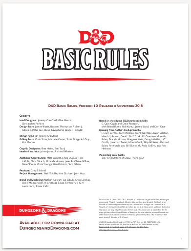

---
tags:
    - D&D
---

# Compression des règles de D&D 5e

## Introduction

### Source

Il est possible de trouver les *Basic Rules* de D&D 5e version 2014 en PDF [ici](https://media.wizards.com/2018/dnd/downloads/DnD_BasicRules_2018.pdf). Vous pouvez aussi télécharger une traduction en français sur le très bon site [aidedd.org](https://www.aidedd.org/adj/telechargement/).

Pour autant, la base de cette compression est la [version 2024](https://www.dndbeyond.com/sources/dnd/free-rules) en ligne des "free rules" de D&D 5e.

Cette page n'explique pas ce qu'est un JDR, ou même les termes classiques de D&D 5e. Certains termes sont accompagnés de leur anglais sont mis entre parenthèse 

### Conventions

Les conventions suivantes sont adoptées :

* Les dés utilisés sont les d3, d4, d6, d8, d10, d12, d20 et d100.
* Les arrondis se font vers le bas, sauf exception.

## Mécaniques de jeu

### Caractéristiques (*Ability*)

Les PJs ont 6 caractéristiques :

* FORce (*STRength*),
* DEXtérité (*DEXterity*),
* CONstitution (*CONstitution*),
* INTelligence (*INTelligence*),
* SAGesse (*WISdom*),
* CHArisme (*CHArisma*).

Ces caractéristiques sont comprises généralement entre 1 et 20, même si elles peuvent monter jusqu'à 30 pour certains monstres.

On associe à chaque caractéristique un modificateur de caractéristique (bonus ou malus, *ability modifier*) calculé comme suit :

* Modificateur de caractéristique = *(caractéristique - 10) / 2*, arrondi vers le bas.

### Test d20

Pour un *test d20*, il faut additionner :

* un d20 ou un d20A ou un d20D (voir ci-dessous),
* le modificateur de caractéristique concerné,
* un bonus de maîtrise (*proficiency*) s'il est applicable,
* des bonus et malus circonstanciels (avantage de classe, sort, etc.),

et le comparer à un seuil.

Il y a deux types de seuils :
* la classe de difficulté (*Difficulty Class*) noté CD (*DC*), pour les tests hors combat,
* la classe d'armure, (*Armor Class*), noté CA (*AC*), pour les tests pendant un combat.

Faire un test d20 avec un *Avantage* (noté d20A) signifie lancer 2 d20 et garder le meilleur score, et faire un test avec un *Désavantage* (noté d20D) signifie lancer 2 d20 et garder le moins bon score.

### Test de caractéristique

Le test de caractéristique est un test d20.

|Caractéristique|Faire un test pour ...                                             |
|---|-------------------------------------------------------------------------------|
|FOR|Soulever, pousser, tirer ou casser quelque chose                               |
|DEX|Bouger avec agilité, rapidité ou silencieusement                               |
|CON|Pousser votre corps au delà de ses limites normales                            |
|INT|Raisonner ou se souvenir                                                       |
|WIS|Remarquer des choses dans l'environnement ou dans le comportement des créatures|
|CHA|Influencer, amuser ou duper                                                    |

Vous devez ajouter le bonus de maîtrise d'une compétence ou d'un outil si le MJ considère que c'est applicable (voir plus bas).

Les classes de difficulté sont présentées ci-dessous :

|Difficulté de la tâche| CD |
|----------------------|----|
| Très facile| 5|
|Facile | 10 |
| Moyenne | 15|
| Difficile | 20|
| Très difficile | 25 |
| Presqu'impossible | 30 |

### Jet de sauvegarde

Un jet de sauvegarde est une tentative pour résister à une attaque.

Utilisez la caractéristique adaptée.

|Caractéristique|Faire un jet de sauvegarde pour ...|
|---|-----------------------------------------------|
|FOR|Résister physiquement à une force externe      |
|DEX|Esquiver pour se mettre hors de danger         |
|CON|Résister à un poison                           |
|INT|Reconnaître une illusion                       |
|WIS|Résister à un assaut mental                    |
|CHA|Affirmer votre identité                        |

Vous devez ajouter le bonus de maîtrise si vous avez une maîtrise dans ce type de sauvegarde (voir plus bas).

La CD est donnée par le MJ.

### Jet d'attaque

La caractéristique utilisée dépend du cas.

|Caractéristique|Faire un jet de sauvegarde pour ...           |
|-----|--------------------------------------------------------|
|FOR |Attaque en mêlée ou attaque sans arme                    |
|DEX  |Attaque à distance avec une arme                        |
|Autre|Attaque avec un sort (dépend de la classe de personnage)|

Dans certains cas, il est possible d'utiliser d'autres caractéristiques (voir Finesse plus loin).

Vous devez ajouter le bonus de maîtrise si vous avez une maîtrise dans le type d'arme utilisé ou pour le sort que vous maîtrisez (voir plus bas).

La CA de base se calcule de la manière suivante : 

* CA de base = 10 + modificateur de DEX

Elle peut être modifiée par les armures, les sorts, les objets magiques, etc.

Un 20 obtenu sur 1d20 est toujours une réussite critique (20 "naturel"), et un 1 est toujours un échec critique (1 naturel).

