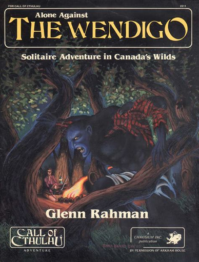

---
tags:
    - D&D
    - DCC
    - Dungeon Squad
    - Ghostbusters
    - GURPS
    - OSR
    - Risus
    - Shadowrun
    - Star Wars
    - USR
---

# Répertoire des moteurs de JDR simples

## Une explosion des offres

Cela fait pas mal de temps que j'explore les moteurs de JDR aux règles simples. La plupart sont en anglais mais nous avons quelques créateurs français qui ont produit des choses très intéressantes.

Ce répertoire offre une entrée multiple :

* Une entrée par lettre de l'alphabet,
* Une entrée par période,
* Une liste des mécanismes de jeu.

La vision chronologique est parfois éclairante car, les jeux s'inspirant les uns des autres, nous avons parfois une succession de jeux aux différences très subtiles (par exemple dans le courant OSR - Old School Renaissance, courant remettant au goût du jour les anciennes versions de *D&D*). Comme nous avons pu l'expliquer dans [un autre article](licences.md), la partie règles du jeu n'est pas quelque chose de "patentable" aux États-Unis. D'où un écosystème où les créateurs de jeux se copient et se démarquent.

Note : ce petit répertoire entend couvrir des jeux simples et non :

* les jeux microscopiques : pour cela, je vous conseille le répertoire de Bruno Bord sur les [Micro RPG](https://brunobord.github.io/micro-rpg-catalog/) ;
* pas les jeux couverts par l'excellentissime [Grog](https://legrog.org).

Nous ferons sans doute quelques incursions dans le monde OGL ([Open Game License](https://en.wikipedia.org/wiki/Open_Game_License)) car, force est de constater que les principes de *D&D* ne cessent d'inspirer les créateurs de JDR.

Dernier point, ce répertoire est, bien entendu, subjectif et vous ne trouverez pas la distinction claire du Grog entre description du jeu et critique des joueurs.

## Répertoire alphabétique des jeux

### Dungeon Squad

| Nom complet | Dungeon Squad                                                 |
|-------------|---------------------------------------------------------------|
| Auteur      | Jason Morningstar                                             |
| Date        | 2005                                                          |
| URL         | [Dungeon Squad](https://github.com/orey/jdr-dungeon-squad-fr) |
| Style       | Médiéval-fantastique                                          |

Ce jeu est, à la base, un jeu d'initiation pour les enfants.

Chaque personnage est décrit par les mêmes trois archétypes, **Magicien**, **Voleur** et **Guerrier**. Le joueur doit affecter un d4, un d8 et un d12 dans chacun des archétypes (voir [ici](archétypes-sous-forme-de-dés)).

Ils ont deux autres dés, un d6 et un d10, à assigner à des avantages, ces avantages étant entendues au sens large et pouvant être un sort, une arme, une armure, etc.

Toutes les actions sont résolues via [tables de difficultés](#table-de-difficultes) :

* les actions simples,
* les combats utilisent le dé de Guerrier contre une catégorie de monstres,
* la magie utilise des seuils dépendant de la situation (dans le combat et hors combat),
* les actions de voleur ont un seuil par type d'action. 

Pour faire des dommages, il faut avoir assigné un dé d'avantage à une arme. Chaque arme a son dé de dommages. Pour qu'une [armure](#armure) soit utilisée, il faut qu'un avantage ait été assigné à cet armure. La protection est variable et exprimée par un dé.

L'expérience permet une progression dans les archétypes selon [une chaîne de dés](#chaine-de-des) : d4/d6/d8/d10/d12.

### Risus

| Nom complet | Risus, The Anything RPG                                      |
|-------------|--------------------------------------------|
| Auteur      | S. John Ross                               |
| Date        | 2001 (créé en 1993)                                      |
| URL         | [Risus](https://github.com/orey/jdr-risus) |
| Style       | Générique                                  |

Ce jeu a marqué l'histoire du JDR. Le jeu se joue avec des d6, même s'il existe des variantes avec des dés polyédriques.

Le PJ est défini avec des archétypes (nommés **Clichés**). Le joueur assigne 10d à ses archétypes (maximum 5d par archétype) (voir [ici](archétypes-sous-forme-de-dés)).

Le principe du jet est de lancer tous les dés de son Cliché et d'additionner les résultats. En ce sens, le jeu fonctionne comme *Ghostbusters* et comme *Star Wars* 1e et 2e.

Les actions simples sont gérées via une [table de difficultés](#table-de-difficultes). Pour les conflits, les parties doivent faire des jets en opposition, le plus grand total l'emporte et le perdant perd un dé de Cliché pour le round suivant. Ce mécanisme est à la fois amusant, original mais réputé comme créateur de la "spirale de la mort". Le jeu ne propose pas de PdV mais une perte de dés de Clichés à la place.

Un des aspects ludiques du jeu est la négociation entre le joueur et le MJ sur l'adaptation du Cliché à une situation. En effet, dans certains combats, le PJ peut ne pas avoir de Cliché applicable ; il faut donc utiliser un "Cliché inapproprié" mais convaincre pour cela le MJ que le Cliché peut quand même être utilisé.

Les Clichés peuvent être "gonflés" (pump). Cela signifie qu'un joueur peut anticiper des pertes de dés de Clichés supplémentaires lors d'un conflit pour gonfler son score. Si un PJ possède un Cliché à 3d et qu'il perd un round, ce dernier se retrouvera à 2d. Si le joueur décide de booster son Cliché de 1d, il lancera 4d pour ce round (3+1) mais perdra 2d s'il perd le round (1+1). S'il le gagne son adversaire perdra 2d : celui de la perte de round et celui de la gonflette de son adversaire !

Les Clichés deviennent donc une monnaie d'échange pour des actes héroïques et risqués (voir [ici](#gonfler-un-archetype)).

On notera aussi, dans le même genre, la gestion des pouvoirs spéciaux comme la magie ou les pouvoirs psioniques. Dans la mesure où les effets sont dévastateurs au travers de la "double gonflette" (on investit Xd dans la gonflette mais celle-ci donne une augmentation de 2Xd au jet, tout en ne risquant que Xd en cas d'échec), le coût du Cliché est double, par exemple 6 points pour un Cliché Nécromant[3].

Ce qui est, en un sens exceptionnel, est comment ce petit jeu inspiré de *Ghostbusters* et utilisé tout d'abord pour des tests est devenu un phénomène concentrant un certain nombre d'idées dont certaines sont encore en vogue aujourd'hui. 

### USR

| Nom complet | USR (Unbelievably Simple Role-playing)                                                    |
|-------------|-------------------------------------------------------------------------------------------|
| Auteur      | Scott Malthouse                                                                           |
| Date        | 2012                                                                                      |
| URL         | [USR](https://www.drivethrurpg.com/en/product/98901/usr-unbelievably-simple-role-playing) |
| Style       | Générique                                                                                 |

Les personnages sont définis par 3 caractéristiques :

* **Action**, pour tout ce qui est physique,
* **Wits**, pour tout ce qui est intelligence et perception,
* **Ego**, pour tout ce qui est relations sociales.

Le joueur doit répartir des dés dans les différentes caractéristiques : d6, d8 et d10.

On retrouve cette mécanique d'attribution de dés à des caractéristiques dans de nombreux jeux (voir [ici](#caracteristiques-sous-forme-de-des)).

Les PdV (**Hits**) sont dérivés : il faut lancer les dés correspondant à Action et à Wits et additionner les deux. Quand les PdV tombent à 0, le personnage est mort.

Les joueurs peuvent posséder en option un **Narrative Point** leur permettant de changer le résultat d'une action. C'est aussi une mécanique connue (voir [ici](#point-de-narration)).

Les joueurs peuvent choisir en tout 3 spécialités (**specialism**) rattachées à leurs caractéristiques. Cela leur donne un bonus de +2 (voir [ici](#specialisation)). Ces spécialités sont des [compétences libres](#competences-libres).

Pour les tests, le jeu propose une [table de difficultés](#table-de-difficultes) avec des seuils. Pour les conflits, le MJ joue pour les PNJ et le score le plus haut gagne. Lors des combats, la différence entre les deux jets constitue les dommages (voir [ici](#dommages-bases-sur-la-marge-de-reussite)).

Les armes donnent des bonus à l'attaque, mais pas à la défense. Les armures annulent des points de dommages (voir [ici](#armure)).

L'avancement se fait via un cumul de points d'expériences. Les PJs peuvent changer de niveau et gagner +1 sur une spécialité ou obtenir une nouvelle spécialité.

Un bon jeu simple.

### X6

| Nom complet | X6 Core Second edition              |
|-------------|-------------------------------------|
| Auteur      | Georgios Chatzipetros               |
| Date        | 2013 (1e en 2011)                   |
| URL         | [X6 Core](https://www.x6system.net) |
| Style       | Générique  ? Plutôt moderne         |

Que dire de ce jeu sinon qu'il propose une vision assez simple et complète d'un jeu avec un [pool de d6](pool-de-des).

On trouve quelques idées intéressantes :

* Les dés normaux ne sont pas binaires : 1-2 est un échec, 3-4 un succès et 5-6 deux succès ;
* Des dés appelés "dés gris" sont utilisés comme modificateurs dans des cas de désalignement entre caractéristique et compétence : 1-4 échec, 5 un succès et 6 deux succès.
* Un dé est le dé du destin : c'est un dé normal sauf que 1 enlève un succès ; cela peut amener à l'échec critique (si le résultat est 0 succès après avoir enlevé le succès) ; 6 peut exploser (voir [ici](#explosion)) mais le risque de refaire 1 doit être pris par le joueur.

Le jeu propose une [table de difficultés](#table-de-difficultes) pour les actions normales et utilise le plus grand nombre de succès lors d'un combat (les deux combattants attaquent simultanément).

Les règles proposent de "brûler des succès en trop" par exemple en faisant plus de dommages. L'interprétation des [marges de réussite](#marge-de-reussite) est un grand classique du JDR, quoique ce ne soit pas du tout ma tasse de thé.

Le jeu propose ensuite une déclinaison caractéristiques / compétences assez confuse.

| Caractéristique *x6* | Caractéristique *D&D* |
|----------------------|-----------------------|
| Strength             | Strength              |
| Dexterity            | Dexterity             |
| Reason               | Intelligence          |
| Intuition            | Intelligence / Wisdom |
| Willpower            | Wisdom                |
| Charisma             | Charisma              |

Le split Reason/Intuition ne semble pas forcément très pertinent, car il apporte des confusions.

La liste des compétences est aussi assez étonnante car peu équilibrée.

| Compétences 1 | Compétences 2 | Compétences 3 |
|---------------|---------------|---------------|
| Athletics     | Business      | Computers     |
| Demolitions   | Drive         | Education     |
| Empathy       | Etiquette     | Firearms      |
| Investigation | Medicine      | Melee         |
| Perception    | Persuasion    | Pilot         |
| Politics      | Science       | Stealth       |

Nous n'avons pas d'esquive (Dodge) alors que c'est cité dans les exemples et que nous avons Mêlée...

Les caractéristiques et les compétences ont des spécialités avec des niveaux; C'est compliqué à utiliser et cela rend la création du personnage faite d'allers et de retours. Que faut-il faire ? Prendre une compétence une spécialité de caractéristique ou une spécialité de compétence ? Et comment savoir ce que ça va donner dans le jeu ?

Hé oui, parce que la mécanique n'est pas complètement simple. Pour tester une compétence, il faut :

* trouver la compétence,
* ajouter la caractéristique la plus adaptée,
* regarder les deltas entre eux pour rectifier l'addition des deux pools de dés avec des dés gris.

Pas très simple, surtout que la caractéristique la plus adaptée n'est pas forcément facile à trouver. On ne trouve pas de rattachement naturel entre compétence et caractéristique. C'est plus souple, mais c'est plus compliqué. Et c'est plus difficile de savoir quelle est la vraie chance de réussite en conditions normales.

On notera la présence d'atouts pendant la création du personnage : allié, autorité, réseau, moyens financiers. On préférera la version *GURPS*.

Le combat est aussi assez étrange en proposant des actions qui se basent sur certaines compétences et/ou caractéristiques.

Ce n'est que dans cette partie (il faudra attendre la page 24) que nous arrivons aux blessures. Elles sont des seuils basés sur des multiplicateurs de Strength... Là encore, déterminer les dommages est compliqué...

On ressort de la lecture de ces règles avec une vraie impression de confusion, de complication. Trop de tiroirs, trop de choses ambiguës, trop d'options inutiles pour un jeu générique... qui ne fait allusion qu'à un monde moderne.

On peut se demander quel est le but de l'auteur. Faire un système de jeu que l'on publie en open source sur Internet est bien, mais je vais revenir à mon dada : pourquoi faire moins bien ce qui existe déjà ? Si le jeu se voulait un jeu simple et facile, c'est raté. Si le jeu se voulait un jeu complet avec un grand nombre d'options, c'est brouillon et probablement pas très étudié en termes de probabilités. Quel est le segment visé par ce moteur de jeu "générique" qui ne l'est pas ?

Difficile de croire que beaucoup de MJs soient tentés.

## Répertoire chronologique

### 2000-2009

* 2001 : [Risus](#risus)
* 2005 : [Dungeon Squad](#dungeon-squad)

### 2010-2019

* 2012 : [USR](#usr)
* 2013 : [x6](#x6)

    
## Répertoire des mécaniques de jeu

Avertissement : la plupart des noms de "patterns" (littéralement "patron" au sens ancien de modèle) de jeux qui suivent ne sont pas forcément des plus évocateurs ou des plus réussis. Il est nécessaire de considérer cet exercice comme une tentative de classification des différents patterns de jeu. 

### Archétypes en guise de PdV

Les archétypes ont soit des scores fixes, soit une formule avec des dés. Dans certains jeux, une perte d'un round de combat amène à la perte de points ou de dés d'archétypes.

* [Risus](#risus)

### Archétypes sous forme de dés

Le PJ est décrit avec des archétypes qui ont chacun une formule avec des dés.

* [Dungeon Squad](#dungeon-squad)
* [Risus](#risus)

### Armure

L'armure enlève des points de dommages. Certains jeux proposent des armures enlevant un nombre fixe de points de dommage, certains jeux ont des armures enlevant un nombre variable de points de dommages (souvent exprimés via une formule avec des dés).

* [USR](#usr)

### Caractéristiques sous forme de dés

Des dés (d4, d6, d8, d10, d12, etc.) sont assignées aux caractéristiques du personnage. On entend par caractéristique des traits physiques et psychiques du personnage (à distinguer des compétences).

Cette façon de faire apparaît en réaction aux caractéristiques fixes des jeux comme *D&D* ou *Call of Cthulhu*.

Un des jeux les plus connus utilisant ce pattern est *Savage Worlds*.

* [USR](#usr)

### Chaîne de dés

Présente dans un certain nombre de jeux, la chaîne de dés permet une progression (ou une régression) temporaire ou permanente d'une caractéristique (si cette dernière est exprimée [avec des dés](#caracteristique-sous-forme-de-des)), ou un changement de dé à tirer lors d'un jet.

La chaîne de dés occupe une position centrale dans le jeu *DCC*.

* [Dungeon Squad](#dungeon-squad) 

### Compétences libres

Des compétences non listées dans le cadre du jeu. Un certain nombre de jeux préconisent ce système : les joueurs proposent des compétences qui sont validées ensuite par le MJ. L'utilisation de ces compétences donne généralement un bonus.

On trouve parfois des compétences libres vues comme des [spécialisations](#specialisation) de caractéristiques.

* [USR](#usr)

### Dommages basés sur la marge de réussite

Les dommages sont basés sur la différence entre le jet du vainqueur et le jet du vaincu.

* [USR](#usr)

### Explosion

On parle d'explosion de dé lorsqu'une certaine valeur (souvent la valeur maximale du dé), une fois sortie, permet au joueur de rejouer.

On trouve cette règle dans *Star Wars* 2e : le 6 est comptabilisé comme 6 et en même temps est rejoué pour additionner son score au score global. Un dé qui explose peut exploser plusieurs fois ou pas.

* [x6](#x6)

### Gonfler un archétype

Cette technique est assez rare dans les jeux. On la trouve dans [Risus](#risus). Il s'agit de miser une partie des dés de l'archétype pour gonfler le nombre de dés nécessaire au conflit. Cette "gonflette" servira de malus au perdant du combat :

* Si le PJ qui a gonflé son archétype échoue, il perdra le nombre de dés de la gonflette plus le dé de perte de round.
* Si le PJ qui a gonflé son archétype réussit, son adversaire perdra le nombre de dés de la gonflette plus le dé de perte de round.

Cette technique a été inventée pour compenser les défauts structurels du jeu Risus, en particulier la spirale de la mort (*death spiral*). Elle a des échos dans des jeux plus récents avec la notion d'**effort**. Le PJ fait un effort en concentrant son énergie sur le round à venir mais en acceptant d'avoir moins d'énergie dans les rounds suivants.

* [Risus](#risus)

### Marge de réussite

Certains jeux font usage des seuils de réussite. Dans les conflits, le fait que l'un des camp réussisse ne suffit pas, les marges de réussite comptent pour expliquer si la réussite est normale, supérieure ou grandiose. La marge s'exprime en points, en nombre de réussites, etc. et les interprétations peuvent se lire sur une table des marges de réussite.

* [x6](#x6)

### Point de narration

En utilisant un point de narration, le joueur peut changer l'issue d'une situation. Il doit raconter la scène comme il a décidé qu'elle se passe et le MJ doit prendre en compte ce changement.

* [USR](#usr)

### Pool de dés

On entend par pool de dés, des dés de même taille que l'on additionne pas mais qui, pris individuellement, vont indiquer le succès ou l'échec d'une tâche. Il suffira de compter les succès et de se comparer à une [table de difficultés](#table-de-difficultes) pour savoir si l'action est réussie. plus l'action est difficile, plus le nombre de succès doit être grand.

Notons que certains pools de dés utilisent des seuils variables par dé pour indiquer les difficultés. Supposons que je possède une compétence à 3d. Lors d'une utilisation facile, un jet de 4-5-6 sera un succès, mais lors d'une utilisation extrême, seuls les 6 seront des succès.

On trouve cette mécanique dans *Shadowrun*.

* [x6](#x6)

### Spécialisation

Les compétences sont vues comme des spécialisations des caractéristiques.

* [USR](#usr)

### Table de difficultés

Un grand classique du JDR : les actions à réaliser ont un facteur de difficulté qu'il faut égaler ou battre, avec un jet de dés, pour réussir.

* [Dungeon Squad](#dungeon-squad)
* [Risus](#risus)
* [USR](#usr)

