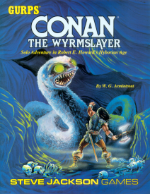
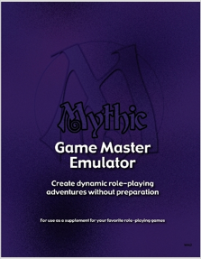

---
tags:
    - Mythic
    - GME
    - Fudge
---

# Petit rappel sur les GME

Dans l'histoire du jeu de rôles, le jeu de rôles en solo a toujours fait l'objet de suppléments. On peut se souvenir des suppléments pour Call of Cthulhu, pour Conan et bien sûr toute la série des [Fighting Fantasy](https://www.fightingfantasy.com/).

Au début des années 2000, des "Game Master Emulator" (GME) sont nés adressant trois types de publics :

* Les joueurs en solo,
* Les joueuers voulant jouer sans MJ,
* Les MJs voulant jouer sans préparation.

Les GME du marché sont plus ou moins élaborés, parfois payants et parfois gratuits. Voir sur [DriveThru](https://www.drivethrurpg.com/browse.php?keywords=emulator).

# Analyse de la table du destin de Mythic GME

Mythic GME, issu du JDR éponyme, est l'un des plus élaborés à ma connaissance. Son auteur Tom/Tana Pigeon maintient une [collection de produits intéressants](https://www.drivethrurpg.com/browse/pub/480/Word-Mill) intéressants sur [DriveThruRPG](https://www.drivethrurpg.com/). Tous les suppléments tournent autour d'une utilisation des tables aléatoires dans la construction de l'aventure elle-même.

D'une certaine façon, on pourrait rapprocher cela des analyses structurelles des histoires dont nous avons déjà parlé :

* [La Grande Liste des intrigues de JDR](../downloads/grande-liste.md),
* [La morphologie du conte](../pages/propp.md) de Vladimir Propp.

## La table du destin

Dans la première version du GME, Mythic propose une table du destin ("Fate Chart") basée sur deux paramètres :

* Une auto-évaluation macroscopique des chances de réussite, allant de "impossible" à "certain" ;
* Une notation du "chaos" lié à la scène.

L'auto-évaluation est définie pendant la scène par le/les protagonistes, et le niveau de chaos dépend d'une mécanique plus globale. A l'aide de ces deux valeurs, la table propose trois nombres.

J'ai traduit, il y a quelques temps, cette table en même temps que l'[écran de Mythic](https://github.com/orey/jdr/blob/master/Mythic-fr/MythicGME-EcranMJ-VersionFrancaise-OreyJdr05.pdf), en donnant une version française complète.

Par exemple, si l'on pose une question à la table du destin dans un contexte de niveau de chaos de 7 et que l'on considère comme peu probable que la réponse soit oui, nous obtenons les nombres suivants : `11 55 92`.

L'idée est de jeter 1d100 :

* Inférieur ou égal à 11 : Réussite critique, ou "oui exceptionnel",
* Entre 12 et 55 : la réponse est oui,
* Entre 56 et 91 : la réponse est non,
* Plus de 92 : la réponse est "non exceptionnel" ou "non critique" ou échec critique.

## Simulations

Notes :
* Un [petit ensemble de programmes](https://github.com/orey/gme) très inspirés de Mythic GME est disponible sur GitHub.
* Dans le folder `oracles`, la table du destin codée dans `oracles2.js` donne les résultats ci-dessous.

| Non critique | Non         | Oui         | Oui critique |
|--------------|-------------|-------------|--------------|
| 6            | 33          | 49          | 11           |
| 6            | 40          | 40          | 13           |
| 6            | 33          | 47          | 13           |
| 7            | 35          | 51          | 6            |
| 9            | 33          | 45          | 12           |
| 14           | 30          | 45          | 10           |
| 12           | 28          | 50          | 9            |
| 9            | 35          | 47          | 8            |
| 5            | 33          | 47          | 14           |
| 9            | 26          | 46          | 18           |
| 6            | 35          | 49          | 9            |
| 12           | 28          | 47          | 12           |
| 7            | 33          | 54          | 5            |
| 7            | 42          | 36          | 14           |
| 9            | 35          | 42          | 13           |
| 9            | 29          | 51          | 10           |
| 7            | 37          | 41          | 14           |
| 8            | 32          | 44          | 15           |
| 8            | 33          | 47          | 11           |
| ...          | ...         | ...         | ...          |
| **8.5951**   | **33.8058** | **45.1383** | **11.4608**  |

_Table 1 : Statistiques de la table du destin ("fate chart")de Mythic GME_

Toutes les combinaisons de la table ont été testées (auto-évaluations x niveaux de chaos = 99 possibilités, car 11 niveaux d'auto-évaluations et 9 niveaux de chaos) 10 000 fois. On converge vers les chiffres en bas.

Cela veut dire que si l'on est assez varié dans ses estimations de difficulté et dans les facteurs de chaos, on a globalement les chances en gras d'obtenir les tirages.

# Analyse de la table du destin de Mythic GME Variations II

Le tableau ci-dessous analyse la table du destin décrite dans le supplément _Mythic Variations II_. La table du destin décrite dans ce supplément ajoute un jet de chaos qui se corrèle aux résultats des dés de destin (2d10 au lieu de 1d100).

Avec la même approche que dans l'exemple précédent, sur 10 000 tirs exploitant les combinaisons complètes niveau d'auto-évaluation x niveaux de chaos. Contrairement à la table du destin de Mythic GME, nous n'avons plus que 28 possibilités (7 pour les auto-évaluations et 4 pour le niveau de chaos qui, au lieu d'être compris entre 1 et 9, est compris entre 3 et 6, d'où 7 x 4 = 28).

Chaque ligne de cette table représente 10 000 tirs sur toutes les combinaisons. On pourra noter sa régularité complète.

| Non Crit EA | Non EA | Non Crit | Non    | Oui    | Oui Crit | Oui EA | Oui Crit EA |
|-------------|--------|----------|--------|--------|----------|--------|-------------|
| 2.18%       | 3.27%  | 4.88%    | 36.04% | 41.53% | 4.09%    | 5.75%  | 2.25%       |
| 2.16%       | 3.32%  | 4.91%    | 35.87% | 41.62% | 4.11%    | 5.71%  | 2.30%       |
| 2.19%       | 3.32%  | 4.90%    | 36.03% | 41.42% | 4.08%    | 5.73%  | 2.33%       |
| 2.18%       | 3.33%  | 4.92%    | 35.99% | 41.54% | 4.04%    | 5.68%  | 2.33%       |
| 2.22%       | 3.30%  | 4.90%    | 36.05% | 41.31% | 4.09%    | 5.77%  | 2.36%       |
| 2.22%       | 3.35%  | 4.92%    | 35.94% | 41.36% | 4.13%    | 5.73%  | 2.35%       |
| 2.21%       | 3.26%  | 4.87%    | 35.98% | 41.59% | 4.01%    | 5.73%  | 2.34%       |
| 2.21%       | 3.32%  | 4.88%    | 36.10% | 41.52% | 4.02%    | 5.63%  | 2.32%       |
| 2.14%       | 3.32%  | 4.94%    | 35.96% | 41.41% | 4.15%    | 5.74%  | 2.34%       |
| 2.20%       | 3.26%  | 4.99%    | 36.02% | 41.50% | 4.04%    | 5.68%  | 2.30%       |
| 2.17%       | 3.37%  | 4.98%    | 36.15% | 41.22% | 4.05%    | 5.77%  | 2.29%       |
| 2.17%       | 3.27%  | 4.98%    | 35.95% | 41.46% | 4.09%    | 5.75%  | 2.33%       |
| 2.17%       | 3.30%  | 4.93%    | 36.00% | 41.39% | 4.10%    | 5.77%  | 2.33%       |
| 2.15%       | 3.33%  | 4.94%    | 36.00% | 41.46% | 4.11%    | 5.70%  | 2.32%       |

_Table 2 : Statistiques de la table du destin ("fate check") de Mythic GME Variation II_

Légende :

* Non Crit EA : Non critique avec événement aléatoire,
* Non EA : Non avec événement aléatoire,
* Non Crit : Non critique,
* Non : Non,
* Oui : Oui,
* Oui Crit : Oui critique,
* Oui EA : Oui avec événement aléatoire,
* Oui Crit EA : Oui critique avec événement aléatoire,

La caractéristique de cette variation est de mélanger intimement la réponse à une question avec l'apparition d'événements aléatoires.

Dans la première table du destin (Mythic GME), plus le niveau de chaos était élevé, plus l'oracle avait une tendance à répondre oui aux questions.

Dans le mécanisme proposé par la variation 2, l'influence du chaos n'est plus aussi visible étant donnée que cette dernière est tissée dans les jets des dés de destin. Au final, on retrouve un éventail plus large de possibilités de jeu.

_Juin 2022_
