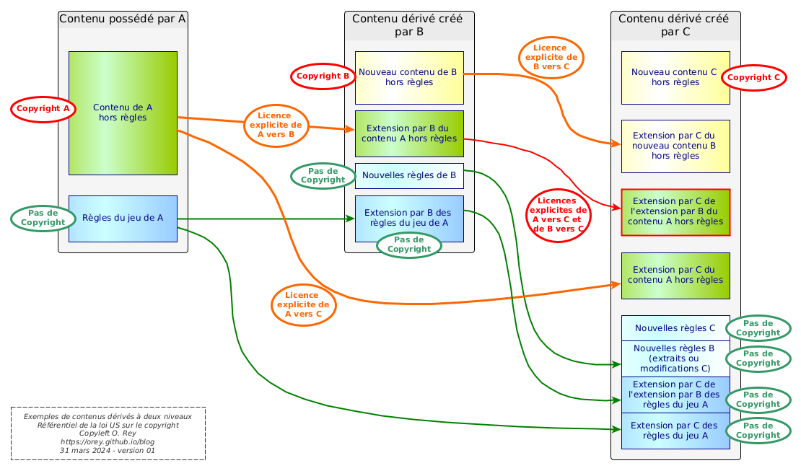

---
tags:
    - Adventures in Middle-Earth
    - Basic Roleplaying System
    - Black Flag
    - Black Hack
    - Call of Cthulhu
    - Chaosium
    - D&D
    - Dark Sun
    - Kobold Press
    - Middle-Earth Role Playing
    - Paizo
    - Pathfinder
    - Tales of the Valiant
    - The Lord of the Rings Roleplaying Game
    - The One Ring
    - Wizards of the Coast
---

# Les licences "ouvertes" dans le JDR

Pour comprendre les licences ouvertes dans le monde du JDR, et par conséquent les SRD (*System Reference Document*), il est nécessaire d'avoir quelques notions de copyright au sens de la loi américaine. Car fondamentalement, pour ne pas y aller par quatre chemins, c'est la (seule) référence qui vaille en cas de litige. En effet, la loi ne reconnaît ni les licences *Creative Common*, ni les licences OGL V1.0a, ni les licences ORC.

Alors pourquoi tant de bruit autour de ces licences ? Nous allons tenter de répondre à cette question.

*Avertissement : cet article n'est pas un conseil en droit américain, aussi ne le prenez pas pour argent comptant dans le cadre d'un procès. Pour autant, les arguments qu'il recense sont parfaitement alignés avec la loi américaine sur le copyright. Aussi, en cas de litige, n'hésitez pas à demander à des avocats spécialisés de faire le travail afin d'arriver aux mêmes conclusions que celles de cet article.*

## Le droit américain sur le copyright

La loi américaine sur le copyright est un document dénommé [Title 17](https://www.copyright.gov/title17/), disponible en ligne et assorti d'une jurisprudence assez importante.

Voici le lien vers le [Title 17](../files/divers/title17.pdf) ainsi que vers le PDF du [Compendium of US Copyright Office Practices](../files/divers/compendium.pdf) et vers le [glossaire](../files/divers/glossary.pdf). Ces PDFs ont été sauvegardés à la date de l'article.

Attention : ces documents vivent et peuvent changer. N'hésitez pas à consulter le site [copyright.gov](https://www.copyright.gov).

### Quelques définitions

Le paragraphe 101 du Title 17 des définitions définit (entre autres) les notions suivantes.

> “Copyright owner”, with respect to any one of the exclusive rights comprised in a copyright, refers to the owner of that particular right.

Dans la loi américaine, un copyright est un *ensemble de droits* sur une œuvre, cela depuis 1978. Chaque droit peut faire l'objet de transfert de propriété ou d'une licence exclusive ou non-exclusive :

* La licence exclusive s'apparente à un transfert de propriété sur un ou plusieurs droits (mais pas tous) ;
* La licence non-exclusive s'apparente à une autorisation d'usage sous certaines conditions.

> A “derivative work” is a work based upon one or more preexisting works, such as a translation, musical arrangement, dramatization, fictionalization, motion picture version, sound recording, art reproduction, abridgment, condensation, or any other form in which a work may be recast, transformed, or adapted. A work consisting of editorial revisions, annotations, elaborations, or other modifications, which, as a whole, represent an original work of authorship, is a “derivative work”.

La notion d'"œuvre dérivée" est bien entendu au cœur de la notion de jeux fondés sur des SRD et sur les licences qui les accompagnent.

> “Literary works” are works, other than audiovisual works, expressed in words, numbers, or other verbal or numerical symbols or indicia, regardless of the nature of the material objects, such as books, periodicals, manuscripts, phonorecords, film, tapes, disks, or cards, in which they are embodied.

Bien entendu les JDR sont des œuvres littéraires, mais un peu particulières, comme nous allons le voir en raison des différents types de contenus qui les composent.

Nous trouvons aussi la définition d'une licence dans le Compendium et le Glossaire :

> License: An agreement by which a party grants another party one or more rights (but fewer than all rights), usually limited to a particular territory and/or time period. A license may be granted as an exclusive license or a nonexclusive license.

Dans le cadre des trois modèles de licences que nous allons étudier (copyright, OGL et ORC), nous parlons de licences non-exclusives. On trouve la définition d'une licence non-exclusive dans le glossaire.

> Nonexclusive license: A nonexclusive license is “a license of intellectual property rights that gives the licensee a right to use, make, or sell the licensed item on a shared basis with the licensor and possibly other licensees.” BLACK'S LAW DICTIONARY 1 004 (9th ed. 2009).

Traduction : *une licence non-exclusive est "une licence de droits de propriété intellectuelle qui donne au récipiendaire le droit d'usage, de créer ou de vendre l'élément sous licence sur une base partagée avec le propriétaire des droits et possiblement d'autres bénéficiaires de la licence".*

Cette définition ne s'applique pas totalement à notre cas dans la mesure où les licences dont nous parlons permettent de ne pas payer de royalties au propriétaire du contenu.

Pour autant, dans la suite du document, nous parlerons uniquement de licences non-exclusives.

### Définition du copyright (paragraphe 102)

> § 102 · Subject matter of copyright: In general

> (a) Copyright protection subsists, in accordance with this title, in original works of authorship fixed in any tangible medium of expression, now known or later developed, from which they can be perceived, reproduced, or otherwise communicated, either directly or with the aid of a machine or device. Works of authorship include the following categories:

> (1) literary works;

Les JDR entrent dans la catégorie des œuvres littéraires.

> (2) musical works, including any accompanying words;

> (3) dramatic works, including any accompanying music;

> (4) pantomimes and choreographic works;

> (5) pictorial, graphic, and sculptural works;

> (6) motion pictures and other audiovisual works;

> (7) sound recordings; and

> (8) architectural works.

> (b) In no case does copyright protection for an original work of authorship extend to any idea, procedure, process, system, method of operation, concept, principle, or discovery, regardless of the form in which it is described, explained, illustrated, or embodied in such work.

Le paragraphe 102.b. est fondamental. Il indique que **les règles du jeu** (process, procédure, système opératoire, etc.) **ne sont pas soumises au copyright**.

Il en va de même de la loi américaine sur les brevets (*patents*). Les règles du jeu dont considérées par la jurisprudence comme des idées abstraites (*abstract ideas*), et donc ne sont pas "patentables".

Cette idée est à la base de la licence OGL et de la licence ORC, comme nous le verrons.

### Compilations et œuvres dérivées (paragraphe 103)

> § 103 · Subject matter of copyright:

> Compilations and derivative works

> (a) The subject matter of copyright as specified by section 102 includes compilations and derivative works, but protection for a work employing preexisting material in which copyright subsists does not extend to any part of the work in which such material has been used unlawfully.

> (b) The copyright in a compilation or derivative work **extends only to the material contributed by the author of such work**, as distinguished from the preexisting material employed in the work, and does not imply any exclusive right in the preexisting material. The copyright in such work is independent of, and does not affect or enlarge the scope, duration, ownership, or subsistence of, any copyright protection in the preexisting material.

Le paragraphe 103.b. est très clair : le copyright original s'applique encore dans l'œuvre dérivée, et le copyright de l'auteur de l'œuvre dérivée ne possède un copyright que sur la partie qu'il a modifiée ou créée (voir schéma plus loin dans l'article).

### Les droits exclusifs inclus dans le copyright (paragraphe 106)

> § 106 · Exclusive rights in copyrighted works 39

> Subject to sections 107 through 122, the owner of copyright under this title has the exclusive rights to do and to authorize any of the following:

> (1) to reproduce the copyrighted work in copies or phonorecords;

> (2) to prepare derivative works based upon the copyrighted work;

Le droit de créer des œuvres dérivées est un droit du possesseur du copyright.

> (3) to distribute copies or phonorecords of the copyrighted work to the public by sale or other transfer of ownership, or by rental, lease, or lending;

Le possesseur du copyright a le droit de vendre des copies ou de passer par un transfert de propriété, une location, un leasing ou un prêt. Ce ces existe dans le JDR pour les jeux exploitant les licences officielles des films, des séries ou des œuvres littéraires.

> (4) in the case of literary, musical, dramatic, and choreographic works, pantomimes, and motion pictures and other audiovisual works, to perform the copyrighted work publicly;

> (5) in the case of literary, musical, dramatic, and choreographic works, pantomimes, and pictorial, graphic, or sculptural works, including the individual images of a motion picture or other audiovisual work, to display the copyrighted work publicly; and

> (6) in the case of sound recordings, to perform the copyrighted work publicly by means of a digital audio transmission.

### Conclusion temporaire

Nous savons ce qu'est un copyright, quels sont les droits qui lui sont associés. Nous savons aussi qu'une licence est un droit d'usage de ces droits, ainsi que nous avons que ,dans le cadre d'une œuvre dérivée, le copyright original s'applique toujours sur le contenu original.

## Synthèse de la problématique dans le JDR

La problématique des droits dans le JDR se pose à deux niveaux :

* Comment un acteur A permet à un acteur B d'utiliser son contenu dans des produits dérivés ?
* Comment l'acteur B permet à un acteur C d'utiliser le contenu dérivé pour d'autres produits dérivés ?

### Vision synthétique, cas des licences non-exclusives

La figure suivante montre comment la loi américaine sur le copyright répond à cette question.

*(N'hésitez pas à ouvrir l'image dans un nouvel onglet pour une meilleure définition.)*

Nous voyons sur ce schéma les deux niveaux de gestion des droits sur le contenu.

Pour faire plus simple, nous utiliserons le mot "extension" pour qualifier tout ce qui peut être copie complète ou partielle et modification de tout genre.

Pour ce qui est des règles, quelques que soient leurs extensions, ces dernières ne sont pas soumises au copyright. Elles peuvent donc êtres étendues. Cela est vrai à tous les niveaux. Constatons qu'au niveau de C, nous avons potentiellement quatre types de règles (en bleu), toutes non soumises au copyright (dans le cas où C est dans une généalogie de contenus allant de A vers B vers C).

Cela veut aussi dire qu'**il n'est pas nécessaire d'attribuer la paternité des règles à qui que ce soit étant donné qu'elles n'appartiennent à personne**. Ce point est très important, comme nous le verrons ensuite.

Pour ce qui est du contenu sous copyright créé par A, ce dernier ne peut pas être utilisé sans une licence explicite de gré à gré entre A et B. Cette licence ne peut pas être générique, dans la mesure où elle doit préciser les termes de l'usage.

Par exemple, si je veux publier un scénario pour *Forgotten Realms*, il me faut faire un accord explicite avec WotC, une licence non-exclusive, dans l'esprit de la définition de la licence de la loi sur le copyright :

> [...] a right to use, make, or sell the licensed item on a shared basis with the licensor [...]

Evidemment, les sujets des royalties, du respect de l'esprit de l'œuvre originale et potentiellement de la qualité de l'œuvre dérivée seront au cœur des négociations.

Cela vaut pour toutes les situations de ce type et le schéma montre une licence explicite entre B et C sur une extension par C du contenu spécifique créé par B et pour lequel B possède le copyright.

Le seul cas non trivial de cette situation est le cas en rouge sur le diagramme. Supposons que B ait une licence avec A pour faire une extension de son contenu sous copyright. C peut étendre à nouveau ce contenu s'il possède deux licences :

* Une de la part de A sur l'extension du contenu original créé par A,
* Une de la part de B sur l'extension de la contribution de B.

Car, de manière générale, le contenu sous copyright est et reste, dans le cadre des licences non-exclusives, la propriété du possesseur du copyright original.

### Cas des licences exclusives

La licence exclusive procède à un transfert de propriété d'un ou plusieurs droits (mais pas de tous, pour une durée et des conditions données.

Si je possède un personnage de BD par exemple, je peux transférer le droit d'adaptation à l'écran à une société cinématographique de manière exclusive, moyennant accord financier, conditions et durée.

Dans le monde du JDR, la licence exclusive est utilisée pour faire d'un JDR le JDR officiel d'une marque, d'un film, d'une série ou d'une œuvre littéraire.

Par exemple, les héritiers de Tolkien ont accordé à différentes sociétés de JDR aucours du temps le droit exclusif de faire un JDR dans le monde de Tolkien :

* ICE pour *Middle-Earth Role Playing* (1984-1999),
* Decipher pour *The Lord of the Rings Roleplaying Game* (2002-2007),
* Cubicle7 pour *The One Ring 1e* (2011-2019) et *Adventures in Middle-Earth* pour *D&D* 5e,
* Free League Publishing pour *The One Ring 2e* et *The Lord of the Rings Roleplaying* pour *D&D* 5e (depuis 2002).

Ces licences sont exclusives (c'est un transfert exclusif du droit de créer un JDR dans l'univers de Tolkien), elles ont une durée de vie, des conditions et un arrangement financier.

Cette situation semble, dans le monde du JDR, limitée aux adaptations d'œuvres littéraires, cinématographiques ou télévisuelles comme Star Gate RPG, Dune RPG, Indiana Jones RPG, Men in Black RPG, Star Wars RPG, etc.

### Seconde conclusion sur la loi sur le copyright

Selon la loi sur le copyright, il est donc parfaitement possible d'utiliser les règles de n'importe quel jeu :

* Sans licence,
* Sans créditer l'auteur original,
* Pour faire des œuvres dérivées commerciales.

Certes, il faudra faire attention à la proclamation de la compatibilité avec les règles de l'oeuvre originale : pas d'utilisation des trademarks, ni du copyright du détenteur original.

Une formule comme "*le plus grand JDR du monde*" semble accepté par le marché.

Certes l'incertitude porte alors que la définition de la frontière entre règle et contenu sous copyright. Dans la première version du SRD de *Basic Roleplaying Game* 4e (*BRP*), Chaosium prévient que certaines mécaniques de jeu, dont des concepts de magie, sont sous copyright. Ces mécaniques de jeu sont, en effet, très liées avec le background du jeu.

Il est donc possible, en effet de considérer que la "santé mentale" dans *Call of Cthulhu* est soumise au copyright parce qu'elle est une mécanique spécifique à l'univers et intégrée dans cet univers comme partie constitutive de ce dernier. Ca se plaide, mais nous sommes à la limite.

Pour le SRD 5.1 de *D&D*, les choses sont plus simple : en enlevant quelques noms propres, les sorts deviennent de pures mécaniques non liées à des univers et sortent donc du domaine du copyright. La preuve en est que les mécaniques psioniques de *Dark Sun* ne font pas partie du SRD, alors que ce sont des règles, mais faisant partie intégrante de l'univers *Dark Sun* soumis au copyright.

## La licence OGL V1.0a

En 2000, WotC publie l'étrange licence OGL. Cette dernière est vue comme une avancée majeure, sans doute parce que personne ou presque, dans le monde du JDR, ne comprend le droit américain du copyright.

Les effets positifs de cette licence sont de libérer une certaine créativité dans les œuvres OGL et de créer notamment le mouvement OSR (Old School Renaissance) qui revient aux bases du JDR et aux premières versions de *D&D*.

Les effets négatifs sont que la communauté du JDR se met en position de suiveuse de WotC et ne parvient pas à comprendre que la licence OGL demande plus que la loi américaine et qu'en cela, elle est inutile.

### Examen de la licence

Nous allons analyser cette licence au regard du droit américain sur le copyright.

> OPEN GAME LICENSE Version 1.0a

> The following text is the property of Wizards of the Coast, Inc. and is Copyright 2000 Wizards of the Coast, Inc ("Wizards"). All Rights Reserved.

Ce point a été vu comme un problème. Or le fait que le texte de la licence appartienne au possesseur du copyright est normal. Le possesseur de la licence peut dicter ses lois sur le contenu qu'il partage - mais il doit respecter aussi la loi sur le copyright.

> 1. Definitions:

> (a)"Contributors" means the copyright and/or trademark owners who have contributed Open Game Content;

Cette première définition est vague. Dans le schéma ci-dessus, A, B et C sont des contributeurs.

> (b)"Derivative Material" means copyrighted material including derivative works and translations (including into other computer languages), potation, modification, correction, addition, extension, upgrade, improvement, compilation, abridgment or other form in which an existing work may be recast, transformed or adapted;

Cette notion de *Derivative Material* est presque mot pour mot la définition de *Derivative Work* présent dans la loi US sur le copyright.

> (c) "Distribute" means to reproduce, license, rent, lease, sell, broadcast, publicly display, transmit or otherwise distribute;

Là encore, la licence reprend les définitions du droit américain sur le copyright.

> (d)"Open Game Content" means the game mechanic and includes

> * the methods,

> * procedures,

> * processes and routines

WotC reprend le paragraphe 102.b. de la loi US. C'est la première partie du contenu du document soumis à cette licence.

> to the extent such content does not embody the Product Identity

Le *Product Identity* est, selon WotC, la partie soumise au copyright. C'est la deuxième partie du contenu du texte dont il question.

> and is an enhancement over the prior art

Cette phase est tout à fait étrange et cela sur deux points.

Tout d'abord, WotC semble vouloir dire que de nouvelles règles portées par la personne exerçant la licence doit être une *amélioration* de ce qui existe. C'est un vœu pieu, mais très difficile à prouver.

Par exemple, le *Black Hack* est-il une amélioration des règles ou une détérioration ?

Le second point est que cela n'a rien à voir avec le fait d'être qualifié d'*Open Game Content (OGC)*. Par rapport à la loi, toute règle de jeu est OGC, qu'elle soit une amélioration ou pas.

> * and any additional content clearly identified as Open Game Content by the Contributor,

Il s'agit là de la troisième partie du contenu : un contenu soumis au copyright mais que le titulaire de la licence aurait envie de déclarer OGC.

Notons que nous entrons ici un peu dans la confusion. Nous parlions jusqu'à présent d'une société, WotC, qui définissait une licence pour que des personnes ou des compagnies aient l'usage de son contenu (A dans le schémas ci-dessus). Nous sommes maintenant à un point où nous parlons des déclarations des possesseurs de licences (B dans le schéma ci-dessus).

C'est le problème de vouloir faire une licence générique.

Au titre de la loi américaine, le contenu soumis au copyright reste soumis au copyright. Comme ce contenu a une certaine valeur, son possesseur devrai définir la licence avec ceux qui en auront l'usage. Cette licence doit avoir une durée, des conditions et un arrangement financier. Bien entendu, rien n'oblige le possesseur de ce copyright à utiliser la licence OGL pour son contenu.

> and means any work covered by this License, including

> * translations

Les traductions ne sont pas OGC de la définition même de la licence OGL sur les *Derivative Material*. L'affirmation ci-dessus est aussi contraire au droit américain. Une traduction est un *Derivative Work* qui possède son propre copyright.

WotC ne peut pas décréter que les traductions sont OGC sans l'autorisation des traducteurs.

La licence OGL est sur ce point en contradiction avec elle-même et en contradiction partielle avec le droit américain.

> * and derivative works under copyright law, but specifically excludes Product Identity.

Cette phrase est très étrange.

De fait, les œuvres dérivées selon la loi du copyright ne sont pas OGC. Certes, si elles sont du Product Identity, elles ne le sont pas non plus.

Il est possible que WotC ait voulu parler des traductions et des autres œuvres dérivées soumises au copyright que les auteurs auraient voulu mettre en OGC quand même (alors qu'elles ne le sont pas par défaut). Mais la formulation est totalement obscure si c'est cette interprétation qu'il faut retenir.

Mais voyons donc la fameuse notion de *Product Identity*.

> (e) "Product Identity" means product and product line names, logos and identifying marks including trade dress;

Nous parlons ici de *trademarks*.

> artifacts; creatures characters; stories, storylines, plots, thematic elements, dialogue, incidents, language, artwork, symbols, designs, depictions, likenesses, formats, poses, concepts, themes and graphic, photographic and other visual or audio representations; names and descriptions of characters, spells, enchantments,

Malheureusement, les sorts sont considérés comme des règles du jeu. Le cas des sorts associés à des noms propres est plus ambigu, car nous sommes entre le *Product Identity* et l'OGC, donc défendable en tant que *Product Identity* dans la mesure où la règle est partie intégrante de l'univers (cf. remarques ci-dessus à propos de *Dark Sun*).

> personalities, teams, personas, likenesses and special abilities; places, locations, environments, creatures, equipment, magical or supernatural abilities or effects, logos, symbols, or graphic designs;

Cette liste est assez étrange car contraire avec le contenu ouvert par WotC, même dans le SRD 5.1 de *D&D*, notamment sur les créatures et les caractéristiques magiques qui peuvent être assimilées à des règles.

Mais il est possible qu'en presque 20 ans, la compréhension du droit du copyright ait évolué chez WotC.

> and any other trademark or registered trademark clearly identified as Product identity by the owner of the Product Identity, and which specifically excludes the Open Game Content;

Encore les trademarks.

> (f) "Trademark" means the logos, names, mark, sign, motto, designs that are used by a Contributor to identify itself or its products or the associated products contributed to the Open Game License by the Contributor

De nouveau les trademarks.

> (g) "Use", "Used" or "Using" means to use, Distribute, copy, edit, format, modify, translate and otherwise create Derivative Material of Open Game Content.

Même définition que *Derivative Work* de la loi US.

> (h) "You" or "Your" means the licensee in terms of this agreement.

> 2. The License: This License applies to any Open Game Content that contains a notice indicating that the Open Game Content may only be Used under and in terms of this License. You must affix such a notice to any Open Game Content that you Use. No terms may be added to or subtracted from this License except as described by the License itself. No other terms or conditions may be applied to any Open Game Content distributed using this License.

> 3. Offer and Acceptance: By Using the Open Game Content You indicate Your acceptance of the terms of this License.

> 4. Grant and Consideration: In consideration for agreeing to use this License, the Contributors grant You a perpetual, worldwide, royalty-free, non-exclusive license with the exact terms of this License to Use, the Open Game Content.

Droit d'usage du contenu OGC.

La formulation employée, *perpetual, worldwide, royalty-free, non-exclusive license*, est étrangement empruntée au cas de l'administration américaine décrit dans le cadre de la loi US sur le copyright.

En effet, dans le paragraphe 105, il est stipulé qu'un employé de l'Etat appartenant à certaines organisations conserve son copyright mais qu'on peut lui ordonner de donner à l'Etat une *irrevocable, royalty-free, worldwide, nonexclusive license to reproduce,
distribute, perform, or display*.

Le problème est que WotC n'est pas l'Etat, que la licence est un contrat entre deux parties et que si une des deux parties meurt, la licence s'arrête, ce qui n'est pas le cas de l'Etat américain.

> 5.Representation of Authority to Contribute: If You are contributing original material as Open Game Content, You represent that Your Contributions are Your original creation and/or You have sufficient rights to grant the rights conveyed by this License.

Encore une formulation absconse : que doit-on entendre par "matériau original" (*original material*) ? Si ce matériau est composé de règles, alors aucun copyright ne peut être revendiqué ; sinon, ce matériau est sous copyright.

Dans le premier cas, il n'y a pas besoin de représentation ; dans le second, le possesseur du copyright devrait poser une notice copyright comme demandé par le droit américain.

De plus, rien n'indique que le récipiendaire de la licence OGL voudra utiliser la même licence quand il voudra licencier son travail dérivé, celui sur lequel il possède le copyright.

Notons qu'il est dangereux de présumer que l'on donne gratuitement un copyright sans licence, car utiliser la licence OGL sur un contenu copyrighté que l'on possède et que l'on souhaite ouvrir est très dangereux pour le possesseur - et le droit américain nous le dit.

Supposons que je crée dans le cadre d'une licence OGL *D&D* Mister DarkFuzz, un héros aux caractéristiques spéciales et que je l'intègre dans ma déclaration OCG en tant que copyright que je transforme en OGC. Supposons que quelqu'un produise une campagne à succès, des livres et un film sur Mister DarkFuzz. Quels sont mes moyens de contrôler mon copyright ? Il ne faut évidemment pas considérer ce que WotC nous suggère, surtout que eux, ne le font pas (voir plus bas)

> 6.Notice of License Copyright: You must update the COPYRIGHT NOTICE portion of this License to include the exact text of the COPYRIGHT NOTICE of any Open Game Content You are copying, modifying or distributing, and You must add the title, the copyright date, and the copyright holder's name to the COPYRIGHT NOTICE of any original Open Game Content you Distribute.

Evidemment, réutiliser du contenu non soumis à copyright (OGC) ne nécessite pas de créditer ni WotC, ni Gygax, ni qui que ce soit. Car, les règles de *D&D*, dans la mesure où elles sont génériques, ne peuvent pas porter de copyright.

On dirait que cet article est là pour dire à Hasbro, la maison mère de WotC : regardez, vous avez acheté de l'IP (*Intellectual Property*) ! Mais le fait est que non. Au regard du droit US sur le copyright, tout le SRD était ouvert avant qu'il ne soit publié.

Il n'est donc pas besoin de créditer quelqu'un pour un matériau qui est dans le domaine public.

J'entends des mâchoires qui grincent, mais c'est bien la réalité.

> 7. Use of Product Identity: You agree not to Use any Product Identity, including as an indication as to compatibility, except as expressly licensed in another, independent Agreement with the owner of each element of that Product Identity.

WotC rejoint le droit américain (voir les licences explicites dans le schéma ci-dessus). On ne peut pas licencier du contenu sous copyright sans quelques précautions.

> You agree not to indicate compatibility or co-adaptability with any Trademark or Registered Trademark in conjunction with a work containing Open Game Content except as expressly licensed in another, independent Agreement with the owner of such Trademark or Registered Trademark.

La conséquence de cette phrase est de statuer la compatibilité avec *D&D* par une phrase du genre "compatible avec le plus grand JDR du monde".

> The use of any Product Identity in Open Game Content does not constitute a challenge to the ownership of that Product Identity. The owner of any Product Identity used in Open Game Content shall retain all rights, title and interest in and to that Product Identity.

Amusant : cette remarque est totalement conforme avec le droit américain. Tout possesseur de copyright garde ses droits même s'il a permis à des tiers d'utiliser un ou plusieurs droits non exclusifs de manière non payante. Ainsi, oui, WotC a raison, accorder l'usage gratuit d'un contenu sous copyright déclaré comme OGC ne remet pas en cause la propriété du copyright, et n'est pas un transfert de propriété (cas des licences non-exclusives).

> 8. Identification: If you distribute Open Game Content You must clearly indicate which portions of the work that you are distributing are Open Game Content.

Voilà quelque chose de contraignant et j'avoue ne l'avoir jamais vraiment vu faire. Les gens précisent, au contraire, ce qui est Product Identity.

> 9. Updating the License: Wizards or its designated Agents may publish updated versions of this License. You may use any authorized version of this License to copy, modify and distribute any Open Game Content originally distributed under any version of this License.

Soit en bon français :

*9. Mise à jour de la licence : Wizards ou ses représentants désignés peuvent publier des mises à jour de cette licence. Vous pouvez utiliser n'importe quelle version **autorisée** de cette licence pour copier, modifier et distribuer n'importe quel contenu Open Game Content originellement distribué sous n'importe quelle version de cette licence.*

Cet article indique que WotC pourrait décider que la version V1.0a est non autorisée et autoriser une V2 qui elle demande 50% des revenus faits par le récipiendaire de la licence.

Beaucoup de gens ont considéré cet article comme un risque juridique important. Au final, ce n'en est pas un du tout en raison du type de contenus publié par WotC (voir plus bas).

> 10. Copy of this License: You MUST include a copy of this License with every copy of the Open Game Content You Distribute.

Nous remettons en cause ce besoin au regard de la loi sur le copyright (voir plus loin).

> 11. Use of Contributor Credits: You may not market or advertise the Open Game Content using the name of any Contributor unless You have written permission from the Contributor to do so.

Encore une fois le sujet des trademarks. Oui, WotC, personne ne doit user de vos trademarks sans accord.

> 12. Inability to Comply: If it is impossible for You to comply with any of the terms of this License with respect to some or all of the Open Game Content due to statute, judicial order, or governmental regulation then You may not Use any Open Game Material so affected.

> 13. Termination: This License will terminate automatically if You fail to comply with all terms herein and fail to cure such breach within 30 days of becoming aware of the breach. All sublicenses shall survive the termination of this License.

La dernière affirmation est péremptoire mais rien ne le prouve. Si WotC disparaît et se fait racheter par une autre société, la licence peut être terminée.

Mais, au final, est-ce si grave ? Non (voir ci-dessous).

> 14. Reformation: If any provision of this License is held to be unenforceable, such provision shall be reformed only to the extent necessary to make it enforceable.

> 15. COPYRIGHT NOTICE Open Game License v 1.0a Copyright 2000, Wizards of the Coast, Inc.System Reference Document Copyright 2000-2003, Wizards of the Coast, Inc.; Authors Jonathan Tweet, Monte Cook, Skip Williams, Rich Baker, Andy Collins, David Noonan, Rich Redman, Bruce R. Cordell, John D. Rateliff, Thomas Reid, James Wyatt, based on original material by E. Gary Gygax and Dave Arneson.

> END OF LICENSE

### Une pierre, deux coups et beaucoup de confusion

La licence OGL V1.0a (OGL) tente de résoudre deux problèmes à la fois :

* Créer une licence générique entre WotC et ses récipiendaires ;
* Créer une licence applicable entre ses récipiendaires et les gens à qui ils voudraient accorder le même droit. La licence OGL est donc "double". Elle est aussi contaminante "implicitement".

Les trois types de contenu d'un document, selon WotC, sont :

* l'OGC : des règles soumises à la licence OGL ;
* le Product Identity : exclus de la licence et copyright réservé de celui qui utilise la licence ;
* le Product Identity déclaré OGL par le possesseur du copyright.

Or selon la loi sur le copyright et selon la définition même de WotC, **le contenu OGC est non soumis au copyright**. Donc pas besoin de licence pour l'exploiter. Et pas besoin non plus de faire référence à son auteur. Donc **pas besoin de licence OGL**.

Selon la loi sur le copyright, ce que WotC définit comme Product Identity (en excluant monstres génériques et sorts génériques) est soumis à la loi sur le copyright, tout comme les trademarks. Il n'est donc pas possible de les utiliser sans accord explicite et gré à gré avec WotC. La licence OGL n'apporte rien non plus sur cette catégorie de contenu qui est, *de facto*, protégée par le droit américain.

Evidemment, la licence OGL peut jouer le rôle de "rappel de la loi" auprès de ceux qui, ne comprenant pas bien les limites des contenus protégés et non protégés, auraient envie d'utiliser le contenu des univers *D&D* ou les marques pour leur produit dérivé.

Il reste la troisième sorte de contenu : le Product Identity déclaré OGL par le possesseur du copyright dans le but de le transférer à des récipiendaires au travers d'une licence (laquelle ?).

La loi américaine est simple sur le sujet : le copyright reste à son ayant droit et la licence doit être définie (exclusive avec transfert de propriété, ou non-exclusive).

Celui qui veut licencier son propre contenu (par exemple B à C dans le diagramme ci-dessus) choisira alors son mode licensing.

### Intention et réalité

L'ironie de l'affaire est que WotC, dans son SRD 3.5, ne publie en 2000 que du OGC. Donc ils ne font que publier ce qui, chez eux, n'est pas soumis au copyright ! Et donc que tout le monde a le droit de copier !

Ils n'ont pas besoin de licence pour ça, mais cette dernière va faire peur... et va, en même temps, dynamiser le marché.

A l'examen, il semble donc bien que cette licence OGL soit une **grosse arnaque**.

Beaucoup de sociétés vont s'enchaîner à l'OGL alors que ne pas référencer l'OGL et prendre le contenu du SRD sans créditer WotC est parfaitement légal, selon les propres termes de la licence elle-même, et surtout selon la définition du copyright US.

Je pense qu'à la fin des années 90, après le rachat de TSR, WotC a compris que les règles n'étaient ni copyright-ables, ni patent-ables. Ils se sont dit qu'il ne fallait pas que le monde du JDR s'en aperçoive. Ils ont trouvé ce coup de pub énorme, inspiré du software open source, coup de pub qui est, de fait, une gigantesque arnaque.

Et tout le monde est tombé dans le panneau ! Et moi le premier en découvrant toute l'histoire vingt ans après la bataille. Mais après analyse, ce coup de bluff est un baudruche.

Et comme le milieu du JDR est un petit monde avec peu de juristes, la pilule est passée, notamment celle de contaminer les contenus "descendants", soit entre le récipiendaire de la "licence" de WotC et le récipiendaire de la licence du récipiendaire de la "licence" de WotC (entre B et C).

Car si le contenu de WotC OGC est composé de règles sur lesquelles aucun copyright n'est possible, il n'existe aucun devoir à une personne physique ou morale qui voudrait utiliser les règles de *D&D* pour étendre ces règles, ainsi qu'aucune obligation d'attribution.

Au travers de cette licence, WotC a menacé toute la communauté :

* En réaffirmant qu'on ne pouvait pas pirater impunément ses marques et ses univers (le fameux Product Identity), ce qui est totalement vrai et compatible avec le droit américain sur le copyright ;
* En levant toute ambiguïté et en publiant le contenu OGC ouvert, façon de tracer la limite entre leur Product Identity et ce sur quoi aucun copyright ne portait.

C'est malin, quoique la licence soit mal écrite, bien plus mal que le droit US lui-même.

## Utilisation de la licence CC-BY-4.0 pour le SRD 5.1 de D&D : arnaque phase 2 ?

La licence Creative Commons CC-BY-4.0 est une licence non-exclusive qui n'établit aucun transfert de propriété.

De manière générale, les licences Creative Common ont été créées dans le but d'être une alternative aux licences GNU, GNU GPL notamment, licences ayant des propriétés contaminantes : quand un composant logiciel est GPL 3.0 et qu'il est utilisé et distribué dans un software, ce dernier devient GPL 3.0 et donc invendable et open source (*free software*).

Il faudrait les analyser toutes, mais je doute qu'elles valent grand chose face à la loi américaine.

### Analyse de la licence CC4

La licence CC4 porte la même dualité que la licence OGL : selon les moments elle parle de celui qui possède le copyright et qui autorise l'usage de son contenu sans royalties (A dans le schéma ci-dessus) ; à d'autres moments, elle parle de celui qui exploite le contenu et qui a envie de l'utilisation de son contenu dans la chaîne "descendante" des acteurs (B et C dans le schéma).

Dans la [page de garde de la licence](https://creativecommons.org/licenses/by/4.0/deed.en), on nous explique :

> You are free to:

> Share — copy and redistribute the material in any medium or format for any purpose, even **commercially**.

> Adapt — remix, transform, and build upon the material for any purpose, even **commercially**.

> The licensor cannot revoke these freedoms as long as you follow the license terms.

Le dernier point me semble trop simpliste car, comme la licence est basée sur le copyright, si le "licensor" change, alors le copyright change et donc les droits d'exploitation peuvent être remis en question.

Regardons ce qui est écrit dans la [licence](https://creativecommons.org/licenses/by/4.0/legalcode.en#legal-code-title). Notre analyse portera uniquement sur l'application de cette licence au monde des JDR (et plus particulièrement au SRD).

> To the extent this Public License may be interpreted as a contract, You are granted the Licensed Rights in consideration of Your acceptance of these terms and conditions [...]

L'aspect contractuel de la licence est expliqué en préambule.

Dans les définitions, on voit de suite que la licence CC-BY-4.0 (CC4 pour faire plus court) n'est pas pensée pour le sujet du jeu de rôle, soit un mélange de contenus "littéraires" dont (au regard de la loi américaine) une partie possède des droits et est protégée par le copyright (les personnages nommés, les histoires, les lieux, etc.) et une partie ne l'est pas (les règles du jeu).

La licence CC4 ne propose que deux concepts concernant les contenus :

* *Licensed Material* : le contenu qui est ouvert, sur lequel celui qui possède les droits les partage à l'autres ;
* *Adapted Material* : ce que les autres font avec ce contenu.

La licence repousse le problème des deux types de contenus du *Adapted Material*, ceux sous copyright et ceux sans, à la licence que va employer l'utilisateur des contenus sous CC4.

> 1.b. **Adapter's License** means the license You apply to Your Copyright and Similar Rights in **Your contributions to Adapted Material** in accordance with the terms and conditions of this Public License.

Comme dans le droit américain, celui qui a créé un contenu dérivé possède un copyright sur ses contributions seulement (pas sur le contenu original).

> 2.a.1. Subject to the terms and conditions of this Public License, the Licensor hereby grants You a worldwide, royalty-free, non-sublicensable, non-exclusive, irrevocable license to exercise the Licensed Rights in the Licensed Material to:

> - reproduce and Share the Licensed Material, in whole or in part; and
> - produce, reproduce, and Share Adapted Material.

Cet article montre les droits donnés par cette licence. Il est possible de faire ce que l'on souhaite avec le contenu original dans le monde entier et sans payer de royalties si tant est que l'on respecte les conditions d'*attribution* de la licence, soit que l'on nomme le créateur original.

> 2.a.5. paragraph 2. No downstream restrictions . You may not offer or impose any additional or different terms or conditions on, or apply any Effective Technological Measures to, the Licensed Material if doing so restricts exercise of the Licensed Rights by any recipient of the Licensed Material.

En effet, au regard du droit US sur le copyright, il n'est pas possible d'imposer des contraintes différentes ou supplémentaires sur la licence du contenu original (*Licensed Material*).

La question est : est-ce que ce contenu est CC4 et donc doit rester CC4 dans toutes les itérations, notamment dans les liens entre un B et un C au titre du schéma ci-dessus.

> 2.b.3. To the extent possible, the Licensor waives any right to collect royalties from You for the exercise of the Licensed Rights, whether directly or through a collecting society under any voluntary or waivable statutory or compulsory licensing scheme. In all other cases the Licensor expressly reserves any right to collect such royalties.

"To the extend possible" veut dire "dans la mesure du possible", ce qui n'est pas très rassurant. Mais la deuxième partie de l'article précise que les réserves concernant le fait que celui qui ouvre son contenu veuille des royalties doivent être explicites.

J'avoue que cet article me laisse un peu perplexe. Si quelqu'un peut prouver devant un tribunal que, parce que sa société était menacée de faillite, alors il a changé son mode de licensing pour collecter des droits, nous serions dans l'incertitude créée par cette condition "dans la mesure du possible".

Nous arrivons là au cœur du problème. On lit dans la partie *Attribution* les conditions de l'exploitation de la licence :

> 3.a.1. If You Share the Licensed Material (including in modified form), You must:

> A. retain the following if it is supplied by the Licensor with the Licensed Material:

> i.identification of the creator(s) of the Licensed Material and any others designated to receive attribution, in any reasonable manner requested by the Licensor (including by pseudonym if designated);

> ii. a copyright notice;

La notice du copyright est évidemment la notice du copyright du propriétaire du contenu original. Ce fait est très important : la licence CC4 donne le droit d'exploitation du contenu mais ne change pas la propriété de ce dernier. Cette propriété reste soumise au copyright.

Or, pour les jeux de rôles, la jurisprudence américaine considère que la propriété ne s'applique qu'à une partie du contenu original : la partie non relative aux règles du jeu.

Demander un copyright sur le contenu devient donc, dans le cadre des jeux, une mention ambiguë : les règles D20 ne sont pas sous copyright alors que les *Forgotten Realms* le sont.

Dans le cadre d'un SRD ne publiant que des règles, nous avons vu ci-dessus qu'il était inutile de rappeler que les règles du SRD étaient copyright WotC alors que des règles ne peuvent pas porter de copyright. Il est également inutile de créditer les auteurs.

> iii. a notice that refers to this Public License;

> iv. a notice that refers to the disclaimer of warranties;

> v. a URI or hyperlink to the Licensed Material to the extent reasonably practicable;

> B. indicate if You modified the Licensed Material and retain an indication of any previous modifications; and

> C. indicate the Licensed Material is licensed under this Public License, and include the text of, or the URI or hyperlink to, this Public License.

Voilà ce que demande WotC dans le SRD 5.1 de *D&D* en version CC4 :

> The System Reference Document 5.1 is provided to you free of charge under the terms of the Creative Commons Attribution 4.0 International License (“CC-BY-4.0”). You are free to use this content **in any manner permitted by that license** as long as you include the following attribution statement in your own work:

> *This work includes material taken from the System Reference Document 5.1 (“SRD 5.1”) **by Wizards of the Coast LLC** and available at https://dnd.wizards.com/resources/systems-reference-document. The SRD 5.1 is licensed under the Creative Commons Attribution 4.0 International License available at https://creativecommons.org/licenses/by/4.0/legalcode.*

Il est très amusant que WotC ne demande pas de citer son copyright. Pourquoi ? Parce que ces derniers savent que le contenu du SRD n'est pas soumis au copyright ! Il utilisent donc le terme "by WotC" qui n'a aucune valeur juridique.

Cela signifie qu'ils savent que ce que raconte cet article est vrai mais que, tant que les choses marchent, ils continuent.

> Please do not include any other attribution regarding Wizards other than that provided above. You may, however, include a statement on your work that it is “compatible with fifth edition” or “5E compatible.”

> Section 5 of CC-BY-4.0 includes a Disclaimer of Warranties and Limitation of Liability that limits our liability to you.

Notons que, dans cette version, WotC ouvre sa simili-trademark "5e" ou "Fifth Edition", cela facilite l'identification des produits, ce qui est une bonne chose.

Mais là encore, WotC enfonce une porte ouverte : "5e" ou "Fifth edition" ne peut pas faire l'objet d'une vraie trademark en raison de son caractère vraiment trop générique. Si une trademark avait été déposée, cela signifierait que tous les utilisateurs de cette expression devraient payer des royalties à WotC pour l'utiliser !

Mais revenons à la licence CC4.

> 3.a.3. If requested by the Licensor, You must remove any of the information required by Section 3(a)(1)(A) to the extent reasonably practicable.

Cet article précise que le créateur du contenu original a quand même des droits sur ce contenu, au point de pouvoir modifier la mention. Dans la mention demandée par WotC, mention sans copyright original, on peut assumer que WotC a implicitement utilisé cet article pour ne pas indiquer que le contenu du SRD était soumis au copyright.

> 3.a.4. If You Share Adapted Material You produce, the Adapter's License You apply must not prevent recipients of the Adapted Material from complying with this Public License.

Pour la troisième fois, la licence indique que le contenu original est toujours sous la licence CC4 et que ce contenu doit rester sous la licence CC4. Nous dirons que nous sommes dans une "contamination partielle" portée par la licence.

Nous avons vu que la licence CC4 est liée au copyright original, ce qui est normal. Cela a pour implication :

> Term and Termination.

> a. This Public License applies **for the term of the Copyright** and Similar Rights licensed here. However, if You fail to comply with this Public License, then Your rights under this Public License terminate automatically.

Voilà la conséquence naturelle : si les droits se terminent, la licence CC4 devient caduque et il n'est plus possible d'exploiter le contenu. Le copyright est un titre de propriété possédé par une entité.

### CC4 ou OGL, même combat

En fait, nous en sommes au même point. Dès lors que le contenu distribué par WotC n'est pas soumis au copyright, ces derniers peuvent bien le distribuer sous toutes les licences du monde.

Il y a un gros côté hypocrite dans le fait de distribuer ce contenu sous une licence CC4, car la licence CC4 indique que le contenu "ouvert" doit être distribué sous licence CC4. Or c'est faux dans notre cas.

C'est faux au titre du fait que, dans notre cas, le contenu est non soumis au copyright. Il est donc complètement libre. Or comme la licence CC4 impose une attribution des auteurs, elle impose une contrainte supplémentaire à la nature du contenu. Elle est donc en violation avec le droit US : elle restreint l'usage d'un contenu totalement libre en obligeant à une attribution.

Notons que c'est aussi le cas de l'OGL ! Cette "licence" restreint l'utilisation d'un contenu public en obligeant à créditer des personnes qui, au regard de la loi US, ne portent aucun copyright.

Il est notable que WotC nous prouve, avec les mentions portées dans le document SRD 5.1 CC4, qu'il est au courant de l'affaire.

Et pourtant...

## L'update qui fâche

Fin décembre 2022, WotC indique qu'ils travaillent sur un [update de la licence](../files/divers/OGL1.2_DraftForDiscussionPurpose.pdf), update qui va mettre des conditions financières à la licence OGL V1.0a (voir [ici](https://arstechnica.com/gaming/2023/01/rpg-fans-irate-as-dd-tries-to-shut-its-open-game-license/)).

Pour ceux qui croient à la licence, c'est un *casus belli*. Et pourtant, il est nécessaire de bien lire.

### Deux types de contenu dans le SRD 5.1

La licence commence par une page d'introduction redéfinissant les contenus dans le SRD 5.1 de *D&D*. Certaines parties du SRD sortent de la licence CC4 (comme quoi, il est toujours possible avec cette licence de la renier) :

* Les classes de personnages (pages 1 à 55),
* Les sorts, pièges, maladies, folie, objets, poisons, et objets magiques,
* Les conditions.

Pourquoi faire ces choix ? Mystère. Surtout qu'après avoir ouvert ce contenu pendant si longtemps, il est facile de montrer que beaucoup de ces chapitres sont des règles et des mécaniques de jeu - donc qu'aucun copyright ne s'applique dessus.

Sur ce qui reste du SRD, WotC propose de mettre une licence CC4 (à ce moment, le SRD 5.1 complet n'a jamais été publié en CC4). Sur les parties non soumises à la licence CC4 (voir liste ci-dessus), ce serait la licence OGL V1.2 qui s'appliquerait.

La plupart des règles du D20 n'étant pas soumises au copyright, jouer avec la contrainte et faire un "mini SRD" reprenant toutes les règles auxquelles incontestablement, il serait impossible d'attacher un copyright. Puis bâtir sur cette base. C'est ce qu'a fait Kobold Press avec *Black Flag* (voir plus loin).

### Suppression de la licence OGL V1.0a

L'article 9 est invoqué comme le craignaient tous ceux qui avaient lu la licence :

> NOTICE OF DEAUTHORIZATION OF OGL 1.0a. The Open Game License 1.0a is no longer an authorized license. This means that **you may not use that version of the OGL, or any prior version, to publish SRD content after (effective date)**. It does not mean that any content previously published under that version needs to update to this license. Any previously published content remains licensed under whichever version of the OGL was in effect when you published that content.

Oui, les publications faites avant cette licence sont toujours valables, mais pas celles après.

### La version 1.2

Puis la licence est OGL V1.2 est détaillée :

> Open Game License 1.2

> This is a License between Wizards of the Coast LLC (“Wizards,” “us,” “we,” “our”) and anyone who wants to use the licensed content in their own TTRPG (“you,” “your”). By using Our Licensed Content, you agree to the terms of this license. As used in this license, “we” (or any other term referring to us) includes our affiliates, successors, and predecessors.

Le périmètre de la licence est beaucoup moins vague qu'auparavant : WotC s'adresse aux créateurs de JDR.

> 1. LICENSED CONTENT

> (a) Content Covered

> (i) Our Licensed Content. This license covers any content in the SRD 5.1 (or any subsequent version of the SRD we release under this license) that is not licensed to you under Creative Commons. You may use that content in your own works on the terms of this license.

Le contenu sorti de la licence CC4 est le Licenced Content.

> (ii) Our Unlicensed Content. Only Our Licensed Content is licensed under this license. Any other content we release or have released is not licensed to you under this license.

Nouvelle notion : *unlicensed content*, tous les autres contenus sans licence ne sont, évidemment, pas utilisables.

> (iii) Your Content. This is your creative **contributions** to your works that are not Our Licensed Content or Our Unlicensed Content. This license permits you to combine Your Content with Our Licensed Content and distribute the resulting works as authorized by this license.

On aurait pu dire *Derived Works* comme dans le droit américain sur le copyright.

> (b) Works Covered. This license only applies to printed media and static electronic files (such as epubs or pdfs) you create for use in or as tabletop roleplaying games and supplements (“TTRPGs”) and in virtual tabletops in accordance with our Virtual Tabletop Policy (“VTTs”).

> (c) Your Licensed Works. To be a Licensed Work under this license, it must:

> (i) be a covered work as defined in Section 1(b);

> (ii) contain both Our Licensed Content and Your Content; and

> (iii) not contain Our Unlicensed Content.

Cette définition est redondante avec ce qui a été écrit avant.

> (d) Copyrights. We are only licensing you our copyrights in Our Licensed Content, except that under Section 5(a) we also grant you a trademark license to the Creator Product badge, as further detailed in the Creator Product Badge Style Guide. You receive no other rights to our trademarks, and no rights to any other intellectual property we own.

En termes de contenus, nous allons voir les restrictions. En termes de forme, WotC voulait imposer une forme spéciale aux suppléments des créateurs, comme ce que l'on peut trouver sur D&D Beyond ou DMs Guild.

Cette contrainte est totalement inacceptable pour des éditeurs de jeux tierces qui ont, à l'époque leur propre visuel et leur propre gestion artistique. De plus, cette contrainte artistique est bien adaptée pour les petits scénarios, mais pas pour les nouveaux jeux.

Il était normal que cette nouvelle version provoque un tollé.

> 2. LICENSE. In consideration for your compliance with this license, you may copy, use, modify and distribute Our Licensed Content around the world as part of Your Licensed Works. This license is perpetual (meaning that it has no set end date), non-exclusive (meaning that we may offer others a license to Our Licensed Content or Our Unlicensed Content under any conditions we choose), and irrevocable (meaning that content licensed under this license can never be withdrawn from the license). It also cannot be modified except for the attribution provisions of Section 5 and Section 9(a) regarding notices.

Cette garantie est fausse. Dans le droit américain, une licence d'utilisation peut s'arrêter.

D'ailleurs, WotC aurait pu aller plus loin et rendre invendable les produits sous licence OGL V1.0a.

> 3. WHAT YOU OWN. Your Licensed Works are yours. They may not be copied or used without your permission.

Excellent ! WotC donne des leçons de copyright aux bénéficiaires de la licence ! On aura tout vu.

> You acknowledge that we and our licensees, as content creators ourselves, might independently come up with content similar to something you create. If you have a claim that we breached this provision, or that one of our licensees did in connection with content they licensed from us:

> (a) Any such claim will be brought only as a lawsuit for breach of contract, and only for money damages. You expressly agree that money damages are an adequate remedy for such a breach, and that you will not seek or be entitled to injunctive relief.

C'est incroyable ! WotC demande aux récipiendaires des licences de s'engager sur les types de recours qu'ils pourraient faire dans des cas de soupçons de plagiat de la part de WotC ou d'un autre récipiendaire...

Cette mention est parfaitement contraire au droit du copyright qui autorise toutes sortes de recours en cas de plagiat. En d'autres termes WotC demande aux récipiendaires de la licence de s'engager à ne pas avoir recours à tous les moyens juridiques à leur disposition. N'importe quoi.

> (b) In any such lawsuit, you must show that we knowingly and intentionally copied your Licensed Work. Access and substantial similarity will not be enough to prove a breach of this Section 3.

Ils ne manquent pas d'air et veulent faire le procèe et ses conclusions dans la licence. Hasbro et WotC sont-ils au courant qu'ils sont dans un état souverain avec des lois auxquelles ils sont soumis ?

> 4. WHAT WE OWN. We own Our Licensed Content and reserve all rights not expressly granted in this license.

N-ième redite de la même chose.

> 5. YOU CONTROL YOUR CONTENT. You can make your Content available under any terms you choose 

C'est une nouveauté bienvenue en comparaison des sous-entendus de la version 1.0a. Oui, dans le cadre de la loi sur le copyright, il est possible de faire les licences et les transferts de propriété que le possesseur de la licence souhaite.

> but you may not change the terms under which we make Our Licensed Content available.

Le contenu original de WotC reste en licence OGL V1.2.

> (a) You must clearly indicate that your Licensed Work contains Our Licensed Content under this license either by including the full text of this license in your Licensed Work or by applying the Creator Products badge in compliance with the then-current style guidelines.

Clairement, WotC demandait des choses inacceptables quant au style imposé sur les œuvres dérivées.

Il serait intéressant de consulter un spécialiste du droit du copyright pour savoir s'il est possible de donner l'usage d'un contenu tout en contraignant la forme. De ce que j'ai lu, je ne me souviens pas d'avoir vu ce genre de contraintes (à part la mise en place d'un logo par exemple). Il n'est pas certain que cette clause de forme soit défendable en procès et ne soit pas, pour des produits aussi artistiques que les livres de JDR d'aujourd'hui, considérée comme inacceptable et remettant en cause le *Product Identity* du récipiendaire de la licence.

> (b) You may permit the use of your Content on any terms you want. However, if any license you offer to your Licensed Work is different from the terms of this license, you must include in the Licensed Work the attribution for Our Licensed Content found in the preamble to the applicable SRD, and make clear that Our Licensed Content included in your Licensed Work is made available on the terms of this license.

Cette demande est légitime et conforme au droit du copyright et des œuvres dérivées.

> 6. WARRANTIES AND DISCLAIMERS. You represent and warrant that:

> (a) Age and Capacity to Be Bound. You are over the age of majority or, if younger, have had your parent or guardian review these terms and agree to them on your behalf.

Etrange remarque dans un contrat.

> (b) Authority. You have the power and authority to enter into this license and perform its obligations.

> (c) No Infringement. Your Licensed Works do not and will not infringe any third party’s intellectual property rights or any of our rights not licensed to you via this license or any other.

WotC tente de se protéger, mais en faisant signer des déclarations vagues.

> (d) No Endorsement. Except as otherwise expressly allowed by this license, you will not state, suggest, or imply that Your Licensed Works are endorsed by or associated with us.

Mention classique.

> (e) No Illegal Conduct. You will not violate the law in any way relating to this license or Your Licensed Works.

Cette mention a au moins le mérite de la naïveté.

> (f) No Hateful Content or Conduct. You will not include content in Your Licensed Works that is harmful, discriminatory, illegal, obscene, or harassing, or engage in conduct that is harmful, discriminatory, illegal, obscene, or harassing. We have the sole right to decide what conduct or content is hateful, and you covenant that you will not contest any such determination via any suit or other legal action.

Cette contrainte, encore une fois, est inacceptable. Il n'appartient pas à WotC à juger du respect de la loi.

Cette partie 6 a un côté absurde. Dans la partie *Warranty* généralement, la société qui licencie son contenu doit se protéger en disant que tout ce qui peut arriver n'est pas de sa faute, en gros que tout ce qui peut se faire de mal avec son contenu n'est plus de sa responsabilité.

En lieu et place, WotC fait signer un contrat d'adhésion à une plateforme de type réseau social en obligeant les récipiendaires de licences à accepter des règles dont ils doivent rendre compte devant WotC. C'est absurde.

> 7 MODIFICATION OR TERMINATION

> (a) Modification. We may only modify the provisions of this license identifying the attribution required under Section 5 and the notice provision of Section 9(a). We may not modify any other provision.

Cette déclaration n'a aucune valeur.

> (b) Termination

> (i) We may immediately terminate your license if you infringe any of our intellectual property; bring an action challenging our ownership of Our Licensed Content, trademarks, or patents; violate any law in relation to your activities under this license; or violate Section 6(f).

Oui comme dans un réseau social.

> (ii) We may terminate your license if you breach any other term in this license, and do not cure that breach within 30 days of notice to you of the breach.

> 8. DISCLAIMER OF WARRANTIES AND LIMITATION OF LIABILITY. YOU UNDERSTAND AND AGREE THAT WE ARE PROVIDING THE LICENSED CONTENT “AS IS” AND MAKE NO REPRESENTATION OR WARRANTY OF ANY KIND CONCERNING YOUR USE OF THE LICENSED CONTENT EXCEPT AS EXPRESSLY STATED IN THIS LICENSE. WE DISCLAIM ALL WARRANTIES, EXPRESS, IMPLIED, STATUTORY OR OTHERWISE. YOU BEAR ALL RISK OF USING THE LICENSED CONTENT AND SUCH USE IS SOLELY AT YOUR OWN DISCRETION AND RISK. We have no liability to you for any types of damages in connection with your use of Our Licensed Content including without limitation any indirect, consequential, special, punitive, or exemplary damages, so long as our conduct at issue was not grossly negligent or intentional.

Voilà la fameuse mention que nous mentionnions auparavant. Elle est totalement suffisante dans une licence en lieu et place de la section 6.

> 9.MISCELLANEOUS

> (a) Notices. We may notify you by any email or physical address we can locate for you. Only if we cannot locate your email or physical address after a reasonable search, notice via a public channel is sufficient. You may provide notice to us of your email or physical address, or any other notice, by emailing oglnotices@wizards.com.

> (b) Entire Agreement and Disclaimer of Reliance. This license governs your use of Our Licensed Content. This license consists only of the terms expressly included herein, and not any matter not expressly included herein. In accepting this license, you represent and warrant to us that you have relied only on the terms of the license and the advice of your own counsel, if any; you have not relied on anything that is not expressly a part of this license.

Verbiage pseudo-juridique redondant avec de multiples endroits dans cette licence.

> (c) No Waiver of Rights. If we fail to exercise any right we have under this license, that failure will not prevent us from exercising that right in the future.

Cela ne veut rien dire.

> (d) Severability. If any part of this license is held to be unenforceable or invalid for any reason, Wizards may declare the entire license void, either as between it and the party that obtained the ruling or in its entirety. Unless Wizards elects to do so, the balance of this license will be enforced as if that part which is unenforceable or invalid did not exist.

On sent que les personnes qui ont écrit cette licence n'ont pas confiance en eux.

> (e) Governing Law/Jurisdiction/Class Action Waiver. This license and all matters relating to its interpretation and enforcement will be governed by the laws of the State of Washington, and any disputes arising out of or relating to this license will be resolved solely and exclusively through individual litigation in the state or federal courts located in the county in which Wizards (or any successor) has its headquarters, and the parties expressly consent to the jurisdiction of such courts. Each party hereto irrevocably waives the right to participate in any class, collective, or other joint action with respect to such a dispute.

N'importe quoi. Encore une fois, WotC ne peut pas faire signer à quelqu'un qu'il s'engage à renoncer à ses droits légaux en cas de litige. C'est absurde.

Il s'agit probablement d'une clause copiée et collée d'un contrat commercial entre deux entreprises, clause totalement hors sujet dans le cadre de cette licence.

>(f) Headings and Footnotes. The headings and footnotes contained in this license are for reference purposes only and shall not affect in any way the meaning or interpretation of this license.

Mention inutile.

> (g) Waiver of Jury Trial. We and you each waive any right to a jury trial of any dispute, claim or cause of action related to or arising out of this license.

Même remarque qu'auparavant. Il est impossible de renoncer à ses droits légaux dans le cadre d'une licence.

> (h) Review by Counsel. You should seek advice of counsel to make sure you understand this license. You agree that you had the opportunity to do so.

Mention parfaitement stupide.

### Confusion à tous les étages

Osons le dire, ce *draft for discussion purposes* est un torchon ! Il faut absolument que WotC fasse appel à des gens compétents en droit du copyright, car ce "truc" est la preuve d'une incompétence juridique crasse.

Une fois de plus, WotC était en pleine confusion, voire en plein délire :

* **Confusion de logique** :
    * Quel lien entre le contenu protégé par l'OGL V2.0 et la licence elle-même ?
    * Quel lien entre le contenu CC4 et le contenu lui-même ?
    * Il semble qu'il n'y ait aucun lien. Pourquoi ce découpage ? Certains monstres ont une origine très ancienne dans *D&D*, alors pourquoi ne figurent-ils pas dans les éléments non CC4 de la licence ?
* **Confusion de compréhension de la nature des contenus** : vouloir protéger un contenu qu'on a ouvert pendant très longtemps signifie que l'on a mesuré le risque juridique de se faire attaquer sur ce point car, pendant des années, les gens ont pris l'habitude d'utiliser ce contenu gratuitement. Il y a eu la mise en place d'un usage régulier. Le risque juridique aurait donc été que des sociétés attaquent WotC pour démontrer que les contenus nouvellement "fermés" par la licence OGL V2.0 étaient en fait des règles du jeu sur lesquelles aucun copyright ne pouvait être posé.
    * Regardons n'importe quelle classe de personnages et osons dire que ce n'est pas une règle.
* **Confusion business** :
    * WotC a-t-il réalisé qu'une oeuvre dérivée doit pouvoir s'exprimer par la forme et donc qu'une contrainte sur la forme est inacceptable ?
    * Une licence d'utilisation d'un contenu ne peut pas être contrainte à une forme, mais éventuellement à un esprit (dans le cadre de licences exclusives). Si trop de contraintes sont ajoutées, la licence devient un contrat de prestation pour le compte de WotC.
* **Confusions légales** :
    * Il n'est pas possible dans le cadre d'une licence de faire signer aux récipiendaires des renonciations à leurs droits légaux, ni de contraindre à pré-choisir des modes d'attaques ou de défense en cas de procès.
    * Il n'est pas possible de déterminer par avance l'issue de potentielles attaques, par exemple pour plagiat. Ces litiges doivent être résolus par les tribunaux dans l'exercice plein et entier du droit américain.
* **Confusion de textes légaux** : on trouve dans cette licences des éléments venant de multiples sources :
    * Des licences de type CC4,
    * Des conditions d'adhésion à un service Internet en ligne (type D&D Beyond),
    * Voire des clauses de contrat de travail,
    * Des clauses contractuelles établies dans le cadre d'un accord entre deux compagnies.

Ce document est une honte pour le monde du JDR tant l'incompétence des gens ayant travaillé sur ce dossier est patente.

De plus, au regard de son caractère propre à tuer le business, il est normal que la licence OGL V2.0 ait suscité l'ire des compagnies exploitant la licence OGL v1.0a.

### Conclusion de l'affaire

Devant la levée de boucliers, WotC se décide à publier le SRD 5.1 en version OGL V1.0a et en version CC-BY-4.0 (CC4).

Cette position est parfaitement incohérente : dans CC4, tout le contenu est ouvert, alors que dans le clauses de la licence OGL, les sorts par exemple ne figurent pas dans les éléments ouverts (alors qu'ils sont dans le SRD)...

Un tel niveau d'incompétence est quand même rarement vu.

## Suite des événements dans le monde OGL en janvier 2023

La communauté OGL a été prise de panique quand des [informations](https://arstechnica.com/gaming/2023/01/dd-maker-still-wants-to-revoke-earlier-versions-of-open-gaming-license/) ont fait part de la volonté de WotC de révoquer la licence OGL V1.0a.

### La licence ORC et ses différences avec l'OGL V1.0a

Certaines entreprises de jeux contestant la licence OGL dans le monde du JdR, Kobold Press, Paizo et Chaosium, entre autres, se sont alliées pour créer une autre licence : [ORC](https://downloads.paizo.com/ORC_License_FINAL.pdf).

La licence définit essentiellement les contours entre trois types de contenus :

1. Le contenu sur lequel il n'est pas possible de mettre un copyright (pour faire simple toutes les règles) ;
2. Le contenu protégé (*Reserved Material*) qu'il n'est pas possible de copier sans l'autorisation des auteurs ;
3. Le contenu "ouvert" (*Licensed Material*) dont il est possible de dériver des choses.

Par défaut :

* Tout ce qui est règles du jeu (au sens large) est public ;
* Tout ce qui est lié à des lieux, des personnages, etc. est "privé" ; il faut donc spécifier ce que la licence couvre pour "ouvrir un contenu protégé".

On revient aux fondamentaux de la loi sur le copyright.

La notice ORC est assez bien structurée car elle distingue bien tous les types de contenus :

Le texte est déposé à la bibliothèque du Congrès américain et, en cela, est supposé durer (très) longtemps sans être altéré. Il est possédé par [Azora Law](https://azoralaw.com), un cabinet d'avocats de Seattle, supposé garder une certaine neutralité dans le sujet des licences.

Il est possible de faire un petit tableau comparatif entre OGL et ORC :

<table>
<tr>
<th>Type de contenu</th><th>OGL V1.0a</th><th>ORC V1.0</th>
</tr>
<tr>
<td>Règles du jeu</td><td>Open Game Content</td><td>Licensed Material</td>
</tr>
<tr>
<td>Contenu non ouvert</td><td>Product Identity</td><td>Reserved Material</td>
</tr>
<tr>
<td>Contenu ouvert</td><td>Open Game Content</td><td>Expressly Designated Licensed Material</td>
</tr>
<tr>
<td>Référence de filiation</td><td>Amendement de la Copyright notice (article 15)</td><td>Notice complète à 4 sections</td>
</tr>
<tr>
<td>Texte de la licence</td><td>Possédé par WotC</td><td>Possédé par Azora Law</td>
</tr>
<tr>
<td>Pérennité de la licence</td><td>Article 9 **non pérenne**</td><td>Article V. b. "**pérenne**"</td>
</tr>
</table>

Sur les trois premiers paramètres, les deux licences sont très proches. En ce qui concerne la filiation, la licence ORC est plus précise. En ce qui concerne le risque juridique que WotC remette en cause la licence OGL, tout est lié à l'article 9 (voir analyse un peu plus haut dans la page).

Encore une fois, plusieurs points sont à noter.

La licence ORC entend clairement s'attaquer à l'article 9 de la licence OGL V1.0a, le fameux article qui indique que WotC peut changer sa licence, ce qui a été tenté avec la version 2.0.

Il faut rester persuadé qu'une grosse partie du SRD 5.1 de *D&D* ne peut pas légalement porter de copyright car ce sont des règles. Il faudrait faire l'exercice avec un spécialiste pour extraire le contenu "non règles" pour obtenir un SRD complètement ouvert, dans le domaine public.

Mais beaucoup de sociétés ont intérêt à se protéger derrière des licences même si ces dernières sont bancales.

## Ouverture de BRP 5e en ORC

La société Chaosium a publié quasiment [toute la 5e du Basic RolePlaying (BRP)](https://www.chaosium.com/blogdownload-the-free-basic-roleplaying-orc-content-document-sell-the-games-you-create-royaltyfree/) system en ORC.

Il est donc possible de voir cette publication comme, une fois de plus,  une ligne tracée entre ce qui est du contenu sans copyright d'un contenu avec copyright.

D'une certaine façon, c'est le lot des systèmes de jeu génériques (BRP, GURPS, etc.) d'avoir une très grosse partie de leur contenu publiable en mode SRD.

Faute de mieux et histoire de demander à la communauté d'être *fair play* avec les inventeurs, citer la filiation est un acte de bonne conduite que les licences OGL et ORC voudraient rendre obligatoire.

Mais si l'acte est moralement bon, il ne figure pas dans les obligations légales de la loi sur le copyright.

## *Black Flag* et *Tales of the Valiant*

Les plus énervés par les rumeurs sur WotC et la licence OGL en janvier 2023 ont sans doute été les *Kobold Press*.

Ils ont annoncé assez vite que vivre avec cette épée de Damoclès au dessus de la tête était insupportable et qu'ils allaient créer un socle de jeu de type D20 qui serait ORC et que tout le monde pourrait construire de manière fiable et long terme en dérivant de ce contenu.

Le résultat s'appelle *Black Flag* et le Reference Document peut être trouvé [ici](https://www.koboldpress.com/bfr-reference-doc/).

La licence est explicite :

> ORC NOTICE: This product is licensed under the ORC License, located at the Library of Congress at TX 9-307-067, and available online at various locations including www.azoralaw.com/orclicense and others. All warranties are disclaimed as set forth therein.

Pas de surprise, la licence est une licence ORC.

> Attribution: This work includes material taken from the System Reference Document 5.1 (“SRD 5.1”) by Wizards of the Coast LLC and available at https://dnd.wizards.com/resources/systems-reference-document.

> The SRD 5.1 is licensed under the Creative Commons Attribution 4.0 International License available at https://creativecommons.org/licenses/by/4.0/legalcode.

Kobold Press a choisi d'exploiter la licence CC-BY-4.0 du SRD de *D&D* au lieu de la licence OGL V1.0a. En effet, les deux documents existent [sur le site de WotC](https://dnd.wizards.com/resources/systems-reference-document) et la licence CC4 présente, au final, moins de contradictions que la licence OGL V1.0.

> If you use our Licensed Material in your own published works, please credit us as follows: Black Flag Roleplaying Reference Document v0.1, © Open Design, LLC d/b/a Kobold Press

Kobold Press remplit les exigences de la licence ORC sur la demande à ses "descendants" de faire une référence sur le contenu original.

> Reserved Material: Reserved Material elements in this product include all elements designated as Reserved Material under the ORC License.

> Expressly Designated Licensed Material: This product contains no Expressly Designated Licensed Material.

Considérant que le document *Black Flag* ne contient aucune mention explicite à du *Reserved Material*, tout ce qui n'est pas mécanique de jeu (au sens de la licence ORC) peut donc être assimilé à du contenu sous copyright. La dernière phrase entérine ce fait en insistant sur le fait qu'il n'y a pas, en dehors du contenu règles et assimilé, de contenu sous copyright explicitement ouvert.

Une lecture rapide de Black Flag permet de voir que le contenu est une version simplifiée du SRD 5.1 de *D&D* plus quelques innovations de règles (la règle "Doom" par exemple).

*Black Flag* doit servir de fondation au jeu *Tales of the Valiant*. Par cette manipulation de licences, Kobold Press veut construire sur une base ouverte inattaquable et inaltérable lui permettant d'exploiter le contenu de WotC.

## Conclusion

Il n'est pas possible que certains acteurs du JDR américains n'aient pas compris depuis longtemps que cette licence OGL était creuse du fait que le contenu distribué par WotC ne puisse pas être soumis au copyright.

Il paraît invraisemblable que personne chez WotC n'ait compris que le contenu du SRD n'était pas soumis au copyright, j'en veux pour preuve :

*material [...] ***by*** WotC*

et non pas 

*material [...] ***copyright*** WotC*

Cela voudrait dire que toute cette affaire n'est qu'une vulgaire baudruche qui, un jour, se dégonflera.

En attendant, voyons qui va utiliser *Black Flag*.

30 mars 2024
