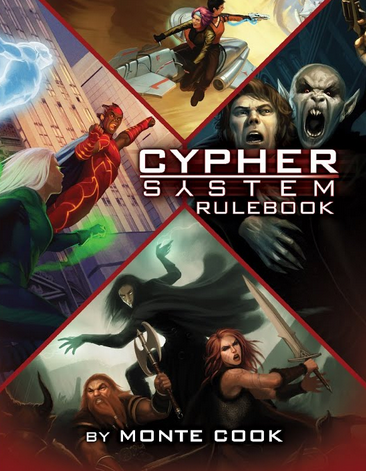
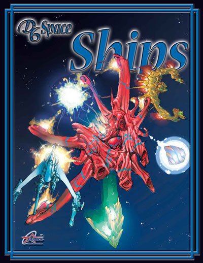
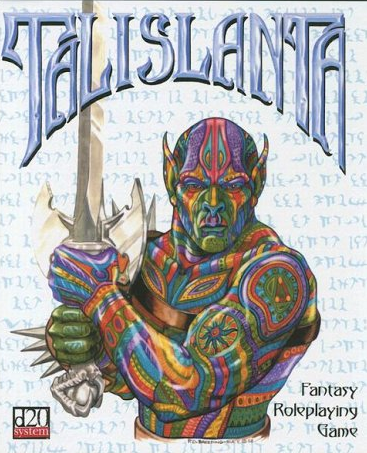

---
tags:
    - 2d20
    - Adventures in Middle-Earth
    - Age System
    - Basic Roleplaying System
    - BESM
    - Blades in the Dark
    - Call of Cthulhu
    - Conan 2d20
    - Cortex Prime
    - Cthulhu Confidential
    - Cypher
    - d20 System
    - D6 System
    - D&D
    - EABA
    - Elric
    - Esoterrorists
    - Fate
    - Forge Engine
    - FU
    - Fudge
    - Fuzion
    - Genesys
    - Gumshoe
    - GURPS
    - Hero System
    - Hollow Earth Expedition
    - Interlock
    - Lord of the Rings 5e
    - M-Space
    - Magic World
    - Megaversal
    - MERP
    - Microlite
    - Mutants & Masterminds
    - Open-Legend RPG
    - Palladium
    - Pathfinder
    - PbtA
    - Rolemaster
    - Runequest
    - Savage Worlds
    - Star Wars 5e
    - Stormbringer
    - Swords of the Serpentine
    - Tri-Stat dX
    - True20
    - Ubiquity
    - WOIN
---

# Petit aperçu partial des moteurs de JDR génériques

## Introduction

### Page reddit

La liste qui suit vient d'une page reddit qui listait les moteurs de jeux génériques : [lien reddit](https://www.reddit.com/r/rpg/comments/123rm76/best_generic_systems/?rdt=56245).

Je me suis dit que ce serait une bonne idée pour moi de faire la synthèse de ce que j'ai vu et lu et de ce à quoi j'ai joué. Attention, tout est très partial et surtout très incomplet, mais cela me permet de capitaliser un peu sur ce que je lis.

### Typologie des systèmes

En fait, nous pouvons commencer une typologie des systèmes.

Le premier élément est que beaucoup de ces systèmes sont le fruit d'une seule personne, ou d'un très petit groupe de jeu. C'est souvent un inconvénient, car travailler sur un groupe large avec une communauté créative permet de créer des jeux plus équilibrés, plus *streamlined* comme on dit en anglais.

Ensuite, beaucoup de systèmes de jeux reprennent les mêmes mécaniques. Un papier assez intéressant a été écrit sur les design patterns dans le JDR : [Design Patterns of Successful Roleplaying Games](../files/divers/RPG_Design_Patterns_9_13_09.pdf).

Pour autant, nous pouvons établir une classification un peu différente des jeux. A compléter.

### A propos de la liste

La liste est présentée par ordre alphabétique. Elle contiendra de plus en plus les mini-systèmes et les liens vers les sites concernés.

## 2D20-System

| Jeux         |                      |                      |
|--------------|----------------------|----------------------|
| Conan        | Star Trek Adventures | Mutant Chronicles 3e |
| Infinity RPG |                      |                      |

Je connais mal ce système. J'ai acquis, il n'y a pas longtemps, un exemplaire de *Conan 2D20* publié pour le *Free RPG Day*, mai je n'ai pas eu le temps de regarder. A suivre.

## 5e, jeux basés sur la 5ème édition de D&D

| Jeux basés sur la 5.0/5.5 |              |            |
|---------------------------|--------------|------------|
| Adventure in Middle-Earth | Tal'Dorei    | Talislanta |
| Ultramodern 5e            | Star Wars 5e |            |

Alors que dire... Malgré toutes les attaques contre la 5e, on peut voir qu'elle s'adapte plutôt pas mal à différentes choses. J'ajouterai en ligne : [Star Wars 5e](https://www.sw5e.com) que je trouve assez réussi.

J'aime bien *Adventures in Middle-Earth*, même si je n'ai jamais joué. J'ai joué, voilà bien longtemps, un scénar de MERP (avec un des "spécialistes" de Tolkien dans le monde du JDR) mais cela ne m'a pas emballé. A l'époque, des gars avaient la grosse tête parce qu'ils avaient lu tout Tolkien en anglais. Cela me laissait perplexe.

Certes *Cubicle 7* a perdu sa licence mais les ayant-droits dudit Tolkien paraissent un peu psychopathes parce qu'on ne bâtit pas une gamme en 5 minutes. Faut-il que les fans rachètent la version *Lord of the Rings 5e* de *Free League* ?

Quand les gammes changent trop, c'est compliqué à suivre. Le pire, ces derniers temps, c'est *Pathfinder 2e* avec ses deux éditions (une OGL et une sans aucune mention venant de l'OGL).

## Age system

| Jeux        |            |            |
|-------------|------------|------------|
| Fantasy Age | Dragon Age | Modern Age |

Je ne connais que les quickstart guides de *Dragon Age* et de *Modern Age*, mais le système est très voisin : 3D6 + caractéristique + focus contre facteur de difficulté.

La table ci-dessous compare les caractéristiques de ces jeux avec *D&D*.

| Dragon Age    | Modern Age    | D&D                          |
|---------------|---------------|------------------------------|
|               | Accuracy      | Dexterity                    |
| Communication | Communication | Charisma                     |
| Constitution  | Constitution  | Constitution                 |
| Cunning       | Intelligence  | Intelligence                 |
| Dexterity     | Dexterity     | Dexterity                    |
|               | Fighting      | Strength/Dexterity           |
| Magic         |               | Wisdom/Intelligence/Charisma |
| Perception    | Perception    | Wisdom                       |
| Strength      | Strength      | Strength                     |
| Willpower     | Willpower     | Wisdom                       |

Pour *D&D*, nous sommes avec d20 + bonus de caractéristique + proficiency bonus + autres bonus contre facteur de difficulté.

Age propose la courbe en cloche des 3D6 contre la linéarité du d20. Mouais, why not. Je ne suis pas certain que cela apporte quelque chose. Si, disons que matérialiser Perception comme une caractéristique est intéressant (c'est un peu une bidouille dans *D&D*).

## Basic Roleplaying System

| Jeux            |           |             |
|-----------------|-----------|-------------|
| Call of Cthulhu | Runequest | Magic World |
| Stormbringer    | Elric     | M-Space     |

Bon, ce système parfait pour *Cthulhu*, je pense que c'est clair, même si je n'aime pas les caractéristiques en pourcentage de la 7ème édition.

Pour *Runequest*, je le trouve un peu dur (voir l'[article sur la classe d'armure](../blog/2025.md#a-propos-du-lien-classe-darmure-et-d20)) : ainsi, il est facile de mourir suite à un mauvais hasard (et non à des actions du joueur). Quoiqu'en dise Petersen dans une de ses interviews, cette façon de faire du médiéval-fantastique est un peu dure pour moi. J'avoue : je ne prends pas plaisir à tuer des personnages (sauf à *Cthulhu* peut-être).

En fait, j'ai l'impression que *Magic World* est plus simple et plus équilibré sans doute que *Runequest*, même si des innovations de Runequest sont très intéressantes.

Cela me fait l'effet de *Stormbringer/Elric* qui a pris un parti volontairement très violent et très custom sur la partie magie.

J'aime beaucoup ce système même si je cherche toujours un système de psioniques qui vaille le coup :

* Celui du *Big Yellow Book* n'est vraiment pas top,
* On a un embryon de système dans *M-Space* mais ce n'est pas top non plus.

##  Cortex Prime

| Jeux                 |            |              |
|----------------------|------------|--------------|
| Battle Star Galatica | Smallville | Supernatural |

Bon, là, j'avoue que j'ai du mal. Si la mécanique de base de *Cortex Prime* est simpliste, dès que l'on entre un peu dans les détails, cela me paraît plutôt compliqué. Cela m'a fait un peu le même effet que *Tri-Stat dX*, et j'avoue que je n'ai jamais fait l'effort de rentrer plus dans ces mécaniques complexes de *dice pools* et de négociations pour faire le moindre jet.

Mais ce doit être mon côté *Microlite20* qui ressort.

## Cypher

| Jeux     |             |   |
|----------|-------------|---|
| Numenera | The Strange |   |

Bon alors là, je trouve que ce système est la preuve qu'un bon créateur de contenus de JDR comme Monte Cook peut être très mauvais concepteur de jeu. Ce n'est d'ailleurs pas étonnant : la créativité univers/scénarios est un talent différent de celui de créateur de jeu.

Ces jeux font partie des rares que j'ai revendu sans problème.

Voir l'article du blog en [2024](../blog/2024.md#cypher-a-eviter).

## D6 System, OpenD6

| Jeux         |               |               |
|--------------|---------------|---------------|
| Ghostbusters | WEG Star Wars | Indiana Jones |
| Men in Black | Metabarons    |               |

J'ai beaucoup joué et écrit sur le [D6](https://orey.github.io/blog/tags/#d6-system). J'aime bien ce système et tout le contenu open qui va avec, même si l'équilibre du jeu est parfois limite.

A noter la partie psionique très intéressante de *D6 Space Opera*, un peu moins connu que ses petits camarades (voir [ici](https://ogc.rpglibrary.org/index.php?title=OpenD6)).

## d20 system, jeux basés sur la 3.0/3.5e de D&D

| Jeux basés sur la 3.0/3.5 |             |      |
|---------------------------|-------------|------|
| Mutants & Masterminds     | Microlite20 | SotU |
| Talislanta                | Pathfinder  |      |

Honte à moi : j'ai acheté en occasion *Mutants & Masterminds* 2e voilà plus d'un an (je poursuis ma quête d'un système de jeu simple intuitif et explosif pour les pouvoirs psioniques) et je n'ai fait que le feuilleter.

C'est sans doute un bon plan que de faire un "fork" de la 3e. *Microlite* est un de mes systèmes de jeux favoris

[Achetez-le](https://www.drivethrurpg.com/en/product/311250/microlite20-rpg-collection-2020-edition) ! 1 euro pour 2 700 pages de jeux !

## EABA

Je ne connais pas mais il est décrit sur [Wikipedia](https://en.wikipedia.org/wiki/EABA). Encore un *dice pool* system.

## Fate, Fate Accelerated

| Jeux          |             |          |
|---------------|-------------|----------|
| Dresden Files | Atomic Robo | Diaspora |

J'ai joué à [Fudge](../downloads/fudge.md) mais jamais à *Fate*.

Je ne suis pas un grand connaisseur mais ce que j'en ai retenu était l'innovation des *aspects*. Au final, ce jeu m'a paru plutôt compliqué à diriger.

## FU (Freeform Universal)

Un jeu de rôle super lite disponible [en ligne](https://www.perilplanet.com/freeform-universal/).

## Forge Engine

Le PDF est gratuit sur [DriveThru](https://www.drivethrurpg.com/en/product/235070/forge-engine-universal-role-playing-system?src=blog) donc vous pouvez le télécharger.

Cela sent le système de jeu fait par un seul homme, comme *Cypher*.

Pour ma part, j'ai été un peu rebuté d'emblée par le mélange de symboles pour les dés et de dice pools. Je suis sans doute trop vieux...

## Fuzion, Interlock

Je note ces systèmes pour les analyser plus tard, mais je ne les connais pas.

## Genesys

| Jeux          |                         |   |
|---------------|-------------------------|---|
| FFG Star Wars | Shadow of the Beanstalk |   |

Je crois que l'utilisation de dés spéciaux m'a tout de suite repoussé. Déjà avec DCC, si l'on veut vraiment avoir la suite de dés, il faut acheter des dés tordus mais là, cela m'a arrêté tout net. J'y reviendrai peut-être.

## Gumshoe

| Jeux                 |                      |                          |
|----------------------|----------------------|--------------------------|
| Fear Itself          | Esoterrorists        | Trail of Cthulhu         |
| Night's Black Agents | Cthulhu Confidential | Swords of the Serpentine |

Je connais bien *Esoterrorists*. J'ai acquis une occase de *Cthulhu Confidential* mais sans avoir pris le temps de le lire (le bouquin est très gros).

Je ne suis pas convaincu par l'hypothèse même qui a généré ce système. Il faudrait aussi regarder dans *Swords of the Serpentine* comment le système s'adapte à du médiéval fantastique.

Lien vers le SRD : [Gumshoe SRD](https://pelgranepress.com/2013/10/24/the-gumshoe-system-reference-document/).

## GURPS

J'ai en magasin les éditions 2, 3 et 4 (enfin complète !) et j'aime bien le système.

Je l'aime particulièrement quand il est ultra-simplifié : voir [GURPS Ultra-Lite](https://www.drivethrurpg.com/en/product/310041/gurps-ultra-lite).

Les suppléments sont vraiment de grande qualité, et très faciles à utiliser pour d'autres jeux, notamment les suppléments (en grand nombre) de la troisième édition.

## Hero System

| Jeux      |           |   |
|-----------|-----------|---|
| Champions | Espionage |   |

Je n'ai jamais été convaincu par le système Héro qui m'a toujours paru très complexe et quand même très adapté au monde des super-héros.

## Omni System
| Jeux          |          |               |
|---------------|----------|---------------|
| Talislanta 4e | Atlantis | High Medieval |

*Omni System* est une variante du système d20 qui est plus light (pas de classes) mais qui est quand même très proche (caractéristique + compétence + d20 pour faire le plus possible sur une échelle de réussite).

Pour rigoler, l'image est la version d20 de *Talislanta*.

## Open Legend RPG

Le système est open source et disponible [sur le net](https://openlegendrpg.com). Il semble que ce soit un système d20, mais il me faudrait plus de temps pour analyser le tout.

## Palladium/Megaversal-System

| Jeux             |          |                       |
|------------------|----------|-----------------------|
| Rifts            | Robotech | Palladium Fantasy RPG |
| Heroes unlimited |          |                       |

Pareil, le système Rifts n'est pas fait pour moi, car trop compliqué et trop collé à l'univers de Rifts. Je reviendrai dessus avec plus d'arguments.

## PbtA - Powered by the Apocalypse

| Jeux               |               |           |
|--------------------|---------------|-----------|
| Apocalypse World   | Dungeon World | Kult 3e   |
| Blades in the Dark | Ironforged    | The Spawn |

Bon, je n'aime pas ces jeux, voir la page sur les jeux [PBTA](../pages/pbta.md).

Bon, enfin, j'ai quand même failli acheter *Blades in the Dark* en occase la dernière fois. Pour être sûr.

## Rolemaster

| Jeux               |             |      |
|--------------------|-------------|------|
| Rolemaster Fantasy | Spacemaster | MERP |
| Shadow World       | Cyberspace  |      |

J'ai la version française de *Rolemaster* d'il y a longtemps mais je n'ai jamais joué. J'avais trouvé pas mal le jeu dans le passé, mais un peu compliqué avec ses dizaines de tables. *MERP* était une version simplifiée.

Avec le recul, comme pour Légendes, je trouve ces jeux trop complexes. On les dirait issus d'une tradition plus wargame, un monde de spécialistes qui ont le temps de potasser des règles très complexes et qui aiment, autour de la table, passer du temps à les utiliser.

## Savage Worlds

J'ai failli jouer de nombreuses fois à SW mais cela ne s'est jamais fait. J'ai bien lu les règles sans être très emballé ni partager l'enthousiasme des fans. Il y en avait beaucoup il y a quelques années, mais la passion semble être un peu retombée.

Je suis intéressé par des suppléments comme *Lankhmar* que j'achèterai peut-être un jour.

## Tri-Stat dX

| Jeux |                            |                      |
|------|----------------------------|----------------------|
| BESM | Empire of the Petal Throne | Silver Age Sentinels |

On revient dans le monde des systèmes D6.

J'ai pas mal regardé ce système et je ne peux pas m'empêcher de le comparer avec *GURPS*. Je l'avais découvert dans la première édition de *BESM* (2004) au travers d'un supplément écrit par John S. Ross, le créateur de *Risus*: *Uresia, grave of Heaven*.

| Tri-Stat dX | GURPS              |
|-------------|--------------------|
| Body        | Strength-Dexterity |
| Mind        | IQ                 |
| Soul        | Will ou avantages  |

La mécanique de création est très proche de *GURPS* : il faut acheter des caractéristiques et des skills avec des points. Au lieu d'utiliser 3D6 comme dans *GURPS*, on *roll under* avec 2D6. Mouais.

Si le système de jeu de *BESM* est assez simple, celui de *Tri-Stat dX*, dans la mesure où il se veut générique avec n'importe quel dé, devient plus compliqué au point finalement de perdre son intérêt.

C'est vrai que, même si je ne suis pas un fan absolu du système de jeu de *GURPS*, je le recommande par rapport à *Tri-Stat dX*

## True20

Je suis tombé par hasard sur des publications de *Green Ronin*, l'éditeur de *True20*, ces derniers mois, notamment sur le *Psychic's Handbook* que j'avais beaucoup apprécié et que je me suis fait imprimer par [lulu](https://lulu.com).

Je me suis toujours dit que je hackerai ce système psionique (extension du système d20) dans le futur, tant je le trouve intéressant. Peut-être faire un croisement avec *D6 Opera* et *Space Opera* serait la solution à mon problème.

Mais revenons à nos moutons.

Je ne sais plus pourquoi je me suis intéressé au système *True20*, probablement parce que ce système semblait plus adapté à de la SF que les autres systèmes d20. J'avais gardé dans mes tablettes de me faire une idée plus précise. Il est possible que je le trouve en occase quelque part, j'ai un peu du mal à me faire à la lecture PDF.

## Ubiquity Roleplaying System

| Jeux                    |                     |            |
|-------------------------|---------------------|------------|
| Hollow Earth Expedition | Revelations of Mars | Space 1889 |

J'ai toujours un peu de mal à comprendre pourquoi réinventer la roue ou faire des variations cosmétiques pour faire différent. Le système *Ubiquity* naît en 2006 avec *Hollow Earth Expedition*.

| Hollow Earth Expedition | D&D          |
|-------------------------|--------------|
| Body                    | Constitution |
| Dexterity               | Dexterity    |
| Strength                | Strength     |
| Charisma                | Charisma     |
| Intelligence            | Intelligence |
| Willpower               | Wisdom       |

Jusqu'ici, c'est très *D&D* ! Les secondary attributes sont un refactoring des skills de *D&D* et de la classe d'armure, les talents sont les *feats*...

Le système est basé sur des pools de dés et propose quelques variantes en comparaison de *D&D* édition 3.5 à l'époque. Certes, il n'y a pas de classes, mais malgré son côté *dice pool*, ce système peut être vu comme une variante du d20 !

Ce qui me gène, c'est qu'il est promus comme étant innovant et *pulp*. Mouais.

## W.O.I.N.

| Jeux        |            |          |
|-------------|------------|----------|
| Judge Dredd | Xenomorphs | Solspace |

A découvrir, je ne connais pas, même si je vais sur [ENWorld.org](https://www.enworld.org) de temps en temps.

